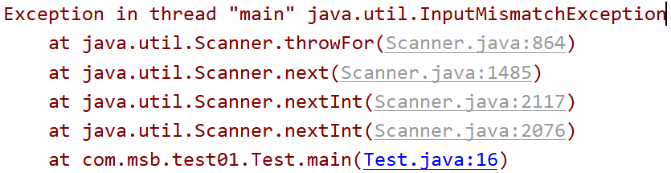
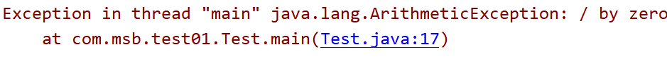
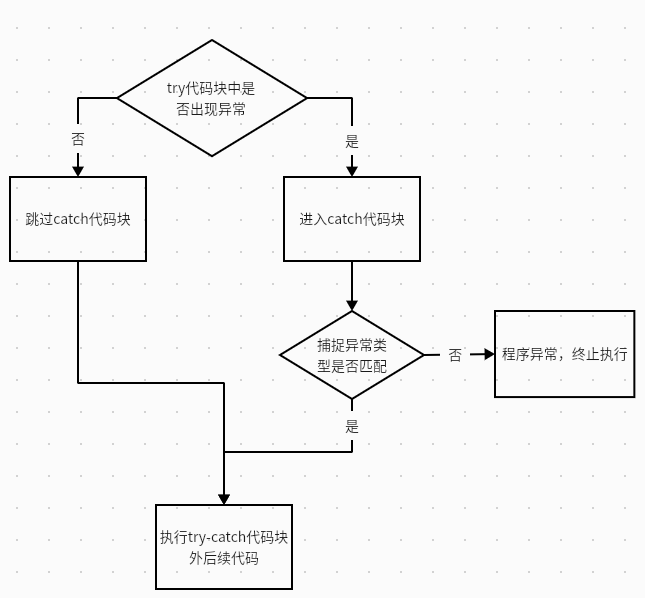
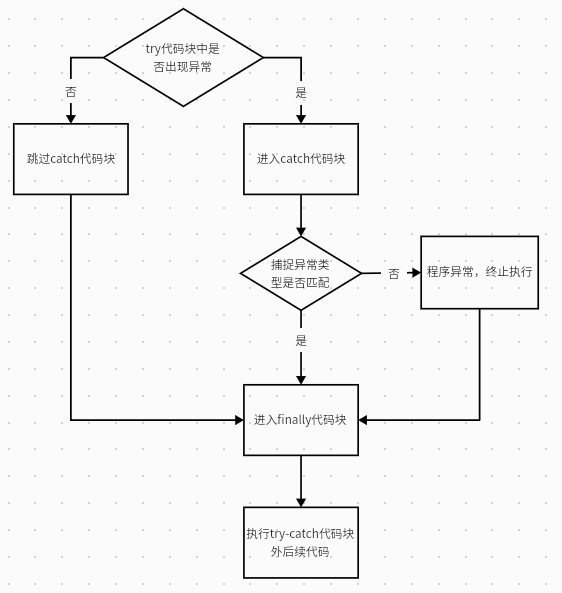
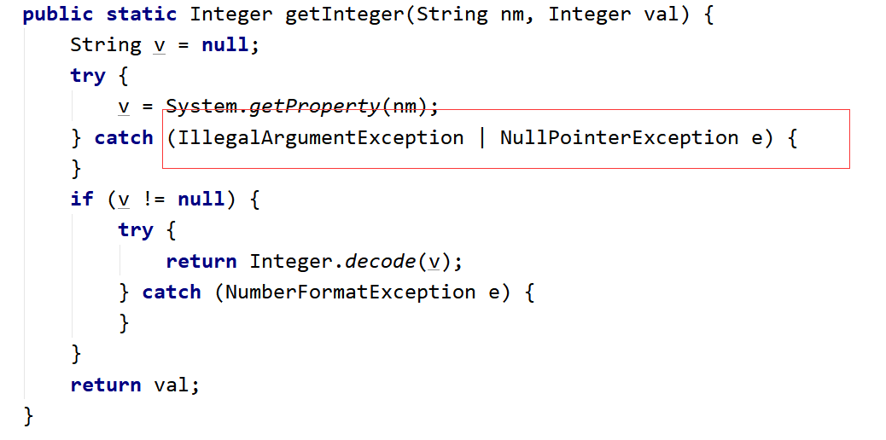

## 前言

### 为什么需要异常处理

我们首先简单来看一个代码：
```java
public class Test {
    //这是一个main方法，是程序的入口：
    public static void main(String[] args) {
        //实现一个功能：键盘录入两个数，求商：
        Scanner sc = new Scanner(System.in);
        System.out.println("请录入第一个数：");
        int num1 = sc.nextInt();
        System.out.println("请录入第二个数：");
        int num2 = sc.nextInt();
        System.out.println("商："+num1/num2);
    }
}
```

在上面的代码中，如果我们输入非int类型的数据时会出现：**InputMismatchException**


如果输入除数为时会出现：**ArithmeticException**


异常：Exception
> 📌在程序的运行过程中，发生了不正常的现象，**阻止了程序的运行**，我们称之为发生异常。

### 解决异常处理

我们试着使用前面的知识来解决这个异常：
```java
public class Test {
    //这是一个main方法，是程序的入口：
    public static void main(String[] args) {
        //实现一个功能：键盘录入两个数，求商：
        Scanner sc = new Scanner(System.in);
        System.out.println("请录入第一个数：");
        if(sc.hasNextInt()){
            int num1 = sc.nextInt();
            System.out.println("请录入第二个数：");
            if(sc.hasNextInt()){
                int num2 = sc.nextInt();
                if(num2 == 0){
                    System.out.println("对不起，除数不能为0");
                }else{
                    System.out.println("商："+num1/num2);
                }
            }else{
                System.out.println("对不起，你录入的不是int类型的数据！");
            }
        }else{
            System.out.println("对不起，你录入的不是int类型的数据！");
        }
    }
}

```

我们发现，问题是解决了，可是新的问题又来了：
- （1）代码臃肿，业务代码和处理异常的代码混在一起。
- （2）可读性差
- （3）程序员需要花费大量的经历来维护这个漏洞
- （4）程序员很难堵住所有的漏洞。

## try-catch

### 代码案例

恰好，Java为我们准备了异常捕捉的相关方法：
```java
public class Test2 {
    public static void main(String[] args) {
        //实现一个功能：键盘录入两个数，求商：
        try{
            Scanner sc = new Scanner(System.in);
            System.out.println("请录入第一个数：");
            int num1 = sc.nextInt();
            System.out.println("请录入第二个数：");
            int num2 = sc.nextInt();
            System.out.println("商："+num1/num2);
        }catch(Exception ex){
            System.out.println("对不起，程序出现异常！");
        }
        System.out.println("----谢谢你使用计算器111");
        System.out.println("----谢谢你使用计算器222");
        System.out.println("----谢谢你使用计算器333");
        System.out.println("----谢谢你使用计算器444");
        System.out.println("----谢谢你使用计算器555");
        System.out.println("----谢谢你使用计算器666");
    }
}
```

我们将可能出现异常的代码放入try代码块中，然后将异常封装为对象，被catch后面的()中的那个异常对象接收，接收以后：执行catch后面的{}里面的代码，然后try-catch后面的代码，该怎么执行就怎么执行。

### 执行逻辑



1. try中没有异常，catch中代码不执行。
2. try中有异常，catch进行捕获：
	- 如果catch中异常类型和你出的异常类型匹配的话：走catch中的代码--》进行捕获
	- 如果catch中异常类型和你出的异常类型不匹配的话：不走catch中的代码--》没有捕获成功，程序相当于遇到异常了，中断了，后续代码不执行


>注意：
> 1. try中如果出现异常，然后用catch捕获成功的话，那么try中后续的代码是不会执行的。
> 2. 如果catch捕获异常成功，那么try-catch后面的代码该执行还是执行没有影响。

### catch中处理异常

- 第一种处理：什么都不写，什么都不做
- 第二种处理：输出自定义异常信息
- 第三种处理：打印异常信息
- 第四种处理：抛出异常

```java
public class Test3 {
    public static void main(String[] args) {
        //实现一个功能：键盘录入两个数，求商：
        try{
            Scanner sc = new Scanner(System.in);
            System.out.println("请录入第一个数：");
            int num1 = sc.nextInt();
            System.out.println("请录入第二个数：");
            int num2 = sc.nextInt();
            System.out.println("商："+num1/num2);
        }catch(Exception ex){
            //第一种处理：什么都不写，什么都不做
            
            //第二种处理：输出自定义异常信息
            //System.out.println("对不起，你的代码有问题！");
            
            //第三种处理：打印异常信息：
            /*(1)调用toString方法，显示异常的类名（全限定路径）*/
              /*System.out.println(ex);
              System.out.println(ex.toString());*/
            /*(2)显示异常描述信息对应的字符串，如果没有就显示null
              System.out.println(ex.getMessage());*/
            /*(3)显示异常的堆栈信息：将异常信息捕获以后，在控制台将异常的效果给我们展示出来，方便我们查看异常*/
             /* ex.printStackTrace();*/
             
            //第四种处理：抛出异常：
            throw ex;
        }
        System.out.println("----谢谢你使用计算器111");
    }
}

```

## try-Catch-finally

### 前言

在之前的try-catch中，如果catch代码块中出现以下情况，将导致后续代码依旧不再执行，程序报错：
- （1）throw抛出异常的情况
- （2）catch中没有正常的进行异常捕获
- （3）在try中遇到return
那么，怎么来保证后续的代码依旧执行呢？
我们可以在catch代码块后继续使用finally代码块
finally代码块中的代码，在程序中无论任何时候都会执行
但是，我们要知道，如果finally与return一起的时候：**先执行finally再执行return**

### 代码案例

```java
public class Test3 {
    public static void main(String[] args) {
        //实现一个功能：键盘录入两个数，求商：
        try{
            Scanner sc = new Scanner(System.in);
            System.out.println("请录入第一个数：");
            int num1 = sc.nextInt();
            System.out.println("请录入第二个数：");
            int num2 = sc.nextInt();
            System.out.println("商："+num1/num2);
            System.exit(0);//终止当前的虚拟机执行
            return;
        }catch(ArithmeticException ex){
            //throw ex;
        }finally {
            System.out.println("----谢谢你使用计算器111");
        }
    }
}
```

### 执行逻辑



### 常用操作

我们在finally代码块中一般执行以下操作：
关闭数据库资源，关闭IO流资源，关闭socket资源。

> 📌当然，如果我们不想finally代码块执行，我们可以直接关闭JVM虚拟机：（**System.exit(0);//终止当前的虚拟机执行**）

## 多重catch

```java
public class Test4 {
    public static void main(String[] args) {
        Integer
        //实现一个功能：键盘录入两个数，求商：
        try{
            Scanner sc = new Scanner(System.in);
            System.out.println("请录入第一个数：");
            int num1 = sc.nextInt();
            System.out.println("请录入第二个数：");
            int num2 = sc.nextInt();
            System.out.println("商："+num1/num2);
        }catch(ArithmeticException ex){
            System.out.println("对不起，除数不可以为0");
        }catch(InputMismatchException ex){
            System.out.println("对不起，你录入的数据不是int类型的数据");
        }catch(Exception ex){
            System.out.println("对不起，你的程序出现异常");
        }finally {
            System.out.println("----谢谢你使用计算器111");
        }
    }
}

```

- 【1】try中出现异常以后，将异常类型跟catch后面的类型依次比较，按照代码的顺序进行比对，执行第一个与异常类型匹配的catch语句
- 【2】一旦执行其中一条catch语句之后，后面的catch语句就会被忽略了！
- 【3】在安排catch语句的顺序的时候，一般会将特殊异常放在前面（并列），一般化的异常放在后面。先写子类异常，再写父类异常。
- 【4】在JDK1.7以后，异常新处理方式：可以并列用|符号连接：



## 异常的分类

### 结构层次


1. Error错误
	1. 通常是程序级的错误，由于JVM系统的内部问题，我们在代码层面是无法干预的
2. Exception异常
	1. 检查异常**CheckedException**：通常是我们的编译器在执行编译前对语法规范进行检查
	1. 运行时异常**RuntimeException**：通常是我们编写的代码出现问题，导致的异常

> 注意：
	在编写代码时，我们不用特意对异常进行处理，我们可以直接抛出Exception，由程序来自行处理 语法错误、逻辑错误不属于Error与Exception错误

### 代码案例

运行时异常

```java
public class Test5 {
    //这是一个main方法，是程序的入口：
    public static void main(String[] args) {
        //运行时异常：
        int[] arr = {1,2,3};
        System.out.println(arr.length);
        /*int[] arr2 = null;
        System.out.println(arr2.length);*/
        System.out.println(arr[10]);
    }
}
```

检查异常

```java
public class Test6 {
    //这是一个main方法，是程序的入口：
    public static void main(String[] args) {
        //检查异常：
        try {
            try {
                Class.forName("com.meturing.test01.Test").newInstance();
            } catch (InstantiationException e) {
                e.printStackTrace();
            } catch (IllegalAccessException e) {
                e.printStackTrace();
            }
        } catch (ClassNotFoundException e) {
            e.printStackTrace();
        }
    }
}
```

## throw与throws

#### 代码案例

```java
public class Test7 {
    //这是一个main方法，是程序的入口：
    public static void main(String[] args) throws Exception {
        //实现一个功能：两个数相除，当除数为0的时候，程序出现异常。
        /*try {
            devide();
        } catch (Exception e) {
            e.printStackTrace();
        }*/
        devide();
    }
    public static void devide() throws Exception {
        Scanner sc = new Scanner(System.in);
        System.out.println("请录入第一个数：");
        int num1 = sc.nextInt();
        System.out.println("请录入第二个数：");
        int num2 = sc.nextInt();
        if(num2 == 0 ){//除数为0 ，制造异常。
            //制造运行时异常：
            /*throw new RuntimeException();*/
            //制造检查异常：
            /*try {
                throw new Exception();
            } catch (Exception e) {
                e.printStackTrace();
            }*/
            throw new Exception();
        }else{
            System.out.println("商："+num1/num2);
        }
    }
}
```

#### 区别

位置不同
-   throw：方法内部
-   throws: 方法的签名处，方法的声明处

内容不同
-   throw+异常对象（检查异常，运行时异常）
-   throws+异常的类型（可以多个类型，用，拼接）

作用不同
-   throw：异常出现的源头，制造异常
-   throws:在方法的声明处，告诉方法的调用者，这个方法中可能会出现我声明的这些异常。然后调用者对这个异常进行处理：要么自己处理要么再继续向外抛出异常

## 重写与重载异常

|    | 英文       | 位置    | 修饰符           | 返回值            | 方法名  | 参数   | 抛出异常 | 方法体 |
| -- | -------- | ----- | ------------- | -------------- | ---- | ---- | ---- | --- |
| 重载 | overload | 同一个类中 | 无关            | 无关             | 必须相同 | 必须不同 | 无关   | 不同  |
| 重写 | override | 子类父类中 | 父类的权限修饰符要低于子类 | 父类的返回值类型必须大于子类 | 必须相同 | 必须相同 | 小于等于 | 不同  |

## 自定义异常

### 代码声明

继承运行时异常

```java
public class MyException extends RuntimeException {
    
    static final long serialVersionUID = -70348971907L;
    
    public MyException(){
    }
    public MyException(String msg){
        super(msg);
    }
}
```

继承检查异常

```java
public class MyException extends Exception {
    static final long serialVersionUID = -70348971907L;
    public MyException(){
    }
    public MyException(String msg){
        super(msg);
    }
}
```

1.  **如果继承的是运行时异常，那么在使用的时候无需额外处理**
2.  **如果继承的是检查异常，那么使用的时候需要try-catch捕获或者throws向上抛**