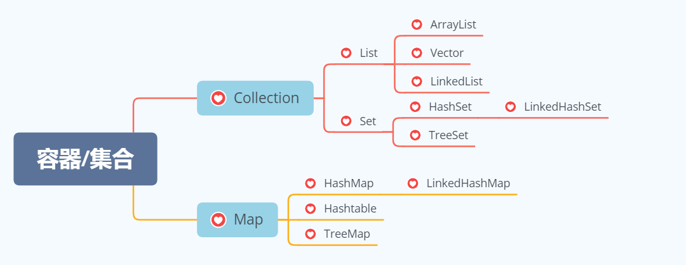
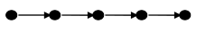
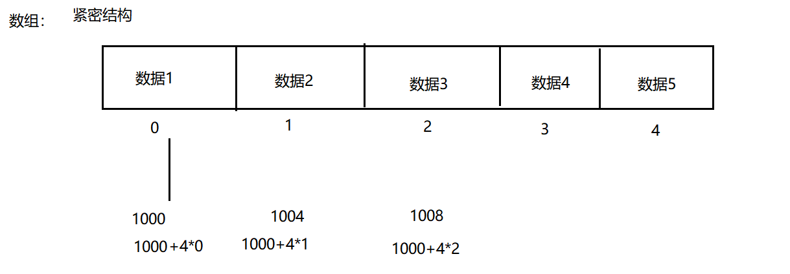
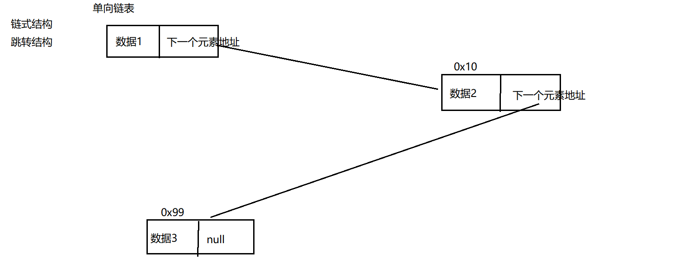
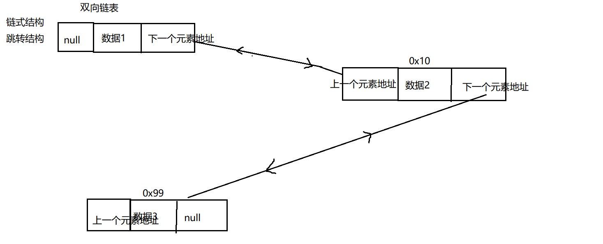
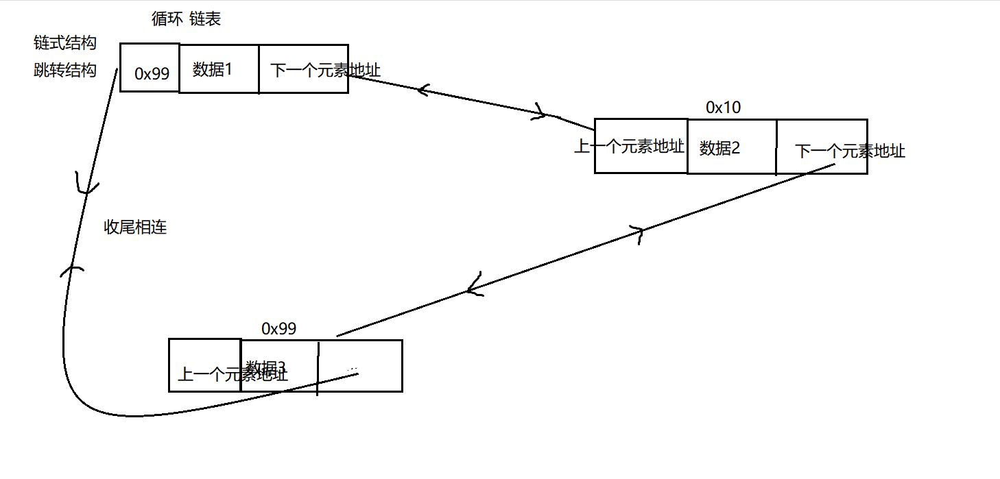
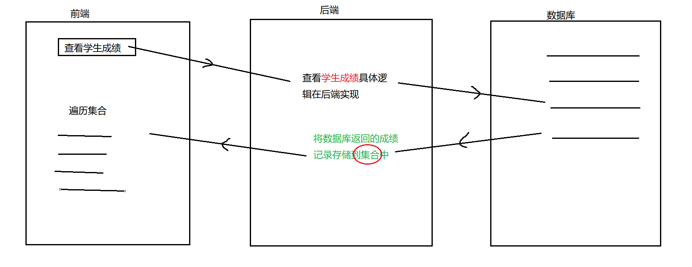

## 什么是算法和数据结构

### 算法

1.  可以解决具体问题：解题流程 = 算法
2.  有设计解决的具体的流程：不同的解题思路
3.  有评价这个算法的具体指标：时间复杂度、空间复杂度

### 数据结构

就是在计算机的缓存，内存，硬盘  如何组织管理数据的。重点在结构上，是按照什么结构来组织管理我们的数据。

#### 分类

-   逻辑结构：思想上的结构
    线性表（数组，链表），图，树，栈，队列
-   物理结构：真实结构
    紧密结构（顺序结构），跳转结构（链式结构）

#### 紧密结构（顺序结构）与   跳转结构（链式结构）

以线性表为例：

- **结构逻辑图**

- **结构特点**
	线性表是n个类型`相同数据元素`的有限`序列`，通常记作a0,a1,,,ai-1,ai,ai+1,,,,,an-1)。
	-   **相同数据类型**
	    在线性表的定义中,我们看到从a0到an-1的n个数据元素是具有相同属件的亓素。
	    比如说可以都是数字,例如(12,23,45,56,45);
	    也可以是宇符,例如(A,B,....Z)
	    当然也可以是具有更复杂结构的数据元素,例如学生、商品、装备等。
	    相同数据类型意味着在内存中存储时,每个元素会占用相同的内存空间,便于后续的查询定位。
	-   **有限**
	    在线性表的定义中,我们看到从a0到an-1的n个数据元素是具有相同属件的亓素。
	    比如说可以都是数字,例如(12,23,45,56,45);
	    也可以是宇符,例如(A,B,....Z)
	    当然也可以是具有更复杂结构的数据元素,例如学生、商品、装备等。
	    相同数据类型意味着在内存中存储时,每个元素会占用相同的内存空间,便于后续的查询定位。
	-   **序列（顺序性）**
	    在线性表的相邻数据元素之间存在若序偶关系，
	    即ai-1是ai的直接前驱,则ai是ai-1的直接后续,
	    同时ai又是ai+1的直接前驱，ai+1是ai的直接后续。
	    唯一没有直接前驱的元素a0 一端称为表头,唯一没有后续的元素an-1一端称为表尾。
	    除了表头和表尾元素外,任何一个元素都有且仅有一个直接前驱和直接后继。

#### 逻辑结构和物理结构

线性表逻辑结构，对应的真实结构如果是紧密结构---》典型就是  **`数组`**

-   数组
    
	优点：**查询元素效率高**
	缺点：**删除元素，插入元素效率低**
	线性表逻辑结构，对应的真实结构如果是跳转结构---》典型就是  **`链表`**
-   单向链表
    
-   双向链表
    
-   循环链表
    
	优点：**删除元素，插入元素效率高**
	缺点：**查询元素效率低**

## 集合的引入

数组，集合都是对多个数据进行存储操作的，简称为容器。
PS:这里的存储指的是内存层面的存储，而不是持久化存储（.txt,.avi,.jpg,数据库）

- 特点：
	（1）数组一旦指定了长度，那么长度就被确定了，不可以更改。
	（2）数组一旦声明了类型以后，数组中只能存放这个类型的数据。数组中只能存放同一种类型的数据。
	
- 缺点：
	（1）数组一旦指定了长度，那么长度就被确定了，不可以更改。
	（2）删除，增加元素  效率低。
	（3）数组中实际元素的数量是没有办法获取的，没有提供对应的方法或者属性来获取
	（4）数组存储：有序，可重复 ，对于无序的，不可重复的数组不能满足要求。

正因为上面的缺点，引入了一个新的存储数据的结构---》**`集合`**
不同集合底层数据结构不一样。**`集合不一样，特点也不一样`**

## 集合结构图

## 应用场景

