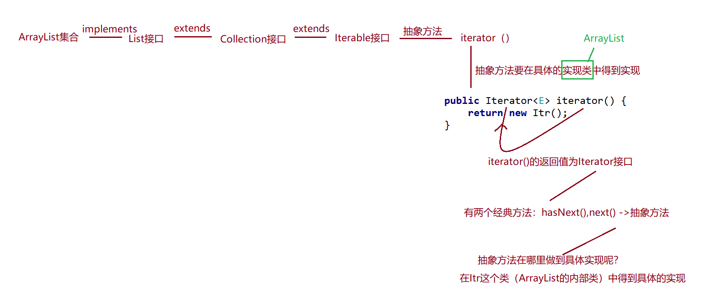

List接口**实现Collection接口**，所以他可以使用Collection接口的通用方法，也可以使用特有的方法。
List接口下存在：**ArrayList实现类**、**Vector实现类**、**LinkedList实现类**
List接口：**不唯一**、**有序**
遍历方式：**普通For循环**、**迭代器**、**增强For循环**

## ArrayList实现类

### 常用方法

| 方法                        | 说明         |
| ------------------------- | ---------- |
| add(E e)                  | 增加元素       |
| add(int index, E element) | 指定位置新增（插入） |
| set(int index, E element) | 修改指定下标的值   |
| remove(int index)         | 移除指定的坐标元素  |
| remove(Object o)          | 移除指定的元素    |
| get(int index)            | 获取指定下标的元素  |

```java
public class Test01 {
    public static void main(String[] args) {
        /*
            List接口中常用方法：
            增加：add(int index, E element)
            删除：remove(int index)  remove(Object o)
            修改：set(int index, E element)
            查看：get(int index)
            判断：
         */
        List list = new ArrayList();
        //新增
        list.add(13);
        list.add(17);
        list.add(6);
        list.add(-1);
        list.add(2);
        list.add("abc");
        System.out.println(list);
        // 指定位置新增（插入）
        list.add(3,66);
        System.out.println(list);
        // 修改
        list.set(3,77);
        System.out.println(list);
        // 移除指定的坐标元素
        list.remove(2);
        System.out.println(list);
        // 移除指定的元素
        list.remove("abc");
        System.out.println(list);
        // 获取指定下标的元素
        Object o = list.get(0);
        System.out.println(o);
        ArrayList arrayList = new ArrayList();
        arrayList.add(123);
        //循环遍历
        System.out.println();
        System.out.println("使用for循环：");
        for (int i = 0; i < list.size(); i++) {
            System.out.print(list.get(i)+"\t");
        }
        System.out.println();
        System.out.println("使用增强for循环：");
        for (Object object : list) {
            System.out.print(object+"\t");
        }
        System.out.println();
        System.out.println("使用Lambda表达式：");
        list.stream().forEach(s-> System.out.print(s+"\t"));
        System.out.println();
        System.out.println("使用迭代器：");
        Iterator iterator = list.iterator();
        while (iterator.hasNext()) {
            System.out.print(iterator.next()+"\t");
        }
    }
}
```

### 内存结构原理

在源码里ArrayList实现了List接口，又继承了AbreastList实现类。但是AbreastList实现类也是实现了List接口，所以此处有些许冗余。但在后续的代码中并没有修正

#### JDK 1.7

总结：**ArrayList初始长度为10，达到长度上限后，以1.5倍扩容**


#### JDK 1.8

总结：**ArrayList初始为空的数据组，第一次使用时设置长度为10，达到长度上限后，以1.5倍扩容**


#### JDK1.7与JDK1.8的区别

JDK1.7在初始化时，就会创建一个长度为10的数组，用于存储。在JDK1.8时，我们在初始化时会创建一个空的数组，第一次使用时才会给数组赋值长度为10.

其余两者扩容的长度都是1.5倍

## Vector实现类

Vector方法以及逐渐退出历史舞台了，但是我们还是需要去了解他。基本上整体代码结构与ArrayList一致

#### 底层代码逻辑

底层Object数组，int类型属性表示数组中有效长度：


`Vector v=new Vector();`调用构造器


add方法


#### 与ArrayList的区别

- 相同点：
	底层都是Object数据组，初始化长度为10
	核心元素都是数组和使用长度计数
- 不同点：
	Vector底层扩容长度为原数组的2倍，使用同步锁，线程安全但效率低
	ArrayList底层扩容长度为原数组的1.5倍，没使用锁，线程相对不安全，但效率高

## LinedList 实现类

1)  LinkedList底层实现了**双向链表和双端队列**特点;
2) 可以添加任意元素(元素可以重复)，包括null;
3) 线程**不安全**，没有实现同步

### 常用方法

| 方法                    | 说明                               |
| --------------------- | -------------------------------- |
| add(E e)              | 新增一个元素                           |
| addFirst(E e)         | 新增到头部                            |
| addLast(E e)          | 新增到尾部                            |
| offer(E e)            | 插入一个元素                           |
| offerFirst(E e)       | 插入到头部                            |
| offerLast(E e)        | 插入到尾部                            |
| poll()                | 删除头上的元素并且将元素返回                   |
| pollFirst()           | 删除第一个的元素并且将元素返回                  |
| pollLast()            | 删除最后一个的元素并且将元素返回                 |
| removeFirst()         | 移除第一个的元素并且将元素返回                  |
| removeLast()          | 移除最后一个的元素并且将元素返回                 |
| element()             | 获取头元素                            |
| getFirst()            | 获取第一个元素                          |
| getLast()             | 获取最后一个元素                         |
| indexOf(Object o)     | 获取指定元素下标                         |
| lastIndexOf(Object o) | 获取指定元素最后一次下标                     |
| peek()                | 检索但不删除此列表的头部（第一个元素）              |
| peekFirst()           | 检索但不删除此列表的第一个元素，如果此列表为空，则返回null  |
| peekLast()            | 检索但不删除此列表的最后一个元素，如果此列表为空，则返回null |

```java
public class Test04 {
    public static void main(String[] args) {
        /*
        LinkedList常用方法：
        增加 addFirst(E e) addLast(E e)
             offer(E e) offerFirst(E e) offerLast(E e)
        删除 poll()
            pollFirst() pollLast()  ---》JDK1.6以后新出的方法，提高了代码的健壮性
            removeFirst() removeLast()
        修改
        查看 element()
             getFirst()  getLast()
             indexOf(Object o)   lastIndexOf(Object o)
             peek()
             peekFirst() peekLast()
        判断
         */
        LinkedList<String> list = new LinkedList<>();
        /*
         * add（不带索引默认添加到链表的最后）与offer一样都是添加操作，
         * 唯一的区别就是offer没有带索引参数的方法，并且如果队列满了add会抛出异常，而offer不会。
         * */
        //新增
        list.add("aaaaa");
        list.add("bbbbb");
        list.add("ccccc");
        list.add("ddddd");
        list.add("eeeee");
        list.add("bbbbb");
        list.add("fffff");
        //添加到头部
        list.addFirst("begin");
        //添加到末尾
        list.addLast("end");
        //添加元素在尾端
        list.offer("offer");
        //添加到头部
        list.offerFirst("offerFirst");
        //添加到末尾
        list.offerLast("offerLast");
        System.out.println(list); // [offerFirst, begin, aaaaa, bbbbb, ccccc, ddddd, eeeee, bbbbb, fffff, end, offer, offerLast]
        //删除
        System.out.println(list.poll());//删除头上的元素并且将元素输出 offerFirst
        System.out.println(list.pollFirst());//删除第一个的元素并且将元素输出 begin
        System.out.println(list.pollLast());//删除末尾的元素并且将元素输出 offerLast
        System.out.println(list); // [aaaaa, bbbbb, ccccc, ddddd, eeeee, bbbbb, fffff, end, offer]
        
        System.out.println(list.removeFirst()); //删除第一个的元素并且将元素输出 begin
        System.out.println(list.removeLast());//删除末尾的元素并且将元素输出 offer
        System.out.println(list); // [bbbbb, ccccc, ddddd, eeeee, bbbbb, fffff, end]
        
        //清空集合
/*        list.clear();
        System.out.println(list);// []*/
        
        //集合的遍历：
        Iterator<String> iterator = list.iterator();
        while (iterator.hasNext()) {
            System.out.print(iterator.next()+"\t");
        }
        System.out.println();
        for (int i = 0; i < list.size(); i++) {
            System.out.print(list.get(i)+"\t");
        }
        System.out.println();
        for (Object o : list) {
            System.out.print(o+"\t");
        }
        System.out.println();
        //下面这种方式好，节省内存
        for (Iterator<String> iterator1 = list.iterator();iterator1.hasNext();){
            System.out.println(iterator1.next());
        }
    }
}
```

### 底层原理

LinedList是链表，物理结构是：跳转结构，逻辑结构是：线性表-链表
ArrayList是数组，物理结构是：紧密结构，逻辑结构是：线性表-数组


1) LinkedList底层维护了一个双向链表;
2) LinkedList中维护了两个属性`first`和`last`分别指向首节点和尾节点;
3) 每个节点(Node对象) ，里面又维护了prev、next、 item三个属性，其中通过prev指向前一 个，通过next指向后个节点，而item就是真正存放数据的属性。最终实现双向链表;
4) 所以LinkedList的元素的添加和删除，不是通过数组完成的，相对来说效率较高，添加是添加在**双向链表的尾部**，remove()不指定索引默认删除的是第一个数据

### 模拟LinedList代码

```java
public class Test03 {
    public static void main(String[] args) {
        MyLinkedList myLinkedList = new MyLinkedList();
        myLinkedList.add(111);
        myLinkedList.add(222);
        myLinkedList.add(333);
        System.out.println(myLinkedList.getSize());
        Object o = myLinkedList.get(2);
        System.out.println(o);
    }
}
class Node{
    //三个属性
    //上一个元素的地址
    private Node pre;
    //当前元素
    private Object obj;
    //下一个元素的地址
    private Node next;
    public Node getPre() {
        return pre;
    }
    public void setPre(Node pre) {
        this.pre = pre;
    }
    public Object getObj() {
        return obj;
    }
    public void setObj(Object obj) {
        this.obj = obj;
    }
    public Node getNext() {
        return next;
    }
    public void setNext(Node next) {
        this.next = next;
    }
    @Override
    public String toString() {
        return "Node{" +
                "pre=" + pre +
                ", obj=" + obj +
                ", next=" + next +
                '}';
    }
}

class MyLinkedList{
    //链中一定有一个首节点：
    Node first;
    //链中一定有一个尾节点：
    Node last;
    //计数器：
    int count = 0;
    //提供一个构造器：
    public MyLinkedList(){
    }
    
    //添加元素方法：
    public void add(Object o){
        if(first == null){//证明你添加的元素是第一个节点：
            //将添加的元素封装为一个Node对象：
            Node n = new Node();
            n.setPre(null);
            n.setObj(o);
            n.setNext(null);
            //当前链中第一个节点变为n
            first = n;
            //当前链中最后一个节点变为n
            last = n;
        }else{//证明已经不是链中第一个节点了
            //将添加的元素封装为一个Node对象：
            Node n = new Node();
            n.setPre(last);//n的上一个节点一定是当前链中的最后一个节点last
            n.setObj(o);
            n.setNext(null);
            //当前链中的最后一个节点的下一个元素 要指向n
            last.setNext(n);
            //将最后一个节点变为n
            last = n;
        }
        //链中元素数量加1
        count++;
    }
    
    //得到集合中元素的数量：
    public int getSize(){
        return count;
    }
    
    //通过下标得到元素：
    public Object get(int index){
        //获取链表的头元素：
        Node n = first;
        //一路next得到想要的元素
        for(int i=0;i<index;i++){
            n = n.getNext();
        }
        return n.getObj();
    }

}

```

### LinedList底层代码

JDK1.7和JDK1.8的LinkedList的源码是一致的
```java
public class LinkedList<E>{//E是一个泛型，具体的类型要在实例化的时候才会最终确定
        transient int size = 0;//集合中元素的数量
        //Node的内部类
        private static class Node<E> {
        E item;//当前元素
        Node<E> next;//指向下一个元素地址
        Node<E> prev;//上一个元素地址
        Node(Node<E> prev, E element, Node<E> next) {
            this.item = element;
            this.next = next;
            this.prev = prev;
        }
    }
        transient Node<E> first;//链表的首节点
        transient Node<E> last;//链表的尾节点
        //空构造器：
        public LinkedList() {
    }
        //添加元素操作：
        public boolean add(E e) {
        linkLast(e);
        return true;
    }
        void linkLast(E e) {//添加的元素e
        final Node<E> l = last;//将链表中的last节点给l 如果是第一个元素的话 l为null
                //将元素封装为一个Node具体的对象：
        final Node<E> newNode = new Node<>(l, e, null);
                //将链表的last节点指向新的创建的对象：
        last = newNode;
                
        if (l == null)//如果添加的是第一个节点
            first = newNode;//将链表的first节点指向为新节点
        else//如果添加的不是第一个节点 
            l.next = newNode;//将l的下一个指向为新的节点
        size++;//集合中元素数量加1操作
        modCount++;
    }
        //获取集合中元素数量
        public int size() {
        return size;
    }
        //通过索引得到元素：
        public E get(int index) {
        checkElementIndex(index);//健壮性考虑
        return node(index).item;
    }
        
    Node<E> node(int index) {
        //如果index在链表的前半段，那么从前往后找
        if (index < (size >> 1)) {
            Node<E> x = first;
            for (int i = 0; i < index; i++)
                x = x.next;
            return x;
        } else {//如果index在链表的后半段，那么从后往前找
            Node<E> x = last;
            for (int i = size - 1; i > index; i--)
                x = x.prev;
            return x;
        }
    }
}

```

## Iterator()与ListIterator()迭代器

### Iterator()迭代器

当我们想在指定位置后面添加字符串时，我们使用Iterator()迭代器进行如下处理：
```java
public class Test2 {
    //这是main方法，程序的入口
    public static void main(String[] args) {
        ArrayList<String> list = new ArrayList<>();
        list.add("aa");
        list.add("bb");
        list.add("cc");
        list.add("dd");
        list.add("ee");
        //在"cc"之后添加一个字符串"kk"
        Iterator<String> it = list.iterator();
        while(it.hasNext()){
            if("cc".equals(it.next())){
                list.add("kk");
            }
        }
    }
}
```

我们会发现触发异常：

主要由于：迭代器与集合进行同步操作导致的

### ListIterator()迭代器

为了解决上面的问题，我们引入了ListIterator()迭代器，让迭代与修改都通过它来执行：
```java
public class Test2 {
    //这是main方法，程序的入口
    public static void main(String[] args) {
        ArrayList<String> list = new ArrayList<>();
        list.add("aa");
        list.add("bb");
        list.add("cc");
        list.add("dd");
        list.add("ee");
        //在"cc"之后添加一个字符串"kk"
        ListIterator<String> it = list.listIterator();
        while(it.hasNext()){
            if("cc".equals(it.next())){
                it.add("kk");
            }
        }
        System.out.println(it.hasNext());
        System.out.println(it.hasPrevious());
        //逆向遍历：
        while(it.hasPrevious()){
            System.out.println(it.previous());
        }
        System.out.println(it.hasNext());
        System.out.println(it.hasPrevious());
        System.out.println(list);
    }
}

```

### iterator()与Iterator以及Iterable的关系

#### 关系图

Collection接口继承Iterable接口，存在iterator()抽象方法，在ArrayList中事项抽象方法返回Iterator接口


#### hasNext(),next()的具体实现

cursor用来模拟指针，输出指针指向的值并移动指针


#### 增强for循环  底层也是通过迭代器实现的


