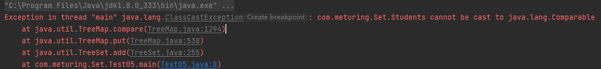
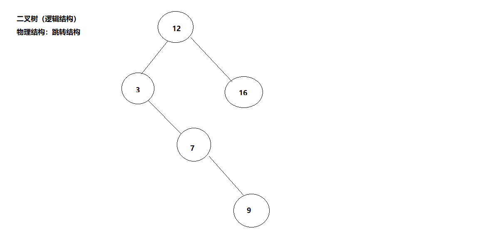

List接口**实现Collection接口**，所以他可以使用Collection接口的通用方法，也可以使用特有的方法。
Set里面有实现类：**HashSet**、**LinkedHashSet**、**TreeSet**
Set接口：相对于List **唯一**，**无序**(添加和取出的顺序不一致)、**没有索引**
遍历方式：**迭代器**、**增强For循环**

## HashSet

HashSet实际上是**HashMap**( jdk1.7:数组+链表   jdk1.8:数组+链表+红黑树 )
**可以存放null值，但是只能有一个null**
HashSet不保证元素是有序的,取决于hash后，再确定索引的结果
不能有重复元素

### 常用方法

```java
public class TestInteger {
    //这是main方法，程序的入口
    public static void main(String[] args) {
        //创建一个HashSet集合：
        HashSet<Integer> hs = new HashSet<>();
        System.out.println(hs.add(19));//true
        hs.add(5);
        hs.add(20);
        System.out.println(hs.add(19));//false 这个19没有放入到集合中
        hs.add(41);
        hs.add(0);
        System.out.println(hs.size());//唯一，无序
        System.out.println(hs);
    }
}

```

```java
public class Test03 {
    public static void main(String[] args) {
        HashSet<Student> students = new HashSet<>();
        students.add(new Student("张三",19));
        students.add(new Student("李四",11));
        students.add(new Student("王五",18));
        students.add(new Student("张三",19));
        System.out.println(students.size());
        System.out.println(students);//引用类型可以重复放入
    }
}
class Student{
    String name;
    int age;
    public Student(String name,int age){
        this.name = name;
        this.age = age;
    }
    @Override
    public String toString() {
        return "Student{" +
                "name='" + name + '\'' +
                ", age=" + age +
                '}';
    }
}
```

### 底层原理

1.  HashSet 底层是HashMap
2.  添加一个元素时，先得到hash值 - 会转成->索引值;
3.  找到存储数据表table ,看这个索引位置是否已经存放的有元素;
    1.  如果没有，直接加入;
    2.  如果有,调用equals比较，如果相同，就放弃添加，如果不相同，则添加到最后;
4.  在Java8中，如果一条链表的元素个数到达`TREEIFY THRESHOLD`(默认是8)，并且table的大小>=MIN TREEIFY CAPACITY(默认64),就会进行树化(红黑树)

-   源码解读
    ```java
    public class Debug03 {
        public static void main(String[] args) {
    　　　　 //添加实例
            HashSet set = new HashSet();
            set.add("java");
            set.add("php");
            set.add("java");
            System.out.println(set);
    
            /*
            源码解读
            1. 执行HashSet()
                public HashSet() {
                    map = new HashMap<>();
                }
            2. 执行add()
                public boolean add(E e) {    //e="java"
                    return map.put(e, PRESENT)==null;  // (static) PRESENT = new Object();
                }
            3. 执行put()，该方法会执行hash(key)得到key对应的hash值  算法 (h = key.hashCode()) ^ (h >>> 16)  避免碰撞
                public V put(K key, V value) {  //key="java"  value=PRESENT  共享的
                    return putVal(hash(key), key, value, false, true);
                }
            4. 执行putVal()
                final V putVal(int hash, K key, V value, boolean onlyIfAbsent,
                       boolean evict) {
                    Node<K,V>[] tab; Node<K,V> p; int n, i;   //定义了辅助变量
                    // table就是HashMap的一个数组，类型是Node[]
                    // if 语句表示如果当前table 是null或者 大小 = 0，就是第一次扩容，到16
                    if ((tab = table) == null || (n = tab.length) == 0)
                        n = (tab = resize()).length;
                    //(1)根据key,得到hash 去计算该key应该存放到table表的哪个索引位置,并把这个位置的对象，赋给 p
                    //(2)判断p 是否为null
                    //(2.1)如果p 为null，表示还没有存放元素，就创建一个Node(key="java",value=PRESENT)
                    //(2.2)就放在该位置 tab[i] = newNode(hash, key, value, null)
                    if ((p = tab[i = (n - 1) & hash]) == null)
                        tab[i] = newNode(hash, key, value, null);
                    else {
                        // 一个开发技巧提示:在需要局部变量（辅助变量）时候,再创建
                        Node<K,V> e; K k;
                        // 如果当前索引位置对应的链表的第一个元素和准备添加的key的hash值一样
                        // 并且满足 下面两个条件之一：
                        //(1)准备加入的key 和 p 指向的Node节点的key是同一个对象
                        //(2)p指向的node节点的key的equals() 和准备加入的key比较后相同
                        // 就不能加入
                        if (p.hash == hash &&
                            ((k = p.key) == key || (key != null && key.equals(k))))
                            e = p;
                        // 再判断 p 是不是一颗红黑树，
                        // 如果是一颗红黑树，就调用 putTreeVal，来进行添加
                        else if (p instanceof TreeNode)
                            e = ((TreeNode<K,V>)p).putTreeVal(this, tab, hash, key, value);
                        // 如果table对应的索引位置，已经是一个链表，就使用for循环比较
                        //(1)依次和该链表的每一个元素比较后，都不相同，则加入到该链表的最后
                        //  注意在把元素添加到链表后，立即判断该链表是否已经达到8个结点
                        //  就调用treeifyBin() 对当前这个链表进行树化(转成红黑树)
                        //  注意，在转成红黑树时，要进行判断，判断条件
                        //  if (tab == null | (n = tab.Length) < MIN_ TREEIFY_ CAPACITY(64) )
                        //  resize() ;
                        //  如果上面条件成立，先table扩容。
                        //  只有上面条件不成立时，才进行转成红黑树
                        //(2)依次和该链表的每一个元素比较过程中，如果有相同情况，就直接break
                        else {
                            for (int binCount = 0; ; ++binCount) {  //死循环
                                if ((e = p.next) == null) {
                                    p.next = newNode(hash, key, value, null);
                                    if (binCount >= TREEIFY_THRESHOLD - 1) // -1 for 1st
                                        treeifyBin(tab, hash);
                                    break;
                                }
                                if (e.hash == hash &&
                                    ((k = e.key) == key || (key != null && key.equals(k))))
                                    break;
                                p = e;
                            }
                        }
                        if (e != null) { // existing mapping for key
                            V oldValue = e.value;
                            if (!onlyIfAbsent || oldValue == null)
                                e.value = value;
                            afterNodeAccess(e);
                            return oldValue;
                        }
                    }
                    ++modCount;
    　　　　　　　　　 //size 就是我们加入一个节点Node(k,v,h,next),size++
                    if (++size > threshold)
                        resize();  //扩容
                    afterNodeInsertion(evict);
                    return null;
                }
             */
        }
    }
    ```

### 扩容及树化机制

1.  HashSet底层是HashMap,第一次添加时，**table 数组长度是16**. **临界值(threshold) = 数组长度(16) \* 加载因子loadFactor(0.75) = 12 
2.  如果table **数组使用到了临界值12, 就会扩容到16* 2 = 32 ,新的临界值就是 32 \* 0.75 = 24, 依次类推正
3.  在Java8中，如果条链表的元素个数到达**TREEIFY THRESHOLD(默认是8 )**,并且 **table的大小>=MIN TREEIFY CAPACITY(默认64)** ,就会进行树化(红黑树)，否则仍然采用数组扩容机制

### 重写equals 与 hashCode

由于对于自定义的引用类型类存储，HashMap的唯一性的特性会失效。所以，我们会重写它的equals 与 hashCode

```java
public class Test03 {
    public static void main(String[] args) {
        HashSet<Student> students = new HashSet<>();
        students.add(new Student("张三",19));
        students.add(new Student("李四",11));
        students.add(new Student("王五",18));
        students.add(new Student("张三",19));
        System.out.println(students.size());
        System.out.println(students);//引用类型可以重复放入
    }
}
class Student{
    String name;
    int age;
    public Student(String name,int age){
        this.name = name;
        this.age = age;
    }
    
    @Override
    public String toString() {
        return "Student{" +
                "name='" + name + '\'' +
                ", age=" + age +
                '}';
    }
    
    @Override
    public boolean equals(Object o) {
        if (this == o) return true;
        if (o == null || getClass() != o.getClass()) return false;
        Student student = (Student) o;
        return age == student.age && Objects.equals(name, student.name);
    }
    
    @Override
    public int hashCode() {
        return Objects.hash(name, age);
    }
}

```

## LinkedHashSet

1.  LinkedHashSet`加入顺序和取出元素,数据的顺序一致`
2.  LinkedHashSet **底层维护的是一个LinkedHashMap**(是HashMap的子类)
3.  LinkedHashSet 底层结构( **数组table+双向链表**) 
4.  第一次添加元素时，直接将数组**table扩容到16** ,存放的结点类型是**LinkedHashMap$Entry** 每一个节点有before、after分别指向前一个和后一个元素
5.  数组是`HashMap$Node[]`存放的元素 / 数据是​`LinkedHashMap$Entry`类型

### 常用方法

```java
public class TestInteger {
    //这是main方法，程序的入口
    public static void main(String[] args) {
        //创建一个HashSet集合：
        LinkedHashSet<Integer> hs = new LinkedHashSet<>();
        System.out.println(hs.add(19));//true
        hs.add(5);
        hs.add(20);
        System.out.println(hs.add(19));//false 这个19没有放入到集合中
        hs.add(41);
        hs.add(0);
        System.out.println(hs.size());//唯一，无序
        System.out.println(hs);
    }
}
```

## ThreeSet

特性：是唯一的、有序的（按照规则排序输出）
排序：**包装类【升序】**、**自定义引用类型【需要重写比较器】** [[比较器|查看比较器的使用]]
底层是个`二叉树`的结构来存储数据

### 代码实践

#### 包装类

```java
public class Test05 {
    public static void main(String[] args) {
        TreeSet<String> strings = new TreeSet<>();
        strings.add("1");
        strings.add("3");
        strings.add("0");
        strings.add("1");
        System.out.println(strings.size()); // 3
        System.out.println(strings); //[0, 1, 3]
    }
}
```

#### 自定义引用类型

[[比较器|查看比较器的使用]]

-   **不重写比较器，会报错！！！**
```java
public class Test05 {
	public static void main(String[] args) {
		TreeSet<Students> students = new TreeSet<>();
		students.add(new Students("张三1",16));
		students.add(new Students("张三4",18));
		students.add(new Students("张三3",15));
		students.add(new Students("张三2",10));
		System.out.println(students);
	}
}
class Students {
	String name;
	int age;
	public Students(String name, int age) {
		this.name = name;
		this.age = age;
	}
	public String getName() {
		return name;
	}
	public void setName(String name) {
		this.name = name;
	}
	public int getAge() {
		return age;
	}
	public void setAge(int age) {
		this.age = age;
	}
	@Override
	public String toString() {
		return "Students{" +
				"name='" + name + '\'' +
				", age=" + age +
				'}';
	}
}
```

会抛出异常：**Exception in thread "main" java.lang.ClassCastException**



-   使用内部比较器
    内部比较器：在自定类中继承Comparable接口，重写compareTo方法
```java
public class Test07 {
	public static void main(String[] args) {
		TreeSet<Student1> students = new TreeSet<>();
		students.add(new Student1("张三1",16));
		students.add(new Student1("张三4",18));
		students.add(new Student1("张三3",15));
		students.add(new Student1("张三2",10));
		System.out.println(students);
	}
}

/**
 * 使用内部比较器
 */
class Student1 implements Comparable<Student1>{
	String name;
	int age;
	public Student1(String name, int age) {
		this.name = name;
		this.age = age;
	}
	public String getName() {
		return name;
	}
	public void setName(String name) {
		this.name = name;
	}
	public int getAge() {
		return age;
	}
	public void setAge(int age) {
		this.age = age;
	}
	@Override
	public String toString() {
		return "Students{" +
				"name='" + name + '\'' +
				", age=" + age +
				'}';
	}
	@Override
	public int compareTo(Student1 o) {
		return this.age-o.age;
	}
}

```

-   使用外部比较器
    外部比较器：创建比较器类继承Comparator接口，重写compare方法
```java
package com.meturing.Set;

import java.util.Comparator;
import java.util.TreeSet;

public class Test08 {
	public static void main(String[] args) {
		//创建比较器对象
		compareToStudent compareToStudent = new compareToStudent();
		// 通过构造函数将比较器传送到TreeSet中
		TreeSet<Student2> students = new TreeSet<>(compareToStudent);
		students.add(new Student2("张三1",16));
		students.add(new Student2("张三4",18));
		students.add(new Student2("张三3",15));
		students.add(new Student2("张三2",10));
		System.out.println(students);
	}
}

/**
 * 使用外部比较器
 */
class Student2{
	String name;
	int age;
	public Student2(String name, int age) {
		this.name = name;
		this.age = age;
	}
	public String getName() {
		return name;
	}
	public void setName(String name) {
		this.name = name;
	}
	public int getAge() {
		return age;
	}
	public void setAge(int age) {
		this.age = age;
	}
	@Override
	public String toString() {
		return "Students{" +
				"name='" + name + '\'' +
				", age=" + age +
				'}';
	}
}

// 比较器类
class compareToStudent  implements Comparator<Student2> {
	@Override
	public int compare(Student2 o1, Student2 o2) {
		return o1.age- o2.age;
	}
}

```

### 底层源码

TreeSet底层的二叉树的遍历是按照升序的结果出现的，这个升序是靠**中序遍历**得到的
关于二叉树的遍历：主要还是对于根节点的读取顺序

**中序遍历：左 → 根 → 右**
先序遍历：根 → 左 → 右
后序遍历：左 → 右 → 根

二叉树，默认都是左小右大！



-   底层源码
    ```java
    public class TreeSet_ {
        public static void main(String[] args) {//TreeSet treeSet = new TreeSet();
            //4、简单看下源码
            TreeSet treeSet = new TreeSet(new Comparator() {
                @Override
                public int compare(Object o1, Object o2) {
                    // 下面 调用String的compareTo方法进行字符串  字典顺序 排序 
                    // return ((String)o1).compareTo((String)o2);
                    // 如果按照长度大小排序  小-->大
                    return ((String)o1).length()-((String)o2).length();
                }
            });
            treeSet.add("jack");
            treeSet.add("tom");
            treeSet.add("sp");
            treeSet.add("a");
            System.out.println(treeSet);
            
            /*
            源码解读：
            1.构造器把传入的比较器对象，赋给了TreeSet的底层的TreeMap的属性this。comparator
                public TreeMap(Comparator<? super K> comparator) {
                         this.comparator = comparator;
                 }
            2、在 调用treeSet.add("tom"),在底层会执行到
                    if (cpr != null) {  //cpr 就是我们的匿名内部类（对象）
                        do {
                            parent = t;
                            //动态的绑定到我们的匿名内部类（对象）compare
                            cmp = cpr.compare(key, t.key);
                            if (cmp < 0)
                                t = t.left;
                            else if (cmp > 0)
                                t = t.right;
                            else {  //如果相等，即返回0，这个key就没有加入
                                V oldValue = t.value;
                                if (replaceOld || oldValue == null) {
                                    t.value = value;
                                }
                                return oldValue;
                            }
                        } while (t != null);
                     }
             */
        }
    }
    ```