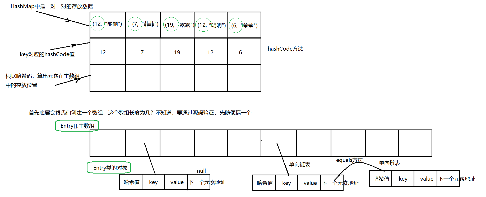
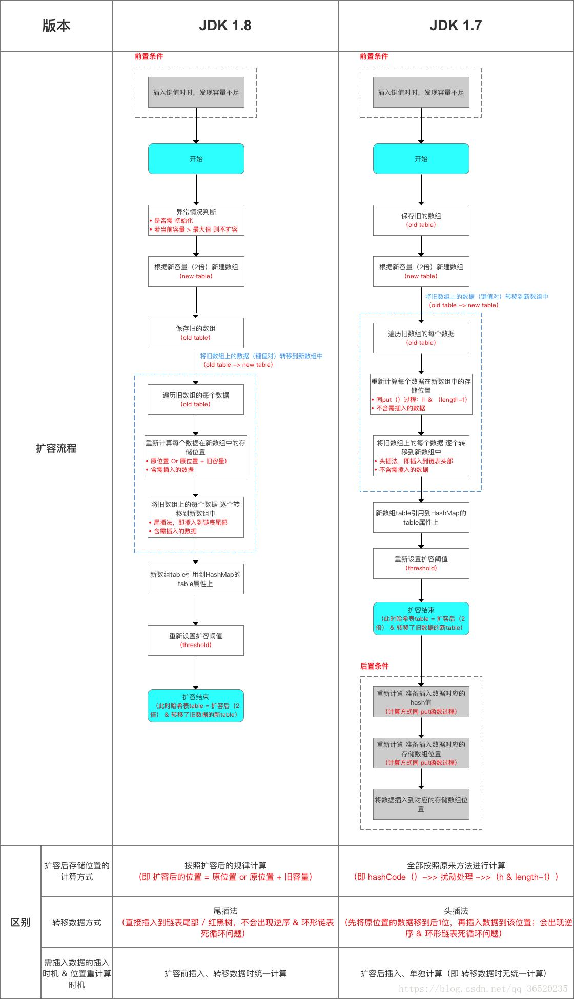

Map接口的常用实现类: HashMap、LinkedHashMap、 Hashtable和Properties。

## HashMap

版本：**JDK1.2**
特点：**无序**、**唯一**
HashMap**是以key-val对的方式来存储数据**
**key不能重复，但是是值可以重复。允许使用null键和null值，但有且只有一个。**
如果**添加相同的key ,则会覆盖原来的key-val ,等同于修改**.(key不会替换，val会替换)
与HashSet一样，不保证映射的顺序，因为**底层是以hash表的方式来存储的**.
HashMap没有实现同步，因此是**线程不安全的**

### 遍历方法

1. 通过 `map.keySet();`获取Key的Set集合，再通过map.get(key)获取Value
2. 通过`map.values();`获取value的Collection集合
3. 通过`map.entrySet();`获取Set\<Map.Entry\<String, Integer>>的K-V集合

### 常用方法

```java
package com.meturing.map;

import java.util.*;

public class Test01 {
    public static void main(String[] args) {
         /*
            增加：put(K key, V value)
            删除：clear() remove(Object key)
            修改：
            查看：entrySet() get(Object key) keySet() size() values()
            判断：containsKey(Object key) containsValue(Object value)
                equals(Object o) isEmpty()
         */
        HashMap<String, Integer> map = new HashMap<>();
        System.out.println(map.put("lili", 10101010)); //null  返回如果存在的话，在Map中的value
        map.put("nana",12345234);
        map.put("feifei",34563465);
        System.out.println(map.put("lili", 34565677)); //对已存在的Key继续添加数据，会覆盖之前的值 10101010 =》 34565677
        map.put("mingming",12323);
        System.out.println(map); // {nana=12345234, lili=34565677, mingming=12323, feifei=34563465}
        // 移除指定的Key
//        map.remove("lili");
//        System.out.println(map);// {nana=12345234, mingming=12323, feifei=34563465}
        // 清空
//        map.clear();
//        System.out.println(map); // {}
        System.out.println(map.size()); //获取Map中使用的长度
        // 判断
        System.out.println(map.containsKey("lili"));//判断指定的Key是否存在 true
        System.out.println(map.containsValue(123123132));//判断指定的Value是否存在 false
        HashMap<String, Integer> map1 = new HashMap<>();
        map1.put("lili",10101010);
        System.out.println(map == map1); //比较的是地址是否一致  false
        System.out.println(map.equals(map1));//map重写了equse方法，比较的是内容是否相等 false
        System.out.println(map.isEmpty());// 判断Map中是否为空  false
        // Map的遍历方式 6种
        // 第一组：通过 map.keySet()获取包含Map的Key的Set集合,通过map.get(key)获取Value   遍历 =》 增强for或迭代器
        Set<String> set = map.keySet();
        for (String s : set) {
            System.out.print(map.get(s) +"\t");
        }
        System.out.println();
        Iterator<String> iterator = set.iterator();
        while (iterator.hasNext()) {
            System.out.print(map.get(iterator.next())+"\t");
        }
        System.out.println();
        // 第二组：通过 map.values()获得一个包含Value的Collection集合  遍历 =》 增强for或迭代器
        Collection<Integer> values = map.values();
        for (Integer value : values) {
            System.out.print(value+"\t");
        }
        System.out.println();
        Iterator<Integer> iterator1 = values.iterator();
        while (iterator1.hasNext()) {
            System.out.print(iterator1.next()+"\t");
        }
        System.out.println();
        //第三组：通过EntrySet 获取 k-v 遍历 =》 增强for或迭代器
        Set<Map.Entry<String, Integer>> entries = map.entrySet();
        for (Map.Entry<String, Integer> entry : entries) {
            System.out.print(entry.getKey() + "----" + entry.getValue() + "\t");
        }
        System.out.println();
        Iterator<Map.Entry<String, Integer>> iterator2 = entries.iterator();
        while (iterator2.hasNext()) {
            Map.Entry<String, Integer> next = iterator2.next();
            System.out.print(next.getKey() + "----" + next.getValue() + "\t");
        }
    }
}

```

### 底层原理

在源码里HashMap实现了Map接口，又继承了AbreastMap实现类。但是AbreastMap实现类也是实现了Map接口，所以此处有些许冗余。但在后续的代码中并没有修正

#### JDK1.7

基本原理：**数组+单向链表**


代码逻辑概述：
- 存储
	- 初始化默认创建一个长度为16的Entry数组，扩容因子是0.75，即12个长度。
	- 在存放数据时，会计算KEY的hash码值，来决定Value的存放位置。为了避免Hash撞码的情况，底层采用了二次散列以及扰动函数。
	- 相同的KEY会放到同样的位置，后者会替换前者的Value，并返回替换前的值。
	- 不同的KEY通过取模来判断存放的位置，相同的下标上可以存放多个Value，以单向链表的形式存储
- 扩容
	- 当Entry数组上存储的数量达到最大扩容因子限定的长度时，HashMap会自动扩容：扩容以主数组的2倍扩容
	- 扩容会重新创建一个当前数组长度2倍的新的Entry数组，并将原数组的Value复制到新的数组，此时会重新计算原有的位置
	- 将HashMap的引用指向到新的Entry数组，舍弃原有Entry数组等待GC扫描回收
	- 重新计算当前需要插入的值在新数组的位置，插入数值

-   相关代码
    ```java
    public class HashMap<K,V>
       //【1】继承的AbstractMap中，已经实现了Map接口
      extends AbstractMap<K,V>
      //【2】又实现了这个接口，多余，但是设计者觉得没有必要删除，就这么地了
      implements Map<K,V>, Cloneable, Serializable{
          //【3】后续会用到的重要属性：先粘贴过来：
          static final int DEFAULT_INITIAL_CAPACITY = 16;//哈希表主数组的默认长度
          //定义了一个float类型的变量，以后作为：默认的装填因子，加载因子是表示Hsah表中元素的填满的程度
          //太大容易引起哈西冲突，太小容易浪费  0.75是经过大量运算后得到的最好值
          //这个值其实可以自己改，但是不建议改，因为这个0.75是大量运算得到的
          static final float DEFAULT_LOAD_FACTOR = 0.75f;
          transient Entry<K,V>[] table;//主数组,每个元素为Entry类型
          transient int size;
          int threshold;//数组扩容的界限值,门槛值   16*0.75=12 
          final float loadFactor;//用来接收装填因子的变量
          //【4】查看构造器：内部相当于：this(16,0.75f);调用了当前类中的带参构造器
          public HashMap() {
          this(DEFAULT_INITIAL_CAPACITY, DEFAULT_LOAD_FACTOR);
      }
    
      //【5】本类中带参数构造器：--》作用给一些数值进行初始化的！
      public HashMap(int initialCapacity, float loadFactor) {
          //【6】给capacity赋值，capacity的值一定是 大于你传进来的initialCapacity 的 最小的 2的倍数(2^n)
          int capacity = 1;
          while (capacity < initialCapacity)
              capacity <<= 1;
          //【7】给loadFactor赋值，将装填因子0.75赋值给loadFactor
          this.loadFactor = loadFactor;
          //【8】数组扩容的界限值,门槛值
          threshold = (int)Math.min(capacity * loadFactor, MAXIMUM_CAPACITY + 1);      
          //【9】给table数组赋值，初始化数组长度为16
          table = new Entry[capacity];
      }
        
       //【10】调用put方法：
       public V put(K key, V value) {
             //【11】对空值的判断
            if (key == null)return putForNullKey(value);
            //【12】调用hash方法，获取哈希码
            int hash = hash(key);
            //【14】得到key对应在数组中的位置
            int i = indexFor(hash, table.length);
            //【16】如果你放入的元素，在主数组那个位置上没有值，e==null  那么下面这个循环不走
            //当在同一个位置上放入元素的时候
            for (Entry<K,V> e = table[i]; e != null; e = e.next) {
                Object k;
                //哈希值一样  并且  equals相比一样   
                //(k = e.key) == key  如果是一个对象就不用比较equals了
                if (e.hash == hash && ((k = e.key) == key || key.equals(k))) {
                    //获取老的Value
                    V oldValue = e.value;
                    //新Value替换老的Value   -->  只替换value不替换值
                    e.value = value;
                    e.recordAccess(this);
                    //返回老的Value
                    return oldValue;
                }
            }
            modCount++;
            //【17】走addEntry添加这个节点的方法：
            addEntry(hash, key, value, i);
            return null;
        }
        
      //【13】hash方法返回这个key对应的哈希值，内部进行二次散列，为了尽量保证不同的key得到不同的哈希码！
     final int hash(Object k) {
          int h = 0;
          if (useAltHashing) {
              if (k instanceof String) {
                  return sun.misc.Hashing.stringHash32((String) k);
              }
              h = hashSeed;
          }
          //k.hashCode()函数调用的是key键值类型自带的哈希函数，
          //由于不同的对象其hashCode()有可能相同，所以需对hashCode()再次哈希，以降低相同率。
          h ^= k.hashCode();
          // This function ensures that hashCodes that differ only by
          // constant multiples at each bit position have a bounded
          // number of collisions (approximately 8 at default load factor).
          /*
             接下来的一串与运算和异或运算，称之为“扰动函数”，
             扰动的核心思想在于使计算出来的值在保留原有相关特性的基础上，
             增加其值的不确定性，从而降低冲突的概率。
             不同的版本实现的方式不一样，但其根本思想是一致的。
             往右移动的目的，就是为了将h的高位利用起来，减少哈西冲突
          */
          h ^= (h >>> 20) ^ (h >>> 12);
          return h ^ (h >>> 7) ^ (h >>> 4);
        }
        
       //【15】返回int类型数组的坐标
      static int indexFor(int h, int length) {
          //其实这个算法就是取模运算：h%length，取模效率不如位运算
          return h & (length-1);
      }
    
      //【18】调用addEntry
      void addEntry(int hash, K key, V value, int bucketIndex) {
          //【25】size的大小  大于 16*0.75=12的时候，比如你放入的是第13个，这第13个你打算放在没有元素的位置上的时候
          if ((size >= threshold) && (null != table[bucketIndex])) {
              //【26】主数组扩容为2倍
              resize(2 * table.length);
              //【30】重新调整当前元素的hash码
              hash = (null != key) ? hash(key) : 0;
              //【31】重新计算元素位置
              bucketIndex = indexFor(hash, table.length);
          }
          //【19】将hash,key,value,bucketIndex位置  封装为一个Entry对象：
          createEntry(hash, key, value, bucketIndex);
      }
      
      //【20】
     void createEntry(int hash, K key, V value, int bucketIndex) {
          //【21】获取bucketIndex位置上的元素给e
          Entry<K,V> e = table[bucketIndex];
          //【22】然后将hash, key, value封装为一个对象，然后将下一个元素的指向为e （链表的头插法）
          //【23】将新的Entry放在table[bucketIndex]的位置上
          table[bucketIndex] = new Entry<>(hash, key, value, e);
          //【24】集合中加入一个元素 size+1
          size++;
      }
      
     //【27】
     void resize(int newCapacity) {
          Entry[] oldTable = table;
          int oldCapacity = oldTable.length;
          if (oldCapacity == MAXIMUM_CAPACITY) {
              threshold = Integer.MAX_VALUE;
              return;
          }
          //【28】创建长度为newCapacity的数组
          Entry[] newTable = new Entry[newCapacity];
          boolean oldAltHashing = useAltHashing;
          useAltHashing |= sun.misc.VM.isBooted() &&
                  (newCapacity >= Holder.ALTERNATIVE_HASHING_THRESHOLD);
          boolean rehash = oldAltHashing ^ useAltHashing;
          //【28.5】转让方法：将老数组中的东西都重新放入新数组中
          transfer(newTable, rehash);
          //【29】老数组替换为新数组
          table = newTable;
          //【29.5】重新计算
          threshold = (int)Math.min(newCapacity * loadFactor, MAXIMUM_CAPACITY + 1);
      }
      
      //【28.6】
      void transfer(Entry[] newTable, boolean rehash) {
          int newCapacity = newTable.length;
          for (Entry<K,V> e : table) {
              while(null != e) {
                  Entry<K,V> next = e.next;
                  if (rehash) {
                      e.hash = null == e.key ? 0 : hash(e.key);
                  }
                  //【28.7】将哈希值，和新的数组容量传进去，重新计算key在新数组中的位置
                  int i = indexFor(e.hash, newCapacity);
                  //【28.8】头插法
                  e.next = newTable[i];//获取链表上元素给e.next
                  newTable[i] = e;//然后将e放在i位置 
                  e = next;//e再指向下一个节点继续遍历
              }
          }
      }
    }
    
    ```

#### JDK1.8



总结，相对于JDK1.7，JDK1.8做了一些优化：

数据结构上的优化：
1.  由**数组+链表**的形式 转换为**数组+链表+红黑树**的形式
    在1.8中，引入了红黑树，当相同位置的链表长度超过8个的时候，会自动从链表结构转换为红黑树结构，加快查找效率。相反，减少为8个以内时会再次转换为链表结构。
2. 扩容上的优化：
	1.  在JDK1.7中，HashMap扩容时会重新计算原有数组中的值在新数组中的位置。在JDK1.8时，则新数组中的位置 = 原位置 or 原位置+旧容量，类似于复制的操作
	2.  在JDK1.7中，插入值操作时导致扩容，会先扩容后，在新数组中重新计算位置。在JDK1.8时，则扩容前插入，转移数据时统一转移。

#### 有意思的面试题

-   为什么是2的倍数？
    在上面的底层原理中，我们发现HashMap的扩容是以主数组的2倍进行的。因为底层在计算Value的位置时，并没有使用`h%length`来计算value的位置，而是使用效率比较高的`h&(length-1)`位运算进行处理的。这样的话，要想结果准确，则length的长度必须为2的整数倍，如果不是的话，hash碰撞的几率会高很多。
-   为什么扩容因子是0.75？
    如果是1的话，数组满了才扩容。节省了空间，但是由于元素不会均匀分布，我们可能会得到一个极长的链表，会影响我们的查询时间。
    如果是0.5就扩容的话，数组并没有达到最大利用率就被扩容了，会出现浪费空间的情况
    综上所述，0.75是一个比较合适的取值限定

## LinkedHashMap

版本：**JDK1.2**
特点：**有序**、**唯一**
**在Hash表的基础上又添加了链表的结构，输出顺序与录入顺序一致**

## HashTable

版本：**JDK1.0**
特点：**无序**、**唯一**
相对于HashTable，**它的Key不允许为null**
底层使用了线程安全机制，**相对于HashTable是线程安全的，但效率低**

## TreeMap

特性：**是唯一的**、**有序的（按照规则排序输出）**
排序：**包装类【升序】**、**自定义引用类型【需要重写比较器】**
底层是个**二叉树**的结构来存储数据