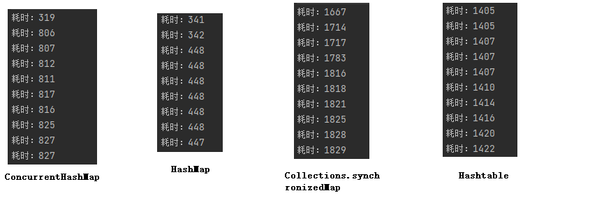

JDK5.0之后提供了多种并发类容器可以替代同步类容器，提升性能、吞吐量
`ConcurrentHashMap`替代 `HashMap`、`HashTable`
`ConcurrentSkipListMap`替代`TreeMap`
简单来讲：ConcurrentHashMap使用了粒度更小的锁

## 测试代码

``` java
public class Test01 {
    public static void main(String[] args) {
        //测试ConcurrentHashMap
        ConcurrentHashMap<String,Integer> concurrentHashMap = new ConcurrentHashMap<>();
//        //创建10个线程
        for (int i = 0; i < 10; i++) {
            new Thread(new Runnable() {
                @Override
                public void run() {
                    long startTime = System.currentTimeMillis();
                    for (int j = 0; j < 1000000; j++) {
                        concurrentHashMap.put("a"+j,j);
                    }
                    long endTime = System.currentTimeMillis();
                    System.out.println("耗时："+(endTime-startTime));
                }
            }).start();
        }
        
        //测试普通容器转换成同步容器
//        HashMap<String, Integer> stringIntegerHashMap = new HashMap<>();
//        Map<String, Integer> stringIntegerMap = Collections.synchronizedMap(stringIntegerHashMap);
//        for (int i = 0; i < 10; i++) {
//            new Thread(new Runnable() {
//                @Override
//                public void run() {
//                    long startTime = System.currentTimeMillis();
//                    for (int j = 0; j < 1000000; j++) {
//                        stringIntegerMap.put("A"+j,j);
//                    }
//                    long endTime = System.currentTimeMillis();
//                    System.out.println("耗时："+(endTime-startTime));
//                }
//            }).start();
//        }
        //测试安全性集合
//        Hashtable<String, Integer> stringIntegerHashtable = new Hashtable<>();
//        for (int i = 0; i < 10; i++) {
//            new Thread(new Runnable() {
//                @Override
//                public void run() {
//                    long startTime = System.currentTimeMillis();
//                    for (int j = 0; j < 1000000; j++) {
//                        stringIntegerHashtable.put("A"+j,j);
//                    }
//                    long endTime = System.currentTimeMillis();
//                    System.out.println("耗时："+(endTime-startTime));
//                }
//            }).start();
//        }
    }
}
```


## 底层逻辑

TODO

## 经典面试题

-   为什么HashTable慢? 它的并发度是什么? 那么ConcurrentHashMap并发度是什么?
-   ConcurrentHashMap在JDK1.7和JDK1.8中实现有什么差别? JDK1.8解決了JDK1.7中什么问题
-   ConcurrentHashMap JDK1.7实现的原理是什么? 分段锁机制
-   ConcurrentHashMap JDK1.8实现的原理是什么? 数组+链表+红黑树，CAS
-   ConcurrentHashMap JDK1.7中Segment数(concurrencyLevel)默认值是多少? 为何一旦初始化就不可再扩容?
-   ConcurrentHashMap JDK1.7说说其put的机制?
-   ConcurrentHashMap JDK1.7是如何扩容的? rehash(注：segment 数组不能扩容，扩容是 segment 数组某个位置内部的数组 HashEntry<K,V>[] 进行扩容)
-   ConcurrentHashMap JDK1.8是如何扩容的? tryPresize
-   ConcurrentHashMap JDK1.8链表转红黑树的时机是什么? 临界值为什么是8?
-   ConcurrentHashMap JDK1.8是如何进行数据迁移的? transferConcurrentHashMap不能保证并发下数据读写顺序的准确性，但是可以保证内部的数据不被破坏。


