## 引入

特点：**先进先出（FIFO）** （First In First Out）
他有两端，一端是让新元素进去，一端是让老元素出去
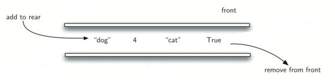

在日常的社会生活中，**比如排队买票使用的就是队列**。在计算机网络架构中、网络自身内部的各种计算资源，无论是多进程共享的 CPU 时间，还是多用户共享的打印机，也都需要借助队列结构实现合理和优化的分配。

同样，我们也可以创建双端队列：两端都可以进行进队，出队的队列
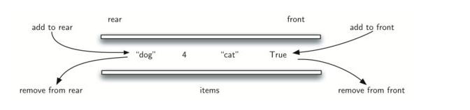

在上面的双端队列的基础上 我们可以加以限制，获得：

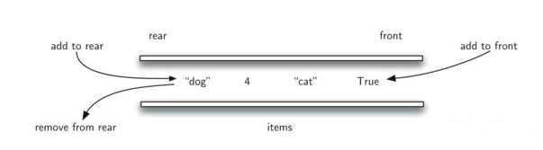
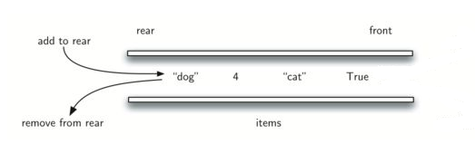

栈和队列的物理结构实现 可以用线性表的数组，链表都可以

## 阻塞队列 - BlockingQueue

BlockingQueue继承**Queue**，**Queue继承自Collection**。所以Collection最基础的增删改查操作是有的，在这个基础上，多了Queue的特点，在这个基础上又多了阻塞的特点，最终形成了BlockingQueue

### 阻塞的概念

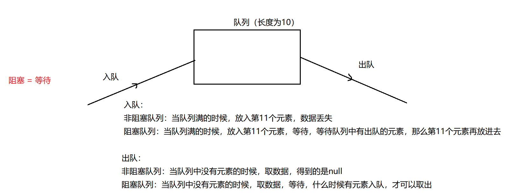

简单来讲，获取参数时如果队列为空则等待，直到队列加入元素后直接获取。添加元素时队列如果满载则等待，直至队列出现空余时立即加入。

### 常用的API

注意：不可以添加Null

| API                                | 说明                                                          |
| ---------------------------------- | ----------------------------------------------------------- |
| boolean add(E e)                   | 将指定元素插入此队列（如果立即可行且不违反容量限制），成功返回true，如果当前没有可用空间，则**抛出异常**    |
| boolean offer(E e)                 | 将指定元素插入此队列（如果立即可行且不违反容量限制），成功返回true，如果当前没有可用空间，则**返回false** |
| void put(E e)                      | 将指定元素插入此队列，如果没有空余空间则等待（**阻塞**）                              |
| E take()                           | 获取并移除此队列的头部，如果没有元素则**一直等待**                                 |
| E pool(long timeout,TimeUnit unit) | 获取并移除此队列的头部，如果没有元素则**等待指定的时间**                              |
| boolean remove(Object o)           | 从队列中移除指定的元素实例，**无论在不在无异常**                                  |

### 子类 - ArrayBlockingQueue

#### 概念

ArrayBlockingQueue是一个底层基于数组的有边界的队列，和其他的队列一样是FIFO（先进先出）。获取元素从头部获取，放置元素从尾部放置。

**不支持读写同时操作，底层基于数组的**

#### 代码

```java
public class TestArrayBlockingQueue {
    public static void main(String[] args) throws InterruptedException {
        ArrayBlockingQueue queue = new ArrayBlockingQueue(3);
        //【1】添加null元素：不可以添加null元素，会报空指针异常：NullPointerException
        //queue.add(null);
        queue.add('a');
        queue.add('b');
        queue.add('c');
        
        //【2】由于当前队列处于满载情况，我们无法添加直接抛出异常 Queue full
        //System.out.println(queue.add('c'));
        
        //【3】 创建一个独立的线程，测试阻塞添加
        new Thread(new Runnable() {
            @Override
            public void run() {
                try {
                    //【3】指定时间等阻塞添加，失败则返回false
                    System.out.println(queue.offer("e", 3, TimeUnit.MILLISECONDS));//flase
                    //【4】完全阻塞添加
                    queue.put('f');
                } catch (InterruptedException e) {
                    throw new RuntimeException(e);
                }
            }
        }).start();
        Thread.sleep(100);//休眠1S
        
        //【5】获取队列头，不移除
        System.out.println(queue.peek());//a
        System.out.println(queue);//[a, b, c]
        
        //【6】获取队列头，且移除
        System.out.println(queue.poll());//a
        System.out.println(queue);//[b, c]
        Thread.sleep(100);//休眠1S
        System.out.println(queue);//[b, c, f]
        
        //【7】获取队列头，且移除(阻塞)
        System.out.println(queue.take());//b
        System.out.println(queue);//[c, f]
        
        //【8】清空元素
        queue.clear();
        System.out.println(queue);//[]
        
        System.out.println(queue.peek());//null
        System.out.println(queue.poll());//null
        
        //测试阻塞
        new Thread(new Runnable() {
            @Override
            public void run() {
                try {
                    //指定时间阻塞式获取
                    System.out.println(queue.poll(2,TimeUnit.MILLISECONDS));
                    //永久阻塞式获取
                    System.out.println("开始强制获取.....");
                    System.out.println(queue.take());
                } catch (InterruptedException e) {
                    throw new RuntimeException(e);
                }
            }
        }).start();
        
        Thread.sleep(2000);//休眠2s
        queue.add("a");
    }
}

```

#### 源码

```java
public class ArrayBlockingQueue<E> {
        //底层就是一个数组：
        final Object[] items;
        //取元素用到的索引，初始结果为0
        int takeIndex;
        //放元素用到的索引，初始结果为0
        int putIndex;
        //数组中元素的个数：
        int count;
        
        //一把锁：这个锁肯定很多方法中用到了，所以定义为属性，初始化以后可以随时使用
        final ReentrantLock lock;
        //锁伴随的一个等待池：notEmpty
        private final Condition notEmpty;
        //锁伴随的一个等待池：notFull
        private final Condition notFull;
        
        //构造器：
        public ArrayBlockingQueue(int capacity) {//传入队列指定的容量
        this(capacity, false);
    }
        
      public ArrayBlockingQueue(int capacity, boolean fair) {//传入队列指定的容量
                  //健壮性考虑
          if (capacity <= 0)
              throw new IllegalArgumentException();
                  //初始化底层数组
          this.items = new Object[capacity];
                  //初始化锁 和  等待队列
          lock = new ReentrantLock(fair);
          notEmpty = lock.newCondition();
          notFull =  lock.newCondition();
        }
        
        //两个基本方法：一个是入队，一个是出队  ，是其他方法的基础：
        
        //入队：
      private void enqueue(E x) {
        // assert lock.getHoldCount() == 1;
        // assert items[putIndex] == null;
        final Object[] items = this.items;//底层数组赋给items
                //在对应的下标位置放入元素
        items[putIndex] = x;
        if (++putIndex == items.length) //++putIndex putIndex 索引 加1 
            putIndex = 0;
                //每放入一个元素，count加1操作
        count++;
        notEmpty.signal();
      }
        
        
        //出队：
        private E dequeue() {
          // assert lock.getHoldCount() == 1;
          // assert items[takeIndex] != null;
          final Object[] items = this.items;//底层数组赋给items
          @SuppressWarnings("unchecked")
          E x = (E) items[takeIndex];//在对应的位置取出元素
          items[takeIndex] = null;//对应位置元素取出后就置为null
          if (++takeIndex == items.length)//++takeIndex 加1操作
              takeIndex = 0;
          count--;//每取出一个元素，count减1操作
          if (itrs != null)
              itrs.elementDequeued();
          notFull.signal();
          return x;//将取出的元素作为方法的返回值
      }
       
}
```

#### 基本原理

##### 核心元素

`Object[] items` 用于存储数据，
`int takeIndex` 取元素用到的索引，初始结果为0
`int putIndex` 放元素用到的索引，初始结果为0
`int count` 数组中元素的个数
`ReentrantLock lock` 一把阻塞锁，存数据/取数据都用这个锁
`Condition notEmpty` 非空等待池
`Condition notFull` 非满等待池

##### 初始化

初始化底层数组长度
初始化锁以及等待池

##### 存元素

1. 将底层数组先赋值给`Object[] items `数组
2. `items[putIndex] = x；`//在对应的下标位置放入元素
3. 将存元素的指针向后位移一个，如果达到队列最大长度则指向0
4. 将Count计数+1
5. 激活非空等待池

##### 取元素

1. 将底层数组先赋值给`Object[] items` 数组
2. `E x = (E) items[takeIndex];`//在对应的位置取出元素
3. 将取元素的指针向后位移一个，如果达到队列最大长度则指向0
4. 将Count计数-1
5. 激活非满等待池
6. 返回元素

#### 相关概念

阻塞存取基于基本的enqueue 和 enqueue，是通过对等待池的限定来实现的
简单点我们可以理解为：
1.  在执行阻塞操作时我们会先获取锁，来同步结果。
2.  如果放数据时达到最大长度，则notFull等待池会进入等待状态。当其他线程取出数据时，才会重新激活notFull等待池，继续执行放置元素的任务
3.  如果取元素时队列为空，则notEmpty等待池会进入等待状态，当其他元素放置元素时，才会重新激活notEmpty等待池，继续执行取元素的任务

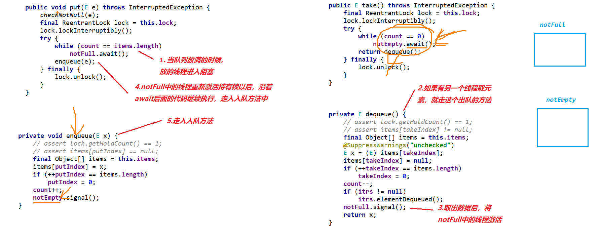

注意：代码的核心关键是，**在判断是否阻塞时采用了while不断的查询状态**，这样**可以在线程被激活的第一时间执行任务**。避免当再次准备放置时，被其他线程抢先的情况造成错误。


### 子类 - LinkedBlockingQueue

#### 概念

**LinkedBlockingQueue是一个有边界的队列，底层采用了链表的结构**。如果我们不指定长度时，他会默认为`Integer.MAX_VALUE 21`亿多

**支持读写同时操作，并发情况下，效率高。底层基于链表。**

#### 代码

``` java
    /**
     *  放置元素
     * @throws InterruptedException
     */
    public void setValue() throws InterruptedException {
        LinkedBlockingQueue<Object> aq = new LinkedBlockingQueue<>(3);
        //添加元素：
        //【1】添加null元素：不可以添加null元素，会报空指针异常：NullPointerException
        //aq.add(null);
        //aq.offer(null);
        aq.put(null);
        //【2】正常添加元素：
        aq.add("aaa");
        aq.offer("bbb");
        aq.put("ccc");
        System.out.println(aq);//[aaa, bbb, ccc]
        //【3】在队列满的情况下，再添加元素：
        //aq.add("ddd");//在队列满的情况下，添加元素 出现异常：Queue full
        //System.out.println(aq.offer("ddd"));//没有添加成功，返回false
        //设置最大阻塞时间，如果时间到了，队列还是满的，就不再阻塞了
        //aq.offer("ddd",2, TimeUnit.SECONDS);
        //真正阻塞的方法： put ,如果队列满，就永远阻塞
        aq.put("ddd");
        System.out.println(aq);
    }
    
    /**
     * 取元素
     * @throws InterruptedException
     */
    public void getValue() throws InterruptedException {
        //创建一个队列，队列可以指定容量指定长度3：
        LinkedBlockingQueue aq = new LinkedBlockingQueue();
        aq.add("aaa");
        aq.add("bbb");
        aq.add("ccc");
        //得到头元素但是不移除
        System.out.println(aq.peek());
        System.out.println(aq);
        //得到头元素并且移除
        System.out.println(aq.poll());
        System.out.println(aq);
        //得到头元素并且移除
        System.out.println(aq.take());
        System.out.println(aq);
        //清空元素：
        aq.clear();
        System.out.println(aq);
        System.out.println(aq.peek());//null
        System.out.println(aq.poll());//null
        //设置阻塞事件，如果队列为空，返回null，时间到了以后就不阻塞了
        //System.out.println(aq.poll(2, TimeUnit.SECONDS));
        //真正阻塞：队列为空，永远阻塞
        System.out.println(aq.take());
    }
```

#### 源码

``` java
public class LinkedBlockingQueue<E>{
        //内部类Node就是链表的节点的对象对应的类：
        static class Node<E> {
        E item;//封装你要装的那个元素
        
        Node<E> next;//下一个Node节点的地址
        Node(E x) { item = x; }//构造器
    }
        //链表的长度
        private final int capacity;
        //计数器：
        private final AtomicInteger count = new AtomicInteger();
        //链表的头结点
        transient Node<E> head;
        //链表的尾结点
        private transient Node<E> last;
        //取元素用的锁
        private final ReentrantLock takeLock = new ReentrantLock();
        //等待池
        private final Condition notEmpty = takeLock.newCondition();
        //放元素用的锁
        private final ReentrantLock putLock = new ReentrantLock();
        //等待池
        private final Condition notFull = putLock.newCondition();
        
        public LinkedBlockingQueue() {
        this(Integer.MAX_VALUE);//调用类本类的空构造器，传入正21亿
    }
        
        public LinkedBlockingQueue(int capacity) {
            //健壮性考虑
            if (capacity <= 0) throw new IllegalArgumentException();
            //给队列指定长度  
            this.capacity = capacity;
            //last，head指向一个新的节点，新的节点中 元素为null 
            last = head = new Node<E>(null);
      }
        
        
        //入队：
        private void enqueue(Node<E> node) {
            last = last.next = node;
        }
        
        //出队：
        private E dequeue() {
            Node<E> h = head;//h指向了head
            Node<E> first = h.next;//first 指向head的next
            h.next = h; // help GC   h.next指向自己，更容易被GC发现 被GC
            head = first;//head的指向指为first
            E x = first.item;//取出链中第一个元素，给了x
            first.item = null;
            return x;//把x作为方法的返回值
        }
}
```

#### 基本原理

##### 初始化

初始化时默认传一个结点，值为空 / 下一个地址也为空，且head指针和last指针都指向这个节点

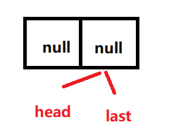

##### 放元素的基本原理

将last节点的地址指向新增的节点（此时last是新增前的last）
将last指针指向新增节点

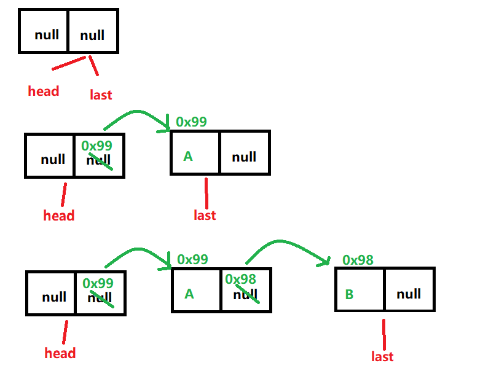

##### 取元素的基本原理

将head指针指向head指针指向的地址的节点
修改原有head指针指向的节点地址为自己（这样更容易被GC）
返回修改后head指针指向的节点的值，并修改为null

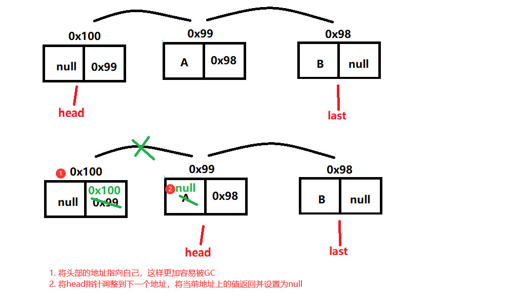

#### 相关概念

##### 阻塞原理实现
同ArrayListBlockingQueue，只不过是LinkedBlockingQueue使用了两把锁，读写各自有单独的锁。

- 放数据
	- 打开放数据的锁 → 传入对象 → 判断是否满载（满载 notFull等待池开始阻塞/非满载存放数据 激活notEmpty等待池) → 关闭放数据的锁
- 取数据
	- 打开取数据的锁 → 获取head指向的对象 → 判断是否为空队列（空队列 notEmpty等待池开始阻塞/非空队列 激活notFull等待池) → 关闭取数据的锁

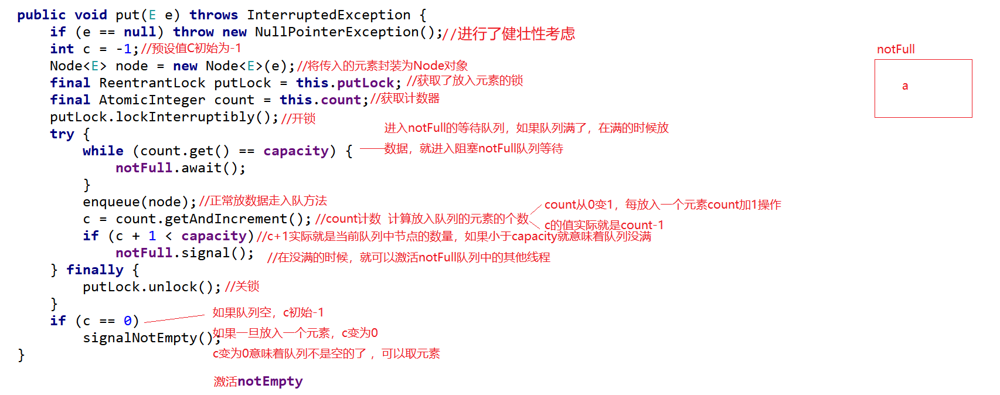


### 子类 - SynchronousQueue

#### 概念

**SynchronousQueue是一个没有容量大小的队列**，这也寓意着我们没有办法正常的通过他来存放数据。同常在使用中需要先获取数据再存放数据，它常被用做线程间的通信。

优点：**效率极高不会出现线程争抢的问题**，我们可以理解为他是线程与线程间的传送门

注意:
	取出元素 不能用peek，因为peek不会将元素从队列中拿走，只是查看的效果；
	一定要先取再放！！！

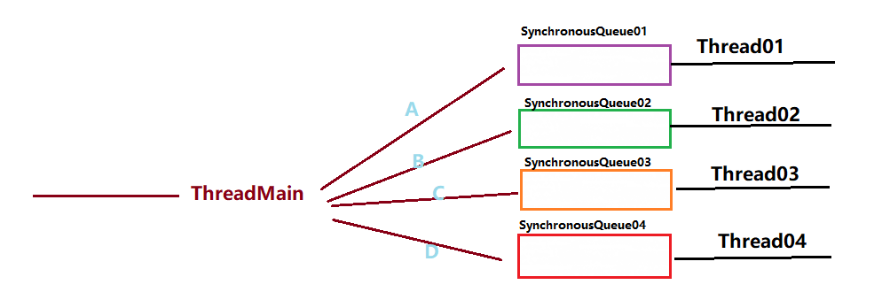
#### 代码

##### 非阻塞

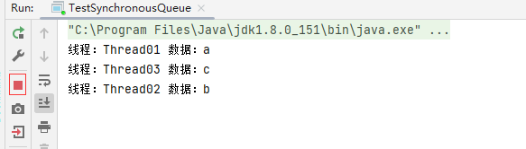
```java
/**
     * 非阻塞类型
     * @throws InterruptedException
     */
    public static  void testTake() throws InterruptedException {
        SynchronousQueue<Object> synchronousQueue1 = new SynchronousQueue<>();
        SynchronousQueue<Object> synchronousQueue2 = new SynchronousQueue<>();
        SynchronousQueue<Object> synchronousQueue3 = new SynchronousQueue<>();
        
        new Thread(()->{
            while (true){
                try {
                    System.out.println("线程："+Thread.currentThread().getName()+" 数据："+synchronousQueue1.take());
                } catch (InterruptedException e) {
                    throw new RuntimeException(e);
                }
            }
        },"Thread01").start();
        
        new Thread(()->{
            while (true){
                try {
                    System.out.println("线程："+Thread.currentThread().getName()+" 数据："+synchronousQueue3.take());
                } catch (InterruptedException e) {
                    throw new RuntimeException(e);
                }
            }
        },"Thread02").start();
        
        new Thread(()->{
            while (true){
                try {
                    System.out.println("线程："+Thread.currentThread().getName()+" 数据："+synchronousQueue3.take());
                } catch (InterruptedException e) {
                    throw new RuntimeException(e);
                }
            }
        },"Thread03").start();
        
        synchronousQueue1.put("a");
        synchronousQueue2.put("b");
        synchronousQueue3.put("c");
    }
```


##### 阻塞

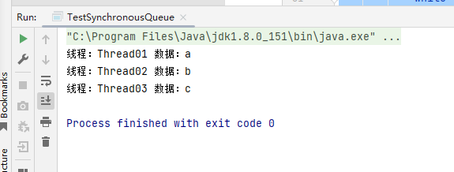

```java
/**
     * 阻塞类型
     * @throws InterruptedException
     */
    public static void testPoll() throws InterruptedException {
        SynchronousQueue<Object> synchronousQueue1 = new SynchronousQueue<>();
        SynchronousQueue<Object> synchronousQueue2 = new SynchronousQueue<>();
        SynchronousQueue<Object> synchronousQueue3 = new SynchronousQueue<>();
        
        new Thread(()->{
            while (true){
                try {
                    Object poll = synchronousQueue1.poll(5, TimeUnit.SECONDS);
                    if (poll==null) break;
                    System.out.println("线程："+Thread.currentThread().getName()+" 数据："+poll);
                } catch (InterruptedException e) {
                    throw new RuntimeException(e);
                }
            }
        },"Thread01").start();
        
        new Thread(()->{
            while (true){
                try {
                    Object poll = synchronousQueue2.poll(5, TimeUnit.SECONDS);
                    if (poll==null) break;
                    System.out.println("线程："+Thread.currentThread().getName()+" 数据："+poll);
                } catch (InterruptedException e) {
                    throw new RuntimeException(e);
                }
            }
        },"Thread02").start();
        
        new Thread(()->{
            while (true){
                try {
                    Object poll = synchronousQueue3.poll(5, TimeUnit.SECONDS);
                    if (poll==null) break;
                    System.out.println("线程："+Thread.currentThread().getName()+" 数据："+poll);
                } catch (InterruptedException e) {
                    throw new RuntimeException(e);
                }
            }
        },"Thread03").start();
        
        synchronousQueue1.put("a");
        synchronousQueue2.put("b");
        synchronousQueue3.put("c");
    }
```


### 子类 - PriorityBlockingQueue

#### 概念

**这是一个带有优先级的无界队列，默认长度为11，长度会根据使用情况自动扩容，直至内存全部耗尽出现OutOfMemoryError内存溢出 程序才会结束。**

存放对象必须是比较对象，实现内部比较器或者外部比较器，**否则抛出异常ClassCastException**

#### 代码

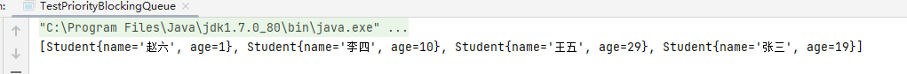
```java
package com.meturing.Queue;

import java.util.concurrent.PriorityBlockingQueue;

public class TestPriorityBlockingQueue {
    public static void main(String[] args) {
        PriorityBlockingQueue<Student> priorityBlockingQueue = new PriorityBlockingQueue<Student>();
        priorityBlockingQueue.put(new Student("张三", 19));
        priorityBlockingQueue.put(new Student("李四", 10));
        priorityBlockingQueue.put(new Student("王五", 29));
        priorityBlockingQueue.put(new Student("赵六", 1));
        System.out.println(priorityBlockingQueue);
    }
}
class Student implements Comparable<Student>{
    String name;
    int age;
    
    public String getName() {
        return name;
    }
    
    public void setName(String name) {
        this.name = name;
    }
    
    public int getAge() {
        return age;
    }
    
    public void setAge(int age) {
        this.age = age;
    }
    
    public Student(String name, int age) {
        this.name = name;
        this.age = age;
    }
    
    @Override
    public String toString() {
        return "Student{" +
                "name='" + name + '\'' +
                ", age=" + age +
                '}';
    }
    
    @Override
    public int compareTo(Student o) {
        return this.age - o.age;
    }
}

```
该队列会根据比较器，将队列中的数据进行排序，按照比较器规则有序取出

### 子类 - DelayQueue

#### 简介

**DelayQueue是一个无界的BlockingQueue，用于放置实现了Delayed接口的对象，其中的对象只能在其到期时才能从队列中取走**

当生产者线程调用put之类的方法加入元素时，会触发Delayed接口中的compareTo方法进行排序，也就是说队列中元素的顺序是按到期时间排序的，而非它们进入队列的顺序。排在队列头部的元素是最早到期的，越往后到期时间赿晚。

消费者线程查看队列头部的元素，注意是查看不是取出。然后调用元素的getDelay方法，如果此方法返回的值小０或者等于０，则消费者线程会从队列中取出此元素，并进行处理。如果getDelay方法返回的值大于0，则消费者线程wait返回的时间值后，再从队列头部取出元素，此时元素应该已经到期。

#### 应用场景

1.  淘宝订单业务:下单之后如果三十分钟之内没有付款就自动取消订单。
2.  饿了吗订餐通知:下单成功后60s之后给用户发送短信通知。
3.  关闭空闲连接。服务器中，有很多客户端的连接，空闲一段时间之后需要关闭之。
4.  缓存。缓存中的对象，超过了空闲时间，需要从缓存中移出。
5.  任务超时处理。在网络协议滑动窗口请求应答式交互时，处理超时未响应的请求等。

#### 测试案例

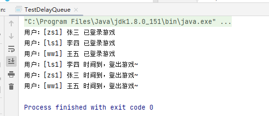
```java
package com.meturing.Queue;

import java.util.concurrent.DelayQueue;
import java.util.concurrent.Delayed;
import java.util.concurrent.TimeUnit;

public class TestDelayQueue {
    DelayQueue<User> delayQueue = new DelayQueue<User>();
    public static void main(String[] args) {
        TestDelayQueue testDelayQueue = new TestDelayQueue();
        testDelayQueue.login(new User("zs1","张三",System.currentTimeMillis()+5000));
        testDelayQueue.login(new User("ls1","李四",System.currentTimeMillis()+2000));
        testDelayQueue.login(new User("ww1","王五",System.currentTimeMillis()+10000));
        
        while (true){
            testDelayQueue.loginOut();
            if (testDelayQueue.getUserSUM()<=0) break;
        }
        
    }
    
    /**
     * 登录
     * @param user
     */
    public void login(User user){
        delayQueue.put(user);
        System.out.println("用户：["+user.getUserId()+"] "+user.getUserName()+" 已登录游戏");
    }
    
    /**
     * 登出
     */
    public void loginOut(){
        try {
            User take = delayQueue.take();
            System.out.println("用户：["+take.getUserId()+"] "+take.getUserName()+" 时间到，登出游戏~");
        } catch (InterruptedException e) {
            throw new RuntimeException(e);
        }
    }
    
    /**
     * 获取人数
     * @return
     */
    public int getUserSUM(){
        return delayQueue.size();
    }
}

class User implements Delayed{
    String UserId;//用户ID
    String UserName;//用户名
    Long endTime;//到期时间
    
    public String getUserId() {
        return UserId;
    }
    
    public void setUserId(String userId) {
        UserId = userId;
    }
    
    public String getUserName() {
        return UserName;
    }
    
    public void setUserName(String userName) {
        UserName = userName;
    }
    
    public Long getEndTime() {
        return endTime;
    }
    
    public void setEndTime(Long endTime) {
        this.endTime = endTime;
    }
    
    public User(String userId, String userName, Long endTime) {
        UserId = userId;
        UserName = userName;
        this.endTime = endTime;
    }
    
    @Override
    public String toString() {
        return "User{" +
                "UserId='" + UserId + '\'' +
                ", UserName='" + UserName + '\'' +
                "}";
    }
    
    @Override
    public long getDelay(TimeUnit unit) {
        //到期时间小于系统时间，退出队列
        return this.getEndTime()-System.currentTimeMillis();
    }
    
    @Override
    public int compareTo(Delayed o) {
        //按照到期时间按排序
        User u = (User) o;
        return ((Long)this.endTime).compareTo((Long) u.endTime);
    }
}
```

## 双端队列Deque

双端队列用的比较少，再具备Queue的基础上同时拓展了对头尾的独立操作方法。
由于Deque是个接口，同样我们使用他的实现类LinkedList

```java
public class Test03 {
    //这是main方法，程序的入口
    public static void main(String[] args) {
        /*
        双端队列：
        Deque<E> extends Queue
        Queue一端放 一端取的基本方法  Deque是具备的
        在此基础上 又扩展了 一些 头尾操作（添加，删除，获取）的方法
         */
        Deque<String> d = new LinkedList<>() ;
        d.offer("A");
        d.offer("B");
        d.offer("C");
        System.out.println(d);//[A, B, C]
        d.offerFirst("D");
        d.offerLast("E");
        System.out.println(d);//[D, A, B, C, E]
        System.out.println(d.poll());
        System.out.println(d);//[A, B, C, E]
        System.out.println(d.pollFirst());
        System.out.println(d.pollLast());
        System.out.println(d);
    }
}
```