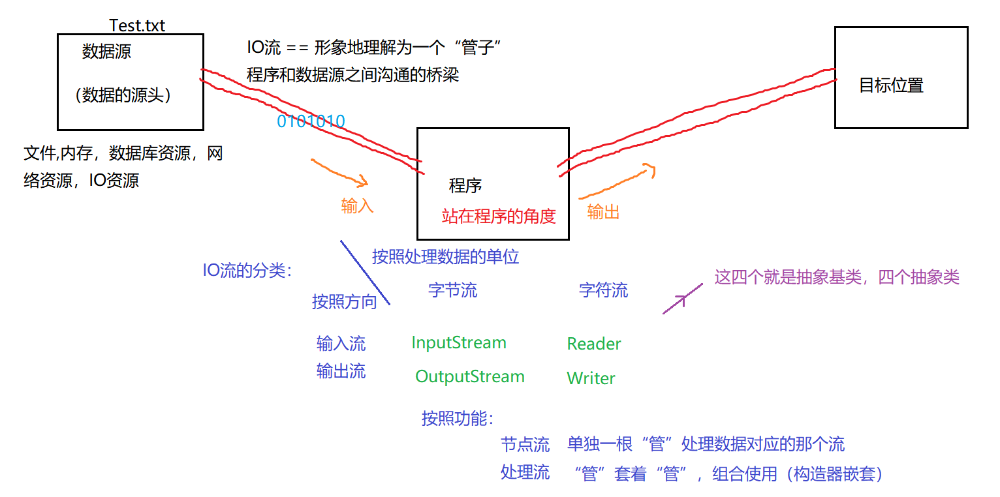
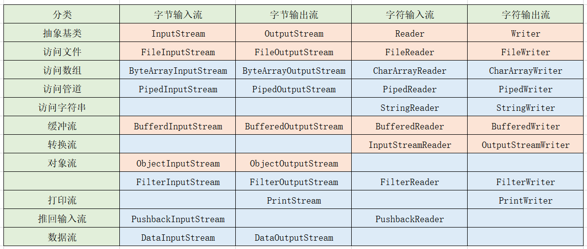

## 概览

### 概念

在本章节我们将学习Java中的IO流的操作，在此之前我们先熟悉两个基本的概念：

1. **File类** 封装文件/目录的各种信息，对目录/文件进行操作，但是我们不可以获取到文件/目录中的内容。
2. **IO流** Input/Output的缩写，用于处理设备之间的数据的传输。

我们可以理解为，将文件实体读取为FIle类对象，然后使用IO流类似通道一样读取文件中的内容。反之将内容通过IO流写道File类对象中，然后保存到硬盘。



### IO流的体系结构



文本文件：.txt .java .c .cpp ---》建议使用字符流操作
非文本文件：.jpg, .mp3 , .mp4 , .doc , .ppt ---》建议使用字节流操作

## 字符流

### FileReader

#### API

| API                                          | 说明                                                                                                | 举例 |
| -------------------------------------------- | ------------------------------------------------------------------------------------------------- | -- |
| FileReader(File file);                       | 构造函数，导入指定的File类                                                                                   |    |
| int read()                                   | 读取一个字符，返回读取的字符，如果已到达流的末尾则为-1                                                                      |    |
| int read(char cbuf\[])                       | 读取指定长度的字符，返回读取的字符数，如果已到达流的末尾则为-1                                                                  |    |
| String(char value\[], int offset, int count) | 分配一个新字符串，该字符串包含字符数组参数的子数组中的字符。offset参数是子数组第一个字符的索引，count参数指定子数组的长度。复制子数组的内容;字符数组的后续修改不会影响新创建的字符串。 |    |

#### 代码
```java
package com.meturing.io;


import java.io.*;

public class TestIO01 {
    /**
     * 读取指定char长度的字符，通过String函数转换成str
     * @param args
     * @throws IOException
     */
    public static void main(String[] args) throws IOException {
        File file = new File("D:" + File.separatorChar + "newFile.txt");
        FileReader fileReader = new FileReader(file);
        char[] chars = new char[5];//缓冲数组
        // 按字符读取 如果读取不到则返回-1
        int read = fileReader.read(chars);//一次性读取指定char长度,并返回当前读取的数量
        while(read!= -1){
            String str = new String(chars, 0, read);//直接使用String读取char数组
            System.out.print(str);
            read = fileReader.read(chars);
        }
        fileReader.close();//关闭流
    }
    
    /**
     * 读取指定char长度的字符
     * @throws IOException
     */
    public void Test02() throws IOException {
        File file = new File("D:" + File.separatorChar + "newFile.txt");
        FileReader fileReader = new FileReader(file);
        char[] chars = new char[5];//缓冲数组
        // 按字符读取 如果读取不到则返回-1
        int read = fileReader.read(chars);//一次性读取指定char长度,并返回当前读取的数量
        while(read!= -1){
            for (int i = 0; i < read; i++) {
                System.out.print(chars[i]);
            }
            read = fileReader.read(chars);
        }
        fileReader.close();//关闭流
    }
    
    /**
     * 一个字符一个字符读取
     * @throws IOException
     */
    public void Test01() throws IOException {
        File file = new File("D:" + File.separatorChar + "newFile.txt");
        FileReader fileReader = new FileReader(file);
        // 按字符读取 如果读取不到则返回-1
        int read = fileReader.read();//读取一个字符
        while(read!= -1){
            System.out.println(read);
            read = fileReader.read();
        }
        fileReader.close();//关闭流
    }
}

```

### FileWriter

#### API

| API                                      | 说明                                                       | 举例 |
| ---------------------------------------- | -------------------------------------------------------- | -- |
| FileReader(File file);                   | 构造函数，导入指定的File类                                          |    |
| FileWriter(File file, boolean append)    | 给定File对象，构造一个FileWriter对象。如果第二个参数为true，则字节将被写入文件的末尾而不是开头 |    |
| void write(char cbuf\[])                 | 写入字符数组                                                   |    |
| void write(String str)                   | 写一个字符串。                                                  |    |
| void write(String str, int off, int len) | 写入字符串的一部分。 参数: str -一个字符串off -开始写入字符的偏移量len -要写入的字符的数量   |    |

#### 代码

```java
    public class TestIO02 {
        public static void main(String[] args) throws IOException {
            File file = new File("D:" + File.separatorChar + "Demo.txt");
            FileWriter fileWriter = new FileWriter(file,true);//默认为false 不执行追加
            
            //输出96 -> 、
    //        fileWriter.write(96);
    //        char[] chars = new char[5];
    //        chars[0] = 'a';
    //        chars[1] = 'b';
    //        chars[2] = 'c';
    //        chars[3] = 'd';
    //        chars[4] = 'e';
    //        fileWriter.write(chars);
            String str = "你好Java";
            fileWriter.write(str.toCharArray());
            fileWriter.close();
        }
    }
```
```
```

### 复制文件

```java
package com.meturing.io;


import java.io.*;

public class TestIO03 {
    public static <Stirng> void main(String[] args) throws IOException {
        //创建复制文件对象
        File fileIn = new File("D:" + File.separatorChar + "Demo.txt");
        //创建输出对象
        File fileOut = new File("D:" + File.separatorChar + "DemoCopy.txt");
        //创建文件输入流
        FileReader fileReader = new FileReader(fileIn);
        //创建文件输出流
        FileWriter fileWriter = new FileWriter(fileOut);
        
        //方式一  一个一个读和写
//        int read = fileReader.read();
//        while(read!=-1){
//            fileWriter.write(read);
//            read = fileReader.read();
//        }
        //方式二 使用数组缓冲
//        char[] chars = new char[5];
//        int read = fileReader.read(chars);
//        while (read!=-1){
//            fileWriter.write(chars,0,read);
//            read = fileReader.read(chars);
//        }
        //方式三 直接使用Str输出
        char[] chars = new char[5];
        int read = fileReader.read(chars);
        while (read!=-1){
            String str = new String(chars,0,read);
            fileWriter.write(str);
            read = fileReader.read(chars);
        }
        //关闭流：从下往上关闭
        fileWriter.close();
        fileReader.close();
    }
}

```

### 字节流

#### FileInputStream

#### FileOutputStream

```java
package com.meturing.io;

import java.io.*;

/**
 * 使用字符流复制
 */
public class TestIO05 {
    public static void main(String[] args) throws IOException {
        File fileIn = new File("D:" + File.separatorChar + "Demo.png");
        File fileOut = new File("D:" + File.separatorChar + "DemoCopy.png");
        FileInputStream fileInputStream = new FileInputStream(fileIn);
        FileOutputStream fileOutputStream = new FileOutputStream(fileOut);
        byte[] bytes = new byte[1024*8];
        int read = fileInputStream.read(bytes);
        while (read!=-1){
            fileOutputStream.write(bytes,0,read);
            read = fileInputStream.read(bytes);
        }
        fileOutputStream.close();
        fileInputStream.close();
    }
    /**
     * 普通一个字节一个字节读取
     * @throws IOException
     */
    public void Demo01() throws IOException {
        File fileIn = new File("D:" + File.separatorChar + "Demo.png");
        File fileOut = new File("D:" + File.separatorChar + "DemoCopy.png");
        FileInputStream fileInputStream = new FileInputStream(fileIn);
        FileOutputStream fileOutputStream = new FileOutputStream(fileOut);
        int read = fileInputStream.read();
        while (read!=-1){
            fileOutputStream.write(read);
            read = fileInputStream.read();
        }
        fileOutputStream.close();
        fileInputStream.close();
    }
}

```

### 字符缓冲流

#### BufferedReader

#### BufferedWriter

```java
/**
 * 字节缓冲流
 */
public class TestIO07 {
    public static void main(String[] args) throws IOException {
        //创建File对象
        File fileIn = new File("D:" + File.separatorChar + "Demo.txt");
        File fileOut = new File("D:" + File.separatorChar + "DemoCopy.txt");
        //构建字节流
        FileReader fileReader = new FileReader(fileIn);
        FileWriter fileWriter = new FileWriter(fileOut);
        //字节缓冲流
        BufferedReader bufferedReader = new BufferedReader(fileReader);
        BufferedWriter bufferedWriter = new BufferedWriter(fileWriter);
        String str = bufferedReader.readLine();
        while (str!=null){
            bufferedWriter.write(str);
            bufferedWriter.newLine();
            str = bufferedReader.readLine();
        }
    }
}
```

### 字节缓冲流

#### BufferedInputStream

#### BufferedOutputStream

```java
/**
 * 字节缓冲流
 */
public class TestIO06 {
    public static void main(String[] args) throws IOException {
        //构建File
        File fileIn = new File("D:" + File.separatorChar + "Demo.png");
        File fileOut = new File("D:" + File.separatorChar + "DemoCopy.png");
        //创建字节流
        FileInputStream fileInputStream = new FileInputStream(fileIn);
        FileOutputStream fileOutputStream = new FileOutputStream(fileOut);
        //字节缓冲流
        BufferedInputStream bufferedInputStream = new BufferedInputStream(fileInputStream);
        BufferedOutputStream bufferedOutputStream = new BufferedOutputStream(fileOutputStream);
        byte[] bytes = new byte[1024 * 8];
        int read = bufferedInputStream.read(bytes);
        while (read!=-1){
            bufferedOutputStream.write(bytes,0,read);
            read = bufferedInputStream.read(bytes);
        }
        //如果处理流包裹着节点流的话，那么其实只要关闭高级流（处理流），那么里面的字节流也会随之被关闭。
        bufferedOutputStream.close();
        bufferedInputStream.close();
    }
}
```

### 字符转换流

#### InputStreamReader

#### OutputStreamWriter

```java
package com.meturing.io;

import java.io.*;

/**
 * 使用字符转换流达到文件复制
 * 、
 * 注意：转换流在使用的时候可以指定编码格式，如果不指定则为当前的程序编码格式一致
 */
public class TestIO08 {
    public static void main(String[] args) throws IOException {
        //创建File对象
        File fileIn = new File("D:" + File.separatorChar + "Demo.txt");
        File fileOut = new File("D:" + File.separatorChar + "DemoCopy.txt");
        
        FileInputStream fileInputStream = new FileInputStream(fileIn);//字节流
        InputStreamReader inputStreamReader = new InputStreamReader(fileInputStream);//FileInputStream-> InputStreamReader 字符流
        
        FileOutputStream fileOutputStream = new FileOutputStream(fileOut);//字节流
        OutputStreamWriter outputStreamWriter = new OutputStreamWriter(fileOutputStream);//FileOutputStream-> OutputStreamWriter 字符流
        
        char[] chars = new char[8];
        int read = inputStreamReader.read(chars);
        while (read!=-1){
            outputStreamWriter.write(chars,0,read);
            read = inputStreamReader.read(chars);
        }
        
        outputStreamWriter.close();
        inputStreamReader.close();
    }
}
```

### Scanner扫描器

```java
/**
 * Scanner扫描器
 */
public class TestIO09 {
    public static void main(String[] args) throws IOException {
        //简单的额IO输入
//        InputStream in = System.in;
//        int read = in.read();
//        System.out.println(read);
        //使用Scanner扫描器
//        Scanner scanner = new Scanner(System.in);
//        int i = scanner.nextInt();
//        System.out.println(i);
        //使用扫描器输出流中的数据
        Scanner scanner = new Scanner(new FileInputStream(new File("D:" + File.separatorChar + "Demo.txt")));
        while (scanner.hasNext()){
            System.out.println(scanner.next());
        }
    }
}
```

```java
/**
 * 使用控制台向文件录入信息
 */
public class TestIO10 {
    public static void main(String[] args) throws IOException {
        File file = new File("D:" + File.separatorChar + "SystemIn.txt");
        FileWriter fileWriter = new FileWriter(file);//字符流
        BufferedWriter bufferedWriter = new BufferedWriter(fileWriter);//增强流
        
        InputStream inputStream = System.in;//字节流
        InputStreamReader inputStreamReader = new InputStreamReader(inputStream,"UTF-8");//字符流
        BufferedReader bufferedReader = new BufferedReader(inputStreamReader);//增强流
        
        String str = bufferedReader.readLine();
        while (!str.equals("exit")){
            bufferedWriter.write(str);
            bufferedWriter.newLine();
            str = bufferedReader.readLine();
        }
        
        bufferedReader.close();
        bufferedWriter.close();
    }
}

```

### 字节对象流

#### ObjectInputStream

#### ObjectOutputStream

```java
package com.meturing.io;

import java.io.*;

/**
 * 对象流
 * 写出的类型跟读入的类型 必须 要匹配！
 */
public class TestIO11 {
    public static void main(String[] args) throws IOException {
        File file = new File("D:" + File.separatorChar + "DataDemo.txt");
        DataOutputStream dataOutputStream = new DataOutputStream(new FileOutputStream(file));
        dataOutputStream.writeUTF("张三");
        dataOutputStream.writeInt(19);
        dataOutputStream.writeBoolean(false);
        dataOutputStream.close();
        
        DataInputStream dataInputStream = new DataInputStream(new FileInputStream(file));
        System.out.println(dataInputStream.readUTF());
        System.out.println(dataInputStream.readInt());
        System.out.println(dataInputStream.readBoolean());
        dataInputStream.close();
    }
}

```

