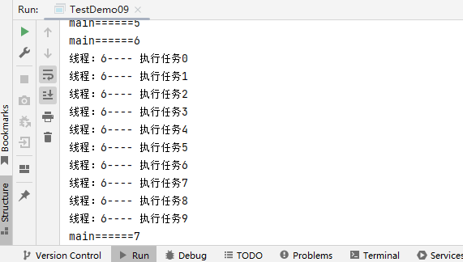
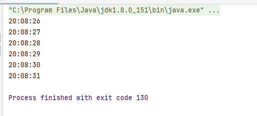
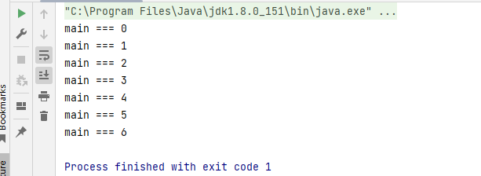

## API

`start()` :  启动当前线程，表面上调用start方法，实际在调用线程里面的run方法

`run()` : 线程类 继承 Thread类 或者 实现Runnable接口的时候，都要重新实现这个run方法，run方法里面是线程要执行的内容

`currentThread()` : Thread类中一个静态方法：获取当前正在执行的线程

`setName(String)` ：设置线程名字

`getName()`： 读取线程名字

### 优先级

同优先级别的线程，采取的策略就是先到先服务，使用时间片策略。线程的**优先级默认是5，设置范围为1-10，数字越大优先级越大**。高优先级的线程，被CPU调度的概率就高。

```java
public class TestDemo08 {
	public static void main(String[] args) {
		TestThread01 testThread01 = new TestThread01();
		testThread01.setPriority(1);//设置优先级低
		testThread01.start();
		TestThread02 testThread02 = new TestThread02();
		testThread01.setPriority(10);//设置优先级高
		testThread02.start();
	}
}
class TestThread01 extends Thread{
	@Override
	public void run() {
		for (int i = 0; i < 30; i++) {
			try {
				sleep(200);
			} catch (InterruptedException e) {
				throw new RuntimeException(e);
			}
			System.out.println(this.getName()+"----"+i);
		}
	}
}
class TestThread02 extends Thread{
	@Override
	public void run() {
		for (int i = 0; i < 30; i++) {
			try {
				sleep(200);
			} catch (InterruptedException e) {
				throw new RuntimeException(e);
			}
			System.out.println(this.getName()+"----"+i);
		}
	}
}
```

### Join

当一个线程调用了join方法，**这个线程就会先被执行，它执行结束以后才可以去执行其余的线程**。

**必须先start，再join才有效。**

```java
/**
 * Join
 */
public class TestDemo09 {
	public static void main(String[] args) throws InterruptedException {
		for (int i = 0; i < 20; i++) {
			System.out.println("main======"+i);
			if (i==6){
				ThreadDemo09 threadDemo09 = new ThreadDemo09("线程：" + i);
				threadDemo09.start();//启动线程
				threadDemo09.join();//加入线程
			}
		}
	}
}

class ThreadDemo09 extends Thread{
	public ThreadDemo09(String name) {
		super(name);
	}
	
	@Override
	public void run() {
		for (int i = 0; i < 10; i++) {
			System.out.println(this.getName()+"---- 执行任务"+i);
		}
	}
}
```



### Sleep

人为的制造阻塞事件

```java
public class TestDemo10 {
	public static void main(String[] args) throws InterruptedException {
		SimpleDateFormat simpleDateFormat = new SimpleDateFormat("HH:mm:ss");
		while (true){
			Thread.sleep(1000);
			System.out.println(simpleDateFormat.format(new Date()));
		}
	}
}
```



### setDaemon

将子线程设置为主线程的**伴随线程，主线程停止的时候，子线程也不要继续执行了**

```java
/**
 * setDaemon
 */
public class TestDemo11 {
	public static void main(String[] args) throws InterruptedException {
		ThreadDemo11 threadDemo11 = new ThreadDemo11();
		threadDemo11.setDaemon(true);//设置伴随线程  注意：先设置，再启动
		threadDemo11.start();
		
		for (int i = 0; i < 20; i++) {
			Thread.sleep(100);
			System.out.println("主线程==="+i);
		}
	}
}
class ThreadDemo11 extends Thread{
	@Override
	public void run() {
		for (int i = 0; i < 20; i++) {
			try {
				sleep(200);
			} catch (InterruptedException e) {
				throw new RuntimeException(e);
			}
			System.out.println("子线程==="+i);
		}
	}
}
```


### stop

停止当前线程，**过期方法，不建议使用**

```java
/**
 * stop
 */
public class TestDemo12 {
	public static void main(String[] args) throws InterruptedException {
		for (int i = 0; i < 100; i++) {
			System.out.println("main === "+i);
			if (i==6) Thread.currentThread().stop(); //停止线程 过期方法不建议使用
		}
	}
}
```


