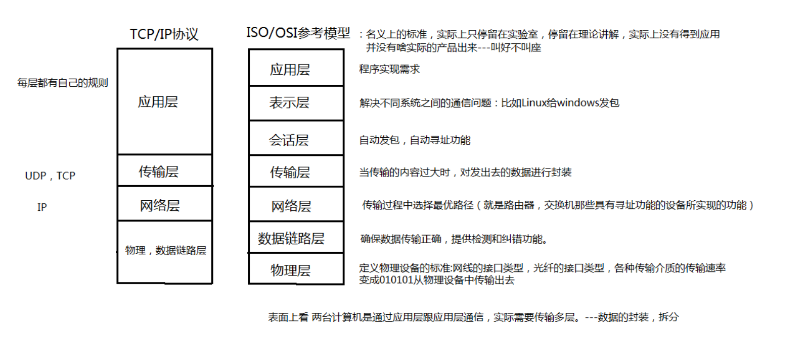
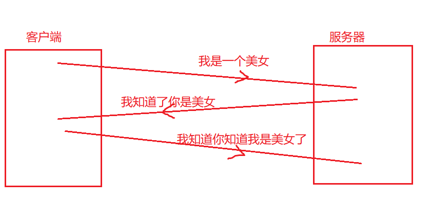
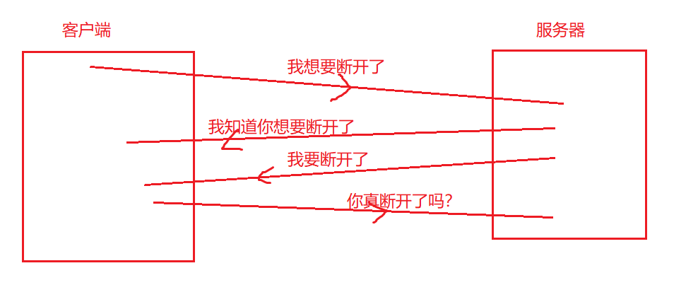

## 基本概念

把分布在不同地理区域的计算机与专门的外部设备用通信线路互连成一个规模大、功能强的网络系统，从而使众多的计算机可以方便地互相传递信息、共享硬件、软件、数据信息等资源。设备之间在网络中进行数据的传输，发送/接收数据。

两台或两台以上的计算机即可构成网络，网络通讯最重要的要素是 IP 和 PORT，通过IP定位计算机，通过PORT定位使用的软件程序。

### IP

1.  A类IP地址：第一个字节在0 - 127之间（1.0.0.1 \~ 126.155.255.254）（其中127.0.0.1 为保留地址，一般用于环回地址）
2.  B类IP地址：第一个字节在128 - 192之间（128.0.0.1 \~ 191.255.255.254）
3.  C类IP地址：第一个字节在192 - 223之间（192.0.0.1 \~ 223.255.255.254）
4.  D类IP地址：第一个字节在224 - 239之间（224.0.0.1 \~ 239.255.255.254）
5.  E类IP地址：第一个字节在240 - 255之间（240.0.0.1 \~ 255.255.255.254）

### PORT

0 到 65535

### 通讯协议



消息发送： 应用层 → 传输层 → 网络层 → 物理，数据链路层

消息接收：物理，数据链路层 → 网络层 → 传输层 → 应用层

### TCP

**安全可靠的，使用三次握手，四次挥手的方式**


#### 建立连接：三次握手

客户端请求链接   /   服务器响应客户端的请求   /  客户端回应服务器收到响应



#### 断开链接：四次挥手

客户端请求断开  / 服务器响应客户端断开请求  / 服务器断开链接  /  客户端检验是否断开



### UDP

**不太安全可靠，数据发送使用数据包，容易产生丢包的现象。**

## 地址API

### InetAddress

#### API

| API                               | 说明                                                                                                    |
| --------------------------------- | ----------------------------------------------------------------------------------------------------- |
| InetAddress.getByName(String str) | 获取指定地址的IP地址,如：localhost → 获取本地地址       127.0.0.1 → 获取本地地址       LAPTOP → 获取计算机名地址  baidu.com → 获取域名地址 |
| InetAddress对象.getHostName()       | 获取域名                                                                                                  |
| InetAddress对象.getHostAddress()    | 获取ip地址                                                                                                |

#### 代码

```java
public class Test01 {
    //这是一个main方法，是程序的入口：
    public static void main(String[] args) throws UnknownHostException, UnknownHostException {
        //封装IP：
        //InetAddress ia = new InetAddress();不能直接创建对象，因为InetAddress()被default修饰了。
        InetAddress ia = InetAddress.getByName("192.168.199.217");
        System.out.println(ia);
        InetAddress ia2 = InetAddress.getByName("localhost");//localhost指代的是本机的ip地址
        System.out.println(ia2);
        InetAddress ia3 = InetAddress.getByName("127.0.0.1");//127.0.0.1指代的是本机的ip地址
        System.out.println(ia3);
        InetAddress ia4 = InetAddress.getByName("LAPTOP-CRIVSRRU");//封装计算机名
        System.out.println(ia4);
        InetAddress ia5 = InetAddress.getByName("www.baidu.com");//封装域名
        System.out.println(ia5);
        System.out.println(ia5.getHostName());//获取域名
        System.out.println(ia5.getHostAddress());//获取ip地址
    }
}
```

### InetSocketAddress

#### API

| API                                                                    | 说明                                        |
| ---------------------------------------------------------------------- | ----------------------------------------- |
| InetSocketAddress isa = new InetSocketAddress("192.168.199.217",8080); | 初始化InetSocketAddress对象：参数1→地址   参数2 → 端口号 |
| isa.getHostName()                                                      | 获取地址名                                     |
| isa.getPort()                                                          | 获取端口号                                     |
| isa.getAddress()                                                       | 获取InetAddress对象                           |

#### 代码

```java
public class Test02 {
    //这是一个main方法，是程序的入口：
    public static void main(String[] args) {
        InetSocketAddress isa = new InetSocketAddress("localhost",8080);
        System.out.println(isa);// localhost/127.0.0.1:8080
        System.out.println(isa.getHostName());//localhost
        System.out.println(isa.getPort());//8080
        InetAddress ia = isa.getAddress();//转为InetAddress
        System.out.println(ia.getHostName());//localhost
        System.out.println(ia.getHostAddress());//127.0.0.1
    }
}
```