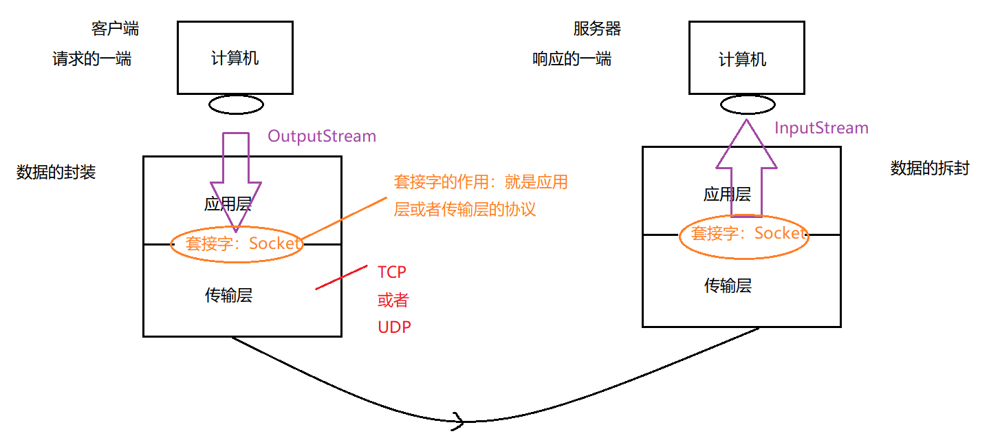

## TCP 通讯

### 单向通讯

使用DataOutputStream高级流处理

**客户端** 

获取Socket对象 → 获取字节输出流 → 嵌套高级流 → 使用流写入

```java
public class TestClient {
	public static void main(String[] args) throws IOException {
		Socket socket = new Socket("127.0.0.1", 8888);//打开指定IP与接口的通信
		OutputStream outputStream = socket.getOutputStream();//获取输出流
		DataOutputStream dataOutputStream = new DataOutputStream(outputStream);//获取数据输出流
		dataOutputStream.writeUTF("你好！");//输出对象
		dataOutputStream.close();//关闭流
		outputStream.close();
		socket.close();
	}
}
```

**服务器**

获取ServerSocket对象 → ServerSocket对象.accept() 阻塞，等待响应，获取Socket 对象 → 获取字节输入流 → 嵌套高级流 → 读取流中的数据

```java
public class TestServer {
	public static void main(String[] args) throws IOException {
		ServerSocket serverSocket = new ServerSocket(8888);//监听指定接口
		Socket accept = serverSocket.accept();//阻塞线程 直到获取到数据
		InputStream inputStream = accept.getInputStream();//获取输入流
		DataInputStream dataInputStream = new DataInputStream(inputStream);//获取数据输入流
		String s = dataInputStream.readUTF();//读取指定类型数据
		System.out.println(s);
		dataInputStream.close();//关闭流
		inputStream.close();
		accept.close();
		serverSocket.close();
	}
}
```

### 双向通讯

使用DataOutputStream高级流处理

**客户端**

在单项流的基础上加入 读取

```java
public class TestClient {
	public static void main(String[] args) throws IOException {
		Socket socket = new Socket("127.0.0.1", 8888);//打开指定IP与接口的通信
		OutputStream outputStream = socket.getOutputStream();//获取输出流
		DataOutputStream dataOutputStream = new DataOutputStream(outputStream);//获取数据输出流
		dataOutputStream.writeUTF("客户端：你好！");//输出对象

		InputStream inputStream = socket.getInputStream();
		DataInputStream dataInputStream = new DataInputStream(inputStream);
		String s = dataInputStream.readUTF();
		System.out.println(s);

		dataInputStream.close();
		inputStream.close();
		dataOutputStream.close();//关闭流
		outputStream.close();
		socket.close();
	}
}
```

**服务器**

在单项流的基础上加入 输出

```java
public class TestServer {
	public static void main(String[] args) throws IOException {
		ServerSocket serverSocket = new ServerSocket(8888);//监听指定接口
		Socket accept = serverSocket.accept();//阻塞线程 直到获取到数据
		InputStream inputStream = accept.getInputStream();//获取输入流
		DataInputStream dataInputStream = new DataInputStream(inputStream);//获取数据输入流
		String s = dataInputStream.readUTF();//读取指定类型数据
		System.out.println(s);
		
		//向客户端发送信息
		OutputStream outputStream = accept.getOutputStream();
		DataOutputStream dataOutputStream = new DataOutputStream(outputStream);
		dataOutputStream.writeUTF("服务器：我收到了你的消息");
		dataOutputStream.close();
		outputStream.close();
		
		dataInputStream.close();//关闭流
		inputStream.close();
		accept.close();
		serverSocket.close();
	}
}
```

### 对象传输通讯

使用ObjectOutputStream 高级流处理

**对象类** : 记得要序列化
```java
package com.meturing.TCP.Demo03;

import java.io.Serializable;

public class UserInfo implements Serializable {
	private static final long serialVersionUID = 9050691344308365540L;
	private String name;
	private String pwd;
	
	public UserInfo(String name, String pwd) {
		this.name = name;
		this.pwd = pwd;
	}
	
	public String getName() {
		return name;
	}
	
	public void setName(String name) {
		this.name = name;
	}
	
	public String getPwd() {
		return pwd;
	}
	
	public void setPwd(String pwd) {
		this.pwd = pwd;
	}
	
	@Override
	public String toString() {
		return "UserInfo{" +
				"name='" + name + '\'' +
				", pwd='" + pwd + '\'' +
				'}';
	}
}
```

**客户端**
```java
public class TestClient {
	public static void main(String[] args) throws IOException {
		Socket socket = new Socket("127.0.0.1", 8888);//打开指定IP与接口的通信
		OutputStream outputStream = socket.getOutputStream();//获取输出流
		//获取对象输出流
		ObjectOutputStream objectOutputStream = new ObjectOutputStream(outputStream);
		Scanner scanner = new Scanner(System.in);
		System.out.print("请输入用户名：");
		String userName = scanner.next();
		System.out.print("请输入密码：");
		String userPwd = scanner.next();
		objectOutputStream.writeObject(new UserInfo(userName,userPwd));//输出对象
		
		//获取服务器返回状态
		InputStream inputStream = socket.getInputStream();
		DataInputStream dataInputStream = new DataInputStream(inputStream);
		boolean flag = dataInputStream.readBoolean();
		if (flag){
			System.out.println("登录成功~！");
		}else {
			System.out.println("登录失败~！");
		}
		
		//关闭流
		dataInputStream.close();
		inputStream.close();
		objectOutputStream.close();
		outputStream.close();
		socket.close();
	}
}
```


**服务器**
```java
public class TestServer {
	public static void main(String[] args) throws IOException, ClassNotFoundException {
		ServerSocket serverSocket = new ServerSocket(8888);//监听指定接口
		Socket accept = serverSocket.accept();//阻塞线程 直到获取到数据
		InputStream inputStream = accept.getInputStream();//获取输入流
		
		//获取数据输入流
		ObjectInputStream objectInputStream = new ObjectInputStream(inputStream);
		UserInfo userInfo = (UserInfo)objectInputStream.readObject();
		System.out.println("服务器收到："+userInfo.toString());
		
		//判断是否正确
		boolean flag = false;
		if (userInfo.getName().equals("张三") && userInfo.getPwd().equals("123456")){
			flag = true;
			System.out.println("服务器验证成功！");
		}else {
			System.out.println("服务器验证失败！");
		}
		//返回状态
		OutputStream outputStream = accept.getOutputStream();
		DataOutputStream dataOutputStream = new DataOutputStream(outputStream);
		dataOutputStream.writeBoolean(flag);
		
		//关闭流
		dataOutputStream.close();
		outputStream.close();
		objectInputStream.close();
		inputStream.close();
		accept.close();
		serverSocket.close();
	}
}
```

### 异常处理

对于关闭时，都需要写在finally 中，并且需要判空

**对象类** : 记得要序列化
```java
public class UserInfo implements Serializable {
	private static final long serialVersionUID = 9050691344308365540L;
	private String name;
	private String pwd;
	
	public UserInfo(String name, String pwd) {
		this.name = name;
		this.pwd = pwd;
	}
	
	public String getName() {
		return name;
	}
	
	public void setName(String name) {
		this.name = name;
	}
	
	public String getPwd() {
		return pwd;
	}
	
	public void setPwd(String pwd) {
		this.pwd = pwd;
	}
	
	@Override
	public String toString() {
		return "UserInfo{" +
				"name='" + name + '\'' +
				", pwd='" + pwd + '\'' +
				'}';
	}
}
```

**客户端**
```java
public class TestClient {
	public static void main(String[] args)  {
		Socket socket = null;//打开指定IP与接口的通信
		OutputStream outputStream = null;//获取输出流
		ObjectOutputStream objectOutputStream = null;
		InputStream inputStream = null;
		DataInputStream dataInputStream = null;
		
		try {
			socket = new Socket("127.0.0.1", 8888);
			outputStream = socket.getOutputStream();
			//获取对象输出流
			objectOutputStream = new ObjectOutputStream(outputStream);
			Scanner scanner = new Scanner(System.in);
			System.out.print("请输入用户名：");
			String userName = scanner.next();
			System.out.print("请输入密码：");
			String userPwd = scanner.next();
			objectOutputStream.writeObject(new UserInfo(userName,userPwd));//输出对象
			
			//获取服务器返回状态
			inputStream = socket.getInputStream();
			dataInputStream = new DataInputStream(inputStream);
			boolean flag = dataInputStream.readBoolean();
			if (flag){
				System.out.println("登录成功~！");
			}else {
				System.out.println("登录失败~！");
			}
		} catch (IOException e) {
			throw new RuntimeException(e);
		} finally {
			//关闭流
			if (dataInputStream == null) {
				try {
					dataInputStream.close();
				} catch (IOException e) {
					throw new RuntimeException(e);
				}
			}
			if (inputStream == null) {
				try {
					inputStream.close();
				} catch (IOException e) {
					throw new RuntimeException(e);
				}
			}
			if (objectOutputStream == null) {
				try {
					objectOutputStream.close();
				} catch (IOException e) {
					throw new RuntimeException(e);
				}
			}
			if (outputStream == null) {
				try {
					outputStream.close();
				} catch (IOException e) {
					throw new RuntimeException(e);
				}
			}
			if (socket == null) {
				try {
					socket.close();
				} catch (IOException e) {
					throw new RuntimeException(e);
				}
			}

		}
	}
}
```

**服务器**
```java
public class TestServer {
	public static void main(String[] args) {
		ServerSocket serverSocket = null;//监听指定接口
		Socket accept = null;//阻塞线程 直到获取到数据
		InputStream inputStream = null;//获取输入流
		ObjectInputStream objectInputStream = null;
		OutputStream outputStream = null;
		DataOutputStream dataOutputStream = null;
		try {
			serverSocket = new ServerSocket(8888);
			accept = serverSocket.accept();
			inputStream = accept.getInputStream();
			
			//获取数据输入流
			objectInputStream = new ObjectInputStream(inputStream);
			UserInfo userInfo = (UserInfo)objectInputStream.readObject();
			System.out.println("服务器收到："+userInfo.toString());
			
			//判断是否正确
			boolean flag = false;
			if (userInfo.getName().equals("张三") && userInfo.getPwd().equals("123456")){
				flag = true;
				System.out.println("服务器验证成功！");
			}else {
				System.out.println("服务器验证失败！");
			}
			//返回状态
			outputStream = accept.getOutputStream();
			dataOutputStream = new DataOutputStream(outputStream);
			dataOutputStream.writeBoolean(flag);
		} catch (IOException e) {
			throw new RuntimeException(e);
		} catch (ClassNotFoundException e) {
			throw new RuntimeException(e);
		} finally {
			//关闭流
			if (dataOutputStream == null) {
				try {
					dataOutputStream.close();
				} catch (IOException e) {
					throw new RuntimeException(e);
				}
			}
			if (outputStream == null) {
				try {
					outputStream.close();
				} catch (IOException e) {
					throw new RuntimeException(e);
				}
			}
			if (objectInputStream == null) {
				try {
					objectInputStream.close();
				} catch (IOException e) {
					throw new RuntimeException(e);
				}
			}
			if (inputStream == null) {
				try {
					inputStream.close();
				} catch (IOException e) {
					throw new RuntimeException(e);
				}
			}
			if (accept == null) {
				try {
					accept.close();
				} catch (IOException e) {
					throw new RuntimeException(e);
				}
			}
			if (serverSocket == null) {
				try {
					serverSocket.close();
				} catch (IOException e) {
					throw new RuntimeException(e);
				}
			}
		}
	}
}
```

#### 多线程

创建接收消息的线程类，通过构造获取Socket 对象

**对象类** : 记得要序列化
```java
public class UserInfo implements Serializable {
	private static final long serialVersionUID = 9050691344308365540L;
	private String name;
	private String pwd;
	
	public UserInfo(String name, String pwd) {
		this.name = name;
		this.pwd = pwd;
	}
	
	public String getName() {
		return name;
	}
	
	public void setName(String name) {
		this.name = name;
	}
	
	public String getPwd() {
		return pwd;
	}
	
	public void setPwd(String pwd) {
		this.pwd = pwd;
	}
	
	@Override
	public String toString() {
		return "UserInfo{" +
				"name='" + name + '\'' +
				", pwd='" + pwd + '\'' +
				'}';
	}
}
```

**客户端**
```java
public class TestClient {
	public static void main(String[] args)  {
		Socket socket = null;//打开指定IP与接口的通信
		OutputStream outputStream = null;//获取输出流
		ObjectOutputStream objectOutputStream = null;
		InputStream inputStream = null;
		DataInputStream dataInputStream = null;
		
		try {
			socket = new Socket("127.0.0.1", 8888);
			outputStream = socket.getOutputStream();
			//获取对象输出流
			objectOutputStream = new ObjectOutputStream(outputStream);
			Scanner scanner = new Scanner(System.in);
			System.out.print("请输入用户名：");
			String userName = scanner.next();
			System.out.print("请输入密码：");
			String userPwd = scanner.next();
			objectOutputStream.writeObject(new UserInfo(userName,userPwd));//输出对象
			
			//获取服务器返回状态
			inputStream = socket.getInputStream();
			dataInputStream = new DataInputStream(inputStream);
			boolean flag = dataInputStream.readBoolean();
			if (flag){
				System.out.println("⌈客户端消息⌋ 登录成功~！");
			}else {
				System.out.println("⌈客户端消息⌋ 登录失败~！");
			}
		} catch (IOException e) {
			throw new RuntimeException(e);
		} finally {
			//关闭流
			if (dataInputStream != null) {
				try {
					dataInputStream.close();
				} catch (IOException e) {
					throw new RuntimeException(e);
				}
			}
			if (inputStream != null) {
				try {
					inputStream.close();
				} catch (IOException e) {
					throw new RuntimeException(e);
				}
			}
			if (objectOutputStream != null) {
				try {
					objectOutputStream.close();
				} catch (IOException e) {
					throw new RuntimeException(e);
				}
			}
			if (outputStream != null) {
				try {
					outputStream.close();
				} catch (IOException e) {
					throw new RuntimeException(e);
				}
			}
			if (socket != null) {
				try {
					socket.close();
				} catch (IOException e) {
					throw new RuntimeException(e);
				}
			}
			
		}
	}
}
```

 **服务器**
```java
public class TestServer {
	public static void main(String[] args) {
		ServerSocket serverSocket = null;
		Socket accept = null;
		try {
			serverSocket = new ServerSocket(8888);
			int count = 0;
			while (true){
				accept =  serverSocket.accept();
				new ThreadServer(accept).start();
				count++;
				System.out.println("⌈服务器消息⌋  这是第"+count+"个登陆的用户，地址是："+accept.getInetAddress());
		   }
		} catch (IOException e) {
			throw new RuntimeException(e);
		}finally {
			if (serverSocket != null) {
				try {
					serverSocket.close();
				} catch (IOException e) {
					throw new RuntimeException(e);
				}
			}
			if (accept != null) {
				try {
					accept.close();
				} catch (IOException e) {
					throw new RuntimeException(e);
				}
			}
		}
	}
}
```

**服务器线程类**
```java
public class ThreadServer extends Thread{
	ServerSocket serverSocket = null;
	Socket accept = null;
	InputStream inputStream = null;
	ObjectInputStream objectInputStream = null;
	OutputStream outputStream = null;
	DataOutputStream dataOutputStream = null;

	public ThreadServer(Socket accept) {
		this.accept = accept;
	}

	@Override
	public void run() {
		try {
			if (accept==null)return;
			inputStream = accept.getInputStream();
			objectInputStream = new ObjectInputStream(inputStream);
			UserInfo userInfo = (UserInfo) (objectInputStream.readObject());
			boolean flage = false;
			if (userInfo.getName().equals("张三")&&userInfo.getPwd().equals("123456")){
				flage = true;
				System.out.println("⌈服务器消息⌋ 用户："+userInfo.getName()+"--登录成功~!");
			}else {
				System.out.println("⌈服务器消息⌋ 用户："+userInfo.getName()+"--登录失败~!");
			}
			outputStream = accept.getOutputStream();
			dataOutputStream = new DataOutputStream(outputStream);
			dataOutputStream.writeBoolean(flage);
		} catch (IOException e) {
			throw new RuntimeException(e);
		} catch (ClassNotFoundException e) {
			throw new RuntimeException(e);
		} finally {
			//关闭流
			if (dataOutputStream != null) {
				try {
					dataOutputStream.close();
				} catch (IOException e) {
					throw new RuntimeException(e);
				}
			}
			if (outputStream != null) {
				try {
					outputStream.close();
				} catch (IOException e) {
					throw new RuntimeException(e);
				}
			}
			if (objectInputStream != null) {
				try {
					objectInputStream.close();
				} catch (IOException e) {
					throw new RuntimeException(e);
				}
			}
			if (inputStream != null) {
				try {
					inputStream.close();
				} catch (IOException e) {
					throw new RuntimeException(e);
				}
			}
		}
	}
}
```

## UDP 通讯

#### 单向通讯

**客户端**
```java
public class TestReceive {
	public static void main(String[] args) throws IOException {
		System.out.println("接收端上线~！");
		DatagramSocket datagramSocket = new DatagramSocket(9999);
		byte[] bytes = new byte[1024];
		DatagramPacket datagramPacket = new DatagramPacket(bytes, bytes.length);
		datagramSocket.receive(datagramPacket);

		byte[] data = datagramPacket.getData();
		String s = new String(data, "UTF-8");
		System.out.println(s);

		datagramSocket.close();
	}
}
```

**服务器**
```java
public class TestSend {
	public static void main(String[] args) throws IOException {
		System.out.println("发送端打开~~~");
		//指定客户端的接口
		DatagramSocket datagramSocket = new DatagramSocket(8888);
		String str = "您好~!";
		byte[] bytes = str.getBytes(StandardCharsets.UTF_8);
		//向指定接口发送数据
		/**
		 * 内容，长度，地址，接口
		 */
		DatagramPacket localhost = new DatagramPacket(bytes, bytes.length, InetAddress.getByName("localhost"),9999);
		//发送数据包
		datagramSocket.send(localhost);
		//关闭发送端接口
		datagramSocket.close();
	}
}
```

### 双向通讯

**客户端**
```java
public class TestReceive {
	public static void main(String[] args) throws IOException {
		System.out.println("接收端上线~！");
		DatagramSocket datagramSocket = new DatagramSocket(9999);
		byte[] bytes = new byte[1024];
		DatagramPacket datagramPacket = new DatagramPacket(bytes, bytes.length);
		datagramSocket.receive(datagramPacket);
		
		byte[] data = datagramPacket.getData();
		String s = new String(data, "UTF-8");
		System.out.println(s);
		
		String str = "你也是";
		byte[] bytes1 = str.getBytes();
		DatagramPacket localhost = new DatagramPacket(bytes1, bytes1.length, InetAddress.getByName("localhost"), 8888);
		datagramSocket.send(localhost);
		
		datagramSocket.close();
	}
}
```

**服务器**
```java
public class TestSend {
	public static void main(String[] args) throws IOException {
		System.out.println("发送端打开~~~");
		//指定客户端的接口
		DatagramSocket datagramSocket = new DatagramSocket(8888);
		String str = "您好~!";
		byte[] bytes = str.getBytes(StandardCharsets.UTF_8);
		//向指定接口发送数据
		/**
		 * 内容，长度，地址，接口
		 */
		DatagramPacket localhost = new DatagramPacket(bytes, bytes.length, InetAddress.getByName("localhost"),9999);
		//发送数据包
		datagramSocket.send(localhost);
		
		//接受反馈
		byte[] bytes1 = new byte[1024];
		DatagramPacket datagramPacket = new DatagramPacket(bytes1, bytes1.length);
		datagramSocket.receive(datagramPacket);
		byte[] data = datagramPacket.getData();
		String s = new String(data, "UTF-8");
		System.out.println(s);
		
		//关闭发送端接口
		datagramSocket.close();
	}
}
```

### 异常处理

**客户端**
```java
public class TestReceive {
	public static void main(String[] args)  {
		DatagramSocket datagramSocket = null;
		try {
			System.out.println("接收端上线~！");
			datagramSocket = new DatagramSocket(9999);
			byte[] bytes = new byte[1024];
			DatagramPacket datagramPacket = new DatagramPacket(bytes, bytes.length);
			datagramSocket.receive(datagramPacket);
			
			byte[] data = datagramPacket.getData();
			String s = new String(data, "UTF-8");
			System.out.println(s);
			
			String str = "你也是";
			byte[] bytes1 = str.getBytes();
			DatagramPacket localhost = new DatagramPacket(bytes1, bytes1.length, InetAddress.getByName("localhost"), 8888);
			datagramSocket.send(localhost);
		} catch (IOException e) {
			throw new RuntimeException(e);
		} finally {
			try {
				if (datagramSocket == null) {
					datagramSocket.close();
				}
			} catch (Exception e) {
				throw new RuntimeException(e);
			}
		}
	}
}
```

**服务器**
```java
public class TestSend {
	public static void main(String[] args) {
		System.out.println("发送端打开~~~");
		DatagramSocket datagramSocket = null;
		try {
			//指定客户端的接口
			datagramSocket = new DatagramSocket(8888);
			String str = "您好~!";
			byte[] bytes = str.getBytes(StandardCharsets.UTF_8);
			//向指定接口发送数据
			/**
			 * 内容，长度，地址，接口
			 */
			DatagramPacket localhost = new DatagramPacket(bytes, bytes.length, InetAddress.getByName("localhost"),9999);
			//发送数据包
			datagramSocket.send(localhost);
			
			//接受反馈
			byte[] bytes1 = new byte[1024];
			DatagramPacket datagramPacket = new DatagramPacket(bytes1, bytes1.length);
			datagramSocket.receive(datagramPacket);
			byte[] data = datagramPacket.getData();
			String s = new String(data, "UTF-8");
			System.out.println(s);
		} catch (IOException e) {
			throw new RuntimeException(e);
		} finally {
			//关闭发送端接口
			try {
				if (datagramSocket == null) {
					datagramSocket.close();
				}
			} catch (Exception e) {
				throw new RuntimeException(e);
			}
		}
	}
}
```

### 持久通讯

**客户端**
```java
public class TestReceive {
	public static void main(String[] args)  {
		DatagramSocket datagramSocket = null;
		Scanner scanner = null;
		try {
			System.out.println("接收端上线~！");
			datagramSocket = new DatagramSocket(9999);
			scanner = new Scanner(System.in);
			while (true) {
				byte[] bytes = new byte[1024];
				DatagramPacket datagramPacket = new DatagramPacket(bytes, bytes.length);
				datagramSocket.receive(datagramPacket);
				
				byte[] data = datagramPacket.getData();
				String s = new String(data, "UTF-8");
				System.out.println(s);
				if (s.equals("byebye"))break;
				
				System.out.println("请输入消息");
				String str = scanner.next();
				byte[] bytes1 = str.getBytes();
				DatagramPacket localhost = new DatagramPacket(bytes1, bytes1.length, InetAddress.getByName("localhost"), 8888);
				datagramSocket.send(localhost);
			}
		} catch (IOException e) {
			throw new RuntimeException(e);
		} finally {
			try {
				if (datagramSocket == null) {
					datagramSocket.close();
				}
			} catch (Exception e) {
				throw new RuntimeException(e);
			}
		}
	}
```

**模拟通讯**
```java
public class TestSend {
	public static void main(String[] args) {
		System.out.println("发送端打开~~~");
		DatagramSocket datagramSocket = null;
		Scanner scanner = null;
		try {
			//指定客户端的接口
			datagramSocket = new DatagramSocket(8888);
			scanner = new Scanner(System.in);
			while (true) {
				System.out.println("请输入消息：");
				String str = scanner.next();
				byte[] bytes = str.getBytes(StandardCharsets.UTF_8);
				//向指定接口发送数据
				/**
				 * 内容，长度，地址，接口
				 */
				DatagramPacket localhost = new DatagramPacket(bytes, bytes.length, InetAddress.getByName("localhost"),9999);
				//发送数据包
				datagramSocket.send(localhost);
				
				//接受反馈
				byte[] bytes1 = new byte[1024];
				DatagramPacket datagramPacket = new DatagramPacket(bytes1, bytes1.length);
				datagramSocket.receive(datagramPacket);
				byte[] data = datagramPacket.getData();
				String s = new String(data, "UTF-8");
				System.out.println(s);
				if (s.equals("byebye"))break;
			}
			System.out.println("链接断开");
		} catch (IOException e) {
			throw new RuntimeException(e);
		} finally {
			//关闭发送端接口
			try {
				if (datagramSocket == null) {
					datagramSocket.close();
				}
			} catch (Exception e) {
				throw new RuntimeException(e);
			}
		}
	}
}
```
