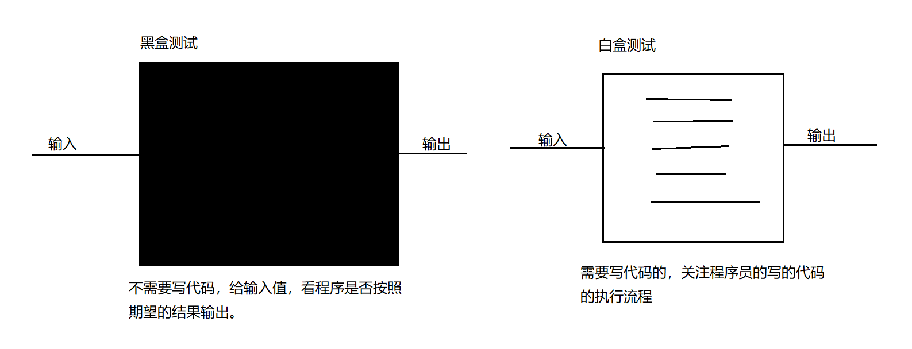

## 概念

软件测试的目的是在规定的条件下对程序进行操作,以发现程序错误,衡量软件质量,并对其是否能满足设计要求进行评估的过程

## 测试分类

### 黑盒测试

软件的黑盒测试意味着测试要在软件的接口处进行。这种方法是把测试对象看做一个黑盒子,测试人员完全不考虑程序内部的逻辑结构和内部特性,只依据程序的需求规格说明书,检查程序的功能是否符合它的功能说明。因此黑盒测试又叫功能测试。

### 白盒测试

Junit属于白盒测试。软件的白盒测试是对软件的过程性细节做细致的检查。这种方法是把测试对象看做一个打开的盒子,它允许测试人员利用程序内部的逻辑结构及有关信息,设计或选择测试用例,对程序的所有逻辑路径进行测试,通过在不同点检查程序状态,确定实际状态是否与预期的状态一致。因此白盒测试又称为结构测试。

