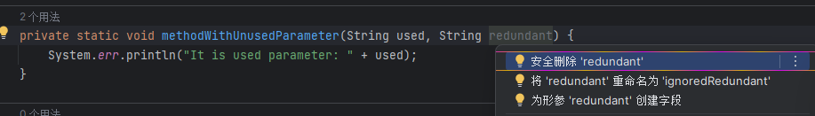
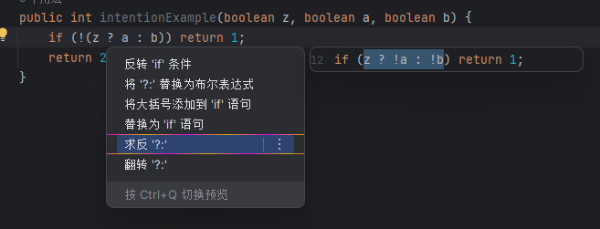
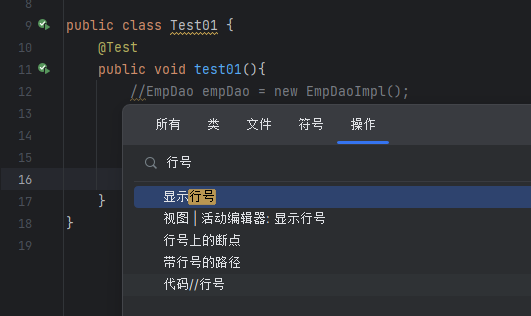
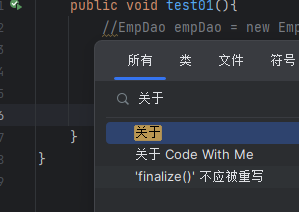
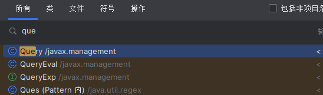
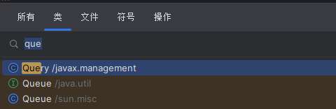
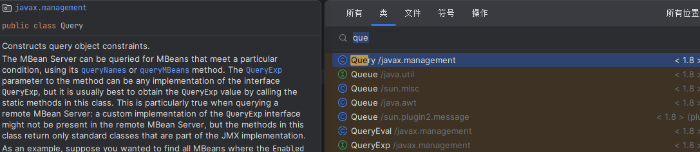
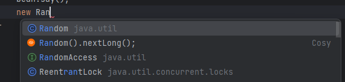
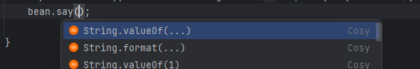

## 意图操作

IntelliJ IDEA有数百个上下文相关操作，可以帮助您转换，改进和修正代码。按`Alt + Enter`以调用显示上下文操作。

- 删除无用的参数

- 变换条件

详见官方文档 : https://www.jetbrains.com/help/idea/intention-actions.html#intention-settings

## 搜索操作

您还可以使用`Ctrl + Shift + A`或按`两次Shift`来更改IDE和项自设置。

## 随处搜索

假设您正在寻找名称中包含单词`guadratic`和`equation`的类。
可以`按两下shift` 打开随处搜索,在搜索字段中输que（这些单词的首字母）。

如果指向查找类,可以使用`Ctrl+N`

按:`Ctrl+Q`,可以预览类的相关文档

同样，您可以按`Ctrl+Alt+Shift+N`查找方法或全局变量 ,按`Ctrl+Shift+N`查找文件。

## 基本补全

正常情况下,我们编辑代码IDEA都会帮我们自动补全

当然,我们也可以在代码的任意地方使用`ALT+/`进行手动激活

使用`Ctrl + Shift + Enter` 可以补全语句,
在方法上或者静态常量上按两下`ALT+/`可以获取相关提示