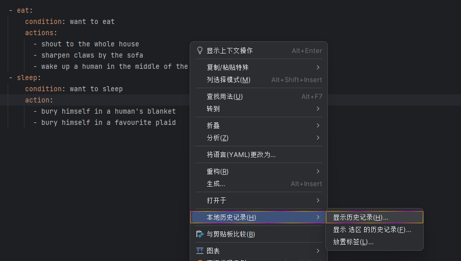
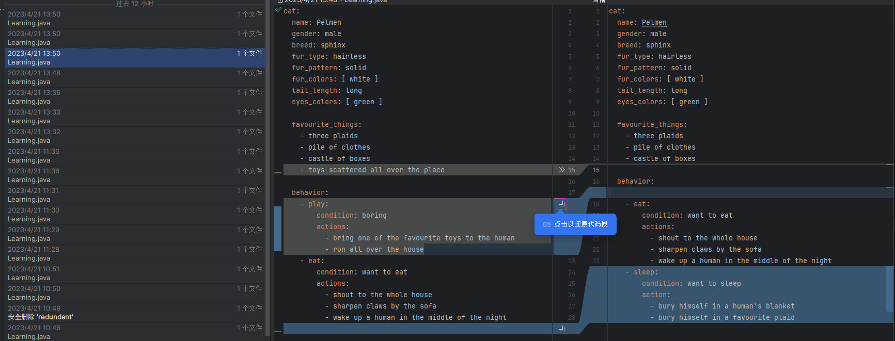
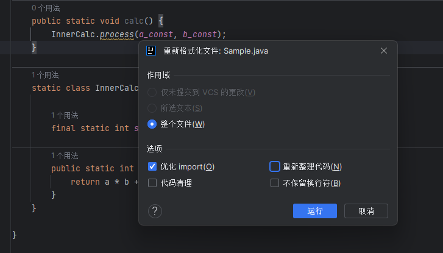
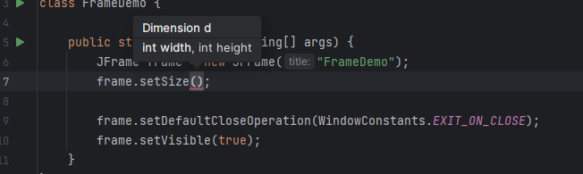
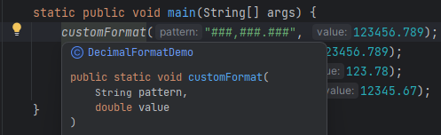
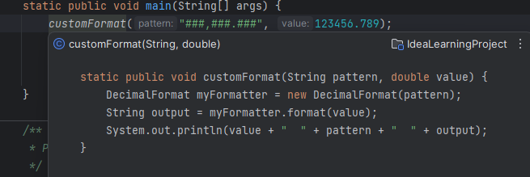
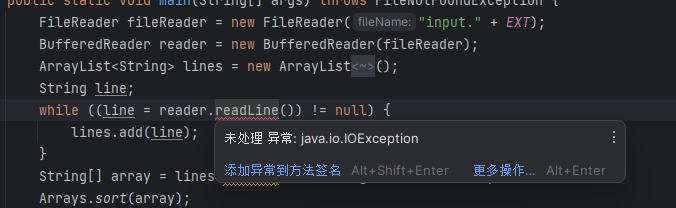
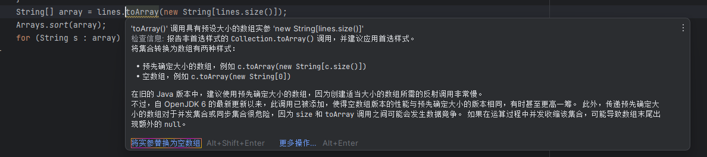
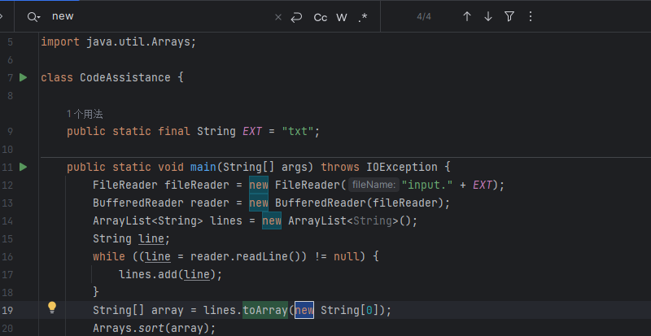

## 还原移除的代码

右键 -> 本地历史记录 -> 显示历史记录

选择需要还原的历史版本,合并差异

## 代码格式

`Ctrl + Alt + L` 可以对当前代码快速格式化

使用 `Ctrl + Alt + Shift + L` 可以个性化格式化的设置,如优化Import

## 形参信息

`Ctrl + P `可以快速查看所需形参

## 快速弹出窗口

`Ctrl + Q`  查看光标处的文档

`Ctrl + Shift + I `可以查看光标处的定义

## 编辑器编码辅助

`F2` 快速跳转到错误处

`Ctrl + F1` 展开警告说明

`Alt + Shift + Enter` 可以执行建议

`Ctrl + Shfit + F7` 高亮显示文本中光标处的所有用法

