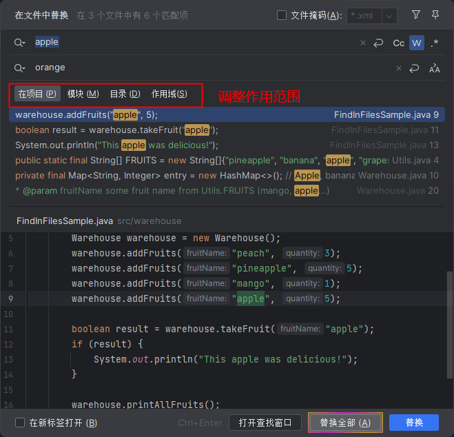
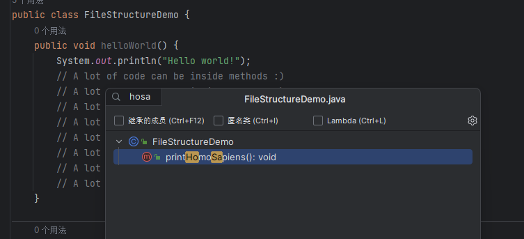
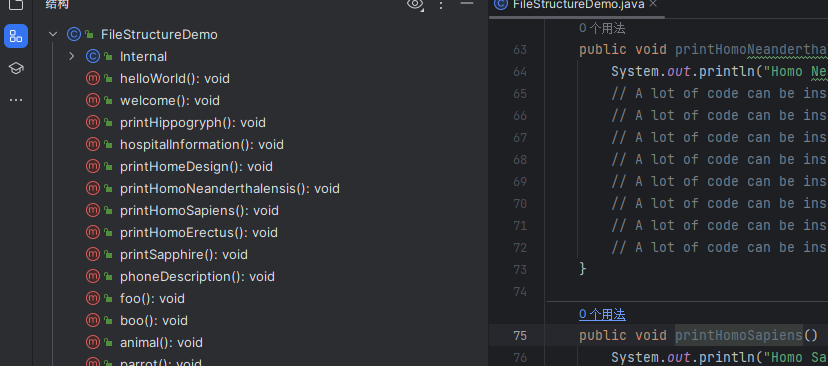
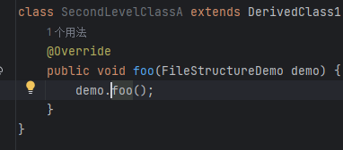
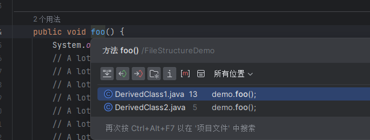
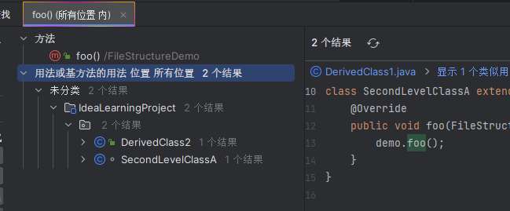
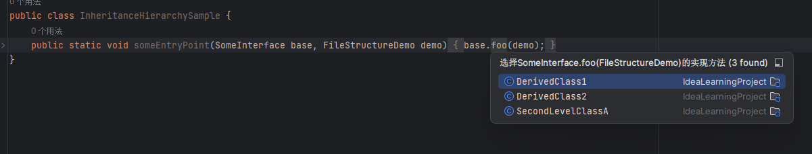
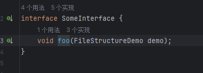
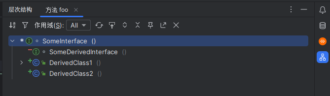

## 随处搜索

[随处搜索](../01_基本操作/基本操作.md#随处搜索)

## 查找和替换

`Ctrl + Shift + F` 全文查找字符串

`Ctrl +  Shift + R` 全文替换

## 文件结构

`Ctrl + F12` 可以打开文件结构,直接输入关键词可以过滤

`Alt + 7`  可以在左边打开小窗口

## 声明和用法

`Ctrl + B`  跳转到方法声明

如果在方法声明中使用`Ctrl + B`  ,会展示该方法所有的引用

`Alt + F7` 查看所有的位置结构

## 继承层次结构

`Ctrl + Alt +B `查看当前类所有的实现

`Ctrl + U` 查看当前派产生类的父类

`Ctrl + Shift +  H` 查看当前的层次结构

## 最近的文件和位置

`Ctrl + E` 查看最近使用的文件

`Ctrl + Shift + E `查看最近使用的位置

## 上一个/下一个匹配

`Ctrl + F` 在当前文件中查找

`Enter` 或 `F3 `切换到下一个匹配

`Shift + Enter`  或 `Shift + F3` 切换到上一个匹配