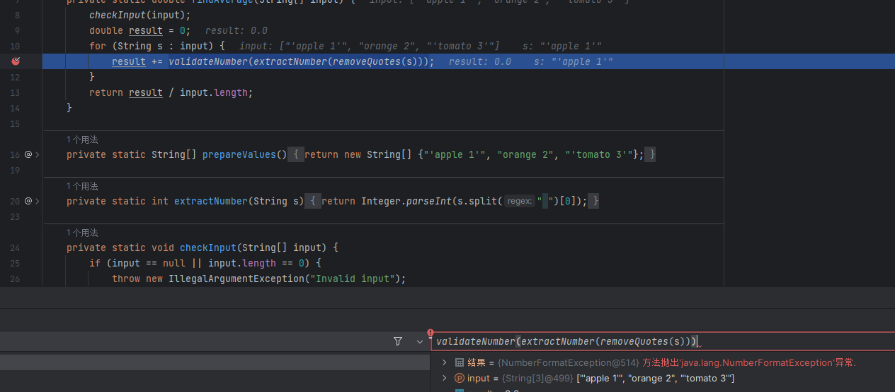
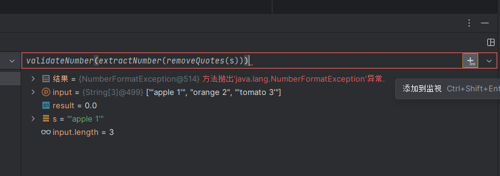
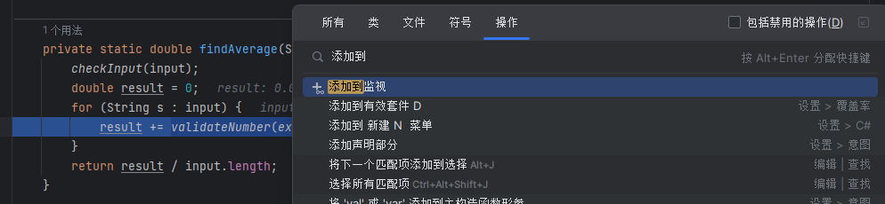
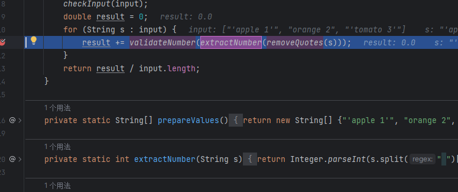
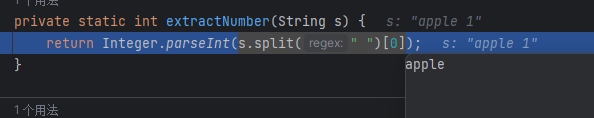
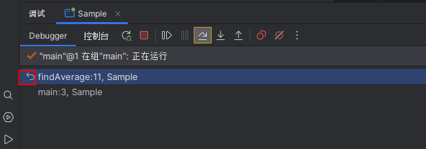

## 运行

`Ctrl + Shift + F10` 快速运行

`Shift 按住 然后点击下图按钮`,可以编辑配置运行

## 调试

`Shift + F9` 或`点击下列图标`开始调试程序

对于可能出错的代码,我们可以粘贴到下列监视窗口中

`点击按钮`添加到监视或者`Ctrl +Shift +Enter`

或者`Ctrl +Shift +A` 然后输入添加到监视

`F7` 或者 步入调试时,多个调用都会高亮,可以使用`←` `→`来控制选择 然后`Enter进入`

`Ctrl + Alt + F8` 对所选表达式快速求值

`Ctrl + F9` 热交换部署,即使修改生效,不用重新启动程序

`Ctrl +Shift + A 搜索重置帧 `或者`点击下图按钮`

`F8` 下一步

`F9` 执行到下次断点

`Alt+ F9` 执行程序到光标处

`Ctrl +F2`结束调试