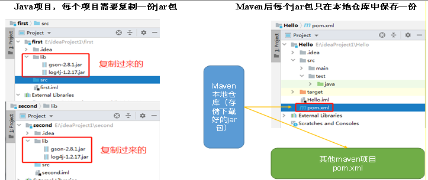
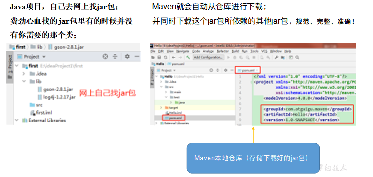
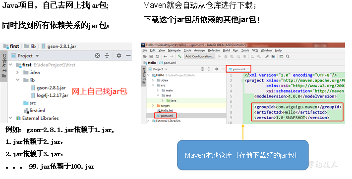
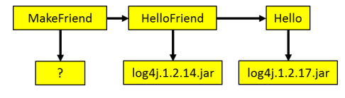
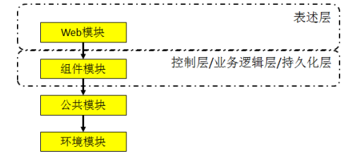
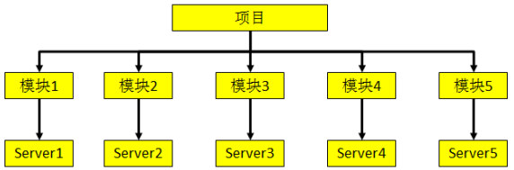
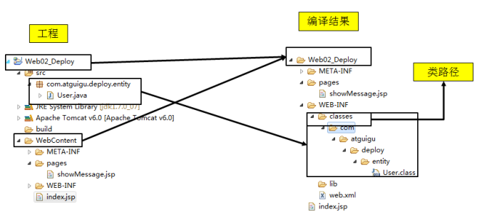

## 第一章：为什么要使用Maven

### 第三方Jar包添加

在今天的JavaEE开发领域，有大量的第三方框架和工具可以供我们使用。要使用这些jar包最简单的方法就是复制粘贴到WEB-INF目录下的lib目录下。但是这会导致每次创建一个新的工程就需要将jar包重复复制到lib目录下，从而造成工作区中存在大量重复的文件。

而使用**Maven后每个**jar包**只**在本地仓库中**保存**一份，需要jar包的工程只需要维护一个文本形式的jar包的引用——我们称之为“坐标”。不仅**极大的节约了存储空间**，更**避免了重复文件太多而造成的混乱**。

### 第三方Jar包获取

JavaEE开发中需要使用到的jar包种类繁多，几乎每个jar包在其本身的官网上的获取方式都不尽相同。为了查找一个jar包找遍互联网，身心俱疲，没有经历过的人或许体会不到这种折磨。不仅如此，费劲心血找的jar包里有的时候并没有你需要的那个类，又或者有同名的类没有你要的方法——以不规范的方式获取的jar包也往往是不规范的。

使用Maven我们可以享受到一个完全统一规范的jar包管理体系。你只**需要**在你**的项目中**以**坐标的方式依赖**一个**jar包，Maven就会自动从**中央**仓库**进行**下载**，并**同时下载这个jar包**所**依赖的其他jar包**——规范、完整、准确！一次性解决所有问题！

### Jar包之间的依赖关系

jar包往往不是孤立存在的，很多jar包都需要在其他jar包的支持下才能够正常工作，我们称之为jar包之间的依赖关系。最典型的例子是：commons-fileupload-1.3.jar依赖于commons-io-2.0.1.jar，如果没有IO包，FileUpload包就不能正常工作

那么问题来了，你知道你所使用的所有jar包的依赖关系吗？当你拿到一个新的从未使用过的jar包，你如何得知他需要哪些jar包的支持呢？如果不了解这个情况，导入的jar包不够，那么现有的程序将不能正常工作。再进一步，当你的项目中需要用到上百个jar包时，你还会人为的，手工的逐一确认它们依赖的其他jar包吗？这简直是不可想象的。

而引入Maven后，**Maven就可以替我们自动的将当前jar包所依赖的其他所有jar包全部导入进来，无需**人工参与，节约了我们大量的时间和精力。用实际例子来说明就是：通过Maven导入commons-fileupload-1.3.jar后，commons-io-2.0.1.jar会被自动导入，程序员不必了解这个依赖关系

### Jar包之间的冲突

上一点说的是jar包不足项目无法正常工作，但其实有的时候jar包多了项目仍然无法正常工作，这就是jar包之间的冲突：

举个例子：我们现在有三个工程MakeFriend、HelloFriend和Hello。MakeFriend依赖HelloFriend，HelloFriend依赖Hello。而Hello依赖log4j.1.2.17.jar，HelloFriend依赖log4j.1.2.14.jar。如下图所示：

那么MakeFriend工程的运行时环境中该导入log4j.1.2.14.jar呢还是log4j.1.2.17.jar呢？

这样的问题一个两个还可以手工解决，但如果系统中存在几十上百的jar包，他们之间的依赖关系会非常复杂，几乎不可能手工实现依赖关系的梳理。

使用Maven就可以自动的处理jar包之间的冲突问题。因为Maven中内置了两条依赖原则：**最短路径者优先和先声明者优先**，上述问题MakeFriend工程会自动使用log4j.1.2.14.jar。

### 将项目拆分成多个工程模块

随着JavaEE项目的规模越来越庞大，开发团队的规模也与日俱增。一个项目上千人的团队持续开发很多年对于JavaEE项目来说再正常不过。那么我们想象一下：几百上千的人开发的项目是同一个Web工程。那么架构师、项目经理该如何划分项目的模块、如何分工呢？这么大的项目已经不可能通过package结构来划分模块，必须将项目拆分成多个工程协同开发。多个模块工程中有的是Java工程，有的是Web工程。

那么工程拆分后又如何进行互相调用和访问呢？这就需要用到Maven的依赖管理机制。例如：某项目拆分的情况如下。

上层模块依赖下层，所以下层模块中定义的API都可以为上层所调用和访问。

### 实现项目的分布式部署

在实际生产环境中，项目规模增加到一定程度后，可能每个模块都需要运行在独立的服务器上，我们称之为分布式部署，这里同样需要用到Maven。

## 第二章：Maven是什么

> **Maven项目对象模型(POM)，可以通过一小段描述信息来管理项目的构建，报告和文档的项目管理工具软件。**
> Maven 除了以程序构建能力为特色之外，还提供高级项目管理工具。由于 Maven 的缺省构建规则有较高的可重用性，所以常常用两三行 Maven 构建脚本就可以构建简单的项目。由于 Maven 的面向项目的方法，许多 Apache Jakarta 项目发文时使用 Maven，而且公司项目采用 Maven 的比例在持续增长。

### 自动化构建

（1）Maven这个单词的本意是：专家，内行。读音是\['meɪv(ə)n]或\['mevn]，不要读作“妈文”。

（2）**Maven是一款自动化构建工具，专注服务于Java平台的项目构建和依赖管理**。在JavaEE开发的历史上构建工具的发展也经历了一系列的演化和变迁：Make→Ant→Maven→Gradle→其他……

### **构建的**概念

> 构建并不是创建，创建一个工程并不等于构建一个项目。要了解构建的含义我们应该由浅入深的从以下三个层面来看：

#### （1）纯Java代码

大家都知道，我们Java是一门编译型语言，.java扩展名的源文件需要编译成.class扩展名的字节码文件才能够执行。所以编写任何Java代码想要执行的话就必须经过**编译**得到对应的.class文件。

#### （2）Web工程

当我们需要通过浏览器访问Java程序时就必须将包含Java程序的Web工程编译的结果“拿”到服务器上的指定目录下，并启动服务器才行。这个“拿”的过程我们叫**部署**。

我们可以将未编译的Web工程比喻为一只生的鸡，编译好的Web工程是一只煮熟的鸡，编译部署的过程就是将鸡炖熟。

Web工程和其编译结果的目录结构对比见下图：

#### （3）实际项目

在实际项目中整合第三方框架，Web工程中除了Java程序和JSP页面、图片等静态资源之外，还包括第三方框架的jar包以及各种各样的配置文件。所有这些资源都必须按照正确的目录结构部署到服务器上，项目才可以运行。

所以综上所述：构建就是以我们编写的Java代码、框架配置文件、国际化等其他资源文件、JSP页面和图片等静态资源作为“**原材料**”，去“**生产**”**出一个可以运行的**项目的过程。

### 构建的环节

#### （1）清理

删除以前的编译结果，为重新编译做好准备。

#### （2）编译

将Java源程序编译为字节码文件。

#### （3）测试

针对项目中的关键点进行测试，确保项目在迭代开发过程中关键点的正确性。

#### （4）报告

在每一次测试后以标准的格式记录和展示测试结果。

#### （5）打包

将一个包含诸多文件的工程封装为一个压缩文件用于安装或部署。Java工程对应jar包，Web工程对应war包。

#### （6）安装

在Maven环境下特指将打包的结果——jar包或war包安装到本地仓库中。

#### （7）部署

将打包的结果部署到远程仓库或将war包部署到服务器上运行。
