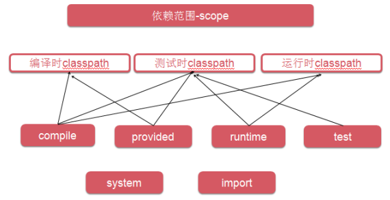
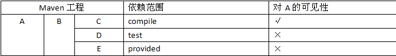
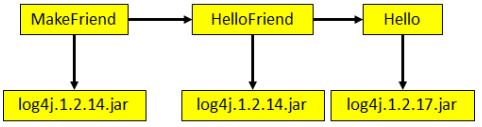
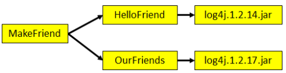
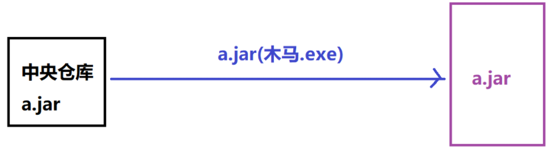
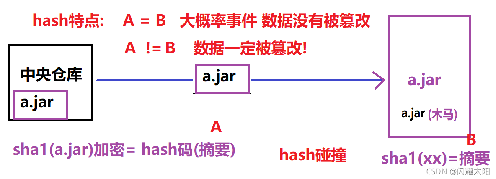

## 4.1  POM

Project Object Model：项目对象模型。**将Java工程的相关信息封装为**对象作为便于操作和管理的模型。使用pom.xml文件描述整个模块的思想

```xml
<?xml version="1.0" encoding="UTF-8"?>
<project xmlns="http://maven.apache.org/POM/4.0.0"
         xmlns:xsi="http://www.w3.org/2001/XMLSchema-instance"
         xsi:schemaLocation="http://maven.apache.org/POM/4.0.0 http://maven.apache.org/xsd/maven-4.0.0.xsd">
    <modelVersion>4.0.0</modelVersion>

    <groupId>com.meturing.maven</groupId>
    <artifactId>mavenDemo</artifactId>
    <version>1.0-SNAPSHOT</version>

    <dependencies>
    <dependency>
            <!--1.组ID: 公司域名倒写  www.tedu.cn-->
            <groupId>junit</groupId>
            <!--2.项目名称唯一-->
            <artifactId>junit</artifactId>
            <!--3.版本号 唯一的-->
            <version>4.12</version>
            <!--了解: 什么时候有效-->
            <scope>test</scope>
        </dependency>
        <dependency>
            <groupId>mysql</groupId>
            <artifactId>mysql-connector-java</artifactId>
            <version>5.1.46</version>
        </dependency>
        <dependency>
            <groupId>com.alibaba</groupId>
            <artifactId>druid</artifactId>
            <version>1.1.10</version>
        </dependency>
        <dependency>
            <groupId>commons-dbutils</groupId>
            <artifactId>commons-dbutils</artifactId>
            <version>1.4</version>
        </dependency>
    </dependencies>
</project>
```

## 4.2  约定目录结构

Maven项目有自己的一套规范，有默认约定好的目录结构，之所以能够自动化构建项目和管理jar包，完全取决于约定好的设计

约定 > 配置 > 编码

## 4.3  坐标

Maven中的坐标它就是体现当前Maven工程的唯一性，而且也是将来引用此jar包的唯一路径

```sql
<dependency>
	<!--1.组ID: 公司域名倒写  com.meturing.demo-->
	<groupId>junit</groupId>
	<!--2.项目名称唯一-->
	<artifactId>junit</artifactId>
	<!--3.版本号 唯一的-->
	<version>4.12</version>
	<!--了解: 什么时候有效-->
	<scope>test</scope>
</dependency>
```

>命名规范
（1）groupId：公司或组织的域名倒序+当前项目名称
（2）artifactId：当前项目的模块名称
（3）version：当前模块的版本

**在本地仓库中，jar包的位置与Maven的坐标一一对应**，如果遇到Jar包下载不全等其他问题，可以在本地仓库删除文件再重新导入

## 4.4  依赖管理

### 4.4.1  概念

Maven项目之间可以通过坐标相互进行依赖

如果A依赖B，B依赖C，那么A→B和B→C都是直接依赖，而A→C是间接依赖。

### 4.4.2  依赖范围

```xml
 <!--添加依赖-->
    <dependencies>
        <!--junit的依赖坐标-->
        <dependency>
            <groupId>junit</groupId>
            <artifactId>junit</artifactId>
            <version>4.12</version>
            <!--
                scope标签决定了当前依赖的生效范围 main和test
                如果不写，默认是compile，表示主程序和测试程序都生效
                如果设置成provided的话，则表示
                主程序和测试程序都生效且实时加载
            -->
            <scope>test</scope>
        </dependency>
    </dependencies>

```

#### 4.4.2.1  compile（默认）

（1）main目录下的Java代码**可以**访问这个范围的依赖
（2）test目录下的Java代码**可以**访问这个范围的依赖
（3）部署到Tomcat服务器上运行时**要**放在WEB-INF的lib目录下
例如：对Hello的依赖。主程序、测试程序和服务器运行时都需要用到。

#### 4.4.2.2  test

（1）main目录下的Java代码**不能**访问这个范围的依赖
（2）test目录下的Java代码**可以**访问这个范围的依赖
（3）部署到Tomcat服务器上运行时**不会**放在WEB-INF的lib目录下
例如：对junit的依赖。仅仅是测试程序部分需要。

#### 4.4.2.3  provided

（1）main目录下的Java代码**可以**访问这个范围的依赖
（2）test目录下的Java代码**可以**访问这个范围的依赖
（3）部署到Tomcat服务器上运行时**不会**放在WEB-INF的lib目录下
例如：servlet-api在服务器上运行时，Servlet容器会提供相关API，所以部署的时候不需要。

#### 4.4.2.4  其他runtime、import、system等



### 4.4.3  依赖的传递性

1.  用户添加jar包时,maven工具会根据jar包的坐标,去本地仓库中查找指定的jar包文件. &#x20;
2.  找到jar包并且实现了jar包文件的依赖. &#x20;
3.  同时加载当前目录下的pom文件,通过标签 加载其它的依赖项. &#x20;
4.  循环执行上述的操作 直到所有的jar包依赖完成为止.

**多个Maven工程之间相互依赖具有传递性，但是是否能够传递还要取决于被传递者的使用范围**



### 4.4.5  Jar包冲突

#### 路径最短则优先



#### 路径相同时先声明的优先



`这里“声明”的先后顺序指的是dependency标签配置的先后顺序。`

### 4.4.6  依赖的排除

```xml
    <!--依赖排除-->
    <exclusions>
        <exclusion>
            <groupId>commons-logging</groupId>
            <artifactId>commons-logging</artifactId>
        </exclusion>
    </exclusions>
```

## 4.5  版本统一管理

### 4.5.1  在pom.xml中创建自定义标签

```xml
<!--统一管理当前模块的jar包的版本-->
<properties>
    <spring.version>4.0.0.RELEASE</spring.version>
</properties>
```

### 4.5.2  在指定位置使用标签

```xml
<dependency>
    <groupId>org.springframework</groupId>
    <artifactId>spring-context</artifactId>
    <version>${spring.version}</version>
</dependency>
<dependency>
    <groupId>org.springframework</groupId>
    <artifactId>spring-webmvc</artifactId>
    <version>${spring.version}</version>
</dependency>
<dependency>
    <groupId>org.springframework</groupId>
    <artifactId>spring-jdbc</artifactId>
    <version>${spring.version}</version>
</dependency>
```

## 4.6  Maven的安全性保障机制

**为了避免jar包在网络中进行传输.可能会被篡改，Maven采用sha1算法校验机制**



### 4.6.1   sha1算法

**SHA-1（英语：Secure Hash Algorithm 1，中文名：安全散列算法1）是一种密码散列函数**，美国国家安全局设计，并由美国国家标准技术研究所（NIST）发布为联邦数据处理标准（FIPS）。**SHA-1可以生成一个被称为消息摘要的160位（20字节）散列值，散列值通常的呈现形式为40个十六进制数**。

> 对数据采用算法进行计算生成**摘要信息**，当数据传递到本地也会生成摘要信息。 之后对比2个摘要数据。判断数据是否相同



但是，由于底层采用了hash码，所以拥有以下特性：

1.  对相同数据,采用相同的hash算法, 问: 结果是否相同?&#x20;
    答:必定相同 
2.  不同的数据,采用相同的hash算法, 问: 结果是否不同?&#x20;
    答: 可能相同，可能出现hash碰撞

### 4.6.2  哈希碰撞

由于哈希码长度的局限性，在资源的文件的种类无限多样化的前提下，哈希码可能会出现不同的数据出现相同的哈希码，这种情况叫做hash碰撞

为了避免哈希碰撞出现的概率，我们可以**增加哈希码的长度**，弱化出现哈希碰撞的概率

## 4.6  仓库

### 4.6.1  仓库分类

**本地仓库**：为当前本机电脑上的所有Maven工程服务。
**远程仓库**
	**私服**：架设在当前局域网环境下，为当前局域网范围内的所有Maven工程服务。
	**中央仓库**：架设在Internet上，为全世界所有Maven工程服务。
	**中央仓库的镜像**：架设在各个大洲，为中央仓库分担流量。减轻中央仓库的压力，同时更快的响应用户请求。

### 4.6.2  仓库中的文件

（1）Maven的插件
（2）我们自己开发的项目的模块
（3）第三方框架或工具的jar包

> 不管是什么样的jar包，在仓库中都是按照坐标生成目录结构，所以可以通过统一的方式查询或依赖。

## 4.7  生命周期

### 4.7.1  Clean Lifecycle

在进行真正的构建之前进行一些清理工作。

### 4.7.2  Default Lifecycle

构建的核心部分，编译，测试，打包，安装，部署等等。

### 4.7.3  Site Lifecycle

生成项目报告，站点，发布站点。

## 4.8  插件和目标

（1）Maven的核心仅仅定义了抽象的生命周期，具体的任务都是交由插件完成的。
（2）每个插件都能实现多个功能，每个功能就是一个插件目标。
（3）Maven的生命周期与插件目标相互绑定，以完成某个具体的构建任务。
例如：compile就是插件maven-compiler-plugin的一个功能；pre-clean是插件maven-clean-plugin的一个目标。
