## 概述

### 介绍

Git是目前世界上最先进的分布式版本控制系统（Distributed Version Control System，简称 DVCS）

### Git工作机制

### 版本控制工具

-   集中式版本控制工具
    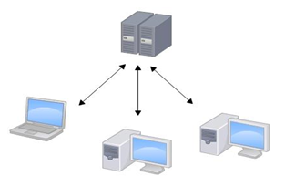
    -   CVS、SVN(Subversion)、VSS……
    -   SVN是集中式版本控制系统，版本库是集中放在中央服务器的，而干活的时候，用的都是自己的电脑，所以首先要从中央服务器下载最新的版本，然后开发代码，写完代码后需要把自己的代码推送到中央服务器。
    -   缺点：
        -   服务器单点故障
        -   容错性差
-   分布式版本控制工具
    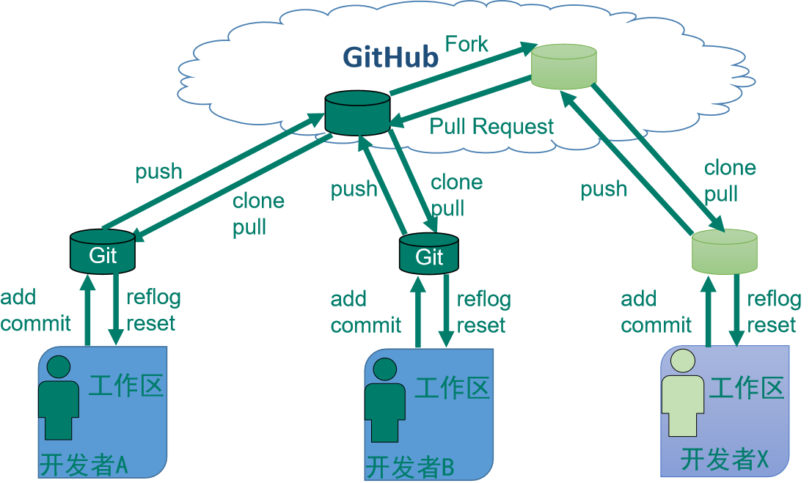
    -   Git、Mercurial、Bazaar、Darcs……
    -   **仓库：**
        -   本地仓库：是在开发人员自己电脑上的Git仓库&#x20;
        -   远程仓库：是在远程服务器上的Git仓库
            -   **团队内协作**
            -   **跨团队协作**
    -   **操作：**
        -   **`clone`**：克隆，就是将远程仓库复制到本地
        -   **`push`**：推送，就是将本地仓库代码上传到远程仓库
        -   **`pull`**：拉取，就是将远程仓库代码下载到本地仓库
        -   **`Commit`**：提交，就是将本地工作区代码上传到本地仓库中
    -   **优点：**
        -   容灾能力强
        -   本地版本管理
        -   异地协作
        -   灵活分支

## 安装、环境搭建

### 安装

-   **安装步骤**
    出现安全警告，点击运行
    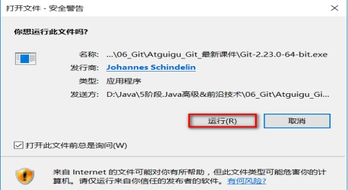
    浏览协议，下一步
    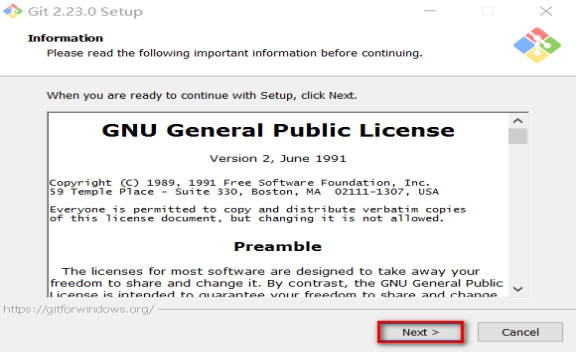
    安装目录，所需要磁盘空间大小，下一步
    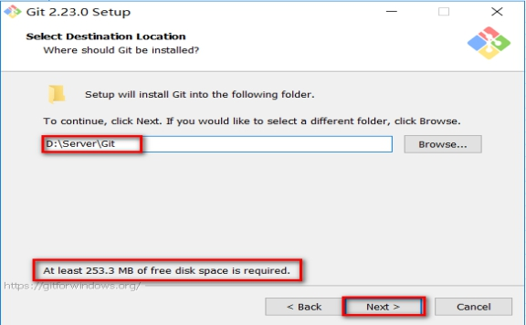
    Git Bash需要安装的，其他默认即可，下一步
    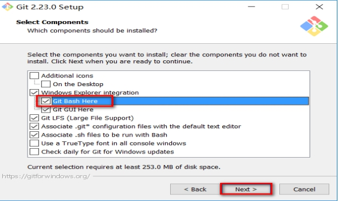
    开始菜单，下一步
    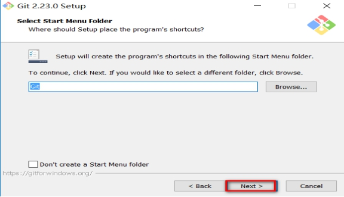
    默认编辑器，下一步
    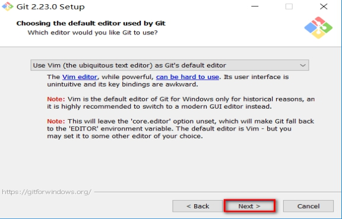
    选择Git命令的执行环境
    -   这里推荐选择第一个，就是单独用户Git自己的命令行窗口。
    -   不推荐和windows的命令行窗口混用。
        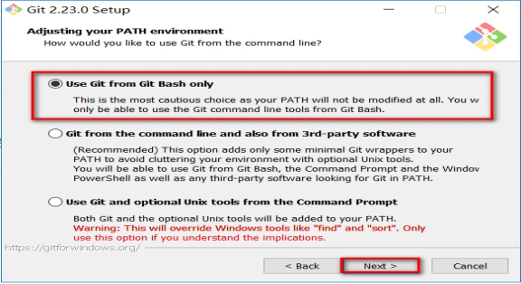
    HTTPS传输：使用SSL传输协议
    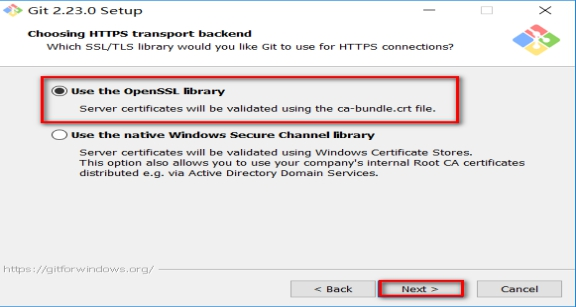
    在“Configuring the line ending conversions”选项中，
    第一个选项：如果是跨平台项目，在windows系统安装
    第二个选项：如果是跨平台项目，在Unix系统安装
    第三个选项：非跨平台项目
    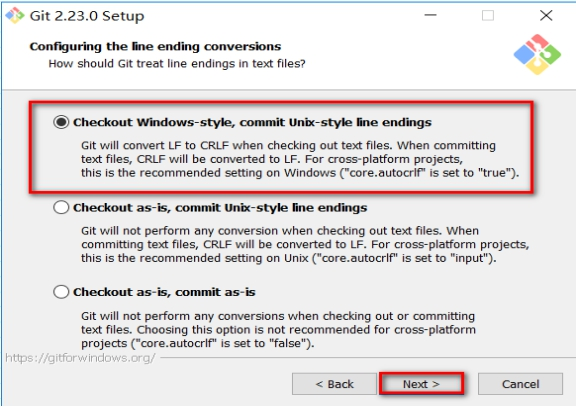
    在“terminal emulator”选项中，
    第一个选项：使用专用的Git窗口（**推荐**）
    第二个选项：使用windows的cmd命令行窗口。
    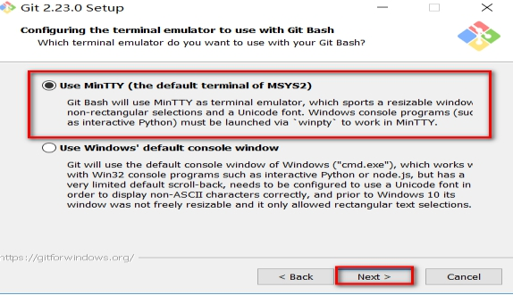
    在“Configuring extra”选项中，默认开启文件缓存即可（推荐）
    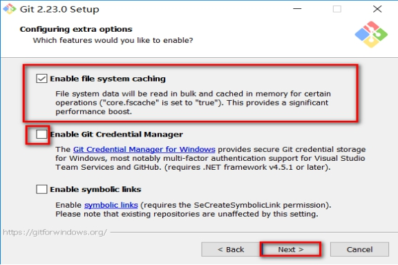
    新功能，还不稳定，不勾选，开始安装
    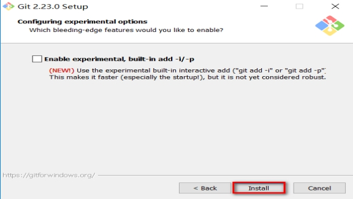
    安装完成
    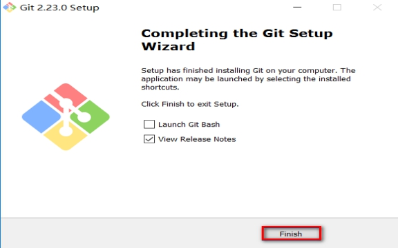

### 设置全局用户签名

1.  安装完成后，在任意的文件目录下，右键都可以开打Git的命令行窗口——Git Bash Here
    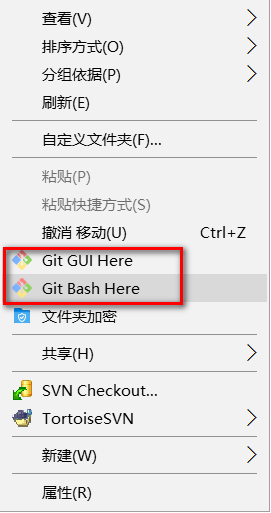
2.  Git是分布式版本控制系统，所以需要填写用户名和邮箱作为一个标识——即：用户签名
    -   说明
        -   签名的作用是区分不同操作者身份。用户的签名信息在每一个版本的提交信息中能够看到，以此确认本次提交是谁做的。
        -   注意：这里设置用户签名和将来登录GitHub（或其他代码托管中心）的账号没有任何关系。
    -   命令：
        **`git config --global user.name "用户名"`**
        **`git config --global user.email "用户邮箱"`**
        -   \--global 表示全局属性，所有的git项目都会共用属性
        -   查看配置信息：git config --list
        -   在当前登录的系统用户路径下，生成\~/.gitconfig隐含文件，里面可以看到刚刚设置的信息。如果不用命令设置，也可以直接打开文件进行设置。

## 相关概念

### 理解工作区、版本库、暂存区概念

-   **工作区(Working Directory)**：就是你电脑本地硬盘目录，一般是项目当前目录
-   **版本库(Repository)**：工作区有个隐藏目录.git，它就是Git的本地版本库
-   **暂存区(stage)**：一般存放在"git目录"下的index文件（.git/index）中，所以我们把暂存区有时也叫作索引（index）
-   **分支（Branch）**：Git为我们自动创建的第一个分支master，以及指向master的一个指针叫HEAD

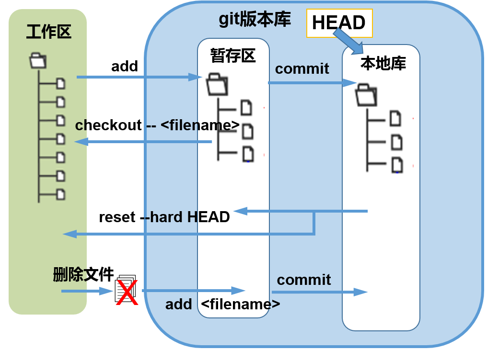

### 提交Git版本库分两步执行

**第一步** 用“**`git add`**”把文件纳入Git管理，实际是把本地文件修改添加到暂存区

**第二步** 用“**`git commit`**”提交更改，实际上就是把暂存区的所有内容提交到当前分支&#x20;

因为我们创建Git版本库时，Git自动为我们创建了唯一一个master分支，所以commit就是往master分支上提交更改。

可以简单理解为，需要提交的文件修改通通放到暂存区，然后，一次性提交暂存区的所有修改。一旦提交完后，如果你又没有对工作区做任何修改，那么工作区就是“干净”的。
即：nothing to commit (working directory clean)。

**其他操作**
①用“**`git diff HEAD -- filename`**”命令可以查看工作区和暂存区里面最新版本的区别。
②新建过撤销未add： **`git checkout  -- 文件名`**
③撤销已add未commit：先`git  reset HEAD  文件名`，再 git checkout -- 文件名
④撤销已add已commit：**`git reset --hard HEAD^`**
