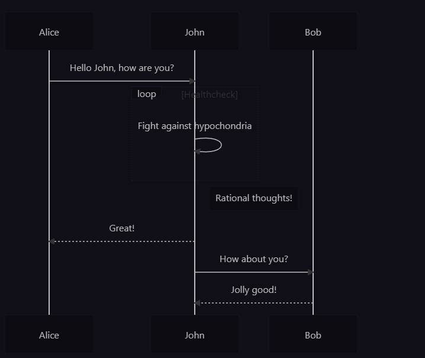

## 1. 认识Markdown

简单易用的**写作语法**,目标:**易读易写**
用简单的**符号**,定义常用的**排版样式**

---

## 2. 使用Markdown

^1d499b

### 标题

``` txt
# 标题一
## 标题二
### 标题三
#### 标题四
##### 标题五
###### 标题六
```

### 加粗/斜体/删除

**加粗**
*斜体*
~~删除~~

``` txt
**加粗**
*斜体*
~~删除~~
```

### 列表

1. aa
	1. aaa
		1. aaaa
2. bb
	1. bb
3. cc

* 11
	* 111
		* 1111
* 22
* 33

``` txt
 有序列表: 数字+.+空格
 无序列表: *+空格 或者 -+空格

table 键可以控制缩进
```

### 引用

使用 `>` 表示，可以有多个 `>`，表示层级更深
> 引用的内容
>> 啊啊啊

^c83780

``` txt
 > + 内容
 >> + 内容
```

### 分割线

``` txt
---
```

### 链接

#### 内联超链接

[这里是链接](https://www.baidu.com "百度")

``` txt
[显示的文字](链接的地址)
[链接文字](链接地址+空格+"文字说明")
```

#### 自动超链接

<https://www.baidu.com>

``` txt
<超链接地址>
<https://www.baiud.com>
```

### 图片


[](https://www.baidu.com/)
``` txt
一般图片的使用:


带链接的图片使用:
[](链接地址)
```

### 代码

#### 代码块
``` text
` ` ` 语言格式
```

#### 行内代码块

这个是``行内代码``
`` There is a literal backtick (`) here.``
``` txt
	这个是``行内代码``
	`` There is a literal backtick (`) here.``
```

### 代办

- [ ] 待办事项
- [x] 已完成
``` txt
- [ ] 待办事项
- [x] 已完成事项
```

### 表格

- 第一个部分是表格的标题，使用`|`来作为列的分割
- 第二个部分是表示列的对齐方式，有左对齐、居中对齐和居右对齐三种类型，直接看例子吧， `---` 表示了默认的**左对齐**，
	- `:---` 表示 **左对齐**
	-  `---:` 表示 **右对齐**
	- `:---:` 表示**居中对齐**
- 第三个部分就是内容了，表示方式跟标题一样，可以有多行

|左对齐|居中|右对齐|
|:---|:---:|---:|
|居左|居中|局右|

``` txt
|左对齐|居中|右对齐|
|:---|:---:|---:|
|居左|居中|局右|
```

### 脚注

在文档末尾写上`[`+`^+数字`+`]:`+文字内容 声明一个脚注 ^jiaozhu

该方法根据实验证明有效[^1]  
[^1]: 文章链接

### 输出公式

使用 `$` 表示，其中一个 `$` 表示在行内，两个 `$` 表示独占一行。
[参考教程](https://1024th.github.io/MathJax_Tutorial_CN)
[数学公式在线编译](https://www.latexlive.com)
$$eg : ∑ i = 1 n a i = 0 \sum_{i=1}^n a_i=0∑i=1nai=0$$

### 输出流程图

[mermaid文档](https://mermaid-js.github.io/mermaid/#/README)

[mermaid在线编辑器](https://mermaid-js.github.io/mermaid-live-editor)



相关代码：mermaid语言

``` txt
sequenceDiagram
  Alice->>John: Hello John, how are you?
  loop Healthcheck
  John->>John: Fight against hypochondria
  end
  Note right of John: Rational thoughts!
  John-->>Alice: Great!
  John->>Bob: How about you?
  Bob-->>John: Jolly good!
```

## Html样式

### 文字样式

``` html
<b>加粗</b>  
<strong>加粗</strong>  
<i>倾斜</i>  
<em>倾斜</em>  
<u>下划线</u>  
<ins>下划线</ins>  
<s>删除线</s>  
<del>删除线</del>  
<sub>下标</sub>  
<sup>上标</sup>
```

## style样式

<b style='font-size:80px; color:red'>加粗</b>

``` txt
<b style='font-size:80px; color:red'>加粗</b>
```

### 超链接

``` html
<a href="https://www.baidu.com">百度</a>
```

