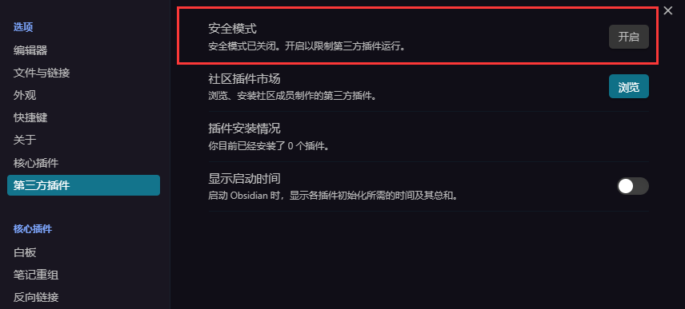
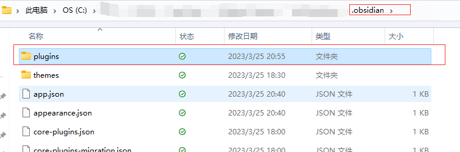

# 使用插件

## 安装插件

- 关闭安全模式
	
- 手动安装插件
	将插件的目录解压到`plugins`中
	

# 推荐的插件

- File Explorer Note Count
	显示文件数量
- Recent Files
	显示最近打开的文件
- Obsidian Pandoc
	转换文件格式输出
- Minimal Theme Settings
	Minimal Theme主题设置
- proxy github
- Mindmap NextGen
	将标题大纲转换成思维导图
- Calendar
	查找当天的日记,依赖于日历的插件,需要先开启
- Tasks
	管理我们的代办事项
- Obsidian memos
	依赖于日历的插件,需要先开启,主要记录当前的想法
- Excalidraw
	绘制流程图
- cMenu
	快捷栏
- Quick Explorer
	按照路径打开文件