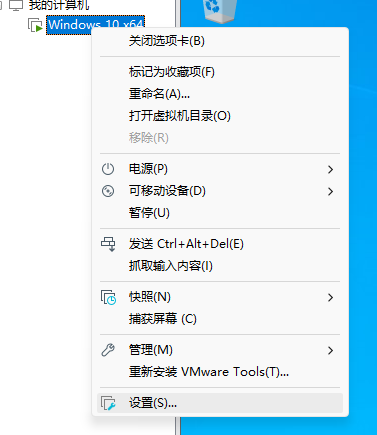
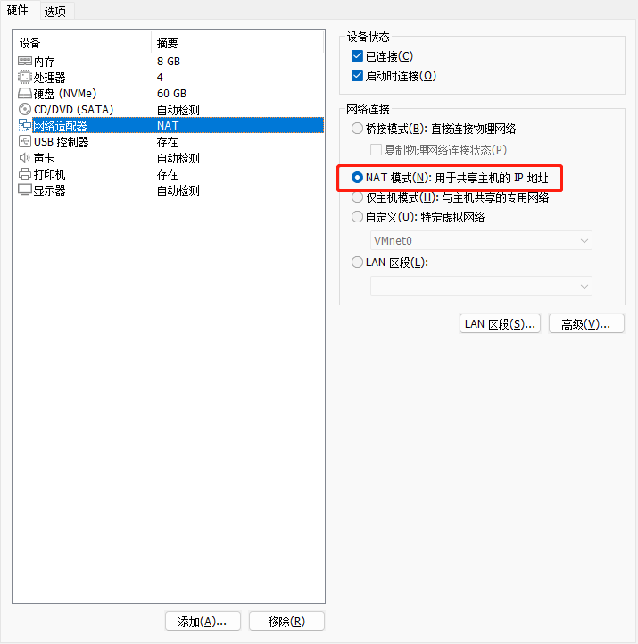
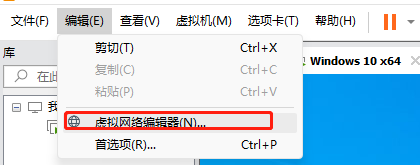
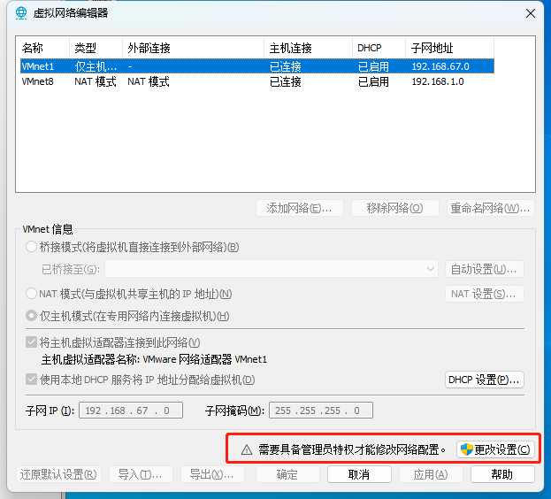
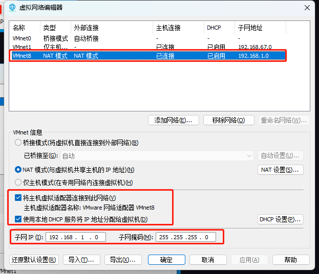
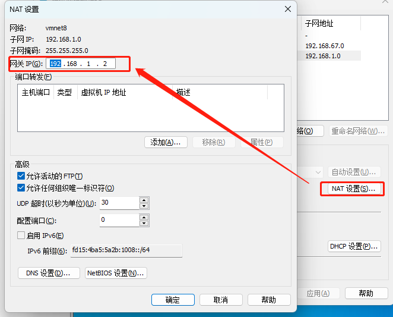
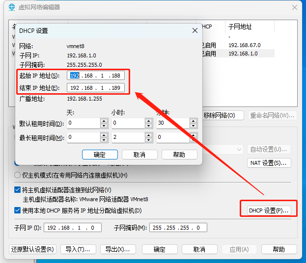
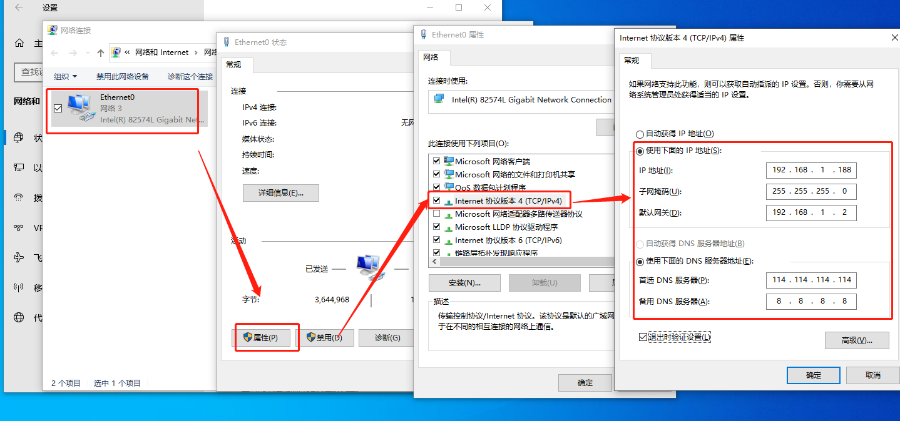
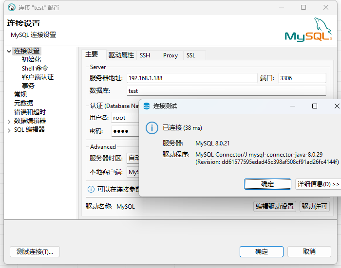

## 配置虚拟机软件

右键虚拟机 -> 设置

检查开启NAT模式

设置虚拟机网络

管理员启动

配置VMnet8链接中的参数,注意子网IP

此处网关需要设置为与子网IP网段一致
	如子网IP为 `aaa.bbb.c.e`  网段IP应为: `aaa.bbb.c.f`

配置DHCP
此处起始IP应排除上述配置的子网IP与网关IP

保存配置

## 配置虚拟机系统

配置虚拟机使用固定IP,方便我们后续在宿主机管理

此处IP地址需要填写上述DHCP池中区间IP
子网掩码与上述虚拟机软件配置一致
默认网关与上述虚拟机软件配置一致
DNS随意填写常用DNA,推荐:`114.114.114.114` `8.8.8.8`

## 实现效果

宿主机直接链接到虚拟机中的环境配置
