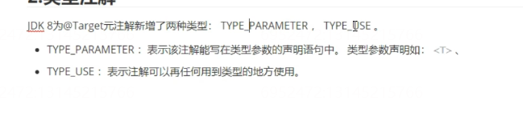

## 重复注解

自从Java5中引用注解以来,注解开始变得非常流行.  并在哥哥框架和项目中被广泛使用. 不过注解有一个最大的限制是: 在同一个地方不能多次使用同一个注解. JDK8引入了重复注解的概念,允许在同一个对方多次使用同一个注解.

在JDK8 中使用`@Repeatable`注解定义重复注解.

1.  定义一个重复注解的容器
    ```java
    @Retention(RetentionPolicy.RUNTIME)
    public @interface MyAnnotations {
        MyAnnotation[] value();
    }
    ```
2.  定义重复注解
    ```java
    @Repeatable(MyAnnotations.class)
    @Retention(RetentionPolicy.RUNTIME)
    public @interface MyAnnotation {
        String value();
    }

    ```
3.  使用重复注解
    ```java
    @MyAnnotation("Test1")
    @MyAnnotation("Test2")
    @MyAnnotation("Test3")
    public class AnnoTest01 {

        @MyAnnotation("fun1")
        @MyAnnotation("fun2")
        public void test01(){

        }

        /**
         * 解析重复注解
         * @param args
         */
        public static void main(String[] args) throws NoSuchMethodException {
            //获取类上的注解
            MyAnnotation[] annotationsByType = AnnoTest01.class.getAnnotationsByType(MyAnnotation.class);
            for (MyAnnotation myAnnotation : annotationsByType) {
                System.out.println(myAnnotation.value());
            }
            //获取方法上的注解
            MyAnnotation[] test01s = AnnoTest01.class.getDeclaredMethod("test01").getAnnotationsByType(MyAnnotation.class);
            for (MyAnnotation test01 : test01s) {
                System.out.println(test01.value());
            }
        }
    }
    ```

## 类型注解



JDK8 为@Target原注解新增了两种类型: TYPE\_PARAMETER TYPE\_USE

1.  TYPE\_PARAMETER : 表示该注解能卸载类型参数的声明语句中,类型参数声明如:\<T>
```java
@Target(ElementType.TYPE_PARAMETER)
public @interface TypeParam {
}
```

```java
public class TypeDemo01 <@TypeParam  T>{
	public <@TypeParam K extends Object> K test01(){
		return null;
	}
}
    ```

2.  TYPE\_USE : 表示注解可以在任何用到类型的地方使用
```java
@Target(ElementType.TYPE_PARAMETER)
public @interface TypeParam {
}

```

```java
public class TypeUserDemo01 {
	public @NotNull Integer agentId = 10;
	
	public void test02(@NotNull String name,@NotNull String sex){
	
	}
}
```
