## html标签

定义 HTML 文档，这个元素我们浏览器看到后就明白这是个HTML文档了，所以你的其它元素要包裹在它里面，标签限定了文档的开始点和结束点，在它们之间是文档的头部和主体。

## head 标签

### 说明

head标签用于定义文档的头部，它是所有头部元素的容器。`<head>` 中的元素可以引用脚本、指示浏览器在哪里找到样式表。文档的头部描述了文档的各种属性和信息，包括文档的标题、在 Web 中的位置以及和其他文档的关系等。绝大多数文档头部包含的数据都不会真正作为内容显示给读者。

下面这些标签可用在 head 部分：
`<title>`、`<meta>`、`<link>`、`<style>`、 `<script>`、 `<base>`。

应该把 `<head>` 标签放在文档的开始处，紧跟在 `<html>` 后面，并处于 `<body>` 标签之前。
文档的头部经常会包含一些 `<meta>` 标签，用来告诉浏览器关于文档的附加信息。

### 标签中可用标签

```html
 <html>
          <!-- 这是一个注释，注释的快捷键是ctrl+shift+/-->
          <!--
                  head标签中：放入：页面的配置信息
                  head标签中可以加入：
                  <title>、<meta>、<link>、<style>、 <script>、 <base>。
          -->
          <head>
                  <!--页面标题-->
                  <title>百度一下，你就知道</title>
                  <!--设置页面的编码，防止乱码现象
                          利用meta标签，
                          charset="utf-8" 这是属性，以键值对的形式给出  k=v a=b 
                          告诉浏览器用utf-8来解析这个html文档
                  -->
                  <meta charset="utf-8" /><!--简写-->
                  <!--繁写形式：（了解）-->
                  <!--<meta http-equiv="content-type" content="text/html;charset=utf-8" />-->
                  <!--页面刷新效果-->
                  <!--<meta http-equiv="refresh" content="3;https://www.baidu.com" />-->
                  <!--页面作者-->
                  <meta name="author" content="xxxx@qq.com" />
                  <!--设置页面搜索的关键字-->
                  <meta name="keywords" content="百度;百度搜索;搜索引擎" />
                  <!--页面描述-->
                  <meta name="description" content="百度首页" />
                  <!--link标签引入外部资源-->
                  <link rel="shortcut icon" href="https://www.baidu.com/favicon.ico" type="image/x-icon" />
          </head>
          <!--
                  body标签中：放入：页面展示的内容
          -->
          <body>
                  this is a html..你好
          </body>
  </html>

```

## body 标签中可用标签

### 说明

body 元素是定义文档的主体。body 元素包含文档的所有内容（比如文本、超链接、图像、表格和列表等等。）body是用在网页中的一种HTML标签，标签是用在网页中的一种HTML标签，表示网页的主体部分，也就是用户可以看到的内容，可以包含文本、图片、音频、视频等各种内容！

### 标签中可用标签

#### 文本标签

##### 普通文本

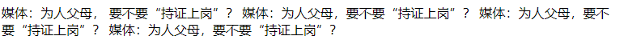

```html
<!DOCTYPE html>
  <html>
	<head>
	  <meta charset="UTF-8">
	  <title>文本标签</title>
	</head>
	<body>
	  <!--
	下面的文字就是普通的文本
	  文本编辑器中的任何效果：比如空格，换行 都不影响页面，页面想要实现效果 必须通过标签来实现
	-->
	  媒体：为人父母， 要不要“持证上岗”？
	  媒体：为人父母，要不要“持证上岗”？
	  媒体：为人父母，要不要“持证上岗”？
	  媒体：为人父母，要不要“持证上岗”？
	</body>
  </html>
```

##### 标题标签 

`<h1></h1>`~`<h7></h7>`

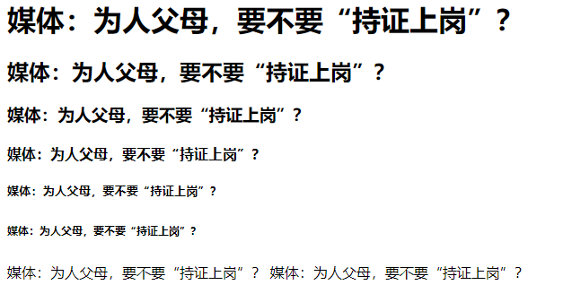

```html
<!DOCTYPE html>
  <html>
	<head>
	  <meta charset="UTF-8">
	  <title>文本标签</title>
	</head>
	<body>
	  <!--
	标题标签
			h1-h6  字号逐渐变小，每个标题独占一行，自带换行效果
			h7之后都属于无效标签，但是浏览器也不会报错，而是以普通文本的形式进行展现
		 -->
	  <h1>媒体：为人父母，要不要“持证上岗”？</h1>
	  <h2>媒体：为人父母，要不要“持证上岗”？</h2>
	  <h3>媒体：为人父母，要不要“持证上岗”？</h3>
	  <h4>媒体：为人父母，要不要“持证上岗”？</h4>
	  <h5>媒体：为人父母，要不要“持证上岗”？</h5>
	  <h6>媒体：为人父母，要不要“持证上岗”？</h6>
	  <h7>媒体：为人父母，要不要“持证上岗”？</h7>
	  <h8>媒体：为人父母，要不要“持证上岗”？</h8>
	</body>
  </html>
```

##### 横线标签 

`<hr/>`


```html
<!DOCTYPE html>
  <html>
	<head>
	  <meta charset="UTF-8">
	  <title>文本标签</title>
	</head>
	<body>
	  <!--
	横线标签
			width:设置宽度
				300px ：固定宽度
				30%：页面宽度的百分比，会随着页面宽度的变化而变化
				align：设置位置  left ,center,right    默认不写的话就是center居中效果
		-->
	  <hr width="300px" align="center" />
	  <hr width="30%" align="center" />
	</body>
  </html>
```

##### 段落标签 

`<p></p>`

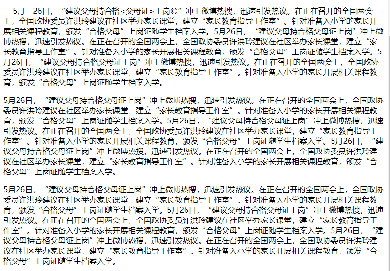

```html
<!DOCTYPE html>
  <html>
	<head>
	  <meta charset="UTF-8">
	  <title>文本标签</title>
	</head>
	<body>
	  <!--
	段落标签：
			段落效果：段落中文字自动换行，段落和段落之间有空行
		-->
	  <p>&nbsp;&nbsp;&nbsp;&nbsp;5月&emsp;26日，“建议父母持合格&lt;父母证&gt;上岗&copy;”冲上微博热搜，迅速引发热议。在正在召开的全国两会上，全国政协委员许洪玲建议在社区举办家长课堂，建立“家长教育指导工作室”。针对准备入小学的家长开展相关课程教育，颁发“合格父母”上岗证随学生档案入学。5月26日，“建议父母持合格父母证上岗”冲上微博热搜，迅速引发热议。在正在召开的全国两会上，全国政协委员许洪玲建议在社区举办家长课堂，建立“家长教育指导工作室”。针对准备入小学的家长开展相关课程教育，颁发“合格父母”上岗证随学生档案入学。5月26日，“建议父母持合格父母证上岗”冲上微博热搜，迅速引发热议。在正在召开的全国两会上，全国政协委员许洪玲建议在社区举办家长课堂，建立“家长教育指导工作室”。针对准备入小学的家长开展相关课程教育，颁发“合格父母”上岗证随学生档案入学。
	  </p>
	  <p>5月26日，“建议父母持合格父母证上岗”冲上微博热搜，迅速引发热议。在正在召开的全国两会上，全国政协委员许洪玲建议在社区举办家长课堂，建立“家长教育指导工作室”。针对准备入小学的家长开展相关课程教育，颁发“合格父母”上岗证随学生档案入学。5月26日，“建议父母持合格父母证上岗”冲上微博热搜，迅速引发热议。在正在召开的全国两会上，全国政协委员许洪玲建议在社区举办家长课堂，建立“家长教育指导工作室”。针对准备入小学的家长开展相关课程教育，颁发“合格父母”上岗证随学生档案入学。5月26日，“建议父母持合格父母证上岗”冲上微博热搜，迅速引发热议。在正在召开的全国两会上，全国政协委员许洪玲建议在社区举办家长课堂，建立“家长教育指导工作室”。针对准备入小学的家长开展相关课程教育，颁发“合格父母”上岗证随学生档案入学。
	  </p>
	  <p>5月26日，“建议父母持合格父母证上岗”冲上微博热搜，迅速引发热议。在正在召开的全国两会上，全国政协委员许洪玲建议在社区举办家长课堂，建立“家长教育指导工作室”。针对准备入小学的家长开展相关课程教育，颁发“合格父母”上岗证随学生档案入学。5月26日，“建议父母持合格父母证上岗”冲上微博热搜，迅速引发热议。在正在召开的全国两会上，全国政协委员许洪玲建议在社区举办家长课堂，建立“家长教育指导工作室”。针对准备入小学的家长开展相关课程教育，颁发“合格父母”上岗证随学生档案入学。5月26日，“建议父母持合格父母证上岗”冲上微博热搜，迅速引发热议。在正在召开的全国两会上，全国政协委员许洪玲建议在社区举办家长课堂，建立“家长教育指导工作室”。针对准备入小学的家长开展相关课程教育，颁发“合格父母”上岗证随学生档案入学。
	  </p>
	</body>
  </html>
```

##### 加粗/倾斜/下划线

`<i></i>` `<u></u>` `<b></b>`

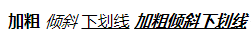

```html
<!DOCTYPE html>
<html>
	<head>
	  <meta charset="UTF-8">
	  <title>文本标签</title>
	</head>
	<body>
	  <!--加粗倾斜下划线-->
	  <b>加粗</b>
	  <i>倾斜</i>
	  <u>下划线</u>
	  <i><u><b>加粗倾斜下划线</b></u></i>
	</body>
</html>
```

##### 删除线

`<del></del>`

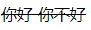

```html
<!DOCTYPE html>
<html>
	<head>
	  <meta charset="UTF-8">
	  <title>文本标签</title>
	</head>
	<body>
	  <!--删除线-->
	  <del>你好 你不好</del>
	</body>
</html>
```

##### 预编译标签

`<pre></pre>`

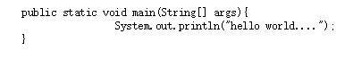

```html
<!DOCTYPE html>
<html>
	<head>
	  <meta charset="UTF-8">
	  <title>文本标签</title>
	</head>
	<body>
	  <!--预编译标签：在页面上显示原样效果-->
	  <pre>
	  public static void main(String[] args){
		  System.out.println("hello world....");
	  }
	  </pre>
	</body>
</html>
```

##### 换行

`<br />`

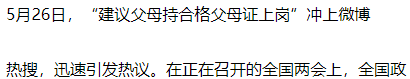

```html
<!DOCTYPE html>
<html>
	<head>
	  <meta charset="UTF-8">
	  <title>文本标签</title>
	</head>
	<body>
	  <!--换行-->
	  5月26日，“建议父母持合格父母证上岗”冲上微博<br />热搜，迅速引发热议。在正在召开的全国两会上，全国政
	</body>
</html>
```

##### 字体标签

`<font></font>`


```html
<!DOCTYPE html>
<html>
	<head>
	  <meta charset="UTF-8">
	  <title>文本标签</title>
	</head>
	<body>
	  <!--字体标签-->
	  <font color="#397655" size="7" face="萝莉体 第二版">建议父母持合格父母证上岗</font>
	</body>
</html>
```

##### 特殊字符

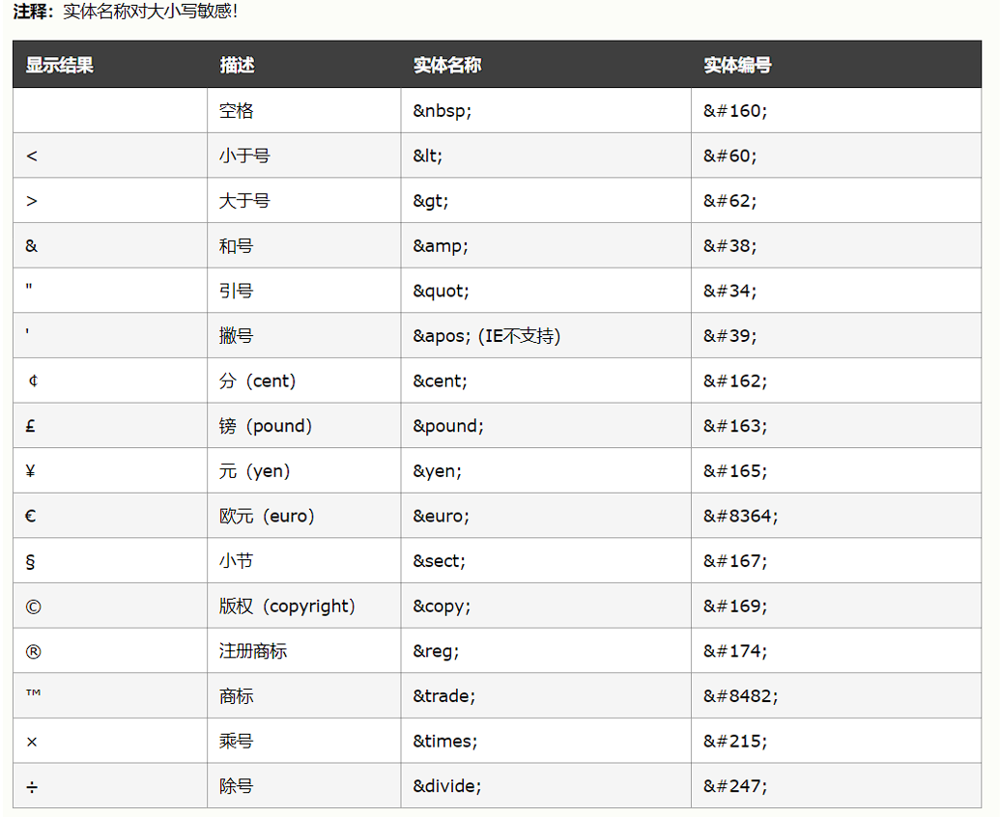

#### 多媒体标签

##### 图片

``

```html
<!DOCTYPE html>
<html>
  <head>
	<meta charset="UTF-8">
	<title></title>
  </head>
  <body>
	<!--图片
	  src:引入图片的位置
		  引入本地资源
		  引入网络资源
	  width:设置宽度
	  height:设置高度
	  注意:一般高度和宽度只设置一个即可，另一个会按照比例自动适应
	  title:鼠标悬浮在图片上的时候的提示语，默认情况下（没有设置alt属性） 图片如果加载失败那么提示语也是title的内容
	  alt:图片加载失败的提示语
	-->
	
	
  </body>
</html>
```

#####  音频视频 

`<embed />`

```html
<!DOCTYPE html>
<html>
  <head>
	<meta charset="UTF-8">
	<title></title>
  </head>
  <body>
	<!--音频-->
	<embed src="music/我要你.mp3"></embed>
	<br />
	<!--视频-->
	<embed src="video/周杰伦 - 说好的幸福呢.mp4" width="500px" height="500px"></embed>
	<embed
	  src="//player.video.iqiyi.com/38913f9ed7358c0933e82a03d9b26ec1/0/0/v_19rv8qeokk.swf-albumId=9194699400-tvId=9194699400-isPurchase=0-cnId=undefined"
	  allowFullScreen="true" quality="high" width="480" height="350" align="middle" allowScriptAccess="always"
	  type="application/x-shockwave-flash"></embed>
  </body>
</html>
```

#### 超链接标签

##### 超链接标签

`<a href=""></a>`


```html
<!DOCTYPE html>
<html>
  <head>
	<meta charset="UTF-8">
	<title></title>
  </head>
  <body>
	<!--超链接标签：作用：实现页面的跳转功能
		href:控制跳转的目标位置
		target:_self 在自身页面打开 （默认效果也是在自身页面打开）    _blank 在空白页面打开
	-->
	<a href="文本标签.html">这是一个超链接01</a>
	<!--跳转到本地资源-->
	<a href="">这是一个超链接02</a>
	<!--跳转到自身页面-->
	<a href="abc">这是一个超链接03</a>
	<!--跳转的目标找不到，提示找不到资源-->
	<a href="https://www.baidu.com" target="_self">这是一个超链接04</a>
	<!--跳转到网络资源-->
	<a href="https://www.baidu.com" target="_blank">这是一个超链接05</a>
	<!--跳转到网络资源-->
	<a href="https://www.baidu.com" target="_blank"></a>
  </body>
</html>
```

##### 设置锚点

###### 当前页面锚点跳转

```html
<!DOCTYPE html>
<html>
  <head>
	<meta charset="UTF-8">
	<title></title>
  </head>
  <body>
	<a name="1F"></a>
	<h1>手机</h1>
	<p>华为p40</p>
	<p>华为p40</p>
	<p>华为p40</p>
	<a name="2F"></a>
	<h1>化妆品</h1>
	<p>大宝</p>
	<p>大宝</p>
	<p>大宝</p>
	<a name="3F"></a>
	<h1>母婴产品</h1>
	<p>奶粉</p>
	<p>奶粉</p>
	<p>奶粉</p>
	<a name="4F"></a>
	<h1>图书</h1>
	<p>thinking in java</p>
	<p>thinking in java</p>
	<p>thinking in java</p>
	<a href="#1F">手机</a>
	<a href="#2F">化妆品</a>
	<a href="#3F">母婴产品</a>
	<a href="#4F">书籍</a>
  </body>
</html>
```

###### 其他页面锚点跳转

```html
<!DOCTYPE html>
<html>
  <head>
	<meta charset="UTF-8">
	<title></title>
  </head>
  <body>
	<a href="设置锚点.html#3F">超链接</a>
  </body>
</html>
```

#### 列表标签

#####  无序列表

`<ul><li></li></ul>`

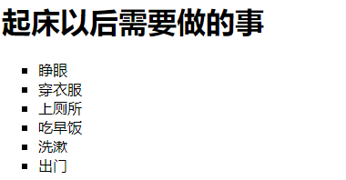

```html
<!DOCTYPE html>
<html>
  <head>
	<meta charset="UTF-8">
	<title></title>
  </head>
  <body>
	<!--无序列表:
	  type:可以设置列表前图标的样式   type="square"
		如果想要更换图标样式，需要借助css技术： style="list-style:url(img/act.jpg) ;"
	-->
	<h1>起床以后需要做的事</h1>
	<ul type="square">
	  <li>睁眼</li>
	  <li>穿衣服</li>
	  <li>上厕所</li>
	  <li>吃早饭</li>
	  <li>洗漱</li>
	  <li>出门</li>
	</ul>
	<!--有序列表:
		type:可以设置列表的标号：1,a,A,i,I
		start:设置起始标号
	-->
	<h1>学习java的顺序</h1>
	<ol type="A" start="3">
	  <li>JAVASE</li>
	  <li>ORACLE</li>
	  <li>MYSQL</li>
	  <li>HTML</li>
	  <li>CSS</li>
	  <li>JS</li>
	</ol>
  </body>
</html
```

##### 有序列表

`<ol><li></li></ol>`

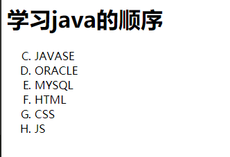

```html
<!DOCTYPE html>
<html>
  <head>
	<meta charset="UTF-8">
	<title></title>
  </head>
  <body>
	<!--有序列表:
		type:可以设置列表的标号：1,a,A,i,I
		start:设置起始标号
	-->
	<h1>学习java的顺序</h1>
	<ol type="A" start="3">
	  <li>JAVASE</li>
	  <li>ORACLE</li>
	  <li>MYSQL</li>
	  <li>HTML</li>
	  <li>CSS</li>
	  <li>JS</li>
	</ol>
  </body>
</html
```

#### 表格标签

应用场景：在页面布局很规整的时候，可能利用的就是表格。
合并原理：
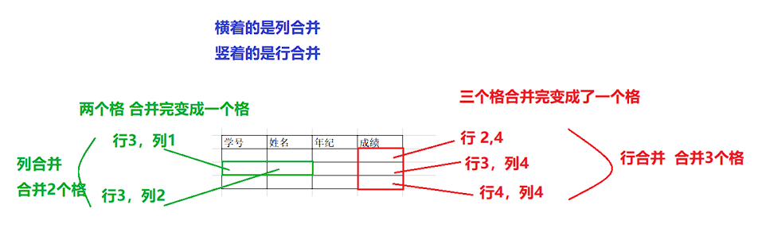

**表格**  : `<table><tr><th></th></tr><tr><td></td></tr></table>`

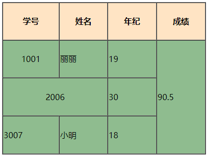

```html
<!DOCTYPE html>
<html>
  <head>
	<meta charset="UTF-8">
	<title></title>
  </head>
  <body>
	<!--表格：4行4列
	  table:表格
		tr:行
		td:单元格
		th:特殊单元格：表头效果：加粗，居中
		默认情况下表格是没有边框的，通过属性来增加表框：
		border:设置边框大小
		cellspacing：设置单元格和边框之间的空隙
		align="center"  设置居中
		background 设置背景图片 background="img/ss.jpg"
		bgcolor :设置背景颜色
		rowspan:行合并
		colspan：列合并
	-->
	<table border="1px" cellspacing="0px" width="400px" height="300px" bgcolor="darkseagreen">
	  <tr bgcolor="bisque">
		<th>学号</th>
		<th>姓名</th>
		<th>年纪</th>
		<th>成绩</th>
	  </tr>
	  <tr>
		<td align="center">1001</td>
		<td>丽丽</td>
		<td>19</td>
		<td rowspan="3">90.5</td>
	  </tr>
	  <tr>
		<td colspan="2" align="center">2006</td>
		<td>30</td>
	  </tr>
	  <tr>
		<td>3007</td>
		<td>小明</td>
		<td>18</td>
	  </tr>
	</table>
  </body>
</html>
```

## 框架

应用场景：内嵌框架是用于在网页中嵌入一个网页并让它在网页中显示.

### 内嵌框架

` <iframe src=" URL "></iframe>`

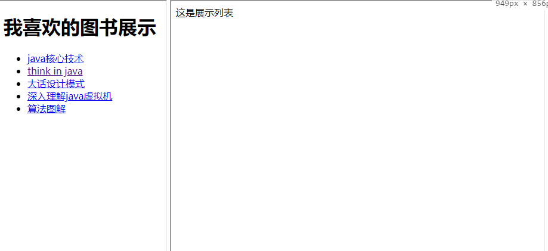

```html
<!DOCTYPE html>
<html>
  <head>
	<meta charset="UTF-8">
	<title></title>
  </head>
  <body>
	<iframe src="书籍导航页面.html" height="700px" width="30%"></iframe>
	<!--内嵌框架-->
	<iframe name="iframe_my" width="67%" height="700px" src="main.html"></iframe>
  </body>
</html>
```

#### 框架集合

`<frameset></frameset>`

> 注意 : 和body是并列的概念，不要将框架集合放入body中

**frameset 元素可定义一个框架集。它被用来组织多个窗口（框架）。每个框架存有独立的文档。在其最简单的应用中，frameset 元素仅仅会规定在框架集中存在多少列或多少行。您必须使用 cols 或 rows 属性。**

里面如果只有一个框架用frame标签 ,如果多个框架用frameset标签用cols 或 rows进行行，列的切割

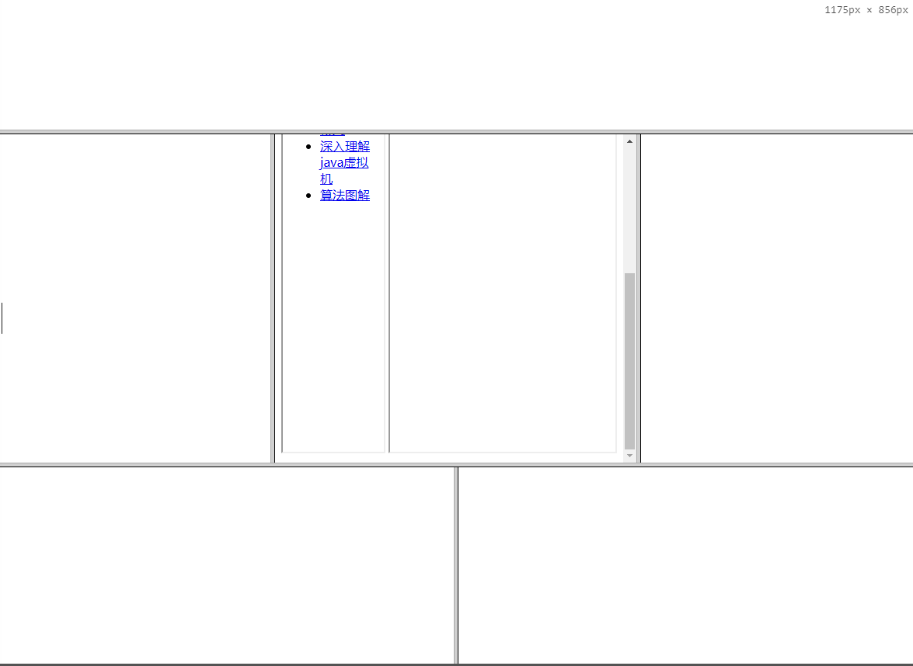

```html
<!DOCTYPE html>
<html>
  <head>
	<meta charset="UTF-8">
	<title></title>
  </head>
  <!--框架集合：和body是并列的概念，不要将框架集合放入body中-->
  <frameset rows="20%,*,30%">
	<frame />
	<frameset cols="30%,40%,*">
	  <frame />
	  <frame src="index.html" />
	  <frame />
	</frameset>
	<frameset cols="50%,*">
	  <frame />
	  <frame />
	</frameset>
  </frameset>
</html>
```
