## 概述

表单在 Web 网页中用来给访问者填写信息，从而能采集客户端信息，使网页具有交互的功能。一般是将表单设计在一个Html 文档中，当用户填写完信息后做提交(submit)操作，于是表单的内容就从客户端的浏览器传送到服务器上，经过服务器上程序处理后，再将用户所需信息传送回客户端的浏览器上，这样网页就具有了交互性。这里我们只讲怎样使用Html 标志来设计表单。

所有的用户输入内容的地方都用表单来写，如登录注册、搜索框。

一个表单一般应该包含用户填写信息的输入框,提交按钮等，这些输入框,按钮叫做控件,表单很像容器,它能够容纳各种各样的控件。

## 语法

```html
<form action＝"url" method=get|post name="myform" ></form> 
-name：表单提交时的名称 
-action：提交到的地址 
-method：提交方式，有get和post两种，默认为get 
```

```html
<!DOCTYPE html>
<html>
  <head>
    <meta charset="UTF-8">
    <title></title>
  </head>
  <body>
    <!--定义form表单:form表单会采集包含的有效数据，提交到后端，进行交互-->
    <!--
        【1】action属性
        地址栏信息：http://127.0.0.1:8020/Form%E8%A1%A8%E5%8D%95/aaa?username=nana&pwd=123123
        ?之前是提交的资源的目标地址
        ?之后是提交的具体的数据 
        
        http ： 信息交互遵照协议 http协议
        127.0.0.1  ：代表本机的IP地址
        8020 ：Hbuilder内置服务器的端口号
        Form%E8%A1%A8%E5%8D%95：指的是你的项目名字：Form表单
        PS：浏览器的地址栏是不支持中文的，都会转成编码传送，如果你在地址栏看到中文，只是当前的那个浏览器给你一个友好的显示
        PS:可以使用在线解析工具查看：urlencode
        aaa:目标资源 --》去当前项目下找aaa了
        
        ?后的内容：
        username=nana&pwd=123123
        我们写的文本框，密码框等必须要加入一个属性：name
        然后name属性和具体录入的信息会拼成一个键值对的形式
        多个键值对之间 ，用&符号进行拼接
        
        PS：只有放在form表单中的内容才会被收集并提交
        
        【2】method属性：默认情况下不写method属性的时候就相当于method="get"
        get方式：提交数据可见，不安全，提交数据长度有限制，效率高
        post方式 ：提交数据不可见，安全，提交数据长度没有限制，效率低
    -->
    <form action="aaa" method="post">
      用户名：<input type="text" name="username" /><br />
      密码：<input type="password" name="pwd" /><br />
      <!--提交按钮-->
      <input type="submit" />
    </form>
    用户名2：<input type="text" name="username2" />
  </body>
</html>
```

## 模仿百度搜索

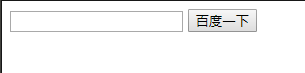

```html
<!DOCTYPE html>
<html>
  <head>
    <meta charset="UTF-8">
    <title>百度一下，你就知道</title>
    <link rel="shortcut icon" href="https://www.baidu.com/favicon.ico" type="image/x-icon" />
  </head>
  <body>
    <form action="https://www.baidu.com/s" method="get">
      <!--文本框-->
      <input type="text" name="wd" />
      <!--提交按钮-->
      <input type="submit" value="百度一下" />
    </form>
  </body>
</html>
```

## 表单元素

### 文本框 text

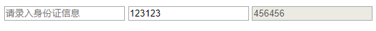

```html
<!DOCTYPE html>
<html>
  <head>
    <meta charset="UTF-8">
    <title></title>
  </head>
  <body>
    <form action="" method="get">
      <!--表单元素-->
      <!--文本框:
          input标签使用很广泛，通过type属性的不同值，来表现不同的形态。
          type="text"  文本框，里面文字可见
          表单元素必须有一个属性：name 有了name才可以提交数据,才可以采集数据
          然后提交的时候会以键值对的形式拼到一起。
          value:就是文本框中的具体内容
          键值对：name=value的形式
          如果value提前写好，那么默认效果就是value中内容。
          一般默认提示语：用placeholder属性，不会用value--》value只是文本框中的值。
          
          readonly只读：只是不能修改，但是其他操作都可以，可以正常提交
          disabled禁用：完全不用，不能正常提交
          
          写法：
          readonly="readonly"
          readonly
          readonly = "true"
      -->
      <input type="text" name="uname" placeholder="请录入身份证信息" />
      <input type="text" name="uname2" value="123123" readonly="true" />
      <input type="text" name="uname3" value="456456" disabled="disabled" />
    </form>
  </body>
</html>

```

### 密码框 password

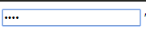

```html
<!DOCTYPE html>
<html>
  <head>
    <meta charset="UTF-8">
    <title></title>
  </head>
  <body>
    <form action="" method="get">
      <!--密码框:效果录入信息不可见-->
      <input type="password" name="pwd" />
    </form>
  </body>
</html>

```

### 单选框 radio

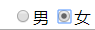

```html
<!DOCTYPE html>
<html>
  <head>
    <meta charset="UTF-8">
    <title></title>
  </head>
  <body>
    <form action="" method="get">
      <!--单选按钮：
          注意：一组单选按钮，必须通过name属性来控制，让它们在一个分组中，然后在一个分组里只能选择一个
          正常状态下，提交数据为：gender=on ，后台不能区分你提交的数据
          不同的选项的value值要控制为不同，这样后台接收就可以区分了
          
          默认选中：checked="checked"
      -->
      性别：
      <input type="radio" name="gender" value="1" checked="checked" />男
      <input type="radio" name="gender" value="0" />女
    </form>
  </body>
</html>

```

### 多选框  checkbox

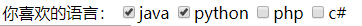

```html
<!DOCTYPE html>
<html>
  <head>
    <meta charset="UTF-8">
    <title></title>
  </head>
  <body>
    <form action="" method="get">
      <!--多选按钮:
          必须通过name属性来控制，让它们在一个分组中，然后在一个分组里可以选择多个
          不同的选项的value值要控制为不同，这样后台接收就可以区分了
          多个选项提交的时候，键值对用&符号进行拼接：例如下：
          favlan=1&favlan=3
      -->
      你喜欢的语言：
      <input type="checkbox" name="favlan" value="1" checked="checked" />java
      <input type="checkbox" name="favlan" value="2" checked="checked" />python
      <input type="checkbox" name="favlan" value="3" />php
      <input type="checkbox" name="favlan" value="4" />c#
    </form>
  </body>
</html>
```

### 文件  file

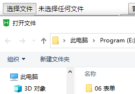

```html
<!DOCTYPE html>
<html>
  <head>
    <meta charset="UTF-8">
    <title></title>
  </head>
  <body>
    <form action="" method="get">
      <!--文件-->
      <input type="file" />
    </form>
  </body>
</html>

```

### 隐藏域  hidden

不显示出来

```html
<!DOCTYPE html>
<html>
  <head>
    <meta charset="UTF-8">
    <title></title>
  </head>
  <body>
    <form action="" method="get">
      <!--隐藏域-->
      <input type="hidden" name="uname6" value="123123" />
    </form>
  </body>
</html>

```

### 按钮组  button

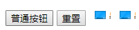

```html
<!DOCTYPE html>
<html>
  <head>
    <meta charset="UTF-8">
    <title></title>
  </head>
  <body>
    <form action="" method="get">
      <!--普通按钮：普通按钮没有什么效果，就是可以点击，以后学了js，可以加入事件-->
      <input type="button" value="普通按钮" />
      <!--特殊按钮：重置按钮将页面恢复到初始状态-->
      <input type="reset" />
      <!--特殊按钮：图片按钮-->
      
      <input type="image" src="img/java核心技术.jpg" />
    </form>
  </body>
</html>

```

### 下拉框  select

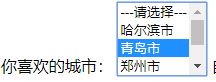

```html
<!DOCTYPE html>
<html>
  <head>
    <meta charset="UTF-8">
    <title></title>
  </head>
  <body>
    <form action="" method="get">
      <!--下拉列表
          默认选中：selected="selected"
          多选：multiple="multiple"
      -->
      你喜欢的城市：
      <select name="city" multiple="multiple">
        <option value="0">---请选择---</option>
        <option value="1">哈尔滨市</option>
        <option value="2" selected="selected">青岛市</option>
        <option value="3">郑州市</option>
        <option value="4">西安市</option>
        <option value="5">天津市</option>
      </select>
    </form>
  </body>
</html>
```

### 多行文本框  textarea

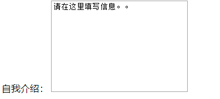

```html
<!DOCTYPE html>
<html>
  <head>
    <meta charset="UTF-8">
    <title></title>
  </head>
  <body>
    <form action="" method="get">
      <!--多行文本框
          利用css样式来控制大小不可变：style="resize: none;"
      -->
      自我介绍：
      <textarea style="resize: none;" rows="10" cols="30">请在这里填写信息。。</textarea>
      <br />
      <!--label标签
          一般会在想要获得焦点的标签上加入一个id属性，然后label中的for属性跟id配合使用。
      -->
      <label for="uname">用户名：</label><input type="text" name="uername" id="uname" />

      <!--特殊按钮：提交按钮：具备提交功能-->
      <input type="submit" />
    </form>
  </body>
</html>
```

### 标签  label&#x20;

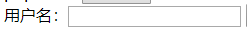

```html
<!DOCTYPE html>
<html>
  <head>
    <meta charset="UTF-8">
    <title></title>
  </head>
  <body>
    <form action="" method="get">
      <!--label标签
          一般会在想要获得焦点的标签上加入一个id属性，然后label中的for属性跟id配合使用。
      -->
      <label for="uname">用户名：</label><input type="text" name="uername" id="uname" />

      <!--特殊按钮：提交按钮：具备提交功能-->
      <input type="submit" />
    </form>
  </body>
</html>
```

### 提交按钮  submit

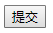

```html
<!DOCTYPE html>
<html>
  <head>
    <meta charset="UTF-8">
    <title></title>
  </head>
  <body>
    <form action="" method="get">
      <!--特殊按钮：提交按钮：具备提交功能-->
      <input type="submit" />
    </form>
  </body>
</html>
```
