## 什么是浮动

浮动设计的初衷为了解决文字环绕图片问题，浮动后一定不会将文字挡住，这是设计初衷，不能违背的。

CSS的 Float（浮动）使元素脱离文档流，按照指定的方向（左或右发生移动），直到它的外边缘碰到包含框或另一个浮动框的边框为止。

说到脱离文档流要说一下什么是文档流，文档流是是文档中可显示对象在排列时所占用的位置/空间，而脱离文档流就是在页面中不占位置了。

## 浮动演示

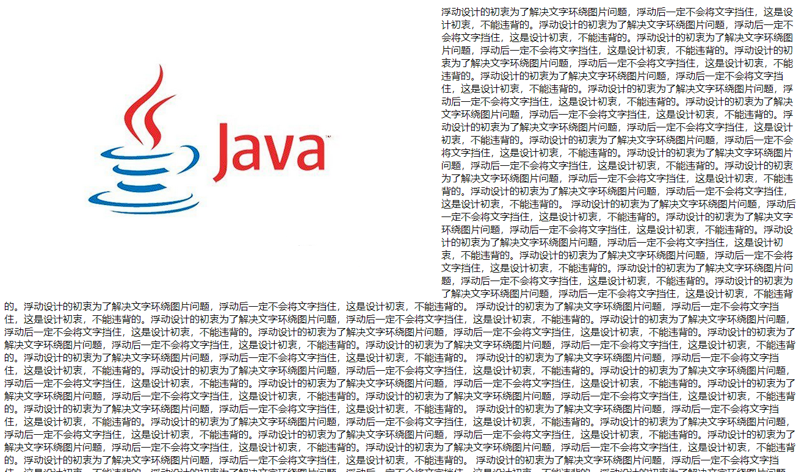

```html
<!DOCTYPE html>
<html>
  <head>
    <meta charset="UTF-8">
    <title></title>
    <style type="text/css">
      img {
        float: left;
      }
    </style>
  </head>
  <body>
    
    浮动设计的初衷为了解决文字环绕图片问题，浮动后一定不会将文字挡住，这是设计初衷，不能违背的。浮动设计的初衷为了解决文字环绕图片问题，浮动后一定不会将文字挡住，这是设计初衷，不能违背的。浮动设计的初衷为了解决文字环绕图片问题，浮动后一定不会将文字挡住，这是设计初衷，不能违背的。浮动设计的初衷为了解决文字环绕图片问题，浮动后一定不会将文字挡住，这是设计初衷，不能违背的。浮动设计的初衷为了解决文字环绕图片问题，浮动后一定不会将文字挡住，这是设计初衷，不能违背的。浮动设计的初衷为了解决文字环绕图片问题，浮动后一定不会将文字挡住，这是设计初衷，不能违背的。浮动设计的初衷为了解决文字环绕图片问题，浮动后一定不会将文字挡住，这是设计初衷，不能违背的。浮动设计的初衷为了解决文字环绕图片问题，浮动后一定不会将文字挡住，这是设计初衷，不能违背的。浮动设计的初衷为了解决文字环绕图片问题，浮动后一定不会将文字挡住，这是设计初衷，不能违背的。浮动设计的初衷为了解决文字环绕图片问题，浮动后一定不会将文字挡住，这是设计初衷，不能违背的。浮动设计的初衷为了解决文字环绕图片问题，浮动后一定不会将文字挡住，这是设计初衷，不能违背的。浮动设计的初衷为了解决文字环绕图片问题，浮动后一定不会将文字挡住，这是设计初衷，不能违背的。
    浮动设计的初衷为了解决文字环绕图片问题，浮动后一定不会将文字挡住，这是设计初衷，不能违背的。浮动设计的初衷为了解决文字环绕图片问题，浮动后一定不会将文字挡住，这是设计初衷，不能违背的。浮动设计的初衷为了解决文字环绕图片问题，浮动后一定不会将文字挡住，这是设计初衷，不能违背的。浮动设计的初衷为了解决文字环绕图片问题，浮动后一定不会将文字挡住，这是设计初衷，不能违背的。浮动设计的初衷为了解决文字环绕图片问题，浮动后一定不会将文字挡住，这是设计初衷，不能违背的。浮动设计的初衷为了解决文字环绕图片问题，浮动后一定不会将文字挡住，这是设计初衷，不能违背的。浮动设计的初衷为了解决文字环绕图片问题，浮动后一定不会将文字挡住，这是设计初衷，不能违背的。
    浮动设计的初衷为了解决文字环绕图片问题，浮动后一定不会将文字挡住，这是设计初衷，不能违背的。浮动设计的初衷为了解决文字环绕图片问题，浮动后一定不会将文字挡住，这是设计初衷，不能违背的。浮动设计的初衷为了解决文字环绕图片问题，浮动后一定不会将文字挡住，这是设计初衷，不能违背的。浮动设计的初衷为了解决文字环绕图片问题，浮动后一定不会将文字挡住，这是设计初衷，不能违背的。浮动设计的初衷为了解决文字环绕图片问题，浮动后一定不会将文字挡住，这是设计初衷，不能违背的。浮动设计的初衷为了解决文字环绕图片问题，浮动后一定不会将文字挡住，这是设计初衷，不能违背的。浮动设计的初衷为了解决文字环绕图片问题，浮动后一定不会将文字挡住，这是设计初衷，不能违背的。
    浮动设计的初衷为了解决文字环绕图片问题，浮动后一定不会将文字挡住，这是设计初衷，不能违背的。浮动设计的初衷为了解决文字环绕图片问题，浮动后一定不会将文字挡住，这是设计初衷，不能违背的。浮动设计的初衷为了解决文字环绕图片问题，浮动后一定不会将文字挡住，这是设计初衷，不能违背的。浮动设计的初衷为了解决文字环绕图片问题，浮动后一定不会将文字挡住，这是设计初衷，不能违背的。浮动设计的初衷为了解决文字环绕图片问题，浮动后一定不会将文字挡住，这是设计初衷，不能违背的。浮动设计的初衷为了解决文字环绕图片问题，浮动后一定不会将文字挡住，这是设计初衷，不能违背的。浮动设计的初衷为了解决文字环绕图片问题，浮动后一定不会将文字挡住，这是设计初衷，不能违背的。
    浮动设计的初衷为了解决文字环绕图片问题，浮动后一定不会将文字挡住，这是设计初衷，不能违背的。浮动设计的初衷为了解决文字环绕图片问题，浮动后一定不会将文字挡住，这是设计初衷，不能违背的。浮动设计的初衷为了解决文字环绕图片问题，浮动后一定不会将文字挡住，这是设计初衷，不能违背的。浮动设计的初衷为了解决文字环绕图片问题，浮动后一定不会将文字挡住，这是设计初衷，不能违背的。浮动设计的初衷为了解决文字环绕图片问题，浮动后一定不会将文字挡住，这是设计初衷，不能违背的。浮动设计的初衷为了解决文字环绕图片问题，浮动后一定不会将文字挡住，这是设计初衷，不能违背的。浮动设计的初衷为了解决文字环绕图片问题，浮动后一定不会将文字挡住，这是设计初衷，不能违背的。
    浮动设计的初衷为了解决文字环绕图片问题，浮动后一定不会将文字挡住，这是设计初衷，不能违背的。浮动设计的初衷为了解决文字环绕图片问题，浮动后一定不会将文字挡住，这是设计初衷，不能违背的。浮动设计的初衷为了解决文字环绕图片问题，浮动后一定不会将文字挡住，这是设计初衷，不能违背的。浮动设计的初衷为了解决文字环绕图片问题，浮动后一定不会将文字挡住，这是设计初衷，不能违背的。浮动设计的初衷为了解决文字环绕图片问题，浮动后一定不会将文字挡住，这是设计初衷，不能违背的。浮动设计的初衷为了解决文字环绕图片问题，浮动后一定不会将文字挡住，这是设计初衷，不能违背的。浮动设计的初衷为了解决文字环绕图片问题，浮动后一定不会将文字挡住，这是设计初衷，不能违背的。
    浮动设计的初衷为了解决文字环绕图片问题，浮动后一定不会将文字挡住，这是设计初衷，不能违背的。浮动设计的初衷为了解决文字环绕图片问题，浮动后一定不会将文字挡住，这是设计初衷，不能违背的。浮动设计的初衷为了解决文字环绕图片问题，浮动后一定不会将文字挡住，这是设计初衷，不能违背的。浮动设计的初衷为了解决文字环绕图片问题，浮动后一定不会将文字挡住，这是设计初衷，不能违背的。浮动设计的初衷为了解决文字环绕图片问题，浮动后一定不会将文字挡住，这是设计初衷，不能违背的。浮动设计的初衷为了解决文字环绕图片问题，浮动后一定不会将文字挡住，这是设计初衷，不能违背的。浮动设计的初衷为了解决文字环绕图片问题，浮动后一定不会将文字挡住，这是设计初衷，不能违背的。
    浮动设计的初衷为了解决文字环绕图片问题，浮动后一定不会将文字挡住，这是设计初衷，不能违背的。浮动设计的初衷为了解决文字环绕图片问题，浮动后一定不会将文字挡住，这是设计初衷，不能违背的。浮动设计的初衷为了解决文字环绕图片问题，浮动后一定不会将文字挡住，这是设计初衷，不能违背的。浮动设计的初衷为了解决文字环绕图片问题，浮动后一定不会将文字挡住，这是设计初衷，不能违背的。浮动设计的初衷为了解决文字环绕图片问题，浮动后一定不会将文字挡住，这是设计初衷，不能违背的。浮动设计的初衷为了解决文字环绕图片问题，浮动后一定不会将文字挡住，这是设计初衷，不能违背的。浮动设计的初衷为了解决文字环绕图片问题，浮动后一定不会将文字挡住，这是设计初衷，不能违背的。
    浮动设计的初衷为了解决文字环绕图片问题，浮动后一定不会将文字挡住，这是设计初衷，不能违背的。浮动设计的初衷为了解决文字环绕图片问题，浮动后一定不会将文字挡住，这是设计初衷，不能违背的。浮动设计的初衷为了解决文字环绕图片问题，浮动后一定不会将文字挡住，这是设计初衷，不能违背的。浮动设计的初衷为了解决文字环绕图片问题，浮动后一定不会将文字挡住，这是设计初衷，不能违背的。浮动设计的初衷为了解决文字环绕图片问题，浮动后一定不会将文字挡住，这是设计初衷，不能违背的。浮动设计的初衷为了解决文字环绕图片问题，浮动后一定不会将文字挡住，这是设计初衷，不能违背的。浮动设计的初衷为了解决文字环绕图片问题，浮动后一定不会将文字挡住，这是设计初衷，不能违背的。
    浮动设计的初衷为了解决文字环绕图片问题，浮动后一定不会将文字挡住，这是设计初衷，不能违背的。浮动设计的初衷为了解决文字环绕图片问题，浮动后一定不会将文字挡住，这是设计初衷，不能违背的。浮动设计的初衷为了解决文字环绕图片问题，浮动后一定不会将文字挡住，这是设计初衷，不能违背的。浮动设计的初衷为了解决文字环绕图片问题，浮动后一定不会将文字挡住，这是设计初衷，不能违背的。浮动设计的初衷为了解决文字环绕图片问题，浮动后一定不会将文字挡住，这是设计初衷，不能违背的。浮动设计的初衷为了解决文字环绕图片问题，浮动后一定不会将文字挡住，这是设计初衷，不能违背的。浮动设计的初衷为了解决文字环绕图片问题，浮动后一定不会将文字挡住，这是设计初衷，不能违背的。
    浮动设计的初衷为了解决文字环绕图片问题，浮动后一定不会将文字挡住，这是设计初衷，不能违背的。浮动设计的初衷为了解决文字环绕图片问题，浮动后一定不会将文字挡住，这是设计初衷，不能违背的。浮动设计的初衷为了解决文字环绕图片问题，浮动后一定不会将文字挡住，这是设计初衷，不能违背的。浮动设计的初衷为了解决文字环绕图片问题，浮动后一定不会将文字挡住，这是设计初衷，不能违背的。浮动设计的初衷为了解决文字环绕图片问题，浮动后一定不会将文字挡住，这是设计初衷，不能违背的。浮动设计的初衷为了解决文字环绕图片问题，浮动后一定不会将文字挡住，这是设计初衷，不能违背的。浮动设计的初衷为了解决文字环绕图片问题，浮动后一定不会将文字挡住，这是设计初衷，不能违背的。
    浮动设计的初衷为了解决文字环绕图片问题，浮动后一定不会将文字挡住，这是设计初衷，不能违背的。浮动设计的初衷为了解决文字环绕图片问题，浮动后一定不会将文字挡住，这是设计初衷，不能违背的。浮动设计的初衷为了解决文字环绕图片问题，浮动后一定不会将文字挡住，这是设计初衷，不能违背的。浮动设计的初衷为了解决文字环绕图片问题，浮动后一定不会将文字挡住，这是设计初衷，不能违背的。浮动设计的初衷为了解决文字环绕图片问题，浮动后一定不会将文字挡住，这是设计初衷，不能违背的。浮动设计的初衷为了解决文字环绕图片问题，浮动后一定不会将文字挡住，这是设计初衷，不能违背的。浮动设计的初衷为了解决文字环绕图片问题，浮动后一定不会将文字挡住，这是设计初衷，不能违背的。
    浮动设计的初衷为了解决文字环绕图片问题，浮动后一定不会将文字挡住，这是设计初衷，不能违背的。浮动设计的初衷为了解决文字环绕图片问题，浮动后一定不会将文字挡住，这是设计初衷，不能违背的。浮动设计的初衷为了解决文字环绕图片问题，浮动后一定不会将文字挡住，这是设计初衷，不能违背的。浮动设计的初衷为了解决文字环绕图片问题，浮动后一定不会将文字挡住，这是设计初衷，不能违背的。浮动设计的初衷为了解决文字环绕图片问题，浮动后一定不会将文字挡住，这是设计初衷，不能违背的。浮动设计的初衷为了解决文字环绕图片问题，浮动后一定不会将文字挡住，这是设计初衷，不能违背的。浮动设计的初衷为了解决文字环绕图片问题，浮动后一定不会将文字挡住，这是设计初衷，不能违背的。
  </body>
</html>
```

## 浮动原理

请看下图，当把框 1 向右浮动时，它脱离文档流并且向右移动，直到它的右边缘碰到包含框的右边缘：

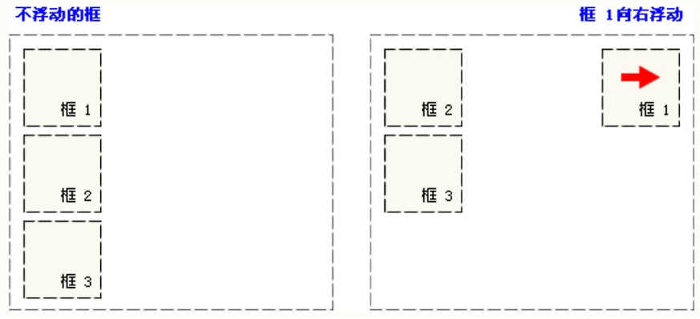

再请看下图，当框 1 向左浮动时，它脱离文档流并且向左移动，直到它的左边缘碰到包含框的左边缘。因为它不再处于文档流中，所以它不占据空间，实际上覆盖住了框 2，使框 2 从视图中消失

如果把所有三个框都向左移动，那么框 1 向左浮动直到碰到包含框，另外两个框向左浮动直到碰到前一个浮动框。

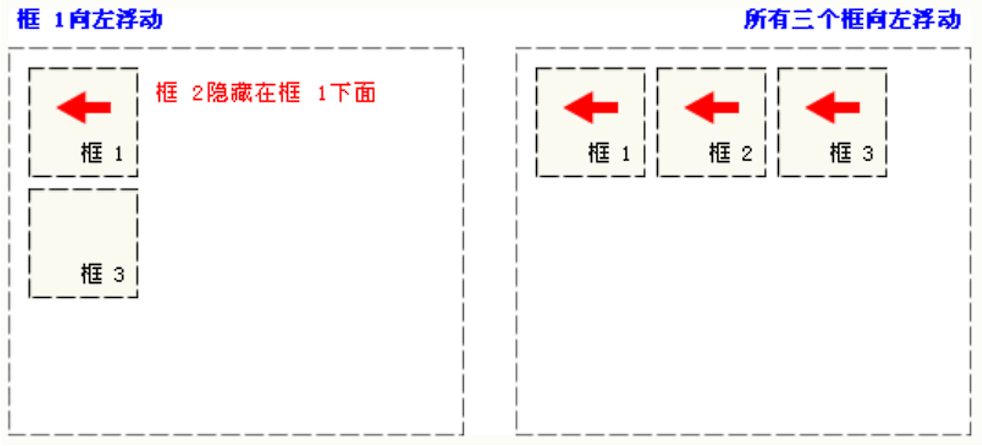

如下图所示，如果包含框太窄，无法容纳水平排列的三个浮动元素，那么其它浮动块向下移动，直到有足够的空间。如果浮动元素的高度不同，那么当它们向下移动时可能被其它浮动元素“卡住”：

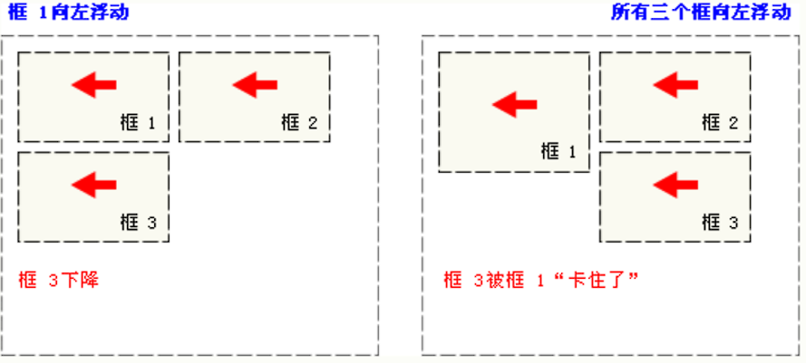

## 浮动语法

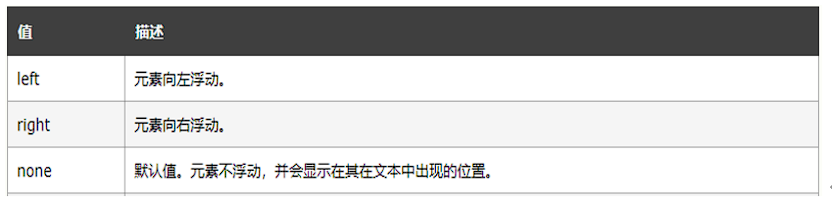

## 感受浮动

初始化3个div

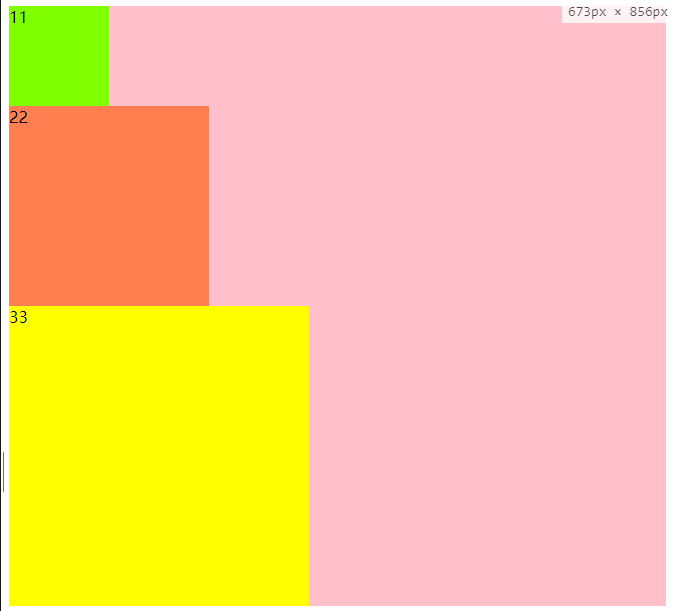

```html
<!DOCTYPE html>
<html>
  <head>
	<meta charset="UTF-8">
	<title></title>
  </head>
  <body>
	<!--外层div-->
	<div style="background-color: pink;">
	  <div style="width: 100px;height: 100px;background-color: chartreuse;">11</div>
	  <div style="width: 200px;height: 200px;background-color: coral;">22</div>
	  <div style="width: 300px;height: 300px;background-color: yellow">33</div>
	</div>
  </body>
</html>
```

然后先给绿色div加上浮动

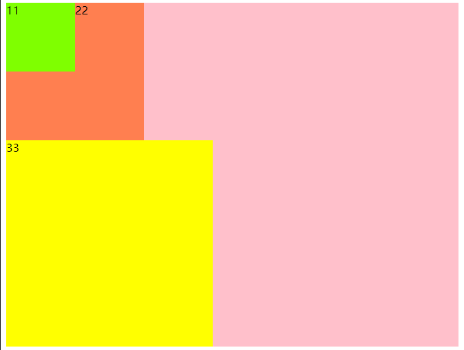

```html
<!DOCTYPE html>
<html>
  <head>
	<meta charset="UTF-8">
	<title></title>
  </head>
  <body>
	<!--外层div-->
	<div style="background-color: pink;">
	  <div style="width: 100px;height: 100px;background-color: chartreuse;float: left;">11</div>
	  <div style="width: 200px;height: 200px;background-color: coral;">22</div>
	  <div style="width: 300px;height: 300px;background-color: yellow">33</div>
	</div>
  </body>
</html>
```

再给橙色div添加浮动

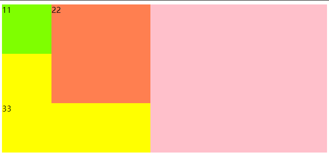

```html
<!DOCTYPE html>
<html>
  <head>
	<meta charset="UTF-8">
	<title></title>
  </head>
  <body>
	<!--外层div-->
	<div style="background-color: pink;">
	  <div style="width: 100px;height: 100px;background-color: chartreuse;float: left;">11</div>
	  <div style="width: 200px;height: 200px;background-color: coral;float: left;">22</div>
	  <div style="width: 300px;height: 300px;background-color: yellow">33</div>
	</div>
  </body>
</html>

```

再给黄色div设置浮动

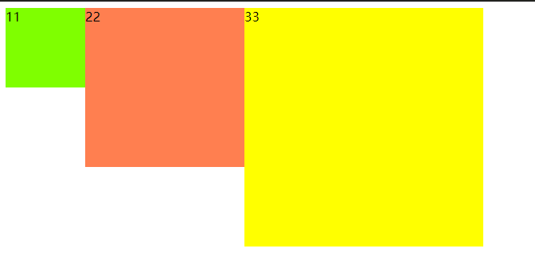
```html
<!DOCTYPE html>
<html>
  <head>
	<meta charset="UTF-8">
	<title></title>
  </head>
  <body>
	<!--外层div-->
	<div style="background-color: pink;">
	  <div style="width: 100px;height: 100px;background-color: chartreuse;float: left;">11</div>
	  <div style="width: 200px;height: 200px;background-color: coral;float: left;">22</div>
	  <div style="width: 300px;height: 300px;background-color: yellow;float: left;">33</div>
	</div>
  </body>
</html>
```

## 清除浮动

### 方式一 : overflow:hidden

给浮动的父节点加入一个属性`overflow:hidden`

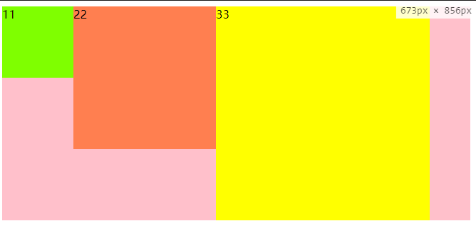

```html
<!DOCTYPE html>
<html>
  <head>
	<meta charset="UTF-8">
	<title></title>
  </head>
  <body>
	<!--外层div-->
	<div style="background-color: pink;overflow:hidden;">
	  <div style="width: 100px;height: 100px;background-color: chartreuse;float: left;">11</div>
	  <div style="width: 200px;height: 200px;background-color: coral;float: left;">22</div>
	  <div style="width: 300px;height: 300px;background-color: yellow;float: left;">33</div>
	</div>
  </body>
</html>
```

### 方式二: 改变父节点高度

给浮动的父节点加入高度,将他撑起来


```html
<!DOCTYPE html>
<html>
  <head>
	<meta charset="UTF-8">
	<title></title>
  </head>
  <body>
	<!--外层div-->
	<div style="background-color: pink;height: 400px;">
	  <div style="width: 100px;height: 100px;background-color: chartreuse;float: left;">11</div>
	  <div style="width: 200px;height: 200px;background-color: coral;float: left;">22</div>
	  <div style="width: 300px;height: 300px;background-color: yellow;float: left;">33</div>
	</div>
  </body>
</html>
```

### 方式三: clear: both

受影响的元素加入 `clear: both; `元素

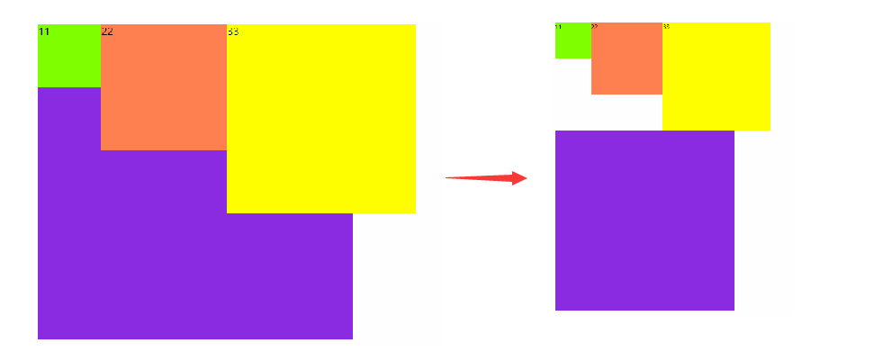

```html
<!DOCTYPE html>
<html>
  <head>
	<meta charset="UTF-8">
	<title></title>
  </head>
  <body>
	<!--外层div-->
	<div style="background-color: pink;">
	  <div style="width: 100px;height: 100px;background-color: chartreuse;float: left;">11</div>
	  <div style="width: 200px;height: 200px;background-color: coral;float: left;">22</div>
	  <div style="width: 300px;height: 300px;background-color: yellow;float: left;">33</div>
	</div>
	  <div style="width: 500px;height: 500px;background-color: blueviolet;clear: both;"></div>
  </body>
</html>
```
