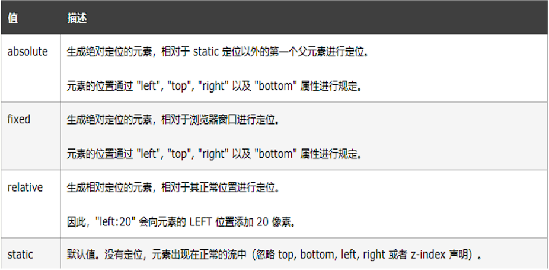
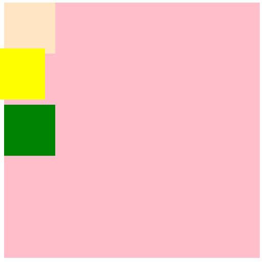
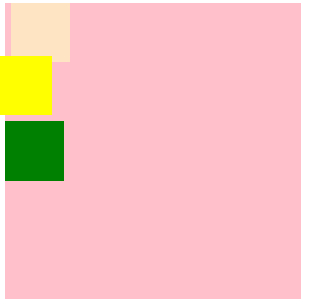
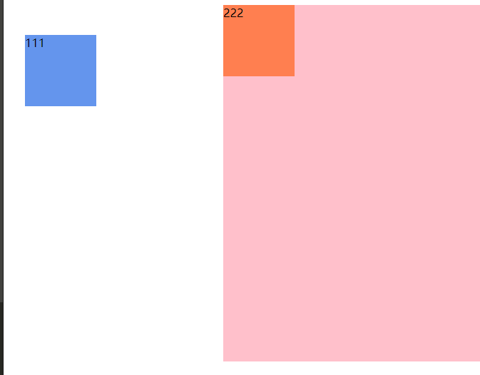
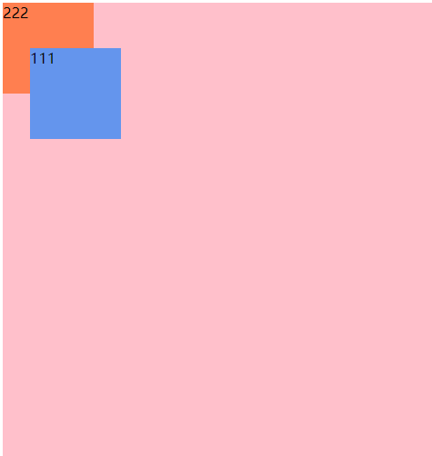
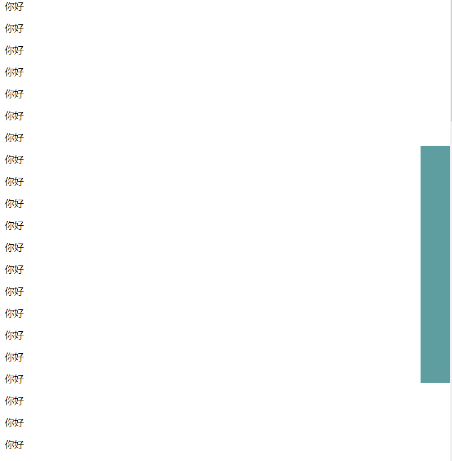

## 概述

`position` 属性指定了元素的定位类型



## 静态定位（static）


```html
<!DOCTYPE html>
<html>
  <head>
    <meta charset="UTF-8">
    <title></title>
  </head>
  <body>
    <!--静态定位：
      如果我们不写position属性的话，相当于默认效果就是静态定位。
        静态效果：就是元素出现在它本该出现的位置。一般使用静态定位可以直接省略不写。
    -->
    
  </body>
</html>
```

## 相对定位（relative）



```html
<!DOCTYPE html>
<html>
  <head>
    <meta charset="UTF-8">
    <title></title>
  </head>
  <body>
    <!--相对定位：
        相对元素自身所在的原来的位置进行定位。
        可以设置 left,right,top,bottom四个属性
        效果：在进行相对定位以后，元素原来所在的位置被保留了，被占用了--》保留站位其他元素的位置不会发生移动
        一般情况下，left和right不会同时使用  ,选择一个方向即可.top和bottom不会同时使用,选择一个方向即可
        优先级：左上>右下
    -->
    <div style="width: 500px;height: 500px;background-color: pink;">
      <div style="width: 100px;height: 100px;background-color: bisque;"></div>
      <div
        style="width: 100px;height: 100px;background-color: yellow;position: relative;bottom: 10px;right: 20px;">
      </div>
      <div style="width: 100px;height: 100px;background-color: green;"></div>
    </div>
  </body>
</html>
```

> 应用场合 :
> 1.  元素在小范围移动的时候
> 2. 结合绝对定位使用

## 堆叠顺序（z-index）

设置堆叠顺序，设置元素谁在上谁在下

> 注意 ：z-index属性要设置在定位的元素上,z-index值越大,层级越高,显示在上面



```html
<!DOCTYPE html>
<html>
  <head>
    <meta charset="UTF-8">
    <title></title>
  </head>
  <body>
    <!--相对定位：
      相对元素自身所在的原来的位置进行定位。
        可以设置 left,right,top,bottom四个属性
        效果：在进行相对定位以后，元素原来所在的位置被保留了，被占用了--》保留站位其他元素的位置不会发生移动
        一般情况下，left和right不会同时使用  ,选择一个方向即可.top和bottom不会同时使用,选择一个方向即可
        优先级：左上>右下
    -->
    <div style="width: 500px;height: 500px;background-color: pink;">
      <div style="width: 100px;height: 100px;background-color: bisque;position: relative;left: 10px;z-index: 10;">
      </div>
      <div
        style="width: 100px;height: 100px;background-color: yellow;position: relative;bottom: 10px;right: 20px;z-index: 90;">
      </div>
      <div style="width: 100px;height: 100px;background-color: green;"></div>
    </div>
  </body>
</html>
```

## 绝对定位（absolute）



```html
<!DOCTYPE html>
<html>
  <head>
    <meta charset="UTF-8">
    <title></title>
    <style type="text/css">
      #outer {
        width: 500px;
        height: 500px;
        background-color: pink;
        margin-left: 300px;
      }
      #div01 {
        width: 100px;
        height: 100px;
        background-color: cornflowerblue;
        position: absolute;
        left: 30px;
        top: 50px;
      }
      #div02 {
        width: 100px;
        height: 100px;
        background-color: coral;
      }
    </style>
  </head>
  <body>
    <div id="outer">
      <div id="div01">111</div>
      <div id="div02">222</div>
    </div>
  </body>
</html>
```

暂时来说看到的效果：蓝色div相对body产生的位移，相对body进行位置的改变，然后蓝色div发生位移以后，原位置得到了释放。橙色div移动上去了！

实际开发中，我们往往让蓝色div在粉色div中发生位移效果：



```html
<!DOCTYPE html>
<html>
  <head>
    <meta charset="UTF-8">
    <title></title>
    <style type="text/css">
      #outer {
        width: 500px;
        height: 500px;
        background-color: pink;
        margin-left: 300px;
        position: relative;
        /*直接设置一个相对定位*/
      }
      #div01 {
        width: 100px;
        height: 100px;
        background-color: cornflowerblue;
        position: absolute;
        left: 30px;
        top: 50px;
      }
      #div02 {
        width: 100px;
        height: 100px;
        background-color: coral;
      }
    </style>
  </head>
  <body>
    <div id="outer">
      <div id="div01">111</div>
      <div id="div02">222</div>
    </div>
  </body>
</html>
```

当给一个元素设置了绝对定位的时候，它相对谁变化呢？

它会向上一层一层的找父级节点是否有定位，如果直到找到body了也没有定位，那么就相对body进行变化，如果父级节点有定位（绝对定位，相对定位，固定定位），但是一般我们会配合使用父级为相对定位，当前元素为绝对定位，这样这个元素就会相对父级位置产生变化。无论是上面的哪一种，都会释放原来的位置，然后其他元素会占用那个位置。

> 开发中建议使用：**父级节点relative定位，子级节点使用绝对定位 **

## 固定定位（fixed）

应用场合：在页面过长的时候，将某个元素固定在浏览器的某个位置上，当拉动滚动条的时候，这个元素位置不动。&#x20;



```html
<!DOCTYPE html>
<html>
  <head>
    <meta charset="UTF-8">
    <title></title>
    <style type="text/css">
      #mydiv {
        width: 50px;
        height: 400px;
        background-color: cadetblue;
        /*固定定位*/
        position: fixed;
        right: 0px;
        top: 300px;
      }
    </style>
  </head>
  <body>
    <div id="mydiv"></div>
    <p>你好</p>
    <p>你好</p>
    <p>你好</p>
    <p>你好</p>
    <p>你好</p>
    <p>你好</p>
    <p>你好</p>
  </body>
</html>
```
