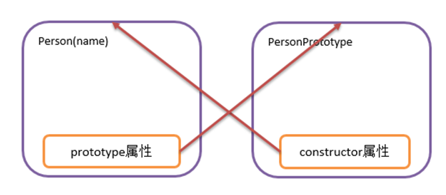
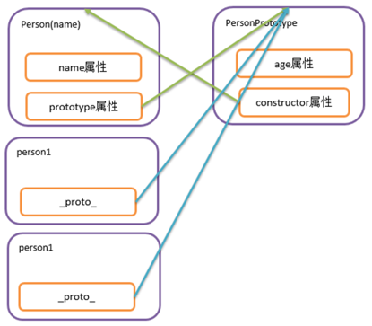
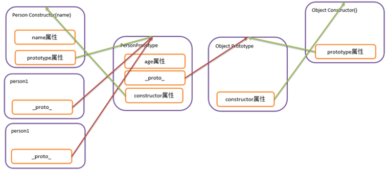

## 常用对象

JS基于对象的脚本语言 ,有类和对象,但是没有封装,继承,多态,

Java script 中有一些浏览器直接识别并使用的对象,常见的对象有`Array`,`String对象`,`Math对象`,`Number对象`,`Date对象`等等.

### String对象

#### 常用API

| **方法**              | **描述**                               |
| ------------------- | ------------------------------------ |
| charAt()            | 返回在指定位置的字符。                          |
| charCodeAt()        | 返回在指定的位置的字符的 Unicode 编码。             |
| concat()            | 连接两个或更多字符串，并返回新的字符串。                 |
| fromCharCode()      | 将 Unicode 编码转为字符。                    |
| indexOf()           | 返回某个指定的字符串值在字符串中首次出现的位置。             |
| includes()          | 查找字符串中是否包含指定的子字符串。                   |
| lastIndexOf()       | 从后向前搜索字符串，并从起始位置（0）开始计算返回字符串最后出现的位置。 |
| match()             | 查找找到一个或多个正则表达式的匹配。                   |
| repeat()            | 复制字符串指定次数，并将它们连接在一起返回。               |
| replace()           | 在字符串中查找匹配的子串， 并替换与正则表达式匹配的子串。        |
| search()            | 查找与正则表达式相匹配的值。                       |
| slice()             | 提取字符串的片断，并在新的字符串中返回被提取的部分。           |
| split()             | 把字符串分割为字符串数组。                        |
| startsWith()        | 查看字符串是否以指定的子字符串开头。                   |
| substr()            | 从起始索引号提取字符串中指定数目的字符。                 |
| substring()         | 提取字符串中两个指定的索引号之间的字符。                 |
| toLowerCase()       | 把字符串转换为小写。                           |
| toUpperCase()       | 把字符串转换为大写。                           |
| trim()              | 去除字符串两边的空白                           |
| toLocaleLowerCase() | 根据本地主机的语言环境把字符串转换为小写。                |
| toLocaleUpperCase() | 根据本地主机的语言环境把字符串转换为大写。                |
| valueOf()           | 返回某个字符串对象的原始值。                       |
| toString()          | 返回一个字符串。                             |

#### 案例

```javascript
// 根据索引获取字符
var str ="hello js";
var c =str.charAt(6);
console.log(c)//j

// 拼接字符串
var a = "hi";
var b = "good";
var c = "China";
var d = c.concat(a, b);
console.log(d)//Chinahigood

//复制字符串指定次数
var e = "adsf";
var f = e.repeat(3);
console.log(f)//adsfadsfadsf

// 截取字符串
var g = "helloJhon";
var h = g.substr(1, 5); // 从哪里开始,连续截取多少个字符
console.log(h)//elloJ
// 包头不包尾
var i = g.substring(1, 7); // 从哪里开始,到哪里结束
console.log(i)//elloJh

// 获取长度
console.log(g.length) // length属性  9


// JS中非常特殊的一个函数,可以将一段字符串当做JS代码来执行
// 将字符串内容解析称JS代码并运行
var testStr = " var x =10 ";
eval(testStr);
console.log(x)//10
```

### Number对象

#### 常用API

| **属性**                    | **描述**                              |
| ------------------------- | ----------------------------------- |
| Number.MAX\_VALUE         | 最大值                                 |
| Number.MIN\_VALUE         | 最小值                                 |
| Number.NaN                | 非数字                                 |
| Number.NEGATIVE\_INFINITY | 负无穷，在溢出时返回                          |
| Number.POSITIVE\_INFINITY | 正无穷，在溢出时返回                          |
| Number.EPSILON            | 表示 1 和比最接近 1 且大于 1 的最小 Number 之间的差别 |
| Number.MIN\_SAFE\_INTEGER | 最小安全整数。                             |
| Number.MAX\_SAFE\_INTEGER | 最大安全整数。                             |

| **方法**                 | **描述**                              |
| ---------------------- | ----------------------------------- |
| Number.parseFloat()    | 将字符串转换成浮点数，和全局方法 parseFloat() 作用一致。 |
| Number.parseInt()      | 将字符串转换成整型数字，和全局方法 parseInt() 作用一致。  |
| Number.isFinite()      | 判断传递的参数是否为有限数字。                     |
| Number.isInteger()     | 判断传递的参数是否为整数。                       |
| Number.isNaN()         | 判断传递的参数是否为 isNaN()。                 |
| Number.isSafeInteger() | 判断传递的参数是否为安全整数。                     |

#### 案例

```javascript
console.log(Number.MAX_VALUE)//1.7976931348623157e+308
console.log(Number.MIN_VALUE)//5e-324
console.log(Number.MAX_SAFE_INTEGER)//9007199254740991
console.log(Number.MIN_SAFE_INTEGER)//-9007199254740991

console.log(Number.parseFloat("10.123") + 20);//30.122999999999998
console.log(Number.parseInt("30") + 20);//50

var i = 10 % 0;
var j = 10 / 0;
console.log(i)//NaN
console.log(j)//Infinity
console.log(Number.isNaN(i)) // is not a number 是不是NAN   true
console.log(Number.isFinite(j))//false
console.log(Number.isSafeInteger(Number.MAX_VALUE))//false
console.log(Number.isSafeInteger(Number.MAX_SAFE_INTEGER))//true
```

### Match对象

#### 常用API

| 属性       | 描述                                       |
| -------- | ---------------------------------------- |
| E        | 返回算术常量 e，即自然对数的底数（约等于2.718）。             |
| LN2      | 返回 2 的自然对数（约等于0.693）。                    |
| LN10     | 返回 10 的自然对数（约等于2.302）。                   |
| LOG2E    | 返回以 2 为底的 e 的对数（约等于 1.4426950408889634）。 |
| LOG10E   | 返回以 10 为底的 e 的对数（约等于0.434）。              |
| PI       | 返回圆周率（约等于3.14159）。                       |
| SQRT1\_2 | 返回 2 的平方根的倒数（约等于 0.707）。                 |
| SQRT2    | 返回 2 的平方根（约等于 1.414）。                    |

| **方法**           | **描述**                                     |
| ---------------- | ------------------------------------------ |
| abs(x)           | 返回 x 的绝对值。                                 |
| acos(x)          | 返回 x 的反余弦值。                                |
| asin(x)          | 返回 x 的反正弦值。                                |
| atan(x)          | 以介于 -PI/2 与 PI/2 弧度之间的数值来返回 x 的反正切值。       |
| atan2(y,x)       | 返回从 x 轴到点 (x,y) 的角度（介于 -PI/2 与 PI/2 弧度之间）。 |
| ceil(x)          | 对数进行上舍入。                                   |
| cos(x)           | 返回数的余弦。                                    |
| exp(x)           | 返回 Ex 的指数。                                 |
| floor(x)         | 对 x 进行下舍入。                                 |
| log(x)           | 返回数的自然对数（底为e）。                             |
| max(x,y,z,...,n) | 返回 x,y,z,...,n 中的最高值。                      |
| min(x,y,z,...,n) | 返回 x,y,z,...,n中的最低值。                       |
| pow(x,y)         | 返回 x 的 y 次幂。                               |
| random()         | 返回 0 \~ 1 之间的随机数。                          |
| round(x)         | 四舍五入。                                      |
| sin(x)           | 返回数的正弦。                                    |
| sqrt(x)          | 返回数的平方根。                                   |
| tan(x)           | 返回角的正切。                                    |
| tanh(x)          | 返回一个数的双曲正切函数值。                             |
| trunc(x)         | 将数字的小数部分去掉，只保留整数部分。                        |

#### 案例

```javascript
console.log(Number.MAX_VALUE)//1.7976931348623157e+308
console.log(Number.MIN_VALUE)//5e-324
console.log(Number.MAX_SAFE_INTEGER)//9007199254740991
console.log(Number.MIN_SAFE_INTEGER)//-9007199254740991

console.log(Number.parseFloat("10.123") + 20);//30.122999999999998
console.log(Number.parseInt("30") + 20);//50

var i = 10 % 0;
var j = 10 / 0;
console.log(i)//NaN
console.log(j)//Infinity
console.log(Number.isNaN(i)) // is not a number 是不是NAN   true
console.log(Number.isFinite(j))//false
console.log(Number.isSafeInteger(Number.MAX_VALUE))//false
console.log(Number.isSafeInteger(Number.MAX_SAFE_INTEGER))//true
```

### Date对象

#### 创建Date对象

```javascript
var d = new Date();
var d = new Date(milliseconds);
var d = new Date(dateString);
var d = new Date(year, month, day, hours, minutes, seconds, milliseconds);

```

#### 常用API

| **方法名**              | **方法描述**                                                                                            |
| -------------------- | --------------------------------------------------------------------------------------------------- |
| getDate()            | 从 Date 对象返回一个月中的某一天 (1 \~ 31)。                                                                      |
| getDay()             | 从 Date 对象返回一周中的某一天 (0 \~ 6)。                                                                        |
| getFullYear()        | 从 Date 对象以四位数字返回年份。                                                                                 |
| getHours()           | 返回 Date 对象的小时 (0 \~ 23)。                                                                            |
| getMilliseconds()    | 返回 Date 对象的毫秒(0 \~ 999)。                                                                            |
| getMinutes()         | 返回 Date 对象的分钟 (0 \~ 59)。                                                                            |
| getMonth()           | 从 Date 对象返回月份 (0 \~ 11)。                                                                            |
| getSeconds()         | 返回 Date 对象的秒数 (0 \~ 59)。                                                                            |
| getTime()            | 返回 1970 年 1 月 1 日至今的毫秒数。                                                                            |
| getTimezoneOffset()  | 返回本地时间与格林威治标准时间 (GMT) 的分钟差。                                                                         |
| getUTCDate()         | 根据世界时从 Date 对象返回月中的一天 (1 \~ 31)。                                                                    |
| getUTCDay()          | 根据世界时从 Date 对象返回周中的一天 (0 \~ 6)。                                                                     |
| getUTCFullYear()     | 根据世界时从 Date 对象返回四位数的年份。                                                                             |
| getUTCHours()        | 根据世界时返回 Date 对象的小时 (0 \~ 23)。                                                                       |
| getUTCMilliseconds() | 根据世界时返回 Date 对象的毫秒(0 \~ 999)。                                                                       |
| getUTCMinutes()      | 根据世界时返回 Date 对象的分钟 (0 \~ 59)。                                                                       |
| getUTCMonth()        | 根据世界时从 Date 对象返回月份 (0 \~ 11)。                                                                       |
| getUTCSeconds()      | 根据世界时返回 Date 对象的秒钟 (0 \~ 59)。                                                                       |
| getYear()            | 已废弃。 请使用 getFullYear() 方法代替。                                                                        |
| parse()              | 返回1970年1月1日午夜到指定日期（字符串）的毫秒数。                                                                        |
| setDate()            | 设置 Date 对象中月的某一天 (1 \~ 31)。                                                                         |
| setFullYear()        | 设置 Date 对象中的年份（四位数字）。                                                                               |
| setHours()           | 设置 Date 对象中的小时 (0 \~ 23)。                                                                           |
| setMilliseconds()    | 设置 Date 对象中的毫秒 (0 \~ 999)。                                                                          |
| setMinutes()         | 设置 Date 对象中的分钟 (0 \~ 59)。                                                                           |
| setMonth()           | 设置 Date 对象中月份 (0 \~ 11)。                                                                            |
| setSeconds()         | 设置 Date 对象中的秒钟 (0 \~ 59)。                                                                           |
| setTime()            | setTime() 方法以毫秒设置 Date 对象。                                                                          |
| setUTCDate()         | 根据世界时设置 Date 对象中月份的一天 (1 \~ 31)。                                                                    |
| setUTCFullYear()     | 根据世界时设置 Date 对象中的年份（四位数字）。                                                                          |
| setUTCHours()        | 根据世界时设置 Date 对象中的小时 (0 \~ 23)。                                                                      |
| setUTCMilliseconds() | 根据世界时设置 Date 对象中的毫秒 (0 \~ 999)。                                                                     |
| setUTCMinutes()      | 根据世界时设置 Date 对象中的分钟 (0 \~ 59)。                                                                      |
| setUTCMonth()        | 根据世界时设置 Date 对象中的月份 (0 \~ 11)。                                                                      |
| setUTCSeconds()      | setUTCSeconds() 方法用于根据世界时 (UTC) 设置指定时间的秒字段。                                                         |
| setYear()            | 已废弃。请使用 setFullYear() 方法代替。                                                                         |
| toDateString()       | 把 Date 对象的日期部分转换为字符串。                                                                               |
| toGMTString()        | 已废弃。请使用 toUTCString() 方法代替。                                                                         |
| toISOString()        | 使用 ISO 标准返回字符串的日期格式。                                                                                |
| toJSON()             | 以 JSON 数据格式返回日期字符串。                                                                                 |
| toLocaleDateString() | 根据本地时间格式，把 Date 对象的日期部分转换为字符串。                                                                      |
| toLocaleTimeString() | 根据本地时间格式，把 Date 对象的时间部分转换为字符串。                                                                      |
| toLocaleString()     | 根据本地时间格式，把 Date 对象转换为字符串。                                                                           |
| toString()           | 把 Date 对象转换为字符串。                                                                                    |
| toTimeString()       | 把 Date 对象的时间部分转换为字符串。                                                                               |
| toUTCString()        | 根据世界时，把 Date 对象转换为字符串。&#xA;实例：&#xA;var today = new Date();&#xA;var UTCstring = today.toUTCString(); |
| UTC()                | 根据世界时返回 1970 年 1 月 1 日 到指定日期的毫秒数。                                                                   |
| valueOf()            | 返回 Date 对象的原始值。                                                                                     |

#### 案例

```javascript
/*
 * 在程序中 西方的月份编号从0开始
 * 1 2 3 4 5 6 
 * 0 1 2 3 4 5
 * */
var today = new Date()
var d1 = new Date("October 13, 1975 11:13:00")
var d2 = new Date(79, 5, 24)
var d3 = new Date(79, 5, 24, 11, 33, 0)
console.log(d1);//Mon Oct 13 1975 11:13:00 GMT+0800 (中国标准时间)
console.log(d2);//Sun Jun 24 1979 00:00:00 GMT+0800 (中国标准时间)
console.log(d3);//Sun Jun 24 1979 11:33:00 GMT+0800 (中国标准时间)


var d4 = new Date(2048, 0, 13, 16, 51, 20, 123)
console.log(d4)//Mon Jan 13 2048 16:51:20 GMT+0800 (中国标准时间)
// set***  略自己尝试一下
console.log(d4.getYear()); // 148
console.log(d4.getFullYear()); // 2048
console.log(d4.getMonth());//0
console.log(d4.getDate());//13
console.log(d4.getHours());//16
console.log(d4.getMinutes());//51
console.log(d4.getSeconds());//20
console.log(d4.getMilliseconds());//123
var d5 = new Date(2048, 0, 13, 16, 51, 20, 456)
console.log(d4 < d5)//true

```

#### 日期对象格式化处理

```javascript
// 关于日期对象格式化处理
/*date对象的格式化方法*/
/*修改Date原型,添加一个format格式化的方法*/
Date.prototype.format = function(fmt) {
  var o = {
    "M+": this.getMonth() + 1, //月份
    "d+": this.getDate(), //日
    "h+": this.getHours(), //小时
    "m+": this.getMinutes(), //分
    "s+": this.getSeconds(), //秒
    "q+": Math.floor((this.getMonth() + 3) / 3), //季度
    "S": this.getMilliseconds() //毫秒
  };

  if (/(y+)/.test(fmt)) {
    fmt = fmt.replace(RegExp.$1, (this.getFullYear() + "").substr(4 - RegExp.$1.length));
  }

  for (var k in o) {
    if (new RegExp("(" + k + ")").test(fmt)) {
      fmt = fmt.replace(
        RegExp.$1, (RegExp.$1.length == 1) ? (o[k]) : (("00" + o[k]).substr(("" + o[k]).length)));
    }
  }
  return fmt;
}


var fmt = d4.format("yyyy-MM-dd hh:mm:ss");
console.log(fmt)//2048-01-13 16:51:20
```

## 自定义对象

JS除了一些常用方法和类以外,允许我们自己定义对象,在JS中自定义对象有三种可用的语法格式,分别为:

### 第一种语法:调用系统的构造函数创建对象(Object)

```javascript
// 实例化对象
var obj = new Object();
// 给对象添加属性
obj.name = "张三";
obj.age = 35;
obj.gender = "男";
// 给对象添加方法
obj.eat = function(food) {
 console.log(this.name + "正在吃" + food)
}

// 查看对象属性
console.log(obj.name);//张三
console.log(obj.age);//35
console.log(obj.gender);//男
// 调用对象方法
obj.eat("蛋糕");//张三正在吃蛋糕

```

### 第二种语法: 自定义构造函数创建对象(function)

```javascript
// 准备一个构造方法 
function Person(pname, page) {
  this.pname = pname;
  this.page = page;

  this.eat = function(food) {
    console.log(this.page + "岁的" + this.pname + "正在吃" + food);
  }
}

var p1 = new Person("张三", 10);
// 查看对象属性
console.log(p1.pname);//张三
console.log(p1.page);//10
// 调用对象方法
p1.eat("油条");//10岁的张三正在吃油条

```

### 第三种语法: 字面量的方式创建对象(JSON)

```javascript
/*  JSON 
  var 对象名 ={属性名:属性值,属性名:属性值, ... ... ,方法名:方法声明,方法名:方法声明}
*/
var person = {
  name: "晓明",
  gender: "男",
  age: 10,
  eat: function(food) {
    console.log(this.age + "岁的" + this.gender + "孩儿" + this.name + "正在吃" + food)
  }
};

// 查看对象属性
// 调用对象方法
console.log(person.name)
console.log(person.gender)
console.log(person.age)
person.eat("馒头")

```

## 原型

### 获取原型对象

当我们用构造方法创建一个类时,在内存会预先调用构造方法创建一个对象,这对象我们称之为`原型对象`,构造方法对象中有一个`prototype属性`指向该对象,原型对象中有一个`constructor属性`指向构造方法.获得一个类的原型对象可以通过类名`.prototype`的方式获得.



```javascript
  // 准备一个构造方法
  function Person(pname, page) {
    this.pname = pname;
    this.page = page;

    this.eat = function(food) {
      console.log(this.page + "岁的" + this.pname + "正在吃" + food);
    }
  }

  console.log(Person) // Constructor对象 构造方法对象
  console.log(Person.prototype)
```

### 当前类对象和原型的关系

当前类的每一个对象内部有一个` _proto_`的一个属性,指向他们的原型, 当我们用对象获取属性和调用方法时,如果当前对象中没有,那么会去他们所对应的原型对象中去找,**也就是说,我们通过对原型的操作可以实现为一个类所有的对象添加属性和方法.**



```javascript
  // 准备一个构造方法 
  function Person(pname, page) {
    this.pname = pname;
    this.page = page;

    this.eat = function(food) {
      console.log(this.page + "岁的" + this.pname + "正在吃" + food);
    }
  }

  console.log(Person) // Constructor对象  构造方法对象
  console.log(Person.prototype)
  
  // 给Person所有的对象增加属性和方法
  //给Person的原型增加属性
  Person.prototype.gender = "男";
  //给Person的原型增加一个方法
  Person.prototype.sleep = function() {
    console.log(this.page + "岁的" + this.gender + "孩儿" + this.pname + "正在睡觉");
  }
  var p1 = new Person("张三", 10);
  p1.eat("蛋挞")//10岁的张三正在吃蛋挞
  p1.sleep();//10岁的男孩儿张三正在睡觉

  var p2 = new Person("李四", 8);
  p2.eat("牛角面包")//8岁的李四正在吃牛角面包
  p2.sleep()//8岁的男孩儿李四正在睡觉


  console.log(p1);
  console.log(p2);
```

### 原型链

一个类的原型是一个Object类的对象,也就是说 ,**原型也有一个_proto_属性,指向Object的原型对象**,那么也就是说`Person.prototype`中没有的属性和方法会继续向`Object .prototype`去找,也就是说,我们在Object原型中添加的属性和方法,我们在`person1`和`person2`中也可以使用.那么这种连续的 `_proto_属性`指向就形成了原型链



```javascript
  // 准备一个构造方法 
  function Person(pname, page) {
    this.pname = pname;
    this.page = page;
    this.eat = function(food) {
      console.log(this.page + "岁的" + this.pname + "正在吃" + food);
    }
  }

  // 给所有的对象增加属性和方法
  //给最终原型增加属性
  Object.prototype.gender = "男";
  //给Person的原型增加一个方法
  Object.prototype.sleep = function() {
    console.log(this.page + "岁的" + this.gender + "孩儿" + this.pname + "正在睡觉");
  }
  var p1 = new Person("张三", 10);
  p1.eat("蛋挞")//10岁的张三正在吃蛋挞
  p1.sleep();//10岁的男孩儿张三正在睡觉
  
  var p2 = new Person("李四", 8);
  p2.eat("牛角面包")//8岁的李四正在吃牛角面包
  p2.sleep()//8岁的男孩儿李四正在睡觉
  
  console.log(p1);
  console.log(p2);
```
