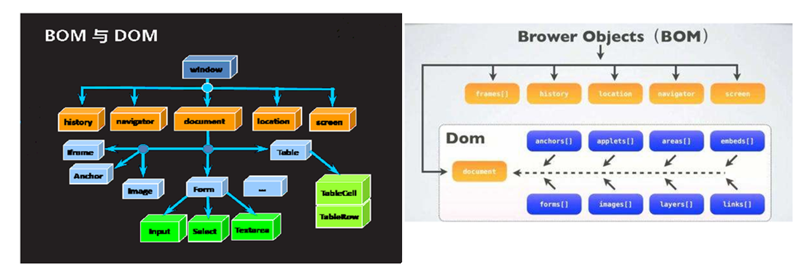
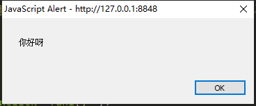
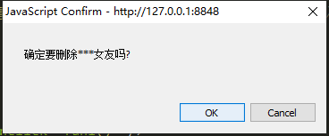
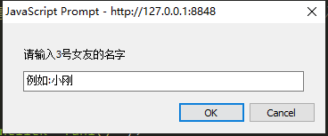

## 概述

### 认识BOM和DOM

#### 什么是BOM

BOM是**B**rowser**O**bject **M**odel的简写，即浏览器对象模型。

BOM有一系列对象组成，是访问、控制、修改浏览器的属性的方法
BOM没有统一的标准(每种客户端都可以自定标准)。
BOM的顶层是window对象

#### 什么是DOM

DOM是**D**ocument**O**bject **M**odel的简写，即文档对象模型。

DOM用于XHTML、XML文档的应用程序接口(API)。
DOM提供一种结构化的文档描述方式，从而使HTML内容使用结构化的方式显示。
DOM由一系列对象组成，是访问、检索、修改XHTML文档内容与结构的标准方法。
DOM标准是由w3c制定与维护。DOM是跨平台与跨语言的。
DOM的顶层是document对象


在上图中 , **红色框内是归DOM**，**绿色框内归BOM**；也可以说**DOM也是归BOM管的**

### BOM与DOM的关系



**BOM编程**  就是把整个浏览器抽象成一个对象(window),这个对象中有很多的属性和方法,访问这些属性或者调用这些方法就可以控制浏览器作出指定的行为 ;  **BOM 是为了操作浏览器出现的 API，window 是其根对象**

**DOM编程`**  就是把浏览器当前页面对应的文档抽象成一个对象(document),这个对象中有很多关于操作文档的一些属性和方法,访问这些属性和方法的时候,我们就可以通过代码动态控制页面上显示的内容;   **DOM 是为了操作文档出现的 API，document 是其根对象**

## Window对象及常用方法

### 什么是Window对象

Window 对象简单理解就是把浏览器抽象成一个对象,它表示一个浏览器窗口或一个框架。

在客户端 JavaScript中 ，**Window 对象是全局对象，所有的表达式都在当前的环境中计算**。也就是说，要引用当前窗口根本不需要特殊的语法，可以把那个窗口的属性作为全局变量来使用。例如，可以只写`document`，而不必写 `window.document`。同样，可以把当前窗口对象的方法当作函数来使用，如只写`alert()`，而不必写 `Window.alert()`

除了上面列出的属性和方法，**Window 对象还实现了核心 JavaScript 所定义的所有全局属性和方法**。Window 对象的 `window `属性和 `self `属性引用的都是它自己。当你想明确地引用当前窗口，而不仅仅是隐式地引用它时，可以使用这两个属性。除了这两个属性之外，`parent `属性、`top `属性以及`frame[]`数组都引用了与当前` Window 对象`相关的其他 `Window对象`。

### Window对象属性

| **属性**                                                                                       | **描述**                                                                                                  |
| -------------------------------------------------------------------------------------------- | ------------------------------------------------------------------------------------------------------- |
| [closed](https://www.runoob.com/jsref/prop-win-closed.html "closed")                         | 返回窗口是否已被关闭。                                                                                             |
| [defaultStatus](https://www.runoob.com/jsref/prop-win-defaultstatus.html "defaultStatus")    | 设置或返回窗口状态栏中的默认文本。                                                                                       |
| [document](https://www.runoob.com/jsref/dom-obj-document.html "document")                    | 对 Document 对象的只读引用。(请参阅[对象](https://www.runoob.com/jsref/dom-obj-document.html "对象"))                   |
| [frames](https://www.runoob.com/jsref/prop-win-frames.html "frames")                         | 返回窗口中所有命名的框架。该集合是 Window 对象的数组，每个 Window 对象在窗口中含有一个框架。                                                  |
| [history](https://www.runoob.com/jsref/obj-history.html "history")                           | 对 History 对象的只读引用。请参数 [History 对象](https://www.runoob.com/jsref/obj-history.html "History 对象")。         |
| [innerHeight](https://www.runoob.com/jsref/prop-win-innerheight.html "innerHeight")          | 返回窗口的文档显示区的高度。                                                                                          |
| [innerWidth](https://www.runoob.com/jsref/prop-win-innerheight.html "innerWidth")            | 返回窗口的文档显示区的宽度。                                                                                          |
| [localStorage](https://www.runoob.com/jsref/prop-win-localstorage.html "localStorage")       | 在浏览器中存储 key/value 对。没有过期时间。                                                                             |
| [length](https://www.runoob.com/jsref/prop-win-length.html "length")                         | 设置或返回窗口中的框架数量。                                                                                          |
| [location](https://www.runoob.com/jsref/obj-location.html "location")                        | 用于窗口或框架的 Location 对象。请参阅 [Location 对象](https://www.runoob.com/jsref/obj-location.html "Location 对象")。   |
| [name](https://www.runoob.com/jsref/prop-win-name.html "name")                               | 设置或返回窗口的名称。                                                                                             |
| [navigator](https://www.runoob.com/jsref/obj-navigator.html "navigator")                     | 对 Navigator 对象的只读引用。请参数 [Navigator 对象](https://www.runoob.com/jsref/obj-navigator.html "Navigator 对象")。 |
| [opener](https://www.runoob.com/jsref/prop-win-opener.html "opener")                         | 返回对创建此窗口的窗口的引用。                                                                                         |
| [outerHeight](https://www.runoob.com/jsref/prop-win-outerheight.html "outerHeight")          | 返回窗口的外部高度，包含工具条与滚动条。                                                                                    |
| [outerWidth](https://www.runoob.com/jsref/prop-win-outerheight.html "outerWidth")            | 返回窗口的外部宽度，包含工具条与滚动条。                                                                                    |
| [pageXOffset](https://www.runoob.com/jsref/prop-win-pagexoffset.html "pageXOffset")          | 设置或返回当前页面相对于窗口显示区左上角的 X 位置。                                                                             |
| [pageYOffset](https://www.runoob.com/jsref/prop-win-pagexoffset.html "pageYOffset")          | 设置或返回当前页面相对于窗口显示区左上角的 Y 位置。                                                                             |
| [parent](https://www.runoob.com/jsref/prop-win-parent.html "parent")                         | 返回父窗口。                                                                                                  |
| [screen](https://www.runoob.com/jsref/obj-screen.html "screen")                              | 对 Screen 对象的只读引用。请参数 [Screen 对象](https://www.runoob.com/jsref/obj-screen.html "Screen 对象")。             |
| [screenLeft](https://www.runoob.com/jsref/prop-win-screenleft.html "screenLeft")             | 返回相对于屏幕窗口的x坐标                                                                                           |
| [screenTop](https://www.runoob.com/jsref/prop-win-screenleft.html "screenTop")               | 返回相对于屏幕窗口的y坐标                                                                                           |
| [screenX](https://www.runoob.com/jsref/prop-win-screenx.html "screenX")                      | 返回相对于屏幕窗口的x坐标                                                                                           |
| [sessionStorage](https://www.runoob.com/jsref/prop-win-sessionstorage.html "sessionStorage") | 在浏览器中存储 key/value 对。 在关闭窗口或标签页之后将会删除这些数据。                                                               |
| [screenY](https://www.runoob.com/jsref/prop-win-screenx.html "screenY")                      | 返回相对于屏幕窗口的y坐标                                                                                           |
| [self](https://www.runoob.com/jsref/prop-win-self.html "self")                               | 返回对当前窗口的引用。等价于 Window 属性。                                                                               |
| [status](https://www.runoob.com/jsref/prop-win-status.html "status")                         | 设置窗口状态栏的文本。                                                                                             |
| [top](https://www.runoob.com/jsref/prop-win-top.html "top")                                  | 返回最顶层的父窗口。                                                                                              |

### Window对象方法

| **方法**                                                                                              | **描述**                                                                                             |
| --------------------------------------------------------------------------------------------------- | -------------------------------------------------------------------------------------------------- |
| [alert()](https://www.runoob.com/jsref/met-win-alert.html "alert()")                                | 显示带有一段消息和一个确认按钮的警告框。                                                                               |
| [atob()](https://www.runoob.com/jsref/met-win-atob.html "atob()")                                   | 解码一个 base-64 编码的字符串。                                                                               |
| [btoa()](https://www.runoob.com/jsref/met-win-btoa.html "btoa()")                                   | 创建一个 base-64 编码的字符串。                                                                               |
| [blur()](https://www.runoob.com/jsref/met-win-blur.html "blur()")                                   | 把键盘焦点从顶层窗口移开。                                                                                      |
| [clearInterval()](https://www.runoob.com/jsref/met-win-clearinterval.html "clearInterval()")        | 取消由 setInterval() 设置的 timeout。                                                                     |
| [clearTimeout()](https://www.runoob.com/jsref/met-win-cleartimeout.html "clearTimeout()")           | 取消由 setTimeout() 方法设置的 timeout。                                                                    |
| [close()](https://www.runoob.com/jsref/met-win-close.html "close()")                                | 关闭浏览器窗口。                                                                                           |
| [confirm()](https://www.runoob.com/jsref/met-win-confirm.html "confirm()")                          | 显示带有一段消息以及确认按钮和取消按钮的对话框。                                                                           |
| [createPopup()](https://www.runoob.com/jsref/met-win-createpopup.html "createPopup()")              | 创建一个 pop-up 窗口。                                                                                    |
| [focus()](https://www.runoob.com/jsref/met-win-focus.html "focus()")                                | 把键盘焦点给予一个窗口。                                                                                       |
| getSelection()                                                                                      | 返回一个 Selection 对象，表示用户选择的文本范围或光标的当前位置。                                                             |
| [getComputedStyle()](https://www.runoob.com/jsref/jsref-getcomputedstyle.html "getComputedStyle()") | 获取指定元素的 CSS 样式。                                                                                    |
| [matchMedia()](https://www.runoob.com/jsref/met-win-matchmedia.html "matchMedia()")                 | 该方法用来检查 media query 语句，它返回一个 MediaQueryList对象。                                                     |
| [moveBy()](https://www.runoob.com/jsref/met-win-moveby.html "moveBy()")                             | 可相对窗口的当前坐标把它移动指定的像素。                                                                               |
| [moveTo()](https://www.runoob.com/jsref/met-win-moveto.html "moveTo()")                             | 把窗口的左上角移动到一个指定的坐标。                                                                                 |
| [open()](https://www.runoob.com/jsref/met-win-open.html "open()")                                   | 打开一个新的浏览器窗口或查找一个已命名的窗口。                                                                            |
| [print()](https://www.runoob.com/jsref/met-win-print.html "print()")                                | 打印当前窗口的内容。                                                                                         |
| [prompt()](https://www.runoob.com/jsref/met-win-prompt.html "prompt()")                             | 显示可提示用户输入的对话框。                                                                                     |
| [resizeBy()](https://www.runoob.com/jsref/met-win-resizeby.html "resizeBy()")                       | 按照指定的像素调整窗口的大小。                                                                                    |
| [resizeTo()](https://www.runoob.com/jsref/met-win-resizeto.html "resizeTo()")                       | 把窗口的大小调整到指定的宽度和高度。                                                                                 |
| scroll()                                                                                            | 已废弃。 该方法已经使用了 [scrollTo()](https://www.runoob.com/jsref/met-win-scrollto.html "scrollTo()") 方法来替代。 |
| [scrollBy()](https://www.runoob.com/jsref/met-win-scrollby.html "scrollBy()")                       | 按照指定的像素值来滚动内容。                                                                                     |
| [scrollTo()](https://www.runoob.com/jsref/met-win-scrollto.html "scrollTo()")                       | 把内容滚动到指定的坐标。                                                                                       |
| [setInterval()](https://www.runoob.com/jsref/met-win-setinterval.html "setInterval()")              | 按照指定的周期（以毫秒计）来调用函数或计算表达式。                                                                          |
| [setTimeout()](https://www.runoob.com/jsref/met-win-settimeout.html "setTimeout()")                 | 在指定的毫秒数后调用函数或计算表达式。                                                                                |
| [stop()](https://www.runoob.com/jsref/met-win-stop.html "stop()")                                   | 停止页面载入。                                                                                            |

### Window弹窗

#### 普通弹窗



```html
<!DOCTYPE html>
<html>
  <head>
    <meta charset="UTF-8">
    <title></title>
    <script>
      function fun1() {
        /*
         * 如果是使用window对象调用的方法和访问的属性 那么window对象都可以省略不写
         * 
         * */
        window.alert("你好呀"); //普通信息提示框
      }
    </script>
  </head>
  <body>
    <input type="button" value="测试按钮" onclick="fun1()" />
  </body>
</html>

```

#### 确认弹窗



```html
<!DOCTYPE html>
<html>
  <head>
    <meta charset="UTF-8">
    <title></title>
    <script>
      function fun1() {
        /*
         * 如果是使用window对象调用的方法和访问的属性 那么window对象都可以省略不写
         * 
         * */
        var con = window.confirm("确定要删除***女友吗?"); // 确认框
        console.log(con);
      }
    </script>
  </head>
  <body>
    <input type="button" value="测试按钮" onclick="fun1()" />
  </body>
</html>

```

#### 消息输入弹窗



```html
<!DOCTYPE html>
<html>
  <head>
    <meta charset="UTF-8">
    <title></title>
    <script>
      function fun1() {
        /*
         * 如果是使用window对象调用的方法和访问的属性 那么window对象都可以省略不写
         * 
         * */
        var message = window.prompt("请输入3号女友的名字", "例如:小刚"); // 信息输入框
        console.log(message)
      }
    </script>
  </head>
  <body>
    <input type="button" value="测试按钮" onclick="fun1()" />
  </body>
</html>

```

### 定时器

#### 循环执行任务

```html
<!DOCTYPE html>
<html>
  <head>
    <meta charset="UTF-8">
    <title></title>
    <script>
      var intervalIDS = new Array(); // [1,2,3 ]
      // 循环执行的定时器任务
      function startInterval() {
        // 2
        var intervalID = window.setInterval(
          function() {
            var today = new Date();
            var hours = today.getHours();
            var minutes = today.getMinutes();
            var seconds = today.getSeconds();
            var str = hours + "点" + minutes + "分" + seconds + "秒";

            var ta = document.getElementById("timeArea");
            ta.value = str;
          },
          1000
        );
        intervalIDS.push(intervalID);
      }

      function stopInterval() {
        while (intervalIDS.length > 0) {
          window.clearInterval(intervalIDS.shift());
        }
      }
    </script>
  </head>
  <body>
    <input type="text" id="timeArea" /> <br />
    <input type="button" value="开始Interval" onclick="startInterval()" />
    <input type="button" value="结束Interval" onclick="stopInterval()" />
  </body>
</html>
```

#### 执行一次任务

```html
<!DOCTYPE html>
<html>
  <head>
    <meta charset="UTF-8">
    <title></title>
    <script>
      var timeoutIDS = new Array();
      // 执行一次的定时器任务
      function startTimeout() {
        var timeoutID = window.setTimeout(
          function() {
            var today = new Date();
            var hours = today.getHours();
            var minutes = today.getMinutes();
            var seconds = today.getSeconds();
            var str = hours + "点" + minutes + "分" + seconds + "秒";
            console.log(str)

          },
          5000
        );
        timeoutIDS.push(timeoutID);
      }

      function stopTimeout() {
        while (timeoutIDS.length > 0) {
          window.clearTimeout(timeoutIDS.shift());
        }
      }
    </script>
  </head>
  <body>
    <input type="text" id="timeArea" /> <br />
    <input type="button" value="开始timeout" onclick="startTimeout()" />
    <input type="button" value="结束timeout" onclick="stopTimeout()" />
  </body>
</html>
```

### open与**close**方法

```html
<!DOCTYPE html>
<html>
  <head>
    <meta charset="UTF-8">
    <title></title>
    <script>
      function fun1() {
        window.open("https://www.baidu.com")
      }

      function fun2() {
        window.close();
      }
    </script>
  </head>
  <body>
    <input type="button" value="打开百度" onclick="fun1()" />
    <input type="button" value="关闭页面" onclick="fun2()" />
  </body>
</html>

```

## BOM中其他对象

### location对象

location对象,是window对象的一个属性,**代表浏览器上URL地址栏**,使用location对象可以操作地址栏&#x20;

```html
<!DOCTYPE html>
<html>
  <head>
    <meta charset="UTF-8">
    <title></title>
    <script>
      function fun1() {
        console.log(location.host); // 当前地址栏中的:服务器的IP+端口号
        console.log(location.hostname); // 当前地址栏中的:IP 
        console.log(location.port); // 当前地址栏中的:端口号
        console.log(location.href); // 当前地址栏中的:地址栏中具体的文字

        location.href = "https://www.baidu.com" //跳转到指定地址
      }
    </script>
  </head>
  <body>
    <input type="button" value="测试location" onclick="fun1()" />
  </body>
</html>

```

### history对象

history对象是window对象的一个属性,**代表浏览器访问历史记录**,通过history的操作我们可以实现翻阅浏览器历史网页&#x20;

```html
<!DOCTYPE html>
<html>
  <head>
    <meta charset="UTF-8">
    <title></title>
    <script>
    //上一页
      function fun1() {
        window.history.forward();
      }
      
      //下一页
      function fun2() {
        history.back();
      }

      //跳转
      function fun3() {
        history.go(2); // 正整数 向前跳转 * 页  负整数 向后跳转*页
      }
    </script>
  </head>
  <body>
    <a href="a.html" target="_self">pageA</a>
    <input type="button" value="向前" onclick="fun1()" />
    <input type="button" value="向后" onclick="fun2()" />
    <input type="button" value="go" onclick="fun3()" />

  </body>
</html>


```

### screen对象和navigator对象

**screen代表屏幕** , **navigator代表浏览器软件本身**,通过这两个对象可以获得屏幕和浏览器软件的一些信息

```html
<!DOCTYPE html>
<html>
  <head>
    <meta charset="UTF-8">
    <title></title>
    <script>
      function fun1() {
        console.info(window.screen.width)//当前屏幕宽度
        console.info(window.screen.height)//当前屏幕高度
        console.info(navigator.userAgent)//浏览器信息
        console.info(navigator.appName)//浏览器名称
      }
    </script>
  </head>
  <body onload="fun1()">
  </body>
</html>


```
