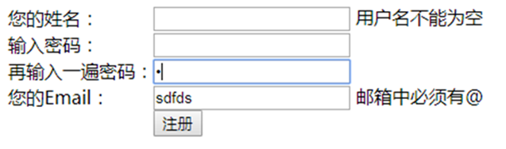

## 一个简单的登录Demo

### 实现效果



### 验证要求

1. 用户名不能为空
2. 用户名长度大于等于6
3. 用户名中不能有数字
4. 密码不少于5位
5. 两次密码必须一致
6. 邮箱格式正确必须有@和. 例如:`123456789@qq.com`

### 实现代码

```html
<!DOCTYPE html>
<html>
  <head>
    <meta charset="UTF-8">
    <title></title>
    <script type="text/javascript" src="js/jquery-3.5.1.min.js"></script>
    <script>
      function checkUsername() {
        var username = $("#user").val();
        if (username == "") { // 不能为空字符串
          $("#usertip").html("<font color='red'>不能为空</font>");
          return false;
        }
        if (username.length <= 6) { // 长度不能少于6位
          $("#usertip").html("<font color='red'>长度必须在6位之上</font>");
          return false;
        }
        for (var i = 0; i < username.length; i++) { // zhangsan
          var c = username.charAt(i);
          if (c <= '9' && c >= '0') {
            $("#usertip").html("<font color='red'>不能使用数字</font>");
            return false;
          }
        }
        // 提示OK
        $("#usertip").html("<font color='green'>OK</font>")
        return true;
      }

      function checkPassword() {
        var pwd = $("#pwd").val();
        if (pwd.length < 5) {
          $("#pwdtip").html("<font color='red'>长度不能少于5位</font>");
          return false;
        }
        $("#pwdtip").html("<font color='green'>OK</font>");
        return true;
      }

      function checkRepwd() {
        var p1 = $("#pwd").val();
        var p2 = $("#repwd").val();
        if (p1.length < 5 || p1 != p2) {
          $("#repwdtip").html("<font color='red'>两次密码不一致</font>");
          return false;
        }
        $("#repwdtip").html("<font color='green'>OK</font>");
        return true;
      }
      
      function checkEmail() {
        var em = $("#email").val();
        var index1 = em.indexOf("@");
        var index2 = em.indexOf(".");
        if (index1 < 1 || index2 < 1) {
          $("#emailtip").html("<font color='red'>邮箱格式有误</font>");
          return false;
        }
        $("#emailtip").html("<font color='green'>OK</font>");
        return true;
      }

      function checkForm() {
        return checkUsername() && checkPassword() && checkRepwd() && checkEmail();
      }
    </script>
  </head>
  <body>
    <table id="center" border="0" cellspacing="0" cellpadding="0">
      <form action="http://www.baidu.com" method="get" onsubmit="return checkForm()">
        <tr>
          <td>您的姓名：</td>
          <td>
            <input id="user" type="text" name="username" onblur="checkUsername()" />
            <div id="usertip" style="display: inline;"></div>
          </td>
        </tr>
        <tr>
          <td>输入密码：</td>
          <td>
            <input id="pwd" name="pwd" type="password" onblur="checkPassword()" />
            <div id="pwdtip" style="display: inline;"></div>
          </td>
        </tr>
        <tr>
          <td>再输入一遍密码：</td>
          <td>
            <input id="repwd" type="password" onblur="checkRepwd()" />
            <div id="repwdtip" style="display: inline;"></div>
          </td>
        </tr>
        <tr>
          <td>您的Email：</td>
          <td>
            <input id="email" type="text" onblur="checkEmail()" />
            <span id="emailtip"></span>
          </td>
        </tr>
        <tr>
          <td colspan="2">
            <input type="submit" value="注册" class="rb1" />
          </td>
        </tr>
      </form>
    </table>
  </body>
</html>
```

### 注意事项

1.  对于表单的提交，**要给form标签绑定onSubmit事件**，而不是给submit按钮绑定onClick事件 ,**onsubmit绑定的方法时要有return关键字,绑定的方法要返回true/false**
2.  表单项内容不管输入的是字符串、数字、日期，js、jQuery、**JSP接收后都是String类型**
3.  表单的验证**和String对象有密切关系** lengthcharAt(i) indexOf("@")
4.  如果表单项内容为空，js收到的不是null，而是空字符串。判断条件不能写 username == null，而**要写username==""或username.length ==0**
5.  **验证出错要return false，验证无错要return true，并且 onsubmit="returncheckForm()**
6.  该示例的缺点主要在于对于邮箱如果采用传统方式进行验证，代码繁琐并且不能保证严谨性,过度依赖String的API。对于邮箱、手机号码、邮政编码等验证，可以使用正则表达式进行验证，严谨而且简单。

## 正则表达式

### 什么是正则表达式

`Regular Expression`，在代码中常简写为regex,正则表达式使用单个字符串来描述、匹配一系列符合某个句法规则的字符串。在很多文本编辑器里，正则表达式通常被用来检索、替换那些符合某个模式的文本。正则表达式是对字符串（包括普通字符（例如，a 到 z 之间的字母）和特殊字符（称为“元字符”））操作的一种逻辑公式，就是用事先定义好的一些特定字符、及这些特定字符的组合，组成一个“规则字符串”，这个“规则字符串”用来表达对字符串的一种过滤逻辑。正则表达式是一种文本模式，该模式描述在搜索文本时要匹配的一个或多个字符串。

### 为什么使用正则表达式

正则表达式可以**使文本的校验的代码更加简洁**
正则表达式可以实现**更加严谨细致的校验**

### **正则表达式举例**

匹配国内电话号码：`\d{3}-\d{8}|\d{4}-\d{7}`
匹配腾讯QQ号：`[1-9][0-9]{4,}`
匹配中国邮政编码：`\d{6} `
匹配身份证：`\d{15}|\d{18}`
匹配由数字和26个英文字母组成的字符串 `^[A-Za-z0-9]+$`
匹配Email地址：`[\w]+(\.[\w]+)*@[\w]+(\.[\w])+`
匹配中文字符的正则表达式： `[\u4e00-\u9fa5][a-zA-Z]`

### 正则表达式的使用

```html
<!DOCTYPE html>
<html>
  <head>
    <meta charset="UTF-8">
    <title></title>
    <script type="text/javascript" src="js/jquery-3.5.1.min.js"></script>
    <script>
      /*
       * 正则表达式不依赖jQuery
       * 正则表达式本身就是一个字符串 只不过该字符串用于表述一种规则
       * 
       * */
      var reg = /^\w?$/
      var words = "a";
      console.log(reg.test(words))
      var regex1 = /^\d{6}$/;
      var regex2 = /^1[3456789]\d{9}$/;
      var regex3 = /^\w{6,}@[0-9A-Za-z]{2,}(\.[a-zA-Z]{2,3}){1,2}$/;
    </script>
  </head>
  <body>
  </body>
</html>
```

## 使用正则优化表单

```html
<!DOCTYPE html>
<html>
  <head>
    <meta charset="UTF-8">
    <title></title>
    <script type="text/javascript" src="js/jquery.min.js"></script>
    <script>
      function checkUsername() {
        var reg1 = /^\D{6,}$/
        var username = $("#user").val();
        if (!reg1.test(username)) {
          $("#usertip").html("<font color='red'>格式必须是至少六位的非数字</font>");
          return false;
        }
        // 提示OK
        $("#usertip").html("<font color='green'>OK</font>")
        return true;
      }

      function checkPassword() {
        var reg2 = /^\S{5,}$/
        var pwd = $("#pwd").val();
        if (!reg2.test(pwd)) {
          $("#pwdtip").html("<font color='red'>至少为5位非空格</font>");
          return false;
        }
        $("#pwdtip").html("<font color='green'>OK</font>");
        return true;
      }

      function checkRepwd() {
        var p1 = $("#pwd").val();
        var p2 = $("#repwd").val();
        if (p1.length < 5 || p1 != p2) {
          $("#repwdtip").html("<font color='red'>两次密码不一致</font>");
          return false;
        }
        $("#repwdtip").html("<font color='green'>OK</font>");
        return true;
      }

      function checkEmail() {
        var em = $("#email").val();
        var regex3 = /^\w{6,}@[0-9A-Za-z]{2,}(\.[a-zA-Z]{2,3}){1,2}$/;
        if (!regex3.test(em)) {
          $("#emailtip").html("<font color='red'>邮箱格式有误</font>");
          return false;
        }
        $("#emailtip").html("<font color='green'>OK</font>");
        return true;
      }

      function checkForm() {
        return checkUsername() && checkPassword() && checkRepwd() && checkEmail();
      }
    </script>
  </head>
  <body>
    <table id="center" border="0" cellspacing="0" cellpadding="0">
      <form action="http://www.baidu.com" method="get" onsubmit="return checkForm()">
        <tr>
          <td>您的姓名：</td>
          <td>
            <input id="user" type="text" name="username" onblur="checkUsername()" />
            <div id="usertip" style="display: inline;"></div>
          </td>
        </tr>
        <tr>
          <td>输入密码：</td>
          <td>
            <input id="pwd" name="pwd" type="password" onblur="checkPassword()" />
            <div id="pwdtip" style="display: inline;"></div>
          </td>
        </tr>
        <tr>
          <td>再输入一遍密码：</td>
          <td>
            <input id="repwd" type="password" onblur="checkRepwd()" />
            <div id="repwdtip" style="display: inline;"></div>
          </td>
        </tr>
        <tr>
          <td>您的Email：</td>
          <td>
            <input id="email" type="text" onblur="checkEmail()" />
            <span id="emailtip"></span>
          </td>
        </tr>
        <tr>
          <td colspan="2">
            <input type="submit" value="注册" class="rb1" />
          </td>
        </tr>
      </form>
    </table>
  </body>
</html>
```
