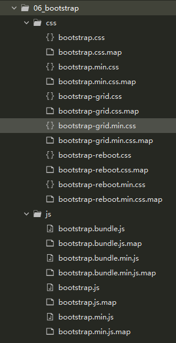
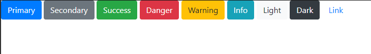

## BootStrap简介

Bootstrap是美国[Twitter](https://baike.baidu.com/item/Twitter/2443267 "Twitter")公司的设计师Mark Otto和Jacob Thornton合作基于HTML、CSS、JavaScript开发的**简洁、直观、强悍的前端**开发框架，使得 Web 开发更加快捷。Bootstrap提供了优雅的HTML和CSS规范，它即是由动态CSS语言Less写成。Bootstrap一经推出后颇受欢迎，一直是GitHub上的热门开源项目，包括NASA的MSNBC（微软全国广播公司）的Breaking News都使用了该项目。国内一些移动开发者较为熟悉的框架，如WeX5前端开源框架等，也是基于Bootstrap源码进行性能优化而来.

### 版本

目前使用较广的是版本2、3和4，其中2的最新版本的是2.3.2，3的最新版本是3.4.1，4的最新版本是4.5.1,在2018年1月下旬，Bootstrap团队发布了Bootstrap 4 正式版，4的最主要变化包括以下方面:

1.  从 Less 迁移到Sass
2.  改进网格系统
3.  缺省弹性框支持
4.  Dropped wells, thumbnails, andpanels for cards
5.  合并所有 HTML resets 到一个新的模块中：Reboot
6.  全新自定义选项
7.  **不再支持 IE8**
8.  重写所有的 JavaScript 插件
9.  改进工具提示和 popovers 的自动定位
10. 改进文档
11. 其他大量改进

### 优点

-   **移动设备优先**
    自 Bootstrap 3 起，框架包含了贯穿于整个库的移动设备优先的样式。&#x20;
-   **浏览器支持**
    IE/火狐/Open/Chrome/Safari
    所有的主流浏览器都支持 Bootstrap。 &#x20;
-   **容易上手**
    只要您具备 HTML 和CSS 的基础知识，您就可以开始学习 Bootstrap
-   **快速开发**
    **bootstrap**给我提供了大量的样式,布局解决方案和插件库,可以让程序员从基本的样式设计和调试上解放,快速搭建项目.同时bootstrap还给我们提供了大量的常用网页组件,可以让我们直接复制代码后,简单修改即可使用.ctrl-c  ctrl-v
-   **响应式设计**
    Bootstrap的响应式 CSS 能够自适应于台式机、平板电脑和手机
-   **为开发人员创建接口提供了一个简洁统一的解决方案**
-   **包含了功能强大的内置组件，易于定制**
-   **提供了基于 Web 的定制**
-   **开源**

## 搭建BootStrap

### 下载BootStrap文件

boostrap中文网 : [https://www.bootcss.com/](https://www.bootcss.com/ "https://www.bootcss.com/")
boostrap4下载地址 : [https://v4.bootcss.com/docs/getting-started/download/](https://v4.bootcss.com/docs/getting-started/download/ "https://v4.bootcss.com/docs/getting-started/download/")

### 引入工程目录



### 创建HTML文件

在HTML文件中引入bootstrap中的css样式文件和JS文件

```html
<!DOCTYPE html>
<html>
  <head>
    <meta charset="utf-8">
    <!-- 引入CSS文件 -->
    <link rel="stylesheet" href="css/bootstrap.min.css" />
    <!-- 导入顺序:JQuery文件\bootstrap.bundle.min.js\bootstrap.min.js -->
    <script src="js/jquery-3.5.1.min.js"></script>
    <script src="js/bootstrap.bundle.min.js"></script>
    <script src="js/bootstrap.min.js"></script>
    <title></title>
  </head>
  <body>

  </body>
</html>
```

### 参考文档快速开发

在HTML文件中引入bootstrap中的css样式文件和JS文件



```html
<!DOCTYPE html>
<html>
  <head>
    <meta charset="utf-8">
    <!-- 引入CSS文件 -->
    <link rel="stylesheet" href="css/bootstrap.min.css" />
    <!-- 导入顺序:JQuery文件\bootstrap.bundle.min.js\bootstrap.min.js -->
    <script src="js/jquery-3.5.1.min.js"></script>
    <script src="js/bootstrap.bundle.min.js"></script>
    <script src="js/bootstrap.min.js"></script>
    <title></title>
  </head>
  <body>
    <button type="button" class="btn btn-primary">Primary</button>
    <button type="button" class="btn btn-secondary">Secondary</button>
    <button type="button" class="btn btn-success">Success</button>
    <button type="button" class="btn btn-danger">Danger</button>
    <button type="button" class="btn btn-warning">Warning</button>
    <button type="button" class="btn btn-info">Info</button>
    <button type="button" class="btn btn-light">Light</button>
    <button type="button" class="btn btn-dark">Dark</button>
    <button type="button" class="btn btn-link">Link</button>
  </body>
</html>


```
