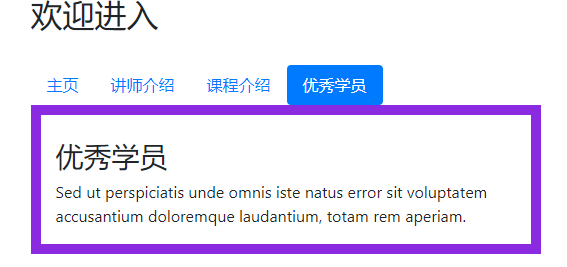

## 导航栏

### 效果图



### 相关代码

```html
<!DOCTYPE html>
<html>
  <head>
    <meta charset="utf-8">
    <!-- 引入CSS文件 -->
    <link rel="stylesheet" href="css/bootstrap.min.css" />
    <!-- 导入顺序:JQuery文件\bootstrap.bundle.min.js\bootstrap.min.js -->
    <script src="js/jquery-3.5.1.min.js"></script>
    <script src="js/bootstrap.bundle.min.js"></script>
    <script src="js/bootstrap.min.js"></script>
    <title></title>
  </head>
  <body>
    <div class="container">
      <h2>欢迎进入</h2>
      <br>
      <!-- Nav pills -->
      <ul class="nav nav-pills" role="tablist">
        <li class="nav-item">
          <a class="nav-link active" data-toggle="pill" href="#home">主页</a>
        </li>
        <li class="nav-item">
          <a class="nav-link" data-toggle="pill" href="#menu1">讲师介绍</a>
        </li>
        <li class="nav-item">
          <a class="nav-link" data-toggle="pill" href="#menu2">课程介绍</a>
        </li>
        <li class="nav-item">
          <a class="nav-link" data-toggle="pill" href="#menu3">优秀学员</a>
        </li>
      </ul>
      <!-- Tab panes -->
      <div class="tab-content">
        <div id="home" class="container tab-pane active" style="border: 10px solid red;"><br>
          <h3>我们公司</h3>
          <p>Lorem ipsum dolor sit amet, consectetur adipisicing elit, sed do eiusmod tempor incididunt ut
            labore et dolore magna aliqua.</p>
        </div>
        <div id="menu1" class="container tab-pane fade" style="border: 10px solid green;"><br>
          <h3>我们的优秀讲师</h3>
          <p>Ut enim ad minim veniam, quis nostrud exercitation ullamco laboris nisi ut aliquip ex ea commodo
            consequat.</p>
        </div>
        <div id="menu2" class="container tab-pane fade" style="border: 10px solid yellow;"><br>
          <h3>我们的课程</h3>
          <p>Sed ut perspiciatis unde omnis iste natus error sit voluptatem accusantium doloremque laudantium,
            totam rem aperiam.</p>
        </div>
        <div id="menu3" class="container tab-pane fade" style="border: 10px solid blueviolet;"><br>
          <h3>优秀学员</h3>
          <p>Sed ut perspiciatis unde omnis iste natus error sit voluptatem accusantium doloremque laudantium,
            totam rem aperiam.</p>
        </div>
      </div>
    </div>
  </body>
</html>

```

## 轮播图

### 效果图


### 相关代码

```html
<!DOCTYPE html>
<html>
  <head>
    <meta charset="utf-8">
    <!-- 引入CSS文件 -->
    <link rel="stylesheet" href="css/bootstrap.min.css" />
    <!-- 导入顺序:JQuery文件\bootstrap.bundle.min.js\bootstrap.min.js -->
    <script src="js/jquery-3.5.1.min.js"></script>
    <script src="js/bootstrap.bundle.min.js"></script>
    <script src="js/bootstrap.min.js"></script>
    <title></title>
  </head>
  <body>
    <div id="carouselExampleCaptions" class="carousel slide" data-ride="carousel">
      <ol class="carousel-indicators">
        <li data-target="#carouselExampleCaptions" data-slide-to="0" class="active"></li>
        <li data-target="#carouselExampleCaptions" data-slide-to="1"></li>
        <li data-target="#carouselExampleCaptions" data-slide-to="2"></li>
        <li data-target="#carouselExampleCaptions" data-slide-to="3"></li>
      </ol>
      <div class="carousel-inner">
        <div class="carousel-item active">
          
          <div class="carousel-caption d-none d-md-block">
            <h5>江河</h5>
            <p>Nulla vitae elit libero, a pharetra augue mollis interdum.</p>
          </div>
        </div>
        <div class="carousel-item">
          
          <div class="carousel-caption d-none d-md-block">
            <h5>山川</h5>
            <p>Lorem ipsum dolor sit amet, consectetur adipiscing elit.</p>
          </div>
        </div>
        <div class="carousel-item">
          
          <div class="carousel-caption d-none d-md-block">
            <h5>公路</h5>
            <p>Praesent commodo cursus magna, vel scelerisque nisl consectetur.</p>
          </div>
        </div>

        <div class="carousel-item">
          
          <div class="carousel-caption d-none d-md-block">
            <h5>火车</h5>
            <p>Praesent commodo cursus magna, vel scelerisque nisl consectetur.</p>
          </div>
        </div>
      </div>
      <a class="carousel-control-prev" href="#carouselExampleCaptions" role="button" data-slide="prev">
        <span class="carousel-control-prev-icon" aria-hidden="true"></span>
        <span class="sr-only">Previous</span>
      </a>
      <a class="carousel-control-next" href="#carouselExampleCaptions" role="button" data-slide="next">
        <span class="carousel-control-next-icon" aria-hidden="true"></span>
        <span class="sr-only">Next</span>
      </a>
    </div>
  </body>
</html>

```
