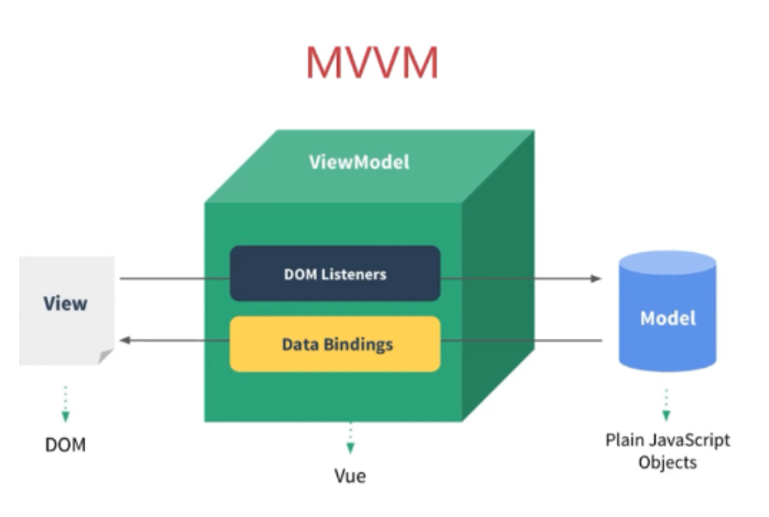
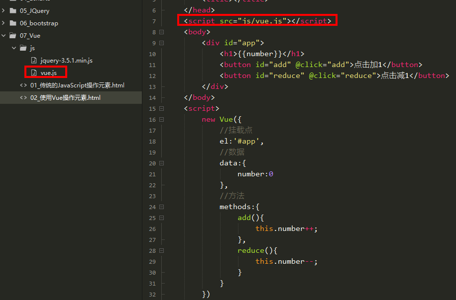
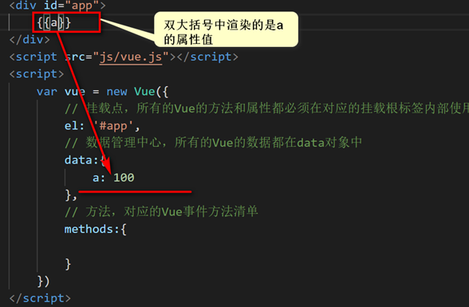
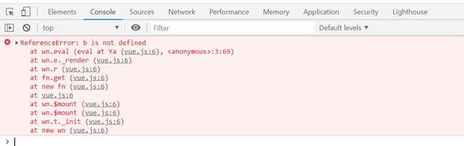

## 了解Vue

Vue (读音` /vjuː/`，类似于 view) **是一套用于构建用户界面的渐进式框架**。与其它大型框架不同的是，Vue 被设计为可以自底向上逐层应用。**Vue 的核心库只关注视图层**，不仅易于上手，还便于与第三方库或既有项目整合。另一方面，当与现代化的工具链以及各种支持类库结合使用时，**Vue 也完全能够为复杂的单页应用提供驱动**

相关网站
[https://cn.vuejs.org/](https://cn.vuejs.org/ "https://cn.vuejs.org/") 官方网站
[https://github.com/vuejs](https://github.com/vuejs "https://github.com/vuejs")  Github网站

## Vue的好处

实际上vue框架就是一个MVVM框架，它是渐进式框架，它是初创公司的首选框架，它是轻量级的，有很多根据Vue拓展的独立的功能或库



通过下面的例子我们来了解Vue的好处


### 传统方式操作元素

```html
<!DOCTYPE html>
<html>
  <head>
    <meta charset="utf-8">
    <title></title>
  </head>
  <body>
    <h1>点击操作的元素</h1>
    <button id="add">点击加1</button>
    <button id="reduce">点击减1</button>
  </body>
  <script>
    var elNubmer = document.getElementsByTagName('h1')[0];//获取到H1中的元素
    var nubler = 0;
    elNubmer.innerHTML = nubler;//初始化值
    
    var elAdd  = document.getElementById('add');//获取到加1的按钮
    elAdd.onclick = function(){//注册点击事件
      nubler++;
      elNubmer.innerHTML = nubler;//重新绘制视图
    }
    
    var elReduce  = document.getElementById('reduce');//获取到减1的按钮
    elReduce.onclick = function(){//注册点击事件
      nubler--;
      elNubmer.innerHTML = nubler;//重新绘制视图
    }  
  </script>
</html>
```

在传统方式操作数据中,我们每次改变数据的值,都需要冲洗向视图中绘制

### 使用Vue操作元素

```html
<!DOCTYPE html>
<html>
  <head>
    <meta charset="utf-8">
    <title></title>
  </head>
  <script src="js/vue.js"></script>
  <body>
    <div id="app">
      <h1>{{number}}</h1>
      <button id="add" @click="add">点击加1</button>
      <button id="reduce" @click="reduce">点击减1</button>
    </div>
  </body>
  <script>
    new Vue({
      //挂载点
      el:'#app',
      //数据
      data:{
        number:0
      },
      //方法
      methods:{
        add(){
          this.number++;
        },
        reduce(){
          this.number--;
        }
      }
    })
  </script>
</html>
```

使用Vue操作时,我们无需关注视图模型,仅仅需要修该数据,视图的渲染都交给Vue来执行

## Vue的使用

### 引入Vue

1.  Vue2文件
    在Vue的起步中，区分开发环境和生产环境，两者的不同，开发环境可以清晰的看清源码，生产环境就是将源码进行压缩，占比大小更小，我们学习过程中使用生产环境
    开发环境版本，包含了有帮助的命令行警告
    [vue\_dev.js](file/vue_dev_BFFNRkiMkA.js)
    生产环境版本，优化了尺寸和速度
    [vue\_uat.js](file/vue_uat_BFAXhXjjx2.js)
2.  文件中引入
    
3.  简单的语法格式
    ```html
    <body>
        <div id="app">
            {{a}}
        </div>
        <script src="js/vue.js"></script>
        <script>
            var vue = new Vue({
                // 挂载点，所有的Vue的方法和属性都必须在对应的挂载根标签内部使用
                el: '#app',
                // 数据管理中心，所有的Vue的数据都在data对象中
                data:{
                    a: 100
                },
                // 方法，对应的Vue事件方法清单
                methods:{
                }
            })
        </script>
    </body>
    ```

### 插值语法

插值语法是通过一对`{{}}`进行书写，内部是对data数据管理中心的属性进行渲染，也可以是表达式moustache（胡子）是双大括号学名，也叫（胡子语法）



内部也可以存放表达式: `{{a >= 100 ? 20 : 10}}`  ,  注意，**表达式支持简单，比如简单判断**，比如三元表达式，**不可以使用if等等复杂判断** `{{if(a>200){a=100}else{a=300}}}`

我们需要注意的是，所有的对象中的清单内容，都是Vue规定，内置的，不可以自由发挥

```html
<body>
    <div id="app">
        {{b}}
    </div>
    <script src="js/vue.js"></script>
    <script>
        var vue = new Vue({
            // 挂载点，所有的Vue的方法和属性都必须在对应的挂载根标签内部使用
            el: '#app',
            // 数据管理中心，所有的Vue的数据都在data对象中
            data:{
                a: 100
            },
            // 方法，对应的Vue事件方法清单
            methods:{

            },
            content:{
                b: 200
            }
        })
    </script>
</body>
```

上面代码中content对象是我们自己随意创建的，所以是不支持在Vue中使用的


