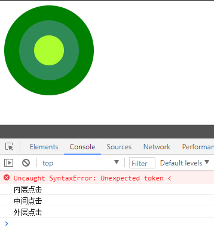
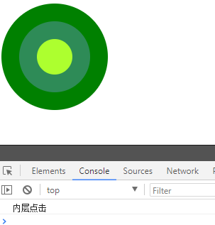
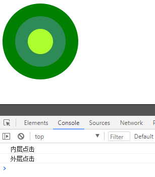
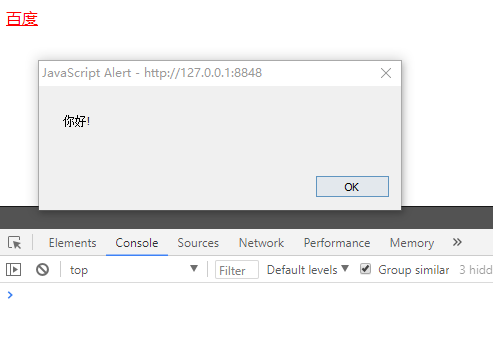
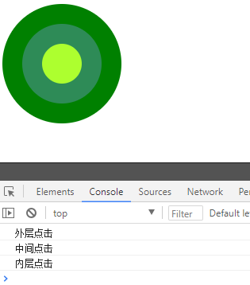
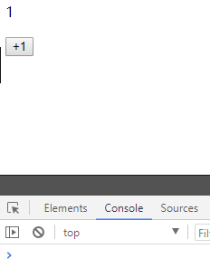
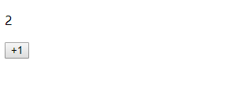
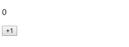
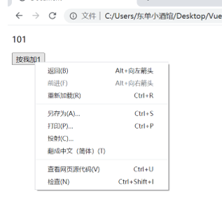

## 事件修饰符

### 为什么使用事件修饰符

在日常开发中,我们经常会遇到多层盒子嵌套的情况,但是如果每个盒子都有自己的点击事件,当我们点击触发内部的盒子的时候,会发现外层的盒子也会被触发.这也就是我们说的事件冒泡

例如,在下列代码中:

```html
<body>
  <div class="outerlayer" onclick="outerlayer()">
    <div class="middle" onclick="middle()">
      <div class="inside" onclick="inside()">
      </div>
    </div>
  </div>
</body>
<script type="text/javascript">
  function outerlayer(){
    console.log("外层点击")
  }
  function middle(){
    console.log("中间点击")
  }
  function inside(){
    console.log("内层点击")
  }
</script>

```

当我们点击内部的盒子时,同时触发了所有盒子的事件



为了阻止事件冒泡的情况,Vue提供了事件修饰符

### 常用的事件修饰符

#### stop修饰符

`.stop`修饰符的作用就是阻止事件的一个冒泡

```html
<body>
  <div id="app">
    <!-- .stop修饰符的作用就是阻止事件的一个冒泡 -->
    <div class="outerlayer" @click="outerlayer()">
      <div class="middle" @click="middle()">
        <div class="inside" @click.stop="inside()">
          
        </div>
      </div>
    </div>
  </div>
</body>
<script type="text/javascript">
  new Vue({
    el:"#app",
    methods:{
      outerlayer(){
        console.log("外层点击")
      },
      middle(){
        console.log("中间点击")
      },
      inside(){
        console.log("内层点击")
      }
    }
  })
</script>
```



#### self修饰符

`.self`修饰符的作用是只有点击元素本身的时候才能触发事件，不接受冒泡上来的事件，同时也不能阻止事件的冒泡

```html
<body>
  <div id="app">
    <!-- .self修饰符的作用是只有点击元素本身的时候才能触发事件，不接受冒泡上来的事件，同时也不能阻止事件的冒泡 -->
    <div class="outerlayer" @click="outerlayer()">
      <div class="middle" @click.self="middle()">
          <div class="inside" @click.self="inside()">
            
          </div>
        </div>
    </div>
  </div>
</body>
<script type="text/javascript">
  new Vue({
    el:"#app",
    methods:{
      outerlayer(){
        console.log("外层点击")
      },
      middle(){
        console.log("中间点击")
      },
      inside(){
        console.log("内层点击")
      }
    }
  })
</script>
```



#### prevent修饰符

`.prevent`修饰符可以屏蔽标签原有的执行效果,仅仅执行监听事件

```html
<body>
  <div id="app">
    <a href="https://www.baidu.com" @click.prevent="hello()">百度</a>
  </div>
</body>
<script type="text/javascript">
  new Vue({
    el:'#app',
    methods:{
      hello(){
        alert("你好!")
      }
    }
  })
</script>
```



#### capture修饰符

`.capture`修饰符是对事件捕获的监听，vue的事件监听，默认都是获取冒泡阶段的，所以使用capture去监听捕获阶段的事件

```html
  <body>
    <div id="app">
      <div class="outerlayer" @click.capture="outerlayer()">
        <div class="middle" @click.capture="middle()">
          <div class="inside" @click="inside()">
            
          </div>
        </div>
      </div>
    </div>
  </body>
  <script type="text/javascript">
    new Vue({
      el:"#app",
      methods:{
        outerlayer(){
          console.log("外层点击")
        },
        middle(){
          console.log("中间点击")
        },
        inside(){
          console.log("内层点击")
        }
      }
    })
  </script>
```



#### once修饰符

`.once`修饰符的作用就是使事件只触发一次

```html
<body>
  <div id="app">
    <p>{{number}}</p>
    <button @click.once="add()">+1</button>
  </div>
</body>
<script type="text/javascript">
  new Vue({
    el:"#app",
    data:{
      number:0
    },
    methods:{
      add(){
        this.number++;
      }
    }
  })
</script>
```



## 按键修饰符

我们之前在JavaScript的课程中接触过onkeydown和onokeyup，这两个是键盘的事件监听，在vue中有对应的事件修饰符

### 基本用法

```html
<body>
  <div id="app">
    <p>{{numbers}}</p>
    <button @click="add()" @keyup.left="add()">+1</button>
    <!-- <button @click="add()" @keyup.37="add()">+1</button> -->
  </div>
</body>
<script type="text/javascript">
  new Vue({
    el:'#app',
    data:{
      numbers:0
    },
    methods:{
      add(){
        this.numbers++
      }
    }
  })
</script>
```



### 常用keyCode

| keyCode值 | 别名      | 键盘按键              |
| -------- | ------- | ----------------- |
| 13       | .enter  | 回车                |
| 32       | .space  | 空格                |
| 37       | .left   | 键盘左键              |
| 38       | .up     | 键盘上键              |
| 39       | .right  | 键盘右键              |
| 40       | .down   | 键盘下键              |
| 9        | .tab    | 键盘tab             |
| 46或者8    | .delete | delete或者backspace |

## 系统修饰符

系统修饰符指的是通过一些指定的按键配合鼠标点击或者键盘事件进行事件监听

### 基本用法

```html
<body>
  <div id="app">
    <p>{{numbers}}</p>
    <!-- 此时按住键盘ctrl键然后鼠标点击才能实现add加1 -->
    <button @click.ctrl="add()">+1</button>
  </div>
</body>
<script type="text/javascript">
  new Vue({
    el:'#app',
    data:{
      numbers:0
    },
    methods:{
      add(){
        this.numbers++
      }
    }
  })
</script>
```



### 常见系统修饰符

| 修饰符名称  | 对应的键盘键名称                                    |
| ------ | ------------------------------------------- |
| .ctrl  | ctrl                                        |
| .alt   | alt                                         |
| .shfit | shift                                       |
| .meta  | 如果是windows系统代表的是键盘的徽标键，如果是IOS系统，单表的是common键 |

此时有一个问题，如果我们设置了系统修饰符，并不希望有其他的按键组合，比如我们设置ctrl修饰符，此时如果按住ctrl和其他键，然后再点击鼠标，此时也会触发事件监听，

所以我需要使用其他的修饰符来设置精确匹配事件 ` exact`

## exact修饰符

exact修饰符的作用是辅助其他修饰符进行精确匹配的

### 基本用法

```html
  <body>
    <div id="app">
      <p>{{numbers}}</p>
      <button @click.ctrl.exact="add()">+1</button>
    </div>
  </body>
  <script type="text/javascript">
    new Vue({
      el:'#app',
      data:{
        numbers:0
      },
      methods:{
        add(){
          this.numbers++
        }
      }
    })
  </script>
```

## 鼠标按键修饰符

鼠标按键修饰符修饰的是鼠标的左、滚轮、右键

如果我们需要点击某个事件，但是我们可以需要使用鼠标右键

### 基本用法

```html
  <body>
    <div id="app">
      <p>{{numbers}}</p>
      <button @click.right.prevent="add()">+1</button>
    </div>
  </body>
  <script type="text/javascript">
    new Vue({
      el:'#app',
      data:{
        numbers:0
      },
      methods:{
        add(){
          this.numbers++
        }
      }
    })
  </script>
```

### 注意事项

如果只使用鼠标修饰符,此时我们发现使用右键时也会出现弹窗:



所以我们推荐结合`prevent`修饰符实现右键的事件监听, 需要注意的是，**prevent修饰符必须在鼠标修饰符的后面**，否则会失效

## 表单修饰符

表单修饰符 一 共有三个，分别是.lazy，.number，.trim,  表单修饰符都是用来修饰v-model属性的

### .lazy 修饰符

.lazy修饰符是将Input输入框的数据绑定v-model从实时监听的状态变为change状态

```html
  <body>
    <div id="app">
      <!-- 修改双向绑定为 change事件同步 -->
      <input type="text" v-model.lazy="text" />
      <p>{{text}}</p>
    </div>
  </body>
  <script type="text/javascript">
    new Vue({
      el:'#app',
      data:{
        text:''
      }
    })
  </script>
```

### .number 修饰符

.number修饰符的作用是将内容转化为数字类型, 如果没有使用number修饰符，得到的输入框的数字都是string类型

```html
  <body>
    <div id="app">
      <!-- 将内容转换为数字,否则都为字符串 -->
      <input type="text" v-model.number='number' />
      <p>{{number+100}}</p>
      <hr >
    </div>
  </body>
  <script type="text/javascript">
    new Vue({
      el:'#app',
      data:{
        number:0
      }
    })
  </script>
```

### .trim 修饰符

.trim修饰符的作用是过滤用户输入的收尾空格

```html
  <body>
    <div id="app">
      <!-- 去除两端空格 -->
      <input type="text" v-model.trim='name' />
      <p>{{name}}</p>
    </div>
  </body>
  <script type="text/javascript">
    new Vue({
      el:'#app',
      data:{
        name:''
      }
    })
  </script>
```
