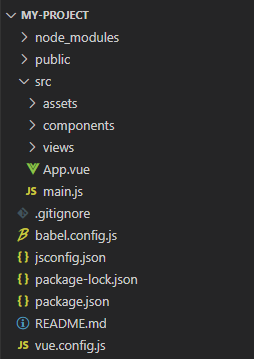
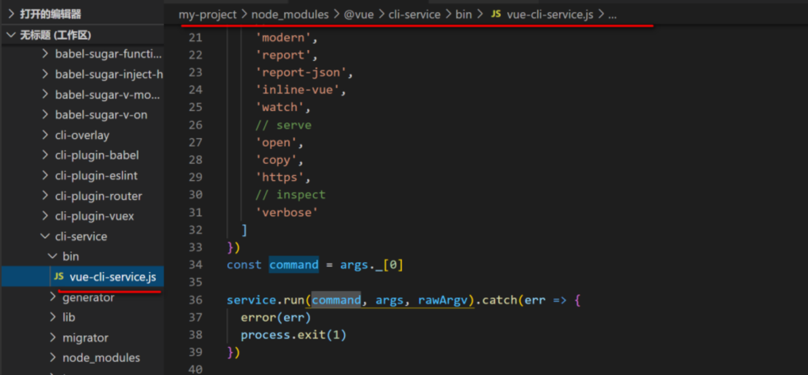
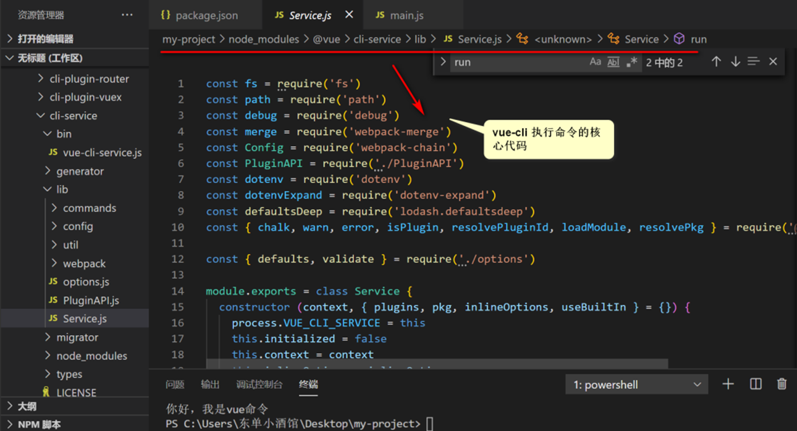

## 准备工作

### 安装nodejs并验证

安装nodejs,下一步下一步就可以,可以安装最新的15版本,win7的话可以安装14版本.使用以下dos命令提示符下执行：

```shell
node -v     # v8.11.3，至少8以上,最新的是v15.11.0
```

### 配置npm

Nodejs下的包管理器,Nodejs中包含了npm,无需单独安装.默认去官网下载资源,可以换成国内的镜像

```shell
npm config get registry # 查看当前配置的镜像，结果是默认的国外网址https://registry.npmjs.org/

npm config set registry https://registry.npm.taobao.org #设置成淘宝镜像

npm config get registry #再获取查看,结果是修改后的https://registry.npm.taobao.org/ 

```

### 脚手架安装

vue-cli: 用户生成Vue工程模板（帮你快速构建一个vue的项目，也就是给你一套vue的结构，包含基础的依赖库） &#x20;
vue-cli: 脚手架工具安装与配置（需要几分钟）

```shell
npm install vue-cli -g #安装vue-cli脚手架---可能比较慢,要等几分钟
 
npm install -g @vue/cli

npm uninstall vue-cli -g #卸载vue-cli脚手架 --- 大可不必

vue –V #查看版本

where vue #vue安装在哪里

```

### 创建Vue项目

在DOS进入指定工作空间

```shell
vue init webpack jt01 #此处项目名不能使用大写---可能比较慢,要等

?Project name xxxx //项目名称，直接回车
?Project description  xxxxx //项目描述，直接回车
?Author xxxxxxxx  //作者，直接回车
?Vue build xxxxx  //编译，直接回车
?Install vue-router?Yes  //是否安装路由， 选Yes!!!
?Use ESLint to lint your code?No   //是否使用规则引擎， No!!!
?Set up unit tests No  //单元测试，选No!!!
?Set up e2e tests with Nightwatch?No    //测试框架，选No!!!
?Should we run install for you after'the project has beecommended) npm
//默认安装方式就是npm， 直接回车
```

### 启动项目&停止项目

```shell
cd jt01 # 进入项目目录

npm run dev # 自动启动服务，ctrl+c 停止,可能要等几分钟
```

## Vue-Cli 脚手架的使用

### cli目录结构



-   `node_modules`  项目的依赖中心
-   `public`  静态资源文件夹,和assets不同的是public不会被webopack进行打包,使用路径的时候要使用绝对路径
-   `src`  项目的核心区域,所有的开发文件的核心内容区域,包括组件\静态资源等等
-   `asstet` 静态资源文件,和public不同的是assets文件夹会被webpack打包,所以要使用相对路径
-   `components`  Vue功能组件的存放位置，内部存放的是公用的组件
-   `views` 公共文件，主要以各个独立页面为主
-   `APP.vue` 整个vue的根组件，所有的vue组件都是从这个组件中拓展的，App根组件最后通过编译后将内容渲染到.html文件中
-   `main.js` vue的入口文件，vue文件初始化位置
-   `.gitignore` GitHub相关配置文件，作用是git再提交代码的时候指定相关忽略格式文件
-   `babel.config.js` babel的配置文件
-   `package.json` 配置（记录了）项目的相关模块，项目相关配置信息等等
-   `package-lock.json` 作用是记录的当前项目安装的相关依赖版本，并且记住了当前所有依赖的关联关系，如果下次vue进行编译的时候会按照这个文件进行编译
-   `README.md` 文件的作用是项目相关的使用方法，和使用说明

### cli文件的编译过程

我们知道vue-cli的起步命令是`npm run serve`，那么这个命令干了一些什么?

首先我们要知道`npm run` 执行一个命令或者是一个文件内容

我们看package.json文件中

```json
{
  "name": "my-project",
  "version": "0.1.0",
  "private": true,
  "scripts": {
    "serve": "vue-cli-service serve",
    "build": "vue-cli-service build",
    "lint": "vue-cli-service lint",
  },
  "dependencies": {
    "core-js": "^3.6.5",
    "vue": "^2.6.11"
  },
  "devDependencies": {
    ....
  },
  "eslintConfig": {
    ...
  },
  "browserslist": [
    ...
  ]
}

```

我们知道scripts是npm执行目录，也就是在scripts这个对象中的key就是npm run的命令值

vue-cli提供了三个命令
1.  `serve` 这个是我们开发使用的命令，执行编译和热更新（ctrl+s的时候浏览器会实时更新）
2.  `build` 工作中如果我们本地调试完后需要部署代码前，进行打包的命令
3.  `lint` 命令的作用是检验文件代码的合格性（对eslint的校验）

我们以`npm run serve`为例:

1.  第一步命令会找到`node_modules`文件夹中`.bin`文件夹内部的`vue-cli-service`文件
    
2.  然后我们根据路径查找到了相关文件
    
3.  核心代码路径
    
4.  severice.js文件是整个编译过程的核心文件
    

### vue-cli的起步文件

#### main.js 文件

```javascript
import Vue from 'vue'
// 相对路径引入的App.vue文件
import App from './App.vue'

// 这行命令的作用是给生产环境配置的提示消息，如果为true或者默认不配置，会有相关提示语
Vue.config.productionTip = false

new Vue({
  // 渲染节点
  render: h => h(App),
  // 挂载函数，内部#app是vue的根节点
}).$mount('#app')

```

#### public>index.html 根文件

```html
<!DOCTYPE html>
<html lang="en">
  <head>
    <meta charset="utf-8">
    <meta http-equiv="X-UA-Compatible" content="IE=edge">
    <meta name="viewport" content="width=device-width,initial-scale=1.0">
    <title></title>
  </head>
  <body>
    <noscript>
      <strong>We're sorry but <%= htmlWebpackPlugin.options.title %> doesn't work properly without JavaScript enabled. Please enable it to continue.</strong>
    </noscript>
    <div id="app"></div>
    <!-- built files will be auto injected -->
  </body>
</html>

```

`noscript`标签的作用是当script标签加载不出来或者抛出错误的时候替换内容，目的是在浏览器中提供友好提示
`<div id="app"></div>`是整个vue项目的根标签，vue需要挂载的标签

#### App.vue 文件

App.vue文件是整个项目的根组件，项目中所有的页面切换页面显示都是在这个组件基础上渲染的.基本结构如下:

```vue
<template>
  <div id="app">

  </div>
</template>

<script>

export default {
  components: {
    
  }
}
</script>

<style>

```

-   `<template>` 元素的作用是搭建vue文件的结构
-   `<script>` 元素的作用是对当前文件逻辑进行交互
-   `<style>` 元素的作用是对当前文件的样式进行修饰

我们之前开发中.js文件只有逻辑.css文件只有样式.html文件只有结构，但是.vue的组建就是将视图和逻辑进行了一个整合
