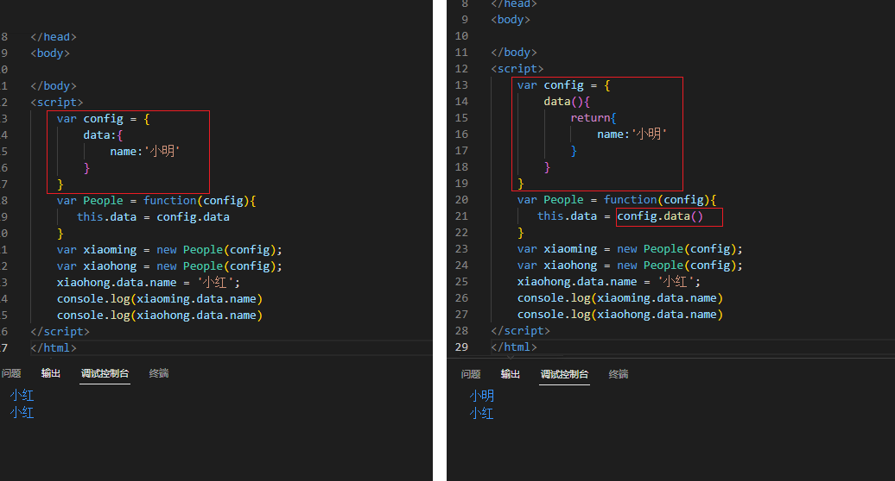
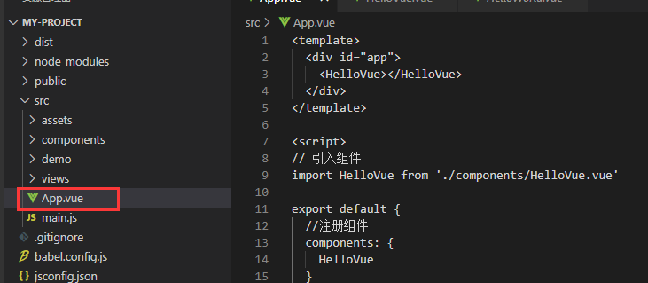
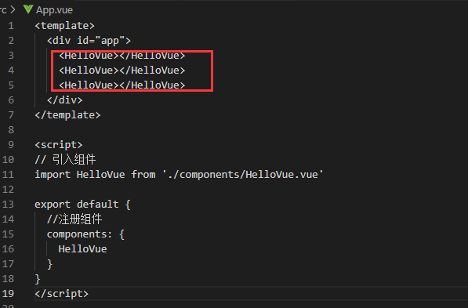
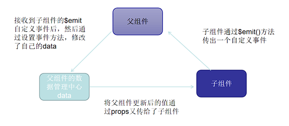

## 组件的概述

组件（Component）是 Vue.js 最强大的功能之一。
组件可以扩展 HTML 元素，封装可重用的代码。
组件系统让我们可以用独立可复用的小组件来构建大型应用，几乎任意类型的应用的界面都可以抽象为一个组件树

### 什么是组件

所有的vue组件都是以`.vue`格式结尾的文件,我们看到的vue-cli中的App.vue文件就是整个vue的根组件

```vue
<template>
  <div>

  </div>
</template>

<script>
export default {
  data(){
   
  }
}
</script>

<style></style>

```

一个vue文件就是一个类,需要注意的地方就是data必须是一个函数,最外层必须有默认暴露

```vue
<script>
export default {
  data(){
    return {
      
    }
  }
}
</script>

```

我们后面写的所有的vue的对象清单都必须在`export default`里面罗列. **data是一个函数**，**返回的是一个对象**，目的是为了让每个组件数据隔离，这个是JavaScript的原理，并不是vue去设计的

### 为什么组件中data是函数

我们先查看一个javaScript的代码案例



我们看到左边的代码中:创建的是一个对象,在使用的过程中,赋值只是将引用地址的值进行赋值传递,当一个声明改变时,将直接影响对象本身的值,所以导致所有的赋值的引用一起改变

在右边的代码中,我们将需要的值放到一个函数中进行返回,这样在使用时拿到的都是独立的对象以及新的地址,在修改时所有的声明时相互隔离互不影响的.

所以,**Vue的组件中data是一个函数,而不是一个data对象.**

## 自定义组件

### 创建组件.vue文件


```vue
<template>
    <div>
        <h1>{{number}}</h1>
        <button @click="add">+1</button>
    </div>
</template>
<script>
    export default{
        data(){
            return{
                number:100
            }
        },
        methods:{
            add(){
                this.number++;
            }
        }
    }
</script>
<style>

</style>
```

### 引入组件/注册组件



```vue
<template>
  <div id="app">
    <HelloVue></HelloVue>
  </div>
</template>

<script>
// 引入组件
import HelloVue from './components/HelloVue.vue'

export default {
  //注册组件
  components: {
    HelloVue
  }
}
</script>

<style>

</style>
```

注意:组件是可以重复使用的,且数据相互隔离!



## 父子组件传值

我们使用组件一定是依托在某一个父组件的身上，比如我们上面写的`HelloVue.vue`文件就是依托在App.vue文件中，此时我们如果要使用App.vue文件中的值怎么办

### 父组件传值给子组件

vue提供了一个props的入口，也是父子组件之间唯一的传值方式，父组件通过v-bind自定义属性传入值，子组件通过props接受对应的参数

#### 基本语法-单个参数

父组件

```vue
<template>
    <div>
        <h1>{{number}}</h1>
        <button @click="add">+1</button>
        <sayVue :father-number='number'></sayVue>
    </div>
</template>
<script>
//引入组件
import sayVue from '../components/SayVue.vue'

export default{
     //注册组件
    components: {
        sayVue
    },
    data(){
        return{
            number:100
        }
    },
    methods:{
        add(){
            this.number++;
        }
    }
}
</script>
<style>

</style>
```

子组件

```vue
<template>
    <div>
        <h1>父组件的值:{{fatherNumber}}</h1>
    </div>
</template>
<script>
    export default{
         // 罗列父组件传进的属性值
        props:['fatherNumber'],
        data(){
            return{

            }
        }
    }
</script>
<style>

</style>
```

#### 基本语法-多个参数

父组件

```vue
<template>
    <div>
        <h1>{{number}}</h1>
        <button @click="add">+1</button>
        <sayVue1 :number-a='number' :number-b='number' :number-c='number'></SayVue1>    </div>
</template>
<script>
//引入组件
import sayVue1 from '../components/SayVue1.vue'
export default{
     //注册组件
    components: {
        sayVue1
    },
    data(){
        return{
            number:100
        }
    },
    methods:{
        add(){
            this.number++;
        }
    }
}
</script>
<style>

</style>
```

子组件

```vue
<template>
    <div>
        <h1>父组件的值:number-a :{{numberA}}/number-b :{{numberB}}/number-c :{{numberC}}</h1>
    </div>
</template>
<script>
    export default{
         // 罗列父组件传进的属性值
        props:['numberA','numberB','numberC'],
        data(){
            return{

            }
        }
    }
</script>
<style>

</style>
```

#### 基本语法-对象

父组件

```vue
<template>
    <div>
        <sayVue2 :student-name='zhangsan.name' :student-age='zhangsan.age'></sayVue2>
    </div>
</template>
<script>
//引入组件
import sayVue2 from '../components/SayVue2.vue'

    export default{
         //注册组件
        components: {
            sayVue2
        },
        data(){
            return{
                zhangsan:{
                    name:'张三',
                    age:110
                }
            }
        }
    }
</script>
<style>

</style>
```

子组件

```vue
<template>
    <div>
        <h1>父组件的值:name :{{studentName}}/age :{{studentAge}}</h1>
    </div>
</template>
<script>
    export default{
         // 罗列父组件传进的属性值
        props:{
            studentName:{
              //传值类型
               type:String,
               //默认值
               default:'李四',
               //是否必须
               required: true
            },
            studentAge:{
                type:Number,
                required: true,
                //校验
                validator: function(value){
                    return value>100;
                }
            },
            studenObj:{
                type: Object,
                //默认值
                default: ()=>{
                    return{
                        name:'王五',
                        age:10
                    }
                }
            }
            
        },
        data(){
            return{

            }
        }
    }
</script>
<style>

</style>
```

## 子组件修改父组件参数

**子组件不可以直接修改父组件的值**，只能传出一个自定义事件，父组件通过调用这个自定义事件后，然后在外部修改值

### 基本语法

子组件

```vue
<template>
    <div>
        <h1>父组件传递过来的值:{{fatherNumber}}</h1>
        <button @click="addNumber">+1</button>
    </div>
</template>
<script>
    export default {
        props:{
            fatherNumber:Number
        },
        data() {
            return {
                
            };
        },
        methods:{
            addNumber(){
                this.$emit("addNumber")
            }
        }
    }
</script>
<style>

</style>
```

父组件

```vue
<template>
    <div>
        <h1>{{number}}</h1>
        <button @click="add">+1</button>
        <sayVue3 :father-number='number' @addNumber="add"></sayVue3>
    </div>
</template>
<script>
//引入组件
import sayVue3 from '../components/SayVue3.vue'

    export default{
         //注册组件
        components: {
            sayVue3
        },
        data(){
            return{
                number:100
            }
        },
        methods:{
            add(){
                this.number++;
            }
        }
    }
</script>
<style>

</style>
```

@add自定义事件是子组件通过`$emit` **传出来的自定义事件，父组件通过这个事件设置事件方法** `addNumber`，然后修改自己的值，从而时间子组件修改父组件的值



这么做的目的就是为了让数据可观察性更强，可维护性更高，有一个更清晰的清单
