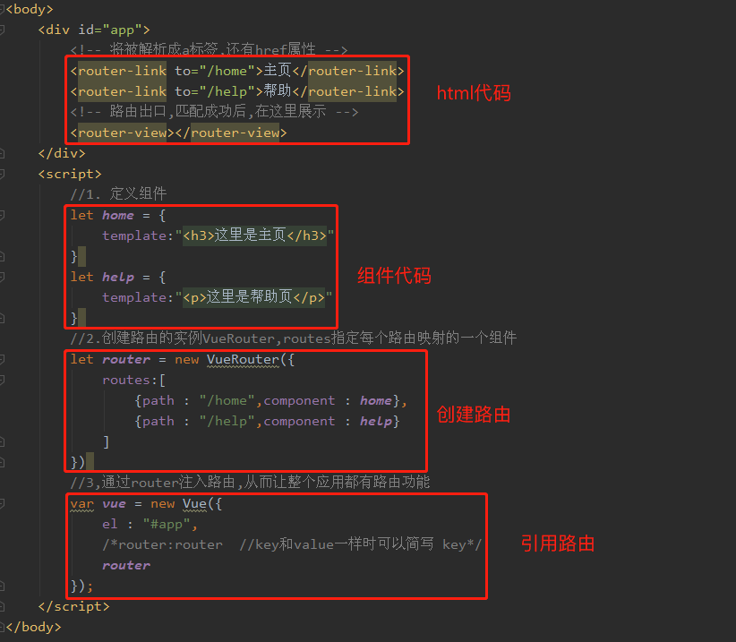

### 路由的概念

用户发起一个请求,在互联网中经过多个站点的跳转.最终获取服务器端的数据，我们把互联网中网络的链路称之为路由。 (网络用语) 
**VUE中的路由: 根据用户的请求URL地址,展现特定的组件(页面)信息. (控制用户程序跳转过程)**

### 路由的使用

-   一、引入JS文件 : [vue-router.js](file/vue-router__6qjFJSZ1m.js)  
    **一定要注意引入顺序**：Vue路由是基于vue.js的扩展，所以要先引用vue.js 再引用vue-router.js 文件
-   二、定义组件 : `var 组件名 = {template:"组件HTML代码"}`
-   三、创建路由的实例VueRouter,routes指定每个路由path映射的一个组件
	   ```vue
    var 路由名 = new VueRouter({
       routes:[
             {path:"/路径1",component:组件名1},
             {path:"/路径2",component:组件名2},
             ............
       ]
    })
	```
-   四、在Vue对象代码中，通过 路由名 注入路由,从而让整个应用都有路由功能
	```vue
	 new Vue({
      el:"作用域",
      ........
      **router：路由名      //此处如果路由器也是router，可以简写  router即可**
    })
	```
-   五、在HTML的渲染域中使用路由
	```Vue
	<div id="作用域">
		<!-- 将被解析成a标签,还有href属性 --> 
		<router-link to="/路径1">文字1</router-link>
		<router-link to="/路径2">文字2</router-link>
		<!-- 路由出口,匹配成功后,在下面区域展示 -->
		<router-view></router-view>
	</div>
	```

**演示代码**

