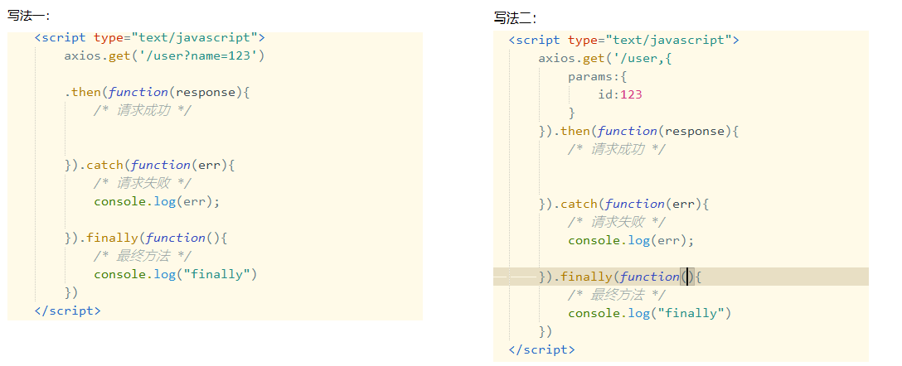
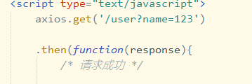
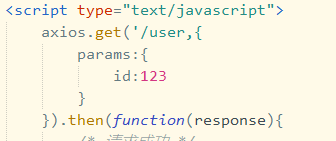
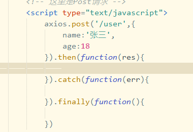
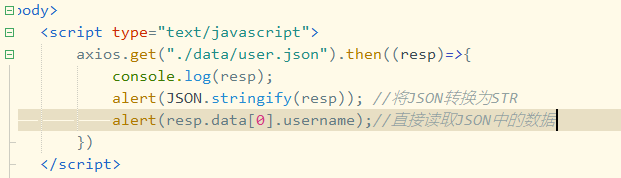

### Axios的概念

Ajax 即Asynchronous Javascript And XML( 异步的 )  ，不是一种新的编程语言，而是多种技术的综合应用。是**客户端**的技术，它可以实现**局部刷新**网页(一种在无需重新加载整个网页的情况下，能够更新部分网页的技术)。**Vue中封装了ajax并增强**了它，在异步并发处理优于原生ajax。**称为：axios**（ajax input output system）

### 使用

-   一、引入JS文件 : [axios.min.js](file/axios.min_yHYNXUXqMB.js)  
     **一定要注意引入顺序**：Vue路由是基于vue.js的扩展，所以要先引用vue.js 再引用vue-router.js 文件
-   二、使用语法
    ```javascript
    vur提供的对象，get函数是指即将发起一个get请求
    参数是一段java程序的访问方式
    当程序访问成功时，then函数是vue自动调用的函数
    axios.get("url地址信息","参数信息").then(res=>{
    //res记录程序返回值return => 箭头函数后处理返回结果res
      console.log(res.data);
    })

    then：访问成功再运行
    res：表示返回的数据
    ```

### 演示



`then()`  ：表示执行成功
`catch() `:  请求失败执行
`finally() `: 总会执行

### 参数的拼接

#### 普通参数



#### 使用params



#### 发送Json



对JSON的处理


