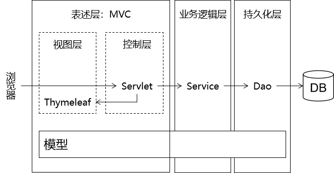
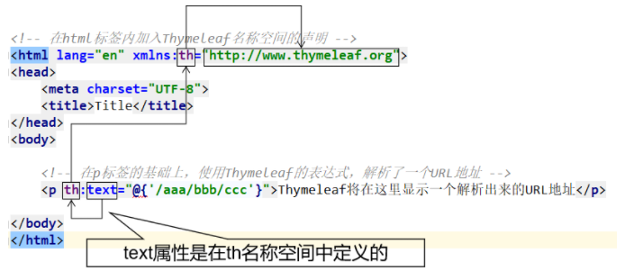
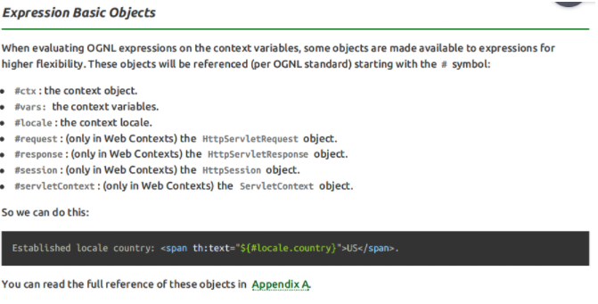
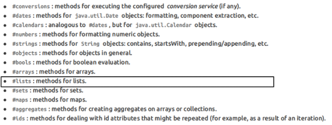
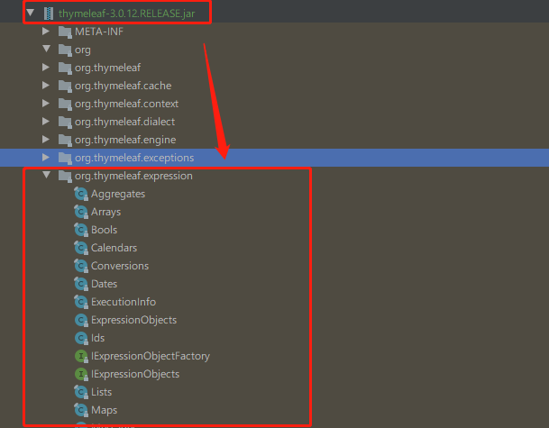
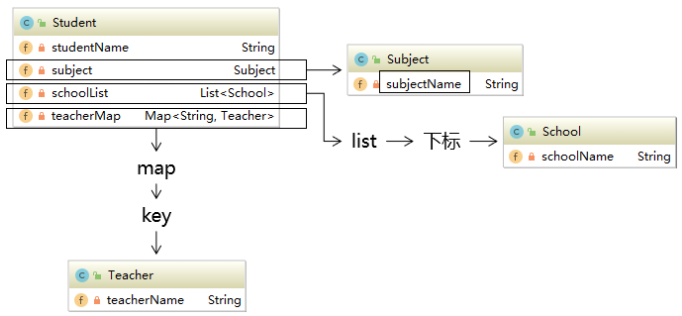
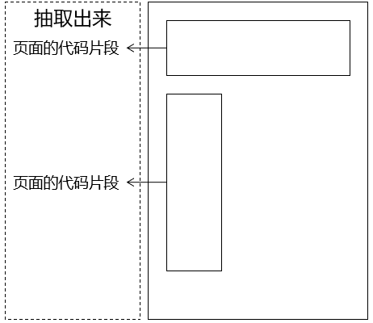

相关资料
[Thymeleaf-3.0.11.pdf](file/Thymeleaf-3.0.11_B0zIAhCTc5.pdf)
[Thymeleaf类库.zip](file/Thymeleaf类库_DL_WdBqpig.zip)

## MVC

- M：Model模型
- V：View视图
- C：Controller控制器

### 为什么要使用MVC

我们如果只使用HTML作为视图的话，它是无法展示动态数据的，所以我们对HTML的新的期待：**既能够正常显示页面，又能在页面中包含动态数据部分**。而动态数据单靠HTML本身是无法做到的，所以此时我们需要引入服务器端动态视图模板技术。

### MVC和三层架构的关系

MVC是在表述层开发中运用的一种设计理念。主张把**封装数据的『模型』**、**显示用户界面的『视图』**、协调调度的『控制器』分开。



我们在原有的表述层中，将servlet中对HTML的操作抽离出来，**将Servlet只作为Controller控制器**负责页面和数据之间的调度，**将HTML页面只作为View视图**负责数据渲染和提交响应，**数据封装到Bean中作为Model模型**贯穿三层架构

## Thymeleaf概念

### 概念

**Thymeleaf是一款用于渲染XML/XHTML/HTML5内容的模板引擎。类似JSP，Velocity，FreeMaker等， 它也可以轻易的与Spring MVC等Web框架进行集成作为Web应用的模板引擎。它的主要作用是在静态页面上渲染显示动态数据**

### 优势

-   SpringBoot官方推荐使用的视图模板技术，和SpringBoot完美整合。
-   不经过服务器运算仍然可以直接查看原始值，对前端工程师更友好。

### 开发步骤

-   将视图层文件归并到web-inf下的view文件
-   在web.xml文件中配置逻辑视图路径
-   在Servlet中新建一个基类
-   新的Servlet继承基类，通过processTemplate方法跳转视图

## Thymeleaf的基本语法

### th名称空间



### 表达式语法

任何HTML标签原有的属性，前面加上『th:』就都可以通过Thymeleaf来设定新值。

```sql
<标签 th:属性名="${参数key}">文本</标签>

```

#### 修改文本

```sql
<p th:text="标签体新值">标签体原始值</p>
```

#### 修改属性

```sql
<input type="text" name="username" th:value="文本框新值" value="文本框旧值" />
```

#### 解析URL

```sql
<!--
使用Thymeleaf解析url地址
@{}的作用是动态获取上下文路径（当前项目路径）
-->
<a th:href="@{/index.html}">访问index.html</a>
```

> 注意 : 不经过服务器解析，直接用浏览器打开HTML文件，看到的是『标签体原始值』, 经过服务器解析，Thymeleaf引擎根据`th:text`属性指定的『标签体新值』去替换『标签体原始值』

### 域对象的使用

#### 全局域 ServletContext

```java
 //Servlet代码 全局域 服务器关闭才关闭
 ServletContext servletContext = getServletContext();
 servletContext.setAttribute("servletContextkey","servletContextvalue");
 
 //HTML代码
 <p th:text="${application.servletContextkey}">源文本</p>   //输出  servletContextvalue
```

#### 请求域 request.setAttribute

```java
 //请求域 仅限于当前请求
 request.setAttribute("username", "奥巴马");//request域
 
 //HTML代码
 <p th:text="${username}">Original Value</p>   //输出  奥巴马
```

#### 会话 session

```java
//session域  仅限于当前用户会话
HttpSession session = request.getSession();//session 会话域
session.setAttribute("sessionkey","sessionvalue");

//HTML代码
<p th:text="${session.sessionkey}">源文本</p>   //输出  sessionvalue
```

### 请求参数的使用

```java
http://localhost:8080/webday07/ServletDemo01?name=123&pwd=123&hobby=篮球&hobby=羽毛球
```

#### 获取一个请求参数

```java
<p>请求参数获取：根据参数名获取一个</p>
<p th:text="${param.name}">源文本</p>
<p th:text="${param.pwd}">源文本</p>
```

#### 获取多个请求参数

```java
<p>请求参数获取：根据参数名获取多个</p>
<p th:text="${param.hobby}">源文本</p>
<p th:text="${param.hobby[0]}">源文本</p>
<p th:text="${param.hobby[1]}">源文本</p>
```

#### 访问Servlet并附带请求参数

```html
<a th:href="@{user(method='toRegisterPage')}" class="register">注册</a>
```

`@{user(method='toRegisterPage')`  表示访问：`http://localhost:8080/webday09/user?method=toRegisterPage`

## Thymeleaf的内置对象

所谓内置对象其实就是**在Thymeleaf的表达式中可以直接使用的对象**

### 基本内置对象



```java
<!--使用request对象-->
<p th:text="${#request.getClass().getName()}">使用request对象所属类的全限定名</p>
<p th:text="${#request.getContextPath()}">使用request对象项目部署名</p>
<p th:text="${#request.getAttribute('username')}">使用request域对象项目部署名</p>
```

-   **如果不清楚这个对象有哪些方法可以使用，那么就通过getClass().getName()获取全类名，再回到Java环境查看这个对象有哪些方法**
-   内置对象的方法可以直接调用
-   调用方法时需要传参的也可以直接传入参数

### 公共内置对象



```java
<!--lists内置对象-->
<p th:text="${#lists.isEmpty(aNotEmptyList)}">判断aNotEmptyList这个key是否为空</p>
<p th:text="${#lists.isEmpty(anEmptyList)}">判断anEmptyList这个key是否为空</p>
```

公共内置对象的源码位置



## OGNL语法

OGNL：Object-Graph Navigation Language对象-图 导航语言



**从根对象触发**，通过特定的语法，逐层访问对象的各种属性。

```java
<p th:text="${student.studentName}">获取student的名字</p>
<p th:text="${student.subject.subjectName}">获取student的学科名字</p>
<p th:text="${student.schoolList[1].schoolName}">获取student的第二个学校的名字</p>
<p th:text="${student.teacherMap.tKey.teacherName}">获取student的老师的名字</p>
```

在Thymeleaf环境下，`${}`中的表达式可以从下列元素开始：
-   访问属性域的起点
    -   请求域属性名
    -   session
    -   application
-   param
-   内置对象
    -   request
    -   session
    -   lists
    -   strings

**属性访问语法**
-   访问对象属性：使用getXxx()、setXxx()方法定义的属性
    -   对象.属性名
-   访问List集合或数组
    -   集合或数组\[下标]
-   访问Map集合
    -   Map集合.key
    -   Map集合\['key']

### 分支与迭代

#### 分支

##### if和unles

```java
<!--
    th:if 如果它值为true 则显示标签
    th:unless 如果它值为true 则不显示标签
-->
<p th:if="${#lists.isEmpty(teacherList)}">没有数据</p>
<p th:if="${not #lists.isEmpty(teacherList)}">有数据</p>
<p th:unless="${#lists.isEmpty((teacherList))}">有数据</p>
```

##### switch

```java
<!--
  switch
-->
<div th:switch="${user.memberLevel}">
  <p th:case="level-1">白银</p>
  <p th:case="level-2">钻石</p>
  <p th:case="level-3">王者</p>
</div>
```

### 迭代

类似于`vue中的v-for`对集合进行迭代遍历，每次遍历出来一条数据就添加一个标签
语法 :` th:each="遍历出来的数据，数据的状态 ：要遍历的数据"`

```html
<!-- Servlet代码 -->
//往请求域中存储一个teacher对象
request.setAttribute("teacherList", Arrays.asList(new Teacher("老师1"),new Teacher("老师2"),new Teacher("老师3")));

<!-- html代码 -->
<!--
    迭代：th:each
    用法：
        1.th:each写在什么标签上？每次遍历出来一条数据就添加一个标签，那么th:each久写在这个标签上
        2.th:each的语法 th:each="遍历出来的数据，数据的状态 ：要遍历的数据"
        3.status 表示遍历的状态 包含以下属性
            index 遍历出来每一个元素的下标
            count 遍历出来每一个元素的计数
            size  遍历集合的长度
            current 遍历出来的当前元素
            even/odd  表示遍历出来的元素是否是奇数或者是否是偶数
            first 表示遍历出来的元素是否是第一个
            last 表示遍历出来的元素是否是最后一个
-->
<table>
  <tr th:each="teacher,status : ${teacherList}">
    <td th:text="${status.id}">这里显示编号</td>
    <td th:text="${teacher.teacherName}">这里显示老师的名字</td>
  </tr>
</table>
```

每次遍历出来一条数据就添加一个标签

## 包含其他页面模板



### 创建模板

```html
<div th:fragment="模板名称">
    <p>被抽取出来的头部内容</p>
</div>
```

### 使用模板

| 语法         | 效果                           | 特点                    |
| ---------- | ---------------------------- | --------------------- |
| th:insert  | 把目标的代码片段整个插入到当前标签内部          | 它会保留页面自身的标签           |
| th:replace | 用目标的代码替换当前标签                 | 它不会保留页面自身的标签          |
| th:include | 把目标的代码片段去除最外层标签，然后再插入到当前标签内部 | 它会去掉片段外层标记，同时保留页面自身标记 |

```html
<!-- 代码片段所在页面的逻辑视图 :: 代码片段的名称 -->
<div id="badBoy" th:insert="segment :: header">
    div标签的原始内容
</div>

<div id="worseBoy" th:replace="segment :: header">
    div标签的原始内容
</div>

<div id="worstBoy" th:include="segment :: header">
    div标签的原始内容
</div>
```
