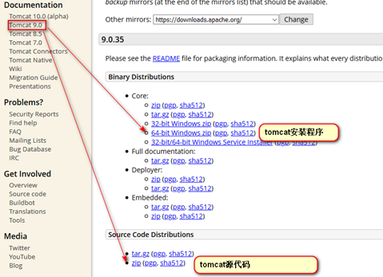

## Tomcat的安装

### 下载

官方网址: [http://tomcat.apache.org/](http://tomcat.apache.org/ "http://tomcat.apache.org/")

### 安装

tomcat由apache开源组织使用java开发的一款web容器,**在使用之前需要安装JDK及配置JAVA\_HOME**.

Tomcat是绿色软解，解压就可使用。如果之前已经安装了其他tomcat并且还配置了`CATALINA_HOME `不要忘记修改`CATALINA_HOME`指向我们现在使用的这个tomcat

### 启动

运行`startup.bat`文件

> 注意: 一定要配置JAVA_HOME, 部分电脑需要配置CATALINA_HOME

### 关闭

运行`shutdown.bat`文件或者直接关闭掉启动窗口

### 访问

访问Tomcat的URL格式：[http://ip](http://ip "http://ip"):port
访问本机Tomcat的URL格式：[http://localhost:8080](http://localhost:8080 "http://localhost:8080")

## Tomcat目录结构

| 目录          | 说明                                                                         |
| ----------- | -------------------------------------------------------------------------- |
| bin     | 主要是用来存放tomcat的命令文件，主要有两大类，&#xA;一类是以.sh结尾的（linux命令），另一类是以.bat结尾的（windows命令） |
| conf    | conf目录主要是用来存放tomcat的一些配置文件                                                 |
| lib     | lib目录主要用来存放tomcat运行需要加载的jar包                                               |
| logs        | logs目录用来存放tomcat在运行过程中产生的日志文件                                              |
| temp        | temp目录用户存放tomcat在运行过程中产生的临时文件。（清空不会对tomcat运行带来影响）                          |
| webapps | webapps目录用来存放应用程序，当tomcat启动时会去加载webapps目录下的应用程序。可以以文件夹、war包的形式发布应用         |
| work    | work目录用来存放tomcat在运行时的编译后文件，例如JSP编译后的文件                                     |
