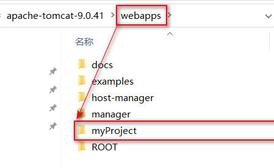
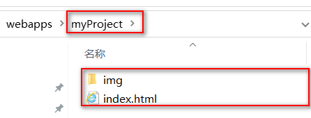
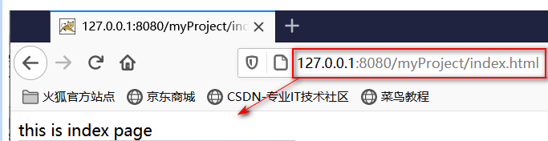
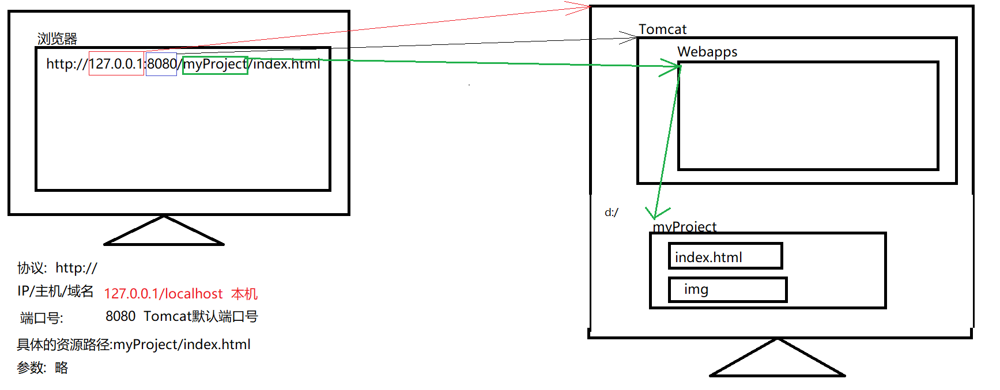

## 方式一 : 在webapps目录中

1. 在Tomcat的webapps中创建一个我们自己的项目目录
    
2.  在自己的myProject中放入一下静态资源
    
3.  启动Tomcat,访问对应的资源
    

运行原理


## 方式二 : 在其他目录中

在localhost中添加配置文件

```xml
<Context path="/myProject" docBase="d:/myProject"/>
```

建议配置文件名和项目名相同

运行原理


