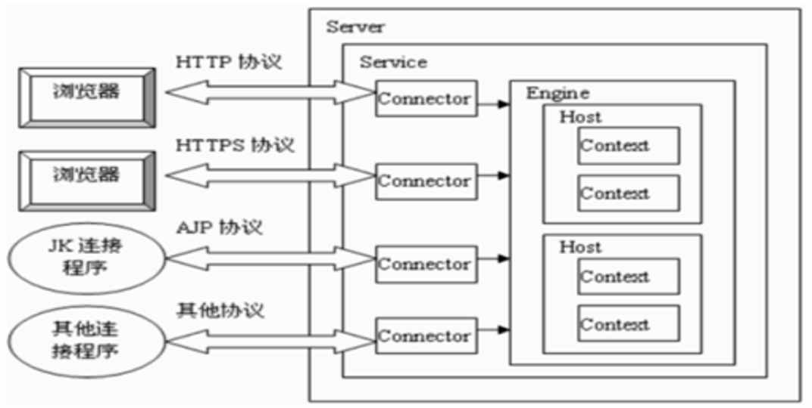
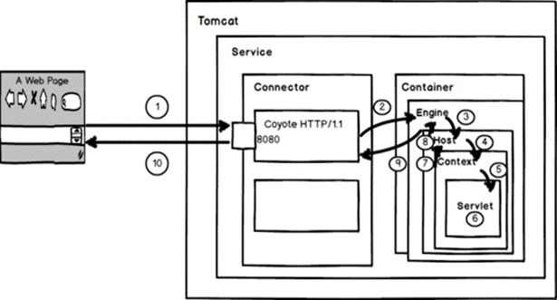

## Tomcat的配置文件

Tomcat 的配置文件由4个xml组成，分别是 context.xml、web.xml、server.xml、tomcat-users.xml。每个文件都有自己的功能与配置方法。

### context.xml

Context.xml 是 Tomcat 公用的环境配置。 Tomcat 服务器会定时去扫描这个文件。一旦发现文件被修改（时间戳改变了），就会自动重新加载这个文件，而不需要重启服务器

### web.xml

Web应用程序描述文件，都是关于是Web应用程序的配置文件。所有Web应用的 web.xml 文件的父文件

### server.xml

是 tomcat 服务器的核心配置文件，server.xml的每一个元素都对应了 tomcat中的一个组件，通过对xml中元素的配置，实现对 tomcat中的各个组件和端口的配置

### tomcat-users.xml

配置访问Tomcat的用户以及角色的配置文件

## Tomcat的配置

### 解决控制台乱码

控制台产生乱码的原因是在Tomcat在输出日志中使用的是UTF-8编码，而我们中文的Windows操作系统使用的是GBK编码。由于编码格式不统一，所以出现了乱码。

解决方式

修改conf目录中的logging.properties文件重新指定的编码方式。如果还是不行,那么 就删除该行即可

```properties
java.util.logging.ConsoleHandler.encoding  = GBK
```

### 修改Tomcat监听端口

Tomcat默认监听端口为8080。可以通过修改server.xml文件来改变Tomcat的监听端口。

```xml
<Connector   port="8080" protocol="HTTP/1.1"
               connectionTimeout="20000"
               redirectPort="8443"   />
```

### 配置Tomcat并发数

Tomcat的最大并发数是可以配置的，实际运用中，最大并发数与硬件性能和CPU数量都有很大关系的。更好的硬件，更多的处理器都会使Tomcat支持更多的并发。

这个并发能力还与应用的逻辑密切相关，如果逻辑很复杂需要大量的计算，那并发能力势必会下降。如果每个请求都含有很多的数据库操作，那么对于数据库的性能也是非常高的。

对于单台数据库服务器来说，允许客户端的连接数量是有限制的。并发能力问题涉及整个系统架构和业务逻辑、系统环境不同、Tomcat版本不同、JDK版本不同、以及修改的设定参数不同。并发量的差异还是满大的。并发数设置参数有如下几个

| 参数              | 说明                                                  |
| --------------- | --------------------------------------------------- |
| maxThreads      | 最大并发数                                               |
| minSpareThreads | 初始化时创建的线程数                                          |
| maxSpareThreads | 一旦创建的线程超过这个值，Tomcat就会关闭不再需要的socket线程                |
| acceptCount     | 指定当所有可以使用的处理请求的线程数都被使用时，可以放到处理队列中的请求数，超过这个数的请求将不予处理 |

```xml
<Connector port="8080" protocol="HTTP/1.1"    
    minSpareThreads="100"  maxSpareThreads="500"   
    maxThreads="1000" acceptCount="700" 
    connectionTimeout="20000" 
    redirectPort="8443"   />
```

### 配置Tomcat Manager

Tomcat Manager是Tomcat自带的、用于对Tomcat自身以及部署在Tomcat上的应用进行管理的web应用。默认情况下，Tomcat Manager是处于禁用状态的。准确的说，Tomcat Manager需要以用户角色进行登录并授权才能使用相应的功能，不过Tomcat并没有配置任何默认的用户，因此我们需要先进行用户配置后才能使用Tomcat Manager

#### 配置访问用户

Tomcat Manager中没有默认用户，我们需要在`tomcat-users.xml文件`配置。Tomcat Manager的用户配置需要配置两个部分：角色配置、用户名及密码配置

Tomcat Manager中的角色分类

-   **manager-gui角色** : 允许访问HTML GUI和状态页面(即URL路径为`/manager/html/*`)
-   **manager-script角色** : 允许访问文本界面和状态页面(即URL路径为`/manager/text/*`)
-   **manager-jmx角色** :  允许访问JMX代理和状态页面(即URL路为`/manager/jmxproxy/*`)
-   **manager- status角色** : 仅允许访问状态页面(即URL路径为`/manager/status/*`)

配置用户即角色

```xml
 <role   rolename="manager-gui"/>
 <role   rolename="manager-script"/>
 <role   rolename="manager-jmx"/>
 <role rolename="manager-status"/>
 <role   rolename="admin-gui"/>
 <role   rolename="admin-script"/>
 <user username="tomcat"   password="tomcat"
      roles="manager-gui,manager-script,manager-jmx,manager-status,admin-gui,admin-script"/>
```

## Tomcat的组件

### Tomcat体系结构图



### 核心组件

#### Server组件

启动一个server实例（即一个JVM），它监听在8005端口以接收shutdown命令。Server的定义不能使用同一个端口，这意味着如果在同一个物理机上启动了多个Server实例，必须配置它们使用不同的端口。

```xml
<Server  port="8005" shutdown="SHUTDOWN">
```

`port `: 接收shutdown指令的端口，默认为8005；
`shutdown`: 发往此Server用于实现关闭tomcat实例的命令字符串，默认为SHUTDOWN；

#### Service组件

Service主要用于关联一个引擎和与此引擎相关的连接器，每个连接器通过一个特定的端口和协议接收请求并将其转发至关联的引擎进行处理。困此，Service要包含一个引擎、一个或多个连接器。

```xml
<Service   name="Catalina">

```

`name`: 此服务的名称，默认为Catalina；

#### Connector组件

支持处理不同请求的组件，一个引擎可以有一个或多个连接器，以适应多种请求方式。默认只开启了处理Http协议的连接器。如果需要使用其他协议，需要在Tomcat中配置该协议的连接器。

在Tomcat中连接器类型通常有4种：
1.  HTTP连接器
2.  SSL连接器
3.  AJP 1.3连接器
4.  proxy连接器

```xml
<Connector   port="8888" protocol="HTTP/1.1" 
             connectionTimeout="20000"
             redirectPort="8443"   />

```

`port`: 监听的端口
`protocol`: 连接器使用的协议，默认为HTTP/1.1;
`connectionTimeout`: 等待客户端发送请求的超时时间，单位为毫秒;
`redirectPort`: 如果某连接器支持的协议是HTTP，当接收客户端发来的HTTPS请求时，则转发至此属性定义的端口;
`maxThreads`: 支持的最大并发连接数，默认为200个;

#### Engine组件

Engine是Servlet处理器的一个实例，即servlet引擎，定义在server.xml中的Service标记中。Engine需要defaultHost属性来为其定义一个接收所有发往非明确定义虚拟主机的请求的host组件。

```xml
<Engine   name="Catalina" defaultHost="localhost">
```

`name`: Engine组件的名称;
`defaultHost`: Tomcat支持基于FQDN(Fully Qualified Domain Name 全限定域名)的虚拟主机，这些虚拟主机可以通过在Engine容器中定义多个不同的Host组件来实现；但如果此引擎的连接器收到一个发往非非明确定义虚拟主机的请求时则需要将此请求发往一个默认的虚拟主机进行处理，因此，在Engine中定义的多个虚拟主机的主机名称中至少要有一个跟defaultHost定义的主机名称同名；

#### Host组件

位于Engine容器中用于接收请求并进行相应处理的虚拟主机。通过该容器可以运行Servlet或者JSP来处理请求。

```xml
<Host   name="localhost"    
appBase="webapps" unpackWARs="true"   
autoDeploy="true">

```

`name`: 虚拟主机的名称，Tomcat通过在请求URL中的域名与name中的值匹配，用于查找能够处理该请求的虚拟主机。如果未找到则交给在Engine中defaultHost指定的主机处理；
`appBase`: 此Host的webapps目录，即指定存放web应用程序的目录的路径；
`name`: 在Tomcat处于运行状态时放置于appBase目录中的应用程序文件是否自动进行deploy；默认为true；
`name`: 在启用此webapps时是否对WAR格式的归档文件先进行展开；默认为true；

#### Context组件

Context是Host的子标签，代表指定一个Web应用，它运行在某个指定的虚拟主机（Host）上；每个Web应用都是一个WAR文件，或文件的目录；

```xml
<Context   path="/test" docBase="D:\mashibing.war" />
```

`path`: context path既浏览器访问项目的访问路径。
`docBase`: 相应的Web应用程序的存放位置；也可以使用相对路径，起始路径为此Context所属Host中appBase定义的路径；

### Tomcat处理请求过程



简单来说:

Connector获得请求 → 所在Service的Engine组件拿到请求 → Host组件匹配主机 → 匹配到的Context获得请求 → JspServlet执行业务 → Context组件 → Host组件 → Engine组件 → Connector组件 → Browser

详细流程
1.  用户访问localhost:8080/test/index.jsp，请求被发送到Tomcat，被监听8080端口并处理HTTP/1.1 协议的Connector获得。
2.  Connector把该请求交给它所在的Service的Engine来处理，并等待Engine的回应。
3.  Engine获得请求localhost/test/index.jsp，匹配所有的虚拟主机Host。
4.  Engine匹配到名为localhost的Host虚拟主机来处理/test/index.jsp请求（即使匹配不到会请求交给默认Host处理），Host会根据/test匹配它所拥有的所有的Context
5.  匹配到的Context获得请求/index.jsp。
6.  构造HttpServletRequest对象和HttpServletResponse对象，作为参数调用JspServlet的doGet（）或doPost（）.执行业务逻辑、数据存储等程序。
7.  Context把执行完之后的结果通过HttpServletResponse对象返回给Host。
8.  Host把HttpServletResponse返回给Engine。
9.  Engine把HttpServletResponse对象返回Connector。
10. Connector把HttpServletResponse对象返回给客户Browser。
