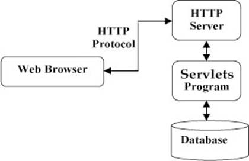
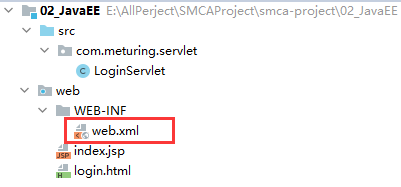

## Servlet简介

Servlet是Server Applet的简称，称为服务端小程序，是JavaEE平台下的技术标准，基于Java语言编写的服务端程序。Web容器或应用服务器实现了Servlet标准所以Servlet需运行在Web容器或应用服务器中。Servlet主要功能在于能在服务器中执行并生成数据。

### Servlet技术特点

Servlet使用单进程多线程方式运行


### Servlet在应用程序中的位置



### 静态资源和动态资源区分

-   静态资源
    每次访问都不需要运算,直接就可以返回的资源, 如HTML  CSS  JS  多媒体文件等等,每次访问获得的资源都是一样的
-   动态资源
    每次访问都需要运算代码生成的资源,如Servlet JSP ,每次访问获得的结果可能都是不一样的

### Servlet在程序中地位

Servlet是可以接受Http请求并作出相应的一种技术,是JAVA语言编写的一种动态资源

Servlet是前后端衔接的一种技术,不是所有的JAVA类都可以接收请求和作出相应,Servlet可以在MVC模式中,Servlet作为Controller层(控制层)主要技术,用于和浏览器完成数据交互,控制交互逻辑

## 快速开发

在后台随机生成一个整数, 当浏览器请求一个Servlet时, 如果生成的是奇数,返回"happy new year", 如果生成的是偶数,返回"happy birthday"

### 开发步骤

#### 继承HttpServlet 类,重写service方法


```java
public class MyServlet extends HttpServlet {
    @Override
    public void service(ServletRequest req, ServletResponse res) throws ServletException, IOException {
        super.service(req, res);
    }
}
```

#### 编写功能性代码

```java
public class MyServlet extends HttpServlet {
    /**
     * 重写service
     * @param req
     * @param resp
     * @throws ServletException
     * @throws IOException
     */
    @Override
    protected void service(HttpServletRequest req, HttpServletResponse resp) throws ServletException, IOException {
        // 动态生成数据
        int num = new Random().nextInt();
        String message  =  num%2==0?"happy birthday":"happy new year";
        // 对浏览器作出响应
        PrintWriter writer = resp.getWriter();
        writer.write(message);
    }
}
```

#### 在web.xml中配置Servlet的映射路径


```xml
<?xml version="1.0" encoding="UTF-8"?>
<web-app xmlns="http://xmlns.jcp.org/xml/ns/javaee"
         xmlns:xsi="http://www.w3.org/2001/XMLSchema-instance"
         xsi:schemaLocation="http://xmlns.jcp.org/xml/ns/javaee http://xmlns.jcp.org/xml/ns/javaee/web-app_4_0.xsd"
         version="4.0">
    <!-- 声明一个servlet -->
    <servlet>
        <servlet-name>myServlet</servlet-name>
        <servlet-class>com.meturing.servlet.MyServlet</servlet-class>
    </servlet>
    <!-- 给Servlet配置映射路径-->
    <servlet-mapping>
        <servlet-name>myServlet</servlet-name>
        <url-pattern>/myServlet.do</url-pattern>
    </servlet-mapping>
</web-app>
```

## 一个简单的登录Demo

准备一个登录页,可以输入用户名和密码, 输入完毕后向后台Servlet提交用户名和密码. Servlet接收到用户名和密码之后,校验是否正确,如果正确响应Success,如果正确响应Success.

### 创建登录页面


```html
<!DOCTYPE html>
<html lang="en">
<head>
    <meta charset="UTF-8">
    <title>Title</title>
</head>
<body>
<form method="get" action="login.do">
    <table style="margin: 0px auto" width="300px" cellpadding="0px" cellspacing="0px" border="1px">
        <tr>
            <td>用户名</td>
            <td>
                <input type="text" name="username" >
            </td>
        </tr>
        <tr>
            <td>密码</td>
            <td>
                <input type="password" name="pwd">
            </td>
        </tr>
        <tr align="center">
            <td colspan="2">
                <input type="submit" value="登录">
            </td>
        </tr>
    </table>
</form>
</body>
</html>
```

### 创建Servlet


```java
public class LoginServlet extends HttpServlet {
    @Override
    public void service(ServletRequest req, ServletResponse res) throws ServletException, IOException {
        String sUsername = req.getParameter("username");
        String sPwd = req.getParameter("pwd");
        String message = null;
        if ("admin".equals(sUsername)&&"admin".equals(sPwd)){
            message="Success";
        }else {
            message="Fail";
        }
        res.getWriter().write(message);
    }
}
```

### 配置web.xml



```xml
<?xml version="1.0" encoding="UTF-8"?>
<web-app xmlns="http://xmlns.jcp.org/xml/ns/javaee"
         xmlns:xsi="http://www.w3.org/2001/XMLSchema-instance"
         xsi:schemaLocation="http://xmlns.jcp.org/xml/ns/javaee http://xmlns.jcp.org/xml/ns/javaee/web-app_4_0.xsd"
         version="4.0">
    <!-- 声明一个servlet -->
    <servlet>
        <servlet-name>login</servlet-name>
        <servlet-class>com.meturing.servlet.LoginServlet</servlet-class>
    </servlet>
    
    <!-- 给Servlet配置映射路径-->
    <servlet-mapping>
        <servlet-name>login</servlet-name>
        <url-pattern>/login.do</url-pattern>
    </servlet-mapping>
    
    <!-- 配置首页 -->
    <welcome-file-list>
        <welcome-file>login.html</welcome-file>
    </welcome-file-list>
    
</web-app>
```
