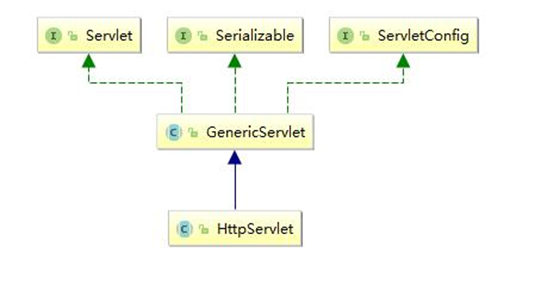
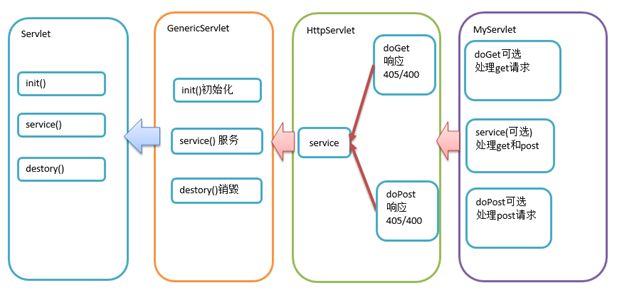
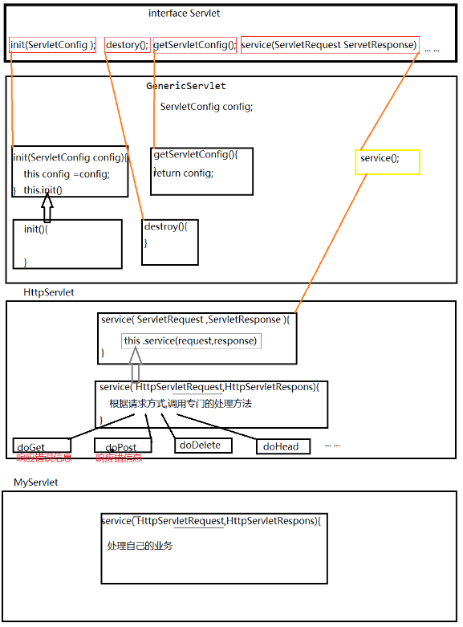
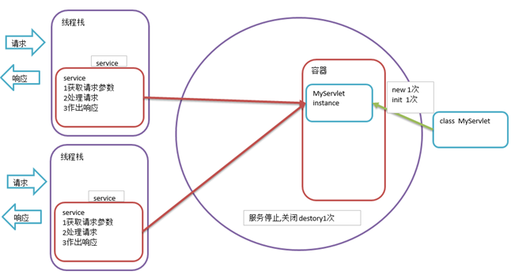
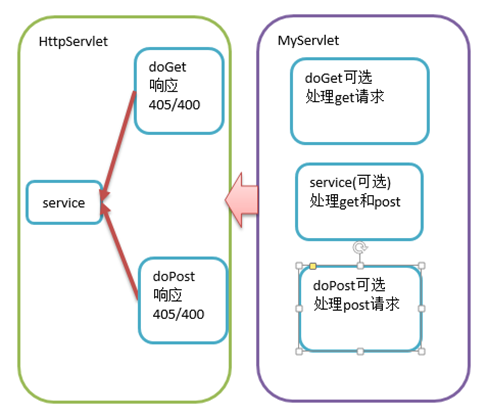

## Servlet的继承结构



### Servlet接口

| API            | 说明                          |
| ------------------ | ------------------------------- |
| init()             | 创建Servlet对象后立即调用该方法完成其他初始化工作    |
| service()          | 处理客户端请求，执行业务操作，利用响应对象响应客户端请求    |
| destroy()          | 在销毁Servlet对象之前调用该方法，释放资源        |
| getServletConfig() | ServletConfig是容器向servlet传递参数的载体 |
| getServletInfo()   | 获取servlet相关信息                   |

### ServletConfig接口

Servlet运行期间，需要一些辅助信息，这些信息可以在web.xml文件中，使用一个或多个元素，进行配置。

当Tomcat初始化一个Servlet时，会将该Servlet的配置信息，封装到一个ServletConfig对象中，通过调用init(ServletConfig config)方法，将ServletConfig对称传递给Servlet

### GenericServlet抽象类

GenericServlet是实现了Servlet接口的抽象类。

在GenericServlet中进一步的定义了Servlet接口的具体实现，其设计的目的是为了和应用层协议解耦，在GenericServlet中包含一个Service抽象方法。

我们也可以通过继承GenericServlet并实现Service方法实现请求的处理，但是需要将ServletReuqest 和 ServletResponse 转为 HttpServletRequest 和 HttpServletResponse。

### HttpServlet

继承自GenericServlet. 针对于处理 HTTP 协议的请求所定制。

在 HttpServlet的service() 方法中已经把 ServletReuqest 和 ServletResponse 转为 HttpServletRequest 和 HttpServletResponse。&#x20;

直接使用 HttpServletRequest 和HttpServletResponse, 不再需要强转。实际开发中, 直接继承 HttpServlet, 并根据请求方式复写 doXxx() 方法即可。



在我们自定义的Servlet中,如果想区分请求方式,不同的请求方式使用不同的代码处理,那么我么重写 doGet  doPost 即可

如果我们没有必要区分请求方式的差异,那么我们直接重写service方法即可

要么重写doGet  doPost 要么重写 service,必须二选一,而且必须进行重写



## Servlet的生命周期

### 容器管理阶段

Servlet的生命周期是由容器管理的，分别经历四个阶段

| 阶段             | 次数 | 时机    |
| -------------- | -- | ----- |
| 创建 new         | 1次 | 第一次请求 |
| 初始化 init()     | 1次 | 实例化之后 |
| 执行服务 service() | 多次 | 每次请求  |
| 销毁 destroy()   | 1次 | 停止服务  |

### 执行流程

1.  当客户端浏览器第一次请求Servlet时，容器会**实例化这个Servlet**，然后**调用一次init方法**，并在新的线程中执行service方法处理请求。
2.  **service方法执行完毕后容器不会销毁这个Servlet而是做缓存处理**，当客户端浏览器再次请求这个Servlet时，容器会从缓存中直接找到这个Servlet对象，并再一次在新的线程中执行Service方法。
3.  当容器在**销毁Servlet之前会调用一次destory方法**

### 线程的安全性问题

**在Servlet中我们一般不要轻易使用成员变量!!!! 可能会造成线程安全问题**

如果要使用的话,应该尽量避免对成员变量产生修改,如果要产生修改我们应该**注意线程安全问题**,但是要知道,**添加线程安全编码处理,会严重影响效率**.

综上所述:  **原则,能不用成员变量就不用!!!**

### 简单的应用实例

```java
public class MyServlet4 extends HttpServlet {
    // 成员变量
    public MyServlet4()   {// 构造一个Servlet对象的方法
        System.out.println("MyServlet4 Constructor invoked");
        try {
            Thread.sleep(5000);
        } catch (InterruptedException e) {
            e.printStackTrace();
        }
    }
    
    @Override
    public void init() throws ServletException {// 初始化
        System.out.println("MyServlet4 init invoked");
        try {
            Thread.sleep(5000);
        } catch (InterruptedException e) {
            e.printStackTrace();
        }
    }
    
    @Override
    protected void service(HttpServletRequest req, HttpServletResponse resp) throws ServletException, IOException {
        // 执行服务
        System.out.println("MyServlet4 service invoked");
    }
    
    @Override
    public void destroy() {// 销毁
        System.out.println("MyServlet4 destory invoked");
    }
}
```

多次请求servlet并查看控制台输出即可印证上述结论,值得注意的是:

如果需要Servlet在服务启动时就实例化并初始化,我们可以在servlet的配置中`添加load-on-startup配置启动顺序`,配置的数字为启动顺序,应避免冲突且应>6



### Servlet处理请求的过程

1.  当浏览器基于get方式请求我们创建Servlet时，我们自定义的Servlet中的doGet方法会被执行。
    doGet方法能够被执行并处理get请求的原因是，容器在启动时会解析web工程中WEB-INF目录中的web.xml文件，在该文件中我们配置了Servlet与URI的绑定，容器通过对请求的解析可以获取请求资源的URI，然后找到与该URI绑定的Servlet并做实例化处理
    注意：只实例化一次，如果在缓存中能够找到这个Servlet就不会再做次实例化处理
2.  在实例化时会使用Servlet接口类型作为引用类型的定义，并调用一次init方法，由于HttpServlet中重写了该方法所以最终执行的是HttpServlet中init方法
    HttpServlet中的Init方法是一个空的方法体
3.  然后在新的线程中调用service方法
    由于在HttpServlet中重写了Service方法所以最终执行的是HttpServlet中的service方法
4.  在service方法中通过request.getMethod()获取到请求方式进行判断如果是Get方式请求就执行doGet方法，如果是POST请求就执行doPost方法
5.  如果是基于GET方式提交的，并且在我们自定义的Servlet中又重写了HttpServlet中的doGet方法，那么最终会根据Java的多态特性转而执行我们自定义的Servlet中的doGet方法


