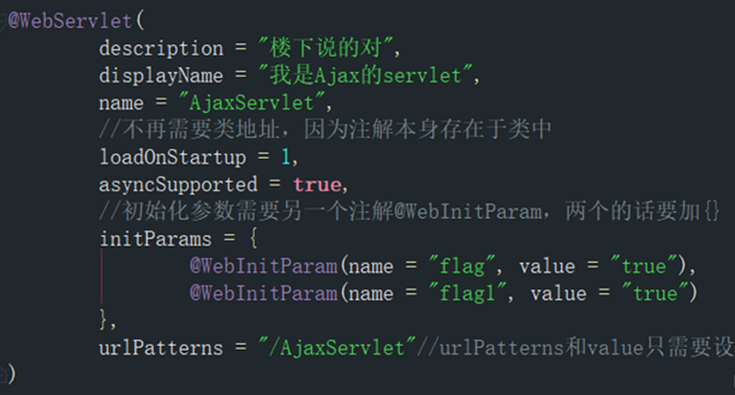

## url-pattern

### 匹配类型

#### 精确匹配

精确匹配是指`<url-pattern>`中配置的值必须与url完全精确匹配

```xml
<servlet-mapping>
    <servlet-name>demoServlet</servlet-name>
    <url-pattern>/demo.do</url-pattern>
  </servlet-mapping>
```

| 路径                                              | 结果      |
| ----------------------------------------------- | ------- |
| `http://localhost:8888/demo/demo.do`    | 匹配  |
|`http://localhost:8888/demo/suibian/demo.do` | 不匹配 |

#### 拓展名匹配

在`<url-pattern>`允许使用统配符`*`作为匹配规则，`*`表示匹配任意字符。

在扩展名匹配中只要扩展名相同都会被匹配和路径无关。注意，在使用扩展名匹配时在`<url-pattern>`中不能使用`/`,否则容器启动就会抛出异常。

```xml
<servlet-mapping>
    <servlet-name>demoServlet</servlet-name>
    <url-pattern>*.do</url-pattern>
  </servlet-mapping>
```

| 路径                                                   | 结果      |
| ---------------------------------------------------- | ------- |
| `http://localhost:8888/demo/demo.do `        | 匹配  |
| `http://localhost:8888/demo/suibian/haha.do` | 匹配  |
| `http://localhost:8888/demo/abc`                 | 不匹配 |

#### 路径匹配

根据请求路径进行匹配，在请求中只要包含该路径都匹配。`*` 表示任意路径以及子路径

```xml
<servlet-mapping>
	<servlet-name>demoServlet</servlet-name>
	<url-pattern>/suibian/*</url-pattern>
</servlet-mapping>
```

| 路径                                                   | 结果      |
| ---------------------------------------------------- | ------- |
| `http://localhost:8888/demo/suibian/haha.do ` | 匹配  |
| `http://localhost:8888/demo/suibian/hehe/haha.do` | 匹配  |
| `http://localhost:8888/demo/hehe/heihei.do`  | 不匹配 |

#### 任意匹配

匹配`/`。匹配所有但不包含JSP页面

```xml
<servlet-mapping>
      <servlet-name>demoServlet</servlet-name>
      <url-pattern>/</url-pattern>
  </servlet-mapping>
```

| 路径                                                      | 结果      |
| ------------------------------------------------------- | ------- |
| `http://localhost:8888/demo/suibian/haha.do`    | 匹配  |
| `http://localhost:8888/demo/suibian/hehe/haha.do`   | 匹配  |
| `http://localhost:8888/demo/hehe/addUser.jsp`    | 不匹配 |
| `http://localhost:8888/demo/suibian/hehe/ddUser.jsp`| 不匹配 |

#### 匹配所有

匹配所有

```xml
<servlet-mapping>
	<servlet-name>demoServlet</servlet-name>
	<url-pattern>/</url-pattern>
</servlet-mapping>
```

| 路径                                                       | 结果     |
| -------------------------------------------------------- | ------ |
| `http://localhost:8888/demo/suibian/haha.do`     | 匹配 |
| `http://localhost:8888/demo/suibian/hehe/haha.do`     | 匹配 |
| `http://localhost:8888/demo/hehe/addUser.jsp`         | 匹配 |
| `http://localhost:8888/demo/suibian/hehe/ddUser.html` | 匹配 |

### 匹配优先顺序

当一个url与多个Servlet的匹配规则可以匹配时，则按照: `精确路径 > 最长路径 >扩展名` 这样的优先级匹配到对应的Servlet

### 案例

```xml
<servlet-mapping>
      <servlet-name>Servlet1</servlet-name>
      <url-pattern>/abc/*</url-pattern>
  </servlet-mapping>
  <servlet-mapping>
      <servlet-name>Servlet2</servlet-name>
      <url-pattern>/*</url-pattern>
  </servlet-mapping>
  <servlet-mapping>
      <servlet-name>Servlet3</servlet-name>
      <url-pattern>/abc</url-pattern>
  </servlet-mapping>
  <servlet-mapping>
      <servlet-name>Servlet4</servlet-name>
      <url-pattern>*.do</url-pattern>
  </servlet-mapping>
```

| URL           | 匹配                | 优先       |
| ------------- | ----------------- | -------- |
| /abc/a.html   | Servlet1,Servlet2 | Servlet1 |
| /abc          | Servlet1,Servlet3 | Servlet3 |
| /abc/a.do     | Servlet1,Servlet4 | Servlet1 |
| /a.do         | Servlet2,Servlet4 | Servlet2 |
| /xxx/yyy/a.do | Servlet2,Servlet4 | Servlet2 |

### URL映射方式

在web.xml文件中支持将多个URL映射到一个Servlet中，但是相同的URL不能同时映射到两个Servlet中。

#### 方式一

```xml
<servlet-mapping>
	<servlet-name>demoServlet</servlet-name>
	<url-pattern>/suibian/*</url-pattern>
	<url-pattern>*.do</url-pattern>
</servlet-mapping>
```

#### 方式二

```xml
<servlet-mapping>
	<servlet-name>demoServlet</servlet-name>
	<url-pattern>/suibian/*</url-pattern>
</servlet-mapping>

<servlet-mapping>
	<servlet-name>demoServlet</servlet-name>
	<url-pattern>*.do</url-pattern>
</servlet-mapping>
```

## 注解模式

在Servlet3.0以及之后的版本中支持注解式开发Servlet

对于Servlet的配置不在依赖于`web.xml`配置文件而是使用`@WebServlet`将一个继承于`javax.servlet.http.HttpServlet`的类定义为Servlet组件

### @WebServlet注解中属性

| 属性名            | 类型              | 作用                  |
| -------------- | --------------- | ------------------- |
| initParams     | WebInitParam\[] | Servlet的init参数      |
| name           | String          | Servlet的名称          |
| urlPatterns    | String\[]       | Servlet的访问URL，支持多个  |
| value          | String\[]       | Servlet的访问URL，支持多个  |
| loadOnStartup  | int             | 自启动Servlet          |
| description    | String          | Servlet的描述          |
| displayName    | String          | Servlet的显示名称        |
| asyncSupported | boolean         | 声明Servlet是否支持异步操作模式 |

### 使用案例


