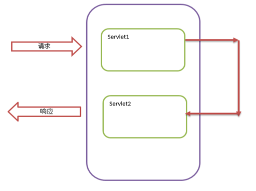
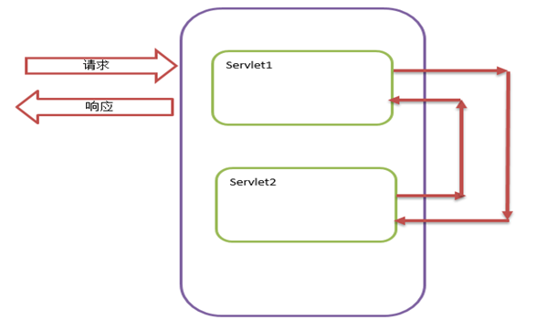
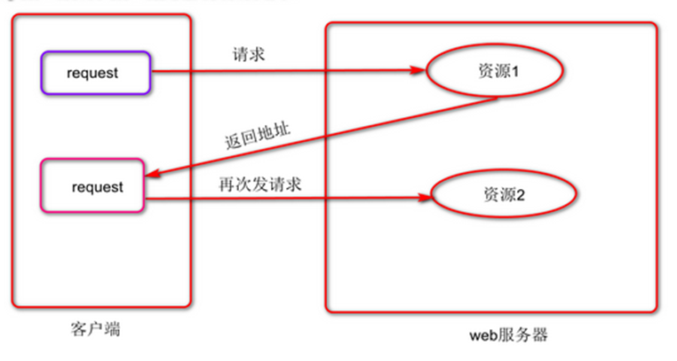

## 请求转发

### forword转发

#### 处理流程

1.  清空Response存放响应正文数据的缓冲区
2.  如果目标资源为Servlet或JSP，就调用它们的service()方法，把该方法产生的响应结果发送到客户端; 如果目标资源文件系统中的静态HTML文档，就读取文档中的数据把它发送到客户端



#### 处理特点

1.  由于forword()方法先清空用于存放响应正文的缓冲区，因此源Servlet生成的响应结果不会被发送到客户端，只有目标资源生成的响应结果才会被发送到客户端
2.  如果源Servlet在进行请求转发之前，已经提交了响应结（flushBuffer(),close()方法），那么forward()方法抛出IllegalStateException。为了避免该异常，不应该在源Servlet中提交响应结果。

#### 测试代码

servlet1 请求转发至servlet2

servlet1

```java
@WebServlet(urlPatterns = "/servlet1.do")
public class Servlet1 extends HttpServlet {
    @Override
    protected void service(HttpServletRequest req, HttpServletResponse resp) throws ServletException, IOException {
        System.out.println("servlet1 service invoked");
        String money = req.getParameter("money");
        System.out.println("money:"+money);
        // 设置响应类型和编码(include模式下)
        /*  resp.setCharacterEncoding("UTF-8");
        resp.setContentType("text/html;charset=UTF-8");*/
        // 增加响应内容
        //resp.getWriter().println("servlet1在转发之前增加的响应内容");
        // 请求转发给另一个组件
        // 获得一个请求转发器
        //RequestDispatcher requestDispatcher = req.getRequestDispatcher("servlet2.do");
        //RequestDispatcher requestDispatcher = req.getRequestDispatcher("aaa.html");
        //RequestDispatcher requestDispatcher = req.getRequestDispatcher("index.jsp");
        //RequestDispatcher requestDispatcher = req.getRequestDispatcher("WEB-INF/bbb.html");
        RequestDispatcher requestDispatcher = req.getRequestDispatcher("https://www.baidu.com");
        // 由请求转发器作出转发动作
        requestDispatcher.forward(req,resp);// 托管给目标资源(forward多一些)
        // 在forward转发模式下,请求应该完全交给目标资源去处理,我们在源组件中,不要作出任何的响应处理
        // 在forward方法调用之后,也不要在使用req和resp对象做其他操作了
    }
}
```

servlet2

```java
@WebServlet(urlPatterns = "/servlet2.do")
public class Servlet2 extends HttpServlet {
    @Override
    protected void service(HttpServletRequest req, HttpServletResponse resp) throws ServletException, IOException {
        System.out.println("servlet2 service invoked");
        // 接收参数
        String money = req.getParameter("money");
        System.out.println("money:"+money);
        // 作出响应 (在forWord模式下)
        resp.setCharacterEncoding("UTF-8");
        resp.setContentType("text/html;charset=UTF-8");
        PrintWriter writer = resp.getWriter();
        writer.println("支付宝到账:"+money+"元");
    }
}
```

### include转发

#### 处理流程

1.  如果目标资源为Servlet或JSP，就调用他们的相应的service()方法，把该方法产生的响应正文添加到源Servlet的响应结果中；如果目标组件为HTML文档，就直接把文档的内容添加到源Servlet的响应结果中
2.  返回到源Servlet的服务方法中，继续执行后续代码块



#### 处理特点

include与forward转发相比，包含有以下特点

1.  源Servlet与被包含的目标资源的输出数据都会被添加到响应结果中
2.  在目标资源中对响应状态码或者响应头所做的修改都会被忽略

#### 测试代码

servlet1 请求转发至servlet2

servlet1

```java
@WebServlet(urlPatterns = "/servlet1.do")
public class Servlet1 extends HttpServlet {
    @Override
    protected void service(HttpServletRequest req, HttpServletResponse resp) throws ServletException, IOException {
        System.out.println("servlet1 service invoked");
        String money = req.getParameter("money");
        System.out.println("money:"+money);
        // 设置响应类型和编码(include模式下)
        /*  resp.setCharacterEncoding("UTF-8");
        resp.setContentType("text/html;charset=UTF-8");*/
        // 增加响应内容
        //resp.getWriter().println("servlet1在转发之前增加的响应内容");
        // 请求转发给另一个组件
        // 获得一个请求转发器
        //RequestDispatcher requestDispatcher = req.getRequestDispatcher("servlet2.do");
        //RequestDispatcher requestDispatcher = req.getRequestDispatcher("aaa.html");
        //RequestDispatcher requestDispatcher = req.getRequestDispatcher("index.jsp");
        //RequestDispatcher requestDispatcher = req.getRequestDispatcher("WEB-INF/bbb.html");
        RequestDispatcher requestDispatcher = req.getRequestDispatcher("https://www.baidu.com");
        // 由请求转发器作出转发动作
        requestDispatcher.include(req,resp);  // 让目标资源完成部分工作
        // 继续增加响应信息 (include模式)
        resp.getWriter().println("servlet1在转发之后增加的响应内容");
        // 在include转发模式下,设置响应可以在转发之前,也可以在转发之后
    }
}
```

servlet2

```java
@WebServlet(urlPatterns = "/servlet2.do")
public class Servlet2 extends HttpServlet {
    @Override
    protected void service(HttpServletRequest req, HttpServletResponse resp) throws ServletException, IOException {
        System.out.println("servlet2 service invoked");
        // 接收参数
        String money = req.getParameter("money");
        System.out.println("money:"+money);
        // 作出响应 (在forWord模式下)
        resp.setCharacterEncoding("UTF-8");
        resp.setContentType("text/html;charset=UTF-8");
        PrintWriter writer = resp.getWriter();
        writer.println("支付宝到账:"+money+"元");
    }
}

```

### 注意事项

1.  请求转发是一种服务器的行为,是对浏览器屏蔽
2.  浏览器的地址栏不会发生变化
3.  请求的参数是可以从源组件传递到目标组件的
4.  请求对象和响应对象没有重新创建,而是传递给了目标组件
5.  请求转发可以帮助我们完成页面的跳转
6.  请求转发可以转发至WEB-INF里
7.  请求转发只能转发给当前项目的内部资源,不能转发至外部资源
8.  常用forward

## 响应重定向

响应重定向是通过`HttpServletResponse对象.sendRedirect(“路径”)`的方式实现,是服务器通知浏览器,让浏览器去自主请求其他资源的一种方式



### 处理流程

1.  用户在浏览器端输入特定URL，请求访问服务器端的某个Servlet
2.  服务器端的Servlet返回一个状态码为302的响应结果，该响应结果的含义为：让浏览器端再请求访问另一个Web资源，在响应结果中提供了另一个Web资源的URL. 另一个Web资源有可能在同一个Web服务器上，也有可能不再同一个Web服务器上
3.  当浏览器端接收到这种响应结果后，再立即自动请求访问另一个Web资源
4.  浏览器端接收到另一个Web资源的响应结果

### 测试代码

servlet1 请求转发至servlet2

```java
@WebServlet(urlPatterns = "/servlet3.do")
public class Servlet3 extends HttpServlet {
    @Override
    protected void service(HttpServletRequest req, HttpServletResponse resp) throws ServletException, IOException {
        System.out.println("servlet3 service invoked");
        String money = req.getParameter("money");
        System.out.println("money:"+money);
        // 响应重定向
        resp.sendRedirect("servlet4.do?money="+money);
        //resp.sendRedirect("WEB-INF/bbb.html");
        //resp.sendRedirect("https://www.baidu.com");
    }
}
```

```java
@WebServlet(urlPatterns = "/servlet4.do")
public class Servlet4 extends HttpServlet {
    @Override
    protected void service(HttpServletRequest req, HttpServletResponse resp) throws ServletException, IOException {
        System.out.println("servlet4 service invoked");
        String money = req.getParameter("money");
        System.out.println("money:"+money);
    }
}
```

### 注意事项

1.  重定向是服务器给浏览器重新指定请求方向 是一种浏览器行为 地址栏会发生变化
2.  重定向时,请求对象和响应对象都会再次产生,请求中的参数是不会携带
3.  重定向也可以帮助我们完成页面跳转
4.  **重定向不能帮助我们访问WEB-INF中的资**源
5.  重定向可以定向到外部资源
