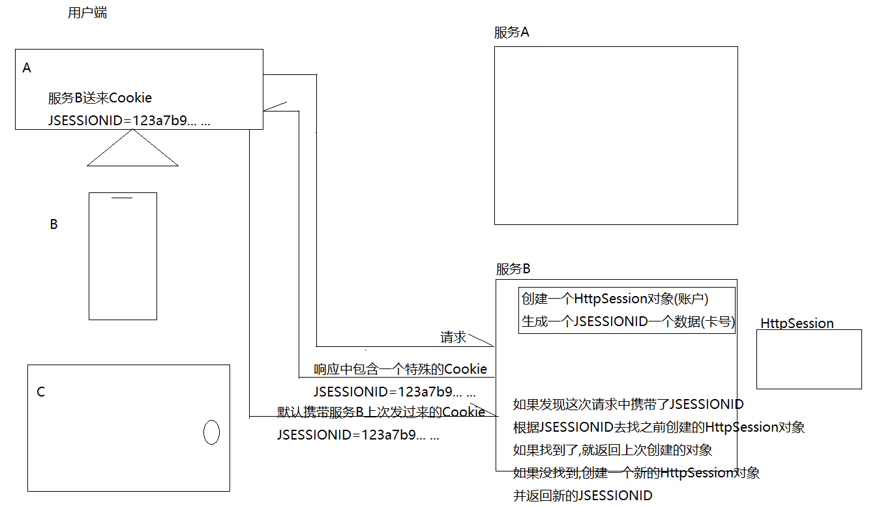
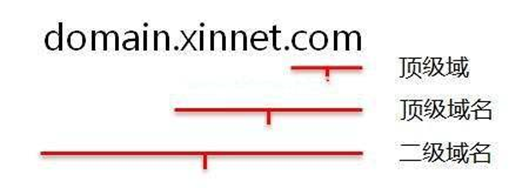
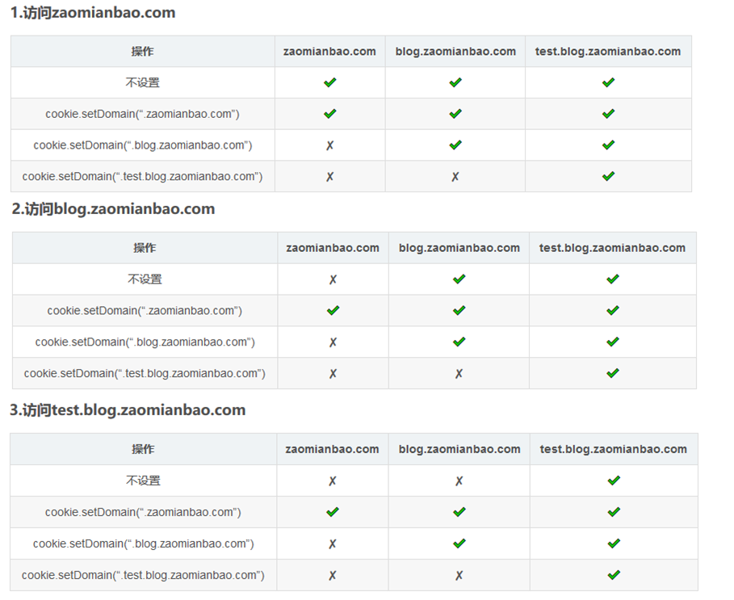
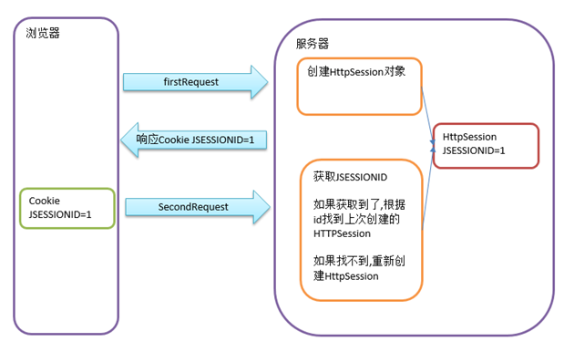
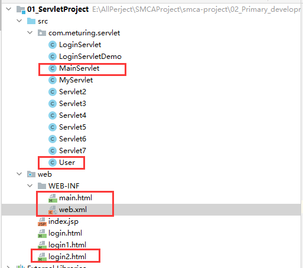

## 初识Cookie和Session

### 相关概念

Cookie对象与HttpSession对象的作用是维护客户端浏览器与服务端的会话状态的两个对象。

**由于HTTP协议是一个无状态的协议，所以服务端并不会记录当前客户端浏览器的访问状态**，但是在有些时候我们是需要服务端能够记录客户端浏览器的访问状态的，如获取当前客户端浏览器的访问服务端的次数时就需要会话状态的维持。

在Servlet中提供了Cookie对象与HttpSession对象用于维护客户端与服务端的会话状态的维持。二者不同的是**Cookie是通过客户端浏览器实现会话的维持，而HttpSession是通过服务端来实现会话状态的维持。**

### 执行流程

相当于去银行取钱:
1.  先向银行提出开户申请,银行开通账户并给银行卡(Cookie)
2.  携带银行卡去银行取钱,银行根据银行卡卡号找到对应的账户给你操作(Session)



## Cookie的使用

Cookie是一种保存少量信息至浏览器的一种技术,**第一请求时,服务器可以响应给浏览器一些Cookie信息**,**第二次请求,浏览器会携带之前的cookie发送给服务器**,通过这种机制可以实现在浏览器端保留一些用户信息.为服务端获取用户状态获得依据

### Cookie对象的特点

-   Cookie使用字符串存储数据
-   Cookie使用Key与Value结构存储数据
-   单个Cookie存储数据大小限制在4097个字节
-   Cookie存储的数据中不支持中文，Servlet4.0中支持
-   Cookie是与域名绑定所以不支持跨一级域名访问
-   Cookie对象保存在客户端浏览器内存上或系统磁盘中
-   Cookie分为持久化Cookie(保存在磁盘上)与状态Cookie(保存在内存上)
-   浏览器在保存同一域名所返回Cookie的数量是有限的。不同浏览器支持的数量不同，Chrome浏览器为50个
-   浏览器每次请求时都会把与当前访问的域名相关的Cookie在请求中提交到服务端。

### Cookie对象的API

#### Cookie对象的创建

```java
//通过new关键字创建Cookie对象
Cookie cookie = new Cookie("key","value");
//通过HttpServletResponse对象将Cookie写回给客户端浏览器
response.addCookie(cookie)

```

#### Cookie对象的获取

```java
//通过HttpServletRequest对象获取Cookie，返回Cookie数组。
Cookie[] cookies = request.getCookies();

```

#### Cookie不支持中文的解决方案

**在Servlet4.0版本之前的Cookie中是不支持中文存储的，如果存储的数据中含有中文，代码会直接出现异常。**

`java.lang.IllegalArgumentException:   Control character in cookie value or attribute.`

我们可以通过对含有中文的数据重新进行编码来解决该问题。在Servlet4.0中的Cookie是支持中文存储的。

```java
//将内容按照指定的编码方式做URL编码处理
URLEncoder.encode("content","code");
//将内容按照指定的编码方式做URL解码处理
URLDecoder.decode("content","code")

```

#### Cookie持久化和状态Cookie

-   状态Cookie
    **当Cookie对象创建后默认为状态Cookie**
    浏览器会缓存Cookie对象。浏览器关闭后Cookie对象销毁
-   持久化Cookie
    **使用Cookie对象下的** `cookie.setMaxAge(60)` **方法设置失效时间，单位为秒。一旦设置了失效时间，那么该Cookie为持久化Cookie**
    浏览器会对Cookie做持久化处理，基于文件形式保存在系统的指定目录中. 在Windows10系统中为了安全问题不会显示Cookie中的内容.

#### Cookie跨越

Cookie不支持一级域名的跨域，支持二级域名的跨域.



一级域名比二级域名更高级，二级域名是依附于一级域名之下的附属分区域名，即二级域名是一级域名的细化分级。例如：baidu.com 为一级域名，news.baidu.com为二级域名



### 综合Demo

写入Cookie

```java
public class Servlet2 extends HttpServlet {
    @Override
    public void service(HttpServletRequest req, HttpServletResponse resp) throws ServletException, IOException {
        Cookie age = new Cookie("age", "10");
        Cookie sex = new Cookie("sex", "男");
        String encodeName = URLEncoder.encode("张三", "UTF-8");//对中文进行编码
        Cookie name = new Cookie("name", encodeName);
        name.setMaxAge(60);//秒钟    持久化Cookie 让浏览器保留1分钟
        resp.addCookie(name);
        resp.addCookie(sex);
        resp.addCookie(age);
    }
}
```

读取Cookie

```java
public class Servlet3 extends HttpServlet {
    @Override
    protected void service(HttpServletRequest req, HttpServletResponse resp) throws ServletException, IOException {
        Cookie[] cookies = req.getCookies();
        if (cookies != null) {
            for (Cookie cookie : cookies) {
                String name = cookie.getName();
                String value = cookie.getValue();
                if ("name".equals(cookie.getName())){
                     value = URLDecoder.decode(value, "UTF-8");
                }
                System.out.println(name + "=" + value);
            }
        }
    }
}
```

## Cookie案例

当客户端浏览器第一次访问Servlet时返回“您好，欢迎您第一次访问！”，第二次访问时返回“欢迎您回来！”

```java
/**
 * 当客户端浏览器第一次访问Servlet时返回“您好，欢迎您第一次访问！”
 * 第二次访问时返回“欢迎您回来！”
 */
public class Servlet4 extends HttpServlet {
    @Override
    protected void service(HttpServletRequest req, HttpServletResponse resp) throws ServletException, IOException {
        String strMessage = "";
        //尝试获取Cookie中的计数器
        Cookie[] cookies = req.getCookies();
        Cookie count = null;
        //如果Cookie不为空切计数器不为0 表示重复访问 计数器++
        if (cookies!=null){
            Integer integerCount = 0;
            for (Cookie cookie : cookies) {
               if ("count".equals(cookie.getName())){
                   integerCount = Integer.valueOf(cookie.getValue());
                   integerCount++;
                   cookie.setValue(integerCount.toString());
                   count = cookie;
                   strMessage = "欢迎您回来！这是您第"+integerCount+"次访问！";
               }
            }
            //如果For循环走还没有取到计数器
            if (integerCount==0){
                count = new Cookie("count", "1");
                strMessage = "您好，欢迎您第1次访问！";
            }
        }else{
            //如果计数器为0或者Cookie为空则表明初次访问 需要颁发Cookie 计数器++
            count = new Cookie("count", "1");
            strMessage = "您好，欢迎您第1次访问！";
        }
        //设置响应头,以便浏览器知道以何种编码解析数据
        resp.setContentType("text/html;charset=UTF-8");
        if (count!=null){
            resp.addCookie(count);
        }
        resp.getWriter().write(strMessage);
    }
}
```

## Session的使用

HttpSession是一种保存少量信息至服务器端的一种技术,第一请求时,服务器会创建HttpSession,我们可以在HttpSession对象中保存一些关于用户的状态信息,并将HttpSession的JSESSIONID以Cookie形式响应给浏览器 .  第二次请求,浏览器会携带之前的JSESSIONID的Cookie,发送给服务器,服务器根据JSESSIONID获取对应的HttpSession对象.通过这种技术可以解决HTTP协议本身无法记录用户状态情况.



### Session特点

-   HttpSession保存在服务端
-   HttpSession可以存储任何类型的数据
-   HttpSession使用Key与Value结构存储数据 value是Object类型
-   HttpSession存储数据大小无限制

### HttpSession对象

#### 对象的创建

HttpSession对象的创建是通过`request.getSession()`方法来创建的。客户端浏览器在请求服务端资源时，如果在请求中没有JSESSIONID，getSession()方法将会为这个客户端浏览器创建一个新的HttpSession对象，并为这个HttpSession对象生成一个JSESSIONID，在响应中通过Cookie写回给客户端浏览器，如果在请求中包含了JSESSIONID，getSession()方法则根据这个ID返回与这个客户端浏览器对应的HttpSession对象。

getSession()方法还有一个**重载方法getSession(true|false)。** 当参数为true时与getSession()方法作用相同。当参数为false时则只去根据SessionID查找是否有与这个客户端浏览器对应的HttpSession，**如果有则返回，如果没有SessionID则不会创建新的HttpSession对象。**

```java
/**
 * 向Session中写入
 * @author sqTan
 * @description servlet5
 * @date 2023/03/20
 */
public class Servlet5 extends HttpServlet {
    @Override
    protected void service(HttpServletRequest req, HttpServletResponse resp) throws ServletException, IOException {
        //获取当前的Session对象
        HttpSession session = req.getSession();
        //向Session中写入数据
        session.setAttribute("userName","admin");
        session.setAttribute("passWord","1234");
        session.setAttribute("level","A");

        //session.invalidate(); //手动使Session失效
    }
}
```

#### 数据的获取

| API                               | 说明                                  |
| --------------------------------- | ----------------------------------- |
| session.setAttribute("key",value) | 将数据存储到HttpSession对象中                |
| session.getAttribute("key")       | 根据key获取HttpSession中的数据，返回Object     |
| session.getAttributeNames()       | 获取HttpSession中所有的key，返回枚举类型         |
| session.removeAttribute("key")    | 根据key删除HttpSession中的数据              |
| session.getId()                   | 根据获取当前HttpSession的SessionID，返回字符串类型 |

```java
/**
 * 获取Session中的数据
 * @author sqTan
 * @description servlet6
 * @date 2023/03/20
 */
public class Servlet6 extends HttpServlet {
    @Override
    protected void service(HttpServletRequest req, HttpServletResponse resp) throws ServletException, IOException {
        HttpSession session = req.getSession();
        //获取Session
        String userName = (String) session.getAttribute("userName");
        String passWord = (String) session.getAttribute("passWord");
        String level = (String) session.getAttribute("level");
        System.out.println(userName);
        System.out.println(passWord);
        System.out.println(level);

        //获取Session对象的其他属性
        System.out.println("创建时间: "+session.getCreationTime());
        System.out.println("最后一次访问时间: "+session.getLastAccessedTime());
        System.out.println("最大不活动时间: "+session.getMaxInactiveInterval());
    }
}
```

#### 销毁方式

-   **方式一:  通过web.xml文件指定超时时间(最大不活动时间)**
    我们可以在web.xml文件中指定HttpSession的超时时间，当到达指定的超时时间后，容器就会销该HttpSession对象，单位为分钟。该时间对整个web项目中的所有HttpSession对象有效。时间的计算方式是根据最后一次请求时间作为起始时间。如果有哪个客户端浏览器对应的HttpSession的失效时间已到，那么与该客户端浏览器对应的HttpSession对象就会被销毁。其他客户端浏览器对应的HttpSession对象会继续保存不会被销毁。
    ```xml
    <session-config>
        <session-timeout>1</session-timeout>
      </session-config>
    ```
    我们**也可以在Tomcat的web.xml文件中配置HttpSession的销毁时间**。如果在Tomcat的web.xml文件中配置了HttpSession的超时时间对应的是Tomcat中所有的Web项目都有效。相当于配置了全局的HttpSession超时时间。如果我们在Web项目中配置了超时时间，那么会以Web项目中的超时时间为准。
-   **方式二: 通过HttpSession对象中的invalidate()方法销毁当前HttpSession对象**
    invalidate()方法是HttpSession对象中所提供的用于销毁当前HttpSession的方法。我们通过调用该方法可以销毁当前HttpSession对象。

#### 生命周期

在HttpSession对象生命周期中没有固定的创建时间与销毁时间。何时创建取决于我们什么时候第一次调用了getSession()或getSession(true)的方法。HttpSession对象的销毁时间取决于超时时间的到达以及调用了invalidate()方法。如果没有超时或者没有调用invalidate()方法，那么HttpSession会一直存储。**默认超时时间为30分钟(Tomcat的web.xml文件配置的时间就是默认超时时间)。**

## Session和Cookie的总结

### 区别

-   cookie数据存放在客户的浏览器或系统的文件中，而HttpSession中的数据存放在服务器中。
-   cookie不安全，而HttpSession是安全的。
-   单个cookie保存的数据不能超过4K，很多浏览器都限制一个域名保存cookie的数量。而HttpSession没有容量以及数量的限制。

### 建议

HttpSession对象是保存在服务端的，所以安全性较高。我们可以在HttpSession对象中存储数据，但是由于HttpSession对象的生命周期不固定，所以不建议存放业务数据。一般情况下我们只是存放用户登录信息。

## Session和Cookie的综合案例

需求:实现登录一次即可,在一次会话内,可以反复多次访问WEB-INF/ welcome.html,如果没有登录过,跳转到登录页,登录成功后,可以访问

### 目录结构



### 组件

#### login.html

```java
<!DOCTYPE html>
<html lang="en">
<head>
    <meta charset="UTF-8">
    <title>Title</title>
</head>
<body>
<form method="get" action="loginServlet.do">
    用户名:<input type="text" name="username" ><br/>
    密码:<input type="password" name="password" ><br/>
    <input type="submit" >
</form>
</body>
</html>
```

#### main.html

```java
<!DOCTYPE html>
<html lang="en">
<head>
    <meta charset="UTF-8">
    <title>Title</title>
</head>
<body>
   this is main page
</body>
</html>
```

#### LoginServlet.Java

用来校验登录的,登录成功将用户信息存户HttpSession,否则回到登录页

```java
@WebServlet(urlPatterns = "/loginServlet.do")
public class LoginServlet extends HttpServlet {
    @Override
    protected void service(HttpServletRequest req, HttpServletResponse resp) throws ServletException, IOException {
        // 获取用户名和密码
        String username = req.getParameter("username");
        String password = req.getParameter("password");
        // 如果用户名和密码为 admin 1234
        if("admin".equals(username)  && "1234".equals(password)){
            // 将用户信息放在HTTPSession中
            User user =new User("admin", "1234");
            HttpSession session = req.getSession();
            session.setAttribute("user", user);
            // 登录成功 跳转至 main.html
            resp.sendRedirect(req.getContextPath()+"/mainServlet.do");
        }else{
            // 登录失败 回到login.html
            resp.sendRedirect(req.getContextPath()+"/login.html");
        }
    }
}
```

#### MainServlet.Java

用来向main.html中跳转的,同时验证登录,登录过,可以直接跳转,否则回到登录页

```java
@WebServlet(urlPatterns = "/mainServlet.do")
public class MainServlet extends HttpServlet {
    @Override
    protected void service(HttpServletRequest req, HttpServletResponse resp) throws ServletException, IOException {
        //跳转至main.html
        HttpSession session = req.getSession();
        User user = (User)session.getAttribute("user");
        if(null != user){
            // 判断如果登录过 允许跳转  HTTPSession中如果有登陆过的信息
            req.getRequestDispatcher("/WEB-INF/main.html").forward(req,resp);
        }else{
            // 如果没有登录过 回到登录去登录  HTTPSession中如果有登陆过的信息
            resp.sendRedirect("login.html");
        }
    }
}
```

#### User.Java

用来存储一个用户的信息的实体类对象

```java
public class User implements Serializable {
    private String username;
    private String pasword;
    ....
}
```
