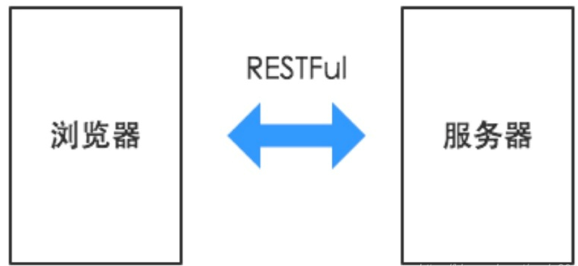
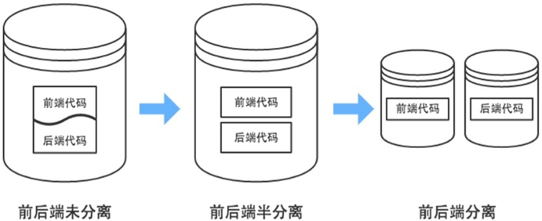
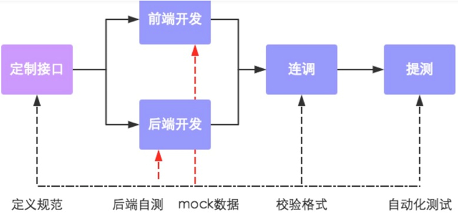
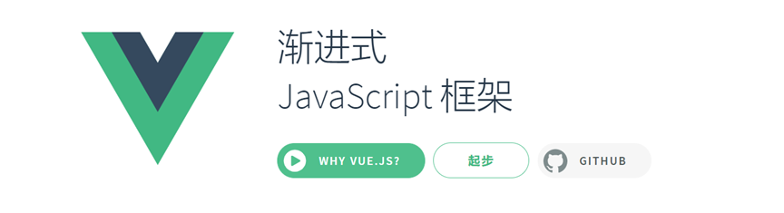

前后端分离属于软件架构的一种。其核心思想是把前端项目（`Node.js`实现的）和后端项目独立部署到不同的服务器上，前端项目在通过Ajax请求服务器端项目`Restful`接口实现数据交互。

使用前后端分离架构的项目在项目组中往往配备前端工程师和后端工程师。后端工程师就是我们，对于我们我们来说，不需要在项目中编写页面了，写到控制器返回数据即可，最后把项目部署到服务器上。而前端项目中主要是一些`HTML`、`JavaScript`、图片等资源，如果希望能够独立运行就需要借助基于`Node.js`的一些前端框架。

## 交互形式

在前后端分离架构中，后端只需要负责按照约定的数据格式向前端提供可调用的API服务即可。前后端之间通过HTTP请求进行交互，前端获取到数据后，进行页面的组装和渲染，最终返回给浏览器。

## 代码组织形式

在传统架构模式中，前后端代码存放于同一个代码库中，甚至是同一工程目录下。页面中还夹杂着后端代码。前后端工程师进行开发时，都必须把整个项目导入到开发工具中。而前后端分离模式在代码组织形式上有以下两种:

### 半分离

前后端共用一个代码库，但是代码分别存放在两个工程中。后端不关心或很少关心前端元素的输出情况，前端不能独立进行开发和测试，项目中缺乏前后端 交互的测试用例。

### 分离

前后端代码库分离，前端代码中有可以进行Mock测试(通过构造虚拟测试对 象以简化测试环境的方法)的伪后端，能支持前端的独立开发和测试。而后端代码中除了功能实现外，还有着详细的测试用例，以保证API的可用性，降低 集成风险

## 数据接口规范流程

在开发期间前后端共同商定好数据接口的交互形式和数据格式。然后实现前后端的并行开发，其中前端工程师再开发完成之后可以独自进行mock测试，而后端也可以使用接口测试平台进行接口自测，然后前后端一起进行功能联调并校验格式，最终进行自动化测试。

## 前后端分离常用框架

对于前端工程师来说常用的就是`Vue.js`和`React.js`和`angularJS`。他们是前端工程师常用的三大框架。
+ Vue.js 小巧，灵活，功能却很强大。在市场上占有率更高，属于成熟稳定的框架。在课程中讲解此框架，后面的项目的前端页面也是基于Vue实现
+ React相比Vue.js更新一些，近几年有追赶Vue.js的架势。更适合做移动项目。
+ AngularJS相比Vue更加大量一些。只有在一些大型项目中才可能被使用。

Vue是一个渐进式的JavaScript框架与其它大型框架不同的是，Vue 被设计为可以自底向上逐层应用。Vue 的核心库只关注视图层，不仅易于上手，还便于与第三方库或既有项目整合。另一方面，与现代化的工具以及各种支持类库结合使用时，Vue 也完全能够为复杂的单页应用提供驱动。

## 前后端分离的好处

### 前后端明确的工作职责

通过将开发团队前后端分离化，让前后端工程师只需要专注于前端或后端的开发工作，使得前后端工程师实现自治，培养其独特的技术特性，然后构建出一个全栈式的精益开发团队。

### 提升开发效率

前后端分离以后，可以实现前后端代码的解耦，只要前后端沟通约定好应用所需接口以及接口参数，便可以开始并行开发，无需等待对方的开发工作结束。与此同时，即使需求发生变更，只要接口与数据格式不变，后端开发人员就不需要修改代码，只要前端进行变动即可。如此一来整个应用的开发效率必然会有质的提升。

### 完美应对复杂多变的前端需求

如果开发团队能完成前后端分离的转型，打造优秀的前后端团队，开发独立化，让开发人员做到专注专精，开发能力必然会有所提升，能够完美应对各种复杂多变的前端需求。

### 增强代码可维护性

前后端分离后，应用的代码不再是前后端混合，只有在运行期才会有调用依赖关系。