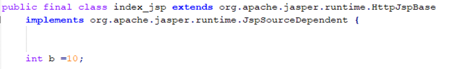
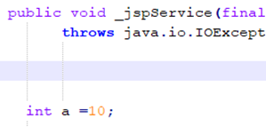
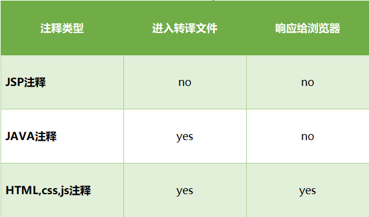
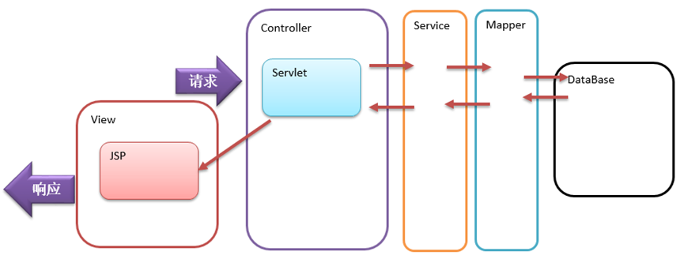

## JSP得性能问题

有人都会认为JSP的执行性能会和Servlet相差很多，其实执行性能上的差别只在第一次的执行。因为JSP在执行第一次后，会被编译成Servlet的类文件，即.class，当再重复调用执行时，就直接执行第一次所产生的Servlet,而不再重新把JSP编译成Servelt。除了第一次的编译会花较久的时间之外，之后JSP和同等功能的Servlet的执行速度就几乎相同了。

JSP慢的原因不仅仅是第一次请求需要进行转译和编译,而是因为JSP作为一种动态资源,本质上就是Servlet,它是需要运行代码才会生成资源,和HTML本身资源已经存在,直接返回,着本质上的差异,另外,JSP转译之后,内部通过大量IO流形式发送页面内容,IO流本身是一种重量级操作,是比较消耗资源的

 在前后端分离时代,JSP作为一种前后端混合技术就不在适用了,但是JSP和Servlet关联比较紧密,所以学习Servlet技术一定要了解一些JSP技术.作为一种软件行业的从业人员,JSP技术是一种基础性技术,是我们学习后面的知识的一种知识积累.JSP技术在某些独特的领域和在一些特定的需求下,还是有存在的必要的,如很多政府和事业单位的项目中就存在大量的JSP应用情况.在我们没有学习更加多的页面静态化和前后端分离技术之前,我们还是要借助JSP技术作为数据展现的一种处理手段,从学习JSP到从JSP中向更高的技术进化需要一个过程.

## JSP中的变量问题

在JSP上可以通过`<% %>` 和`<%! %>`两种方式书写代码,那么两种方式中书写的java代码在转译之后生成的java文件中的位置是不一样,一个在`_JSPService`方法中,一个作为类的成员,以定义变量举例

```Html
<%@ page contentType="text/html;charset=UTF-8" language="java" %>
  <html>
    <head>
      <title>$Title$</title>
    </head>
    <body>
      <%--局部变量--%>
      <%
      int a =10;
      %>
      
      <%--成员变量--%>
      <%!
      int b =10;
      %>
    </body>
  </html>
```

转译之后的结果如下





因为JSP本质就是Servlet,在servlet中我们是不推荐定义一些成员变量的,所以我们也不推荐在JSP中定义局部变量

## JSP中的注释问题

JSP允许在HTML编码中嵌入java代码,那么在JSP上除了HTML中可以简单的注释以外,还有自己的注释方式

在JSP中的注释格式为`<%--   --%>`,不同的注释方式之间时有差异的,接下来我们就对比一下这些差异

```Html
<%@ page contentType="text/html;charset=UTF-8" language="java"   %>
  <html>
  <head>
      <title>Title</title>
      <style>
          /*4css样式的注释*/
      </style>
      <script>
          /*5js中的注释*/
      </script>
  
  </head>
  <body>
  <%--
	  1JSP中的注释
  --%>
  <!--
	  2html注释
  -->
  <%
      for (int i = 0; i <10 ; i++) {
  
      }
	  /*3java中的注释*/
  %>
  index2
  <%--
	  1JSP注释    仅仅存在于JSP页面     不会被编入java代码  不会响应给浏览器
	  2html注释   不仅仅存在于JSP页面 编入java代码        会响应给浏览器
	  3java注释   不仅仅存在于JSP页面 编入java代码        不会响应给浏览器
	  4css js注释 不仅仅存在于JSP      编入java代码        会响应给浏览器
	  推荐在JSP 页面使用JSP注释  尤其是在注释 html代码的时候 
  --%>
  
  <ol>
      <!--</ol> -->
      <li>1</li>
  </ol>
  
  
  </body>
  </html>
```

经过我们查看转译之后的文件和通过浏览器查看源代码发现



所以我们推荐在JSP中使用JSP专用注释`<%-- --%>`

## JSP的使用建议

JSP和Servlet本质上是相同的,JSP页面功能和Servlet后台功能是完全能够互换的,但是JSP的编码风格是在HTML中嵌入少量JAVA代码,它用于显示数据比较方便,如果Servlet上嵌入HTML字符串处理就比较麻烦

Servlet更适合专门编写JAVA代码,JSP更擅长展示数据,Servlet更适合做后台程序,所以在分层上,我们往往将**Servlet作为控制层Controller使用**,**JSP作为视图层view使用**,可以让Servlet将数据发送给JSP,然后在JSP上展示数据

