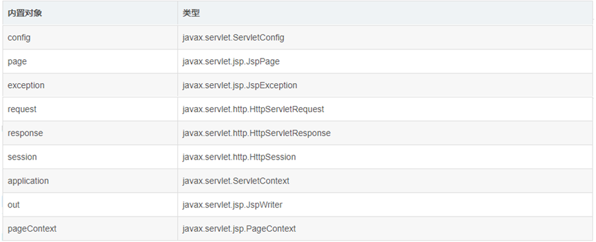
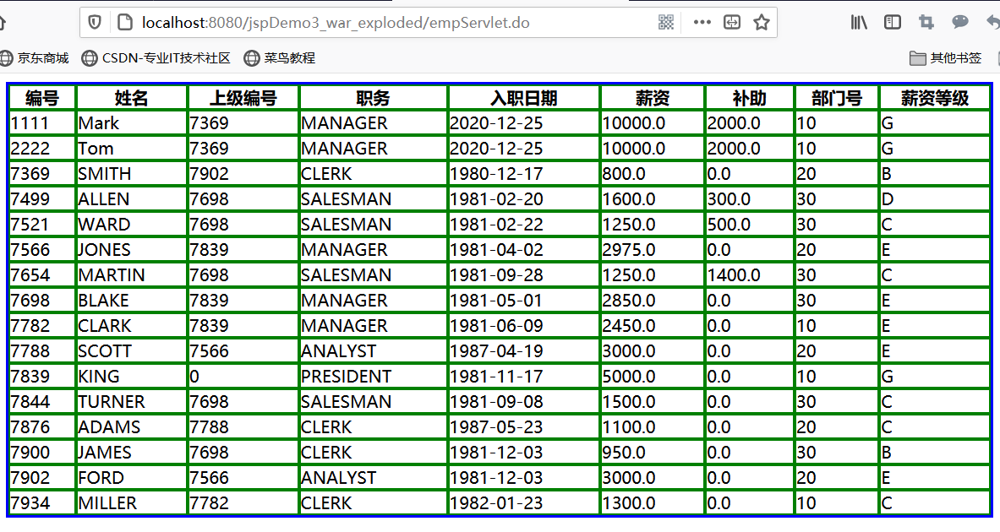
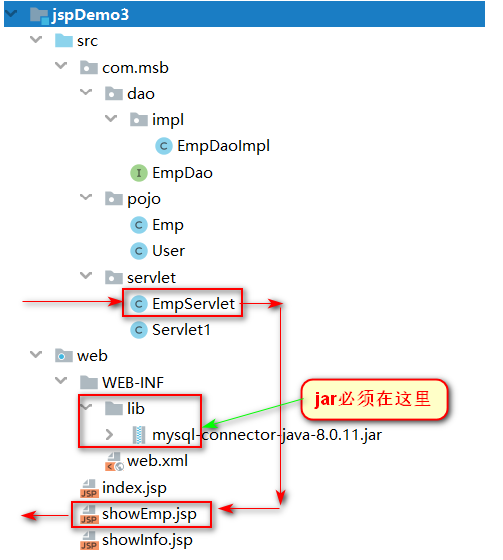

## 什么是内置对象

因为JSP的本质是Servlet,在JSP文件经过转译之后,生成JAVA代码,在运行时,JSP给我们准备好了九个可以直接使用而不用我们自己去new的对象,这九个对象我们称之为内置对象.**内置对象完全有JSP自行去维护,我们直接使用即可**

## JSP的九大内置对象



### 四个域对象

| 内置对象        | 说明           | 范围      |
|:------------|:-------------|:--------|
| pageContext | page域        | 当前页面内可用 |
| request     | request域     | 单次请求    |
| session     | session域     | 单次会话    |
| application | application域 | 项目运行    |

### 响应对象

| 内置对象     | 说明        |
|:---------|:----------|
| response | 响应对象 |  

### 输出流对象

| 内置对象 | 说明   |
|:-----|:-----|
| out  | 打印对象 |  

### 其他三个对象

| 内置对象          | 说明                                            |
|:--------------|:----------------------------------------------|
| servletConfig | 由于JSP本身也是一个Servlet,所以容器也会给我们准备一个ServletConfig |
| page          | 就是他this对象 当前JSP对象本身                           |
| exception     | 异常对象,在错误提示页上使用,当isErrorpage=true 才具有该对象       |  

## 九大内置对象的使用

实体类
```java
public class User implements Serializable {
    private Integer uid;
    private String name;
    private String password;
    ....
```

Servlet代码
```Java
@WebServlet("/servlet1.do")
public class Servlet1 extends HttpServlet {
    @Override
    protected void service(HttpServletRequest req, HttpServletResponse resp) throws ServletException, IOException {
        // 向三个域中放入数据
        
        /*向请求域中放入数据*/
        User user=new User(1,"李雷","123456");
        req.setAttribute("user",user);
        req.setAttribute("msg","requestMessage");
        
        /*向session域中放入数据*/
        List<User> users =new ArrayList<>();
        User user1=new User(1,"韩梅梅","123456");
        User user2=new User(1,"小明","123456");
        User user3=new User(1,"小红","123456");
        Collections.addAll(users,user1,user2,user3);
        HttpSession session =   req.getSession();
        session.setAttribute("users",users);
        session.setAttribute("msg","sessionMessage");
        
        /*向application域中放入数据*/
        ServletContext application = getServletContext();
        Map<String,User> map =new HashMap<>();
        map.put("a",user1);
        map.put("b",user2);
        map.put("c",user3);
        application.setAttribute("userMap",map);
        application.setAttribute("msg","applicationMessage");
        
        // 跳转至jsp
        req.getRequestDispatcher("showInfo.jsp").forward(req,resp);
    }
}

```

JSP代码
```JSP
<%@ page import="com.meturing.pojo.User" %>
<%@ page import="java.util.List" %>
<%@ page import="java.util.Map" %>
<%@ page contentType="text/html;charset=UTF-8" language="java" %>
<html>
<head>
    <title>Title</title>
</head>
<body>
    <%--向pageContext域中放数据--%>
    <%
    pageContext.setAttribute("msg", "pageContextMessage");
    pageContext.setAttribute("user", new User(1,"大黄","abcdefg"));
    %>
    <%--从域中取出数据--%>
    
    pageContext:<br/>
    msg:<%=pageContext.getAttribute("msg")%><br/>
    username:<%=((User)pageContext.getAttribute("user")).getName()%><br/>
    
    request域中的数据:<br/>
    msg:<%=request.getAttribute("msg")%><br/>
    username:<%=((User)request.getAttribute("user")).getName()%><br/>
    
    session域中的数据:<br/>
    msg:<%=session.getAttribute("msg")%><br/>
    username:<%=((List<User>)session.getAttribute("users")).get(0).getName()%><br/>
    
    application域中的数据:<br/>
    msg:<%=application.getAttribute("msg")%><br/>
    username:<%=((Map<String,User>)application.getAttribute("userMap")).get("a").getName()%><br/>
</body>
</html>
```

## 综合案例开发

链接数据库显示所有员工信息到JSP页面,表格如下



### 构建项目结构



### 匹配规则

0-500     A
501-1000  B
1001-1500  C
1501-2000  D
2001-3000  E
3001-4000  F
4000+     G

### 相关代码

实体类
```Java
public class Emp implements Serializable {
    private Integer empno;
    private String ename;
    private String job;
    private Integer mgr;
    private Date hiredate;
    private Double sal;
    private Double comm;
    private Integer deptno;
    ...
```

dao层
```Java
public class EmpDaoImpl implements EmpDao {
    private String url="jdbc:mysql://127.0.0.1:3306/mydb?useSSL=false&useUnicode=true&characterEncoding=UTF-8&serverTimezone=Asia/Shanghai";
    private String username="root";
    private String password="root";
    @Override
    public List<Emp> findAll() {
        List<Emp> list =new ArrayList<>();
        Connection connection =null;
        PreparedStatement pstat=null;
        ResultSet resultSet=null;
        try {
            Class.forName("com.mysql.cj.jdbc.Driver");
            connection = DriverManager.getConnection(url, username, password);
            pstat = connection.prepareStatement("select * from emp");
            resultSet = pstat.executeQuery();
            while(resultSet.next()){
                Integer empno=resultSet.getInt("empno");
                Integer deptno=resultSet.getInt("deptno");
                Integer mgr=resultSet.getInt("mgr");
                String ename=resultSet.getString("ename");
                String job=resultSet.getString("job");
                Double sal=resultSet.getDouble("sal");
                Double comm=resultSet.getDouble("comm");
                Date hiredate=resultSet.getDate("hiredate");
                Emp emp =new Emp( empno,  ename,  job,  mgr,  hiredate,  sal,  comm,  deptno);
                list.add(emp);
            }
        } catch (Exception e) {
            e.printStackTrace();
        }finally {
            if(null!=resultSet){
                try {
                    resultSet.close();
                } catch (SQLException e) {
                    e.printStackTrace();
                }
            }
            if(null!=pstat){
                try {
                    pstat.close();
                } catch (SQLException e) {
                    e.printStackTrace();
                }
            }
            if(null!=connection){
                try {
                    connection.close();
                } catch (SQLException e) {
                    e.printStackTrace();
                }
            }
        }
        return list;
    }
}
```

servlet代码
```java
@WebServlet("/empServlet.do")
public class EmpServlet extends HttpServlet {
    // dao对象
    EmpDao empDao=new EmpDaoImpl();
    @Override
    protected void service(HttpServletRequest req, HttpServletResponse resp) throws ServletException, IOException {
        // 获取数据
        List<Emp> list = empDao.findAll();
        // 将数据放入请求域
        req.setAttribute("emps", list);
        // 请求转发给JSP
        req.getRequestDispatcher("showEmp.jsp").forward(req,resp);
    }
}
```

JSP代码
```java
<%@ page import="java.util.List" %>
<%@ page import="com.meturing.pojo.Emp" %>
<%@ page contentType="text/html;charset=UTF-8" language="java" %>
<html>
<head>
    <title>Title</title>
    <style>
        table{
            border: 3px solid blue;
            width: 80%;
            margin: 0px auto;
        }
        td,th{
            border: 2px solid green;
        }
    </style>
</head>
<body>
    <table cellspacing="0px" cellpadding="0px">
        <tr>
            <th>编号</th>
            <th>姓名</th>
            <th>上级编号</th>
            <th>职务</th>
            <th>入职日期</th>
            <th>薪资</th>
            <th>补助</th>
            <th>部门号</th>
            <th>薪资等级</th>
        </tr>
        <%
            List<Emp> emps = (List<Emp>) request.getAttribute("emps");
            for (Emp emp : emps) {
        %>
            <tr>
                <td><%=emp.getEmpno()%></td>
                <td><%=emp.getEname()%></td>
                <td><%=emp.getMgr()%></td>
                <td><%=emp.getJob()%></td>
                <td><%=emp.getHiredate()%></td>
                <td><%=emp.getSal()%></td>
                <td><%=emp.getComm()%></td>
                <td><%=emp.getDeptno()%></td>
                <td><%--out.print("<td>")--%>
         <%
             Double sal = emp.getSal();
             if(sal<=500){
                 out.print("A");
             }else if( sal <=1000){
                 out.print("B");
             }else if( sal <=1500){
                 out.print("C");
             }else if( sal <=2000){
                 out.print("D");
             }else if( sal <=3000){
                 out.print("E");
             }else if( sal <=4000){
                 out.print("F");
             }else {
                 out.print("G");
             }
         %>
                </td>
            </tr>
        <%
            }
        %>
    </table>
</body>
</html>
```